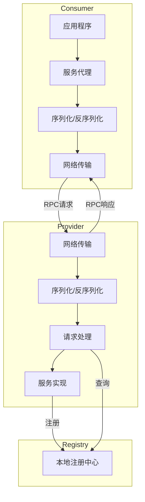

# Easy-RPC

一个轻量级的Java RPC（远程过程调用）框架，用于学习和演示RPC的基本原理和实现。

## 项目概述

Easy-RPC是一个简单的RPC框架实现，旨在展示RPC的核心概念和工作原理。该框架使用HTTP作为传输协议，JDK序列化作为默认的序列化机制，并提供了简单的服务注册和发现功能。

## 架构设计

Easy-RPC采用经典的RPC架构设计：



1. **消费者端**：
   - 服务代理：通过动态代理将接口调用转换为远程调用
   - 序列化/反序列化：将请求对象序列化为字节流，将响应字节流反序列化为对象
   - 网络传输：发送请求到服务提供者并接收响应

2. **提供者端**：
   - 网络传输：接收消费者请求并返回响应
   - 序列化/反序列化：将请求字节流反序列化为对象，将响应对象序列化为字节流
   - 请求处理：根据请求信息查找并调用相应的服务
   - 服务实现：具体的业务逻辑实现

3. **注册中心**：
   - 服务注册：提供者注册服务
   - 服务发现：消费者查询服务

### 核心组件

- **服务注册与发现**：通过本地注册表管理服务
- **序列化/反序列化**：支持Java对象的序列化与反序列化
- **网络传输**：基于HTTP协议的客户端和服务端实现
- **代理调用**：使用JDK动态代理实现远程调用的透明化

## 功能特点

- 基于Vert.x的高性能HTTP服务器
- 简单的本地服务注册中心
- 支持JDK原生序列化
- 动态代理实现透明的RPC调用
- 提供完整的示例代码展示框架使用方法

## 模块说明

### rpc-easy

核心RPC框架实现，包含：

- 客户端代理实现
- HTTP传输层
- 序列化机制
- 服务注册与发现

### example-common

示例公共模块，包含：

- 服务接口定义
- 数据模型

### example-provider

服务提供者示例，包含：

- 服务实现类
- 服务启动类

### example-consumer

服务消费者示例，包含：

- 服务调用示例
- 静态代理示例

## 快速开始

### 1. 定义服务接口

```java
public interface UserService {
    User getUser(User user);
}
```

### 2. 实现服务接口

```java
public class UserServiceImpl implements UserService {
    @Override
    public User getUser(User user) {
        System.out.println("用户名称: " + user.getName());
        return user;
    }
}
```

### 3. 注册并启动服务

```java
// 注册服务
LocalRegistry.register(UserService.class.getName(), UserServiceImpl.class);

// 启动HTTP服务器
HttpServer httpServer = new VertexHttpServer();
httpServer.doStart(8081);
```

### 4. 调用远程服务

```java
// 创建服务代理
UserService userService = ServiceProxyFactory.getProxy(UserService.class);

// 创建请求参数
User user = new User();
user.setName("张三");

// 远程调用
User result = userService.getUser(user);
```

## 未来计划

- [ ] 支持多种序列化协议（如JSON、Protobuf）
- [ ] 实现基于Zookeeper/Etcd的服务注册中心
- [ ] 添加负载均衡策略
- [ ] 增加服务熔断和限流功能
- [ ] 支持异步调用
- [ ] 添加注解驱动的服务发布和引用

## 文档

更多详细文档请参考`doc`目录下的文档：

- [RPC基础与对比](doc/RPC基础与对比.md)
- [序列化机制](doc/序列化机制.md)
- [服务注册中心原理与实现](doc/服务注册中心原理与实现.md)
- [整体架构设计](doc/整体架构设计.md)
- 更多文档...

## 贡献指南

欢迎提交问题和改进建议！如果您想为项目做出贡献，请遵循以下步骤：

1. Fork 本仓库
2. 创建您的特性分支 (`git checkout -b feature/amazing-feature`)
3. 提交您的更改 (`git commit -m 'Add some amazing feature'`)
4. 推送到分支 (`git push origin feature/amazing-feature`)
5. 打开一个 Pull Request

## 许可证

本项目采用 MIT 许可证 - 查看 [LICENSE](LICENSE) 文件了解详情。

## 致谢

- [Vert.x](https://vertx.io/) - 提供高性能的HTTP服务器实现
- [Hutool](https://hutool.cn/) - 提供便捷的工具类
- [Lombok](https://projectlombok.org/) - 减少样板代码 