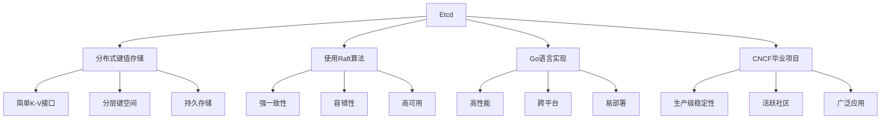
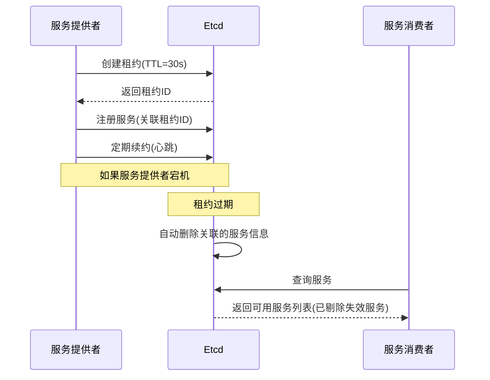

# Etcd注册中心优势与特性

## 问题

> 为什么用 Etcd 实现注册中心？该技术有哪些优势和特性？

## Etcd简介

Etcd是一个分布式、可靠的键值存储系统，专为分布式系统的关键数据设计。它提供了一种可靠的方式来存储需要被分布式系统或机器集群访问的数据。Etcd最初由CoreOS团队开发，现在是Cloud Native Computing Foundation (CNCF)的毕业项目。

## 为什么选择Etcd实现注册中心

在众多可用于实现服务注册中心的技术中（如ZooKeeper、Consul、Eureka等），Etcd因其独特的特性和优势被选为本RPC框架的注册中心实现技术。下面详细分析这一选择的理由：

### 1. 强一致性保证

Etcd基于Raft共识算法，提供了强一致性保证。在服务注册发现场景中，一致性至关重要：

- **数据可靠性**：确保所有节点看到相同的服务信息
- **避免脑裂**：防止在网络分区时出现多个决策中心
- **线性一致性读写**：保证读操作能获取最新写入的数据

这种一致性保证对于避免请求路由到不可用服务实例至关重要，减少了失败请求和错误的可能性。

### 2. 简洁的API和易用性

Etcd提供了简洁直观的API，降低了集成难度和学习成本：

- **REST API**：通过HTTP直接访问，无需特殊客户端
- **gRPC API**：提供高性能的程序化访问
- **命令行工具**：简化运维操作
- **简单的数据模型**：基于键值对的操作直观易懂

相比之下，ZooKeeper的API设计更复杂，需要专门的客户端库和更多的学习时间。

### 3. 实时变更通知机制

Etcd的Watch机制提供了高效的变更通知能力：

- **长连接订阅**：客户端可以建立长连接监听特定键或前缀的变更
- **增量通知**：只推送变更的数据，减少网络开销
- **事件驱动模型**：比轮询更高效、更实时
- **版本控制**：每次修改都有版本号，客户端可以跟踪变更历史

这一特性使服务消费者能够实时感知服务提供者的变化，快速响应服务上下线事件。

### 4. 租约机制与健康检查

Etcd的租约(Lease)机制为健康检查提供了天然的支持：

- **TTL(Time-To-Live)**：键值可以关联到租约，租约到期自动删除
- **自动清理**：无需额外的健康检查组件，自动处理失效节点
- **心跳续约**：服务实例通过定期续约表明自己健康状态
- **优雅退出**：服务实例可以主动释放租约，实现优雅下线

这种机制简化了健康检查的实现，提高了系统的可靠性和自愈能力。

### 5. 高性能与可扩展性

Etcd在性能和扩展性方面表现出色：

- **读写分离**：读请求可以由任何成员处理，写请求由leader处理
- **优化的存储引擎**：使用BoltDB提供高效的持久化存储
- **适合读多写少场景**：服务发现通常是读操作远多于写操作
- **支持百万级别的键值存储**：能够处理大规模服务注册信息
- **集群规模灵活**：可以从3节点起步，扩展到5-7节点以提高可用性

这些特性使Etcd能够满足从小型到大型分布式系统的需求，提供稳定的性能表现。

### 6. 多功能性

除了作为服务注册中心，Etcd还可以用于多种分布式系统场景：

- **配置中心**：集中存储和管理配置信息
- **分布式锁**：通过原子操作实现分布式协调
- **选主**：支持领导者选举
- **分布式队列**：实现简单的任务分发
- **事件总线**：通过Watch机制实现发布订阅模式

这种多功能性使得系统架构更加简洁，避免了引入多个不同的组件来解决类似问题。

## 与其他注册中心技术的对比

为了更全面地理解选择Etcd的原因，下面将其与其他流行的注册中心技术进行对比：

| 特性 | Etcd | ZooKeeper | Consul | Eureka |
|------|------|-----------|--------|--------|
| **一致性模型** | CP (强一致性) | CP (强一致性) | CP (强一致性) | AP (高可用性) |
| **实现语言** | Go | Java | Go | Java |
| **API方式** | HTTP/gRPC | 客户端库 | HTTP/DNS | HTTP |
| **配置复杂度** | 低 | 高 | 中 | 低 |
| **变更通知** | Watch机制 | Watcher | Watch机制 | 客户端轮询 |
| **健康检查** | 租约/TTL | 会话/临时节点 | 主动健康检查 | 心跳机制 |
| **多数据中心** | 有限支持 | 有限支持 | 原生支持 | 有限支持 |
| **部署难度** | 低 | 高 | 中 | 低 |
| **内存占用** | 低 | 高 | 中 | 中 |
| **功能范围** | 通用键值存储 | 分布式协调 | 服务网格 | 专注服务发现 |
| **社区活跃度** | 高 | 高 | 高 | 中 |
| **容器化支持** | 原生支持 | 需要配置 | 原生支持 | 需要配置 |

### Etcd vs ZooKeeper

- Etcd部署更简单，不依赖JVM
- Etcd的API更简洁，易于理解和使用
- Etcd的一致性协议(Raft)比ZooKeeper的(ZAB)更易理解
- ZooKeeper有更长的使用历史和更广泛的生产验证

### Etcd vs Consul

- Etcd更专注于键值存储，接口更简单
- Consul内置更多服务发现和网格功能
- Etcd在纯键值存储场景下性能可能更优
- Consul的服务发现功能更完善，包含DNS接口

### Etcd vs Eureka

- Etcd提供强一致性(CP)，Eureka提供高可用性(AP)
- Etcd适用于对数据一致性要求高的场景
- Eureka适用于可用性优先于一致性的场景
- Etcd提供实时通知，Eureka依赖客户端定期轮询

## Etcd在RPC框架中的应用价值

选择Etcd作为RPC框架的服务注册中心，带来了以下具体价值：

1. **可靠的服务发现**：强一致性保证确保消费者获取可靠的服务信息
2. **实时感知服务变化**：Watch机制使消费者能够立即响应服务提供者的变化
3. **自动剔除不健康实例**：租约机制确保只有健康的服务实例对外可见
4. **简化系统架构**：一个组件同时解决服务注册、发现和配置管理等多个问题
5. **降低运维复杂度**：部署简单，运维友好，支持容器环境
6. **良好的水平扩展性**：随着服务规模增长，Etcd能够平滑扩展以满足需求

## 总结

Etcd作为服务注册中心的实现技术，因其强一致性、简单易用的API、实时变更通知机制、内置的健康检查支持以及优秀的性能和扩展性，成为了RPC框架的理想选择。它不仅满足了服务注册与发现的核心需求，还通过其多功能性简化了整体系统架构。

相比其他类似技术，Etcd在一致性模型、部署简便性、轻量级设计和容器环境适配性等方面具有独特优势，特别适合现代微服务架构和云原生应用场景。这些特性使得基于Etcd的服务注册中心能够为RPC框架提供可靠、高效、易扩展的服务协调能力，支撑分布式系统的稳定运行。 