# Ming RPC Framework Etcd注册中心优势与特性详解

## 📖 概述

Etcd是Ming RPC Framework的核心注册中心实现，作为一个分布式、可靠的键值存储系统，专为分布式系统的关键数据设计。本文将深入分析为什么选择Etcd作为注册中心实现，以及它在Ming RPC Framework中的具体应用和优势。

### 🎯 核心问题
> 为什么用 Etcd 实现注册中心？该技术有哪些优势和特性？

## 🔍 Etcd技术简介

Etcd是一个分布式、可靠的键值存储系统，专为分布式系统的关键数据设计。它提供了一种可靠的方式来存储需要被分布式系统或机器集群访问的数据。Etcd最初由CoreOS团队开发，现在是Cloud Native Computing Foundation (CNCF)的毕业项目。

```mermaid
graph TD
    A[Etcd] --> B[分布式键值存储]
    A --> C[使用Raft算法]
    A --> D[Go语言实现]
    A --> E[CNCF毕业项目]
    
    B --> B1[简单K-V接口]
    B --> B2[分层键空间]
    B --> B3[持久存储]
    
    C --> C1[强一致性]
    C --> C2[容错性]
    C --> C3[高可用]
    
    D --> D1[高性能]
    D --> D2[跨平台]
    D --> D3[易部署]
    
    E --> E1[生产级稳定性]
    E --> E2[活跃社区]
    E --> E3[广泛应用]
```



## 为什么选择Etcd实现注册中心

在众多可用于实现服务注册中心的技术中（如ZooKeeper、Consul、Eureka等），Etcd因其独特的特性和优势被选为本RPC框架的注册中心实现技术。下面详细分析这一选择的理由：

### 1. 强一致性保证

Etcd基于Raft共识算法，提供了强一致性保证。在服务注册发现场景中，一致性至关重要：

- **数据可靠性**：确保所有节点看到相同的服务信息
- **避免脑裂**：防止在网络分区时出现多个决策中心
- **线性一致性读写**：保证读操作能获取最新写入的数据

这种一致性保证对于避免请求路由到不可用服务实例至关重要，减少了失败请求和错误的可能性。

### 2. 简洁的API和易用性

Etcd提供了简洁直观的API，降低了集成难度和学习成本：

- **REST API**：通过HTTP直接访问，无需特殊客户端
- **gRPC API**：提供高性能的程序化访问
- **命令行工具**：简化运维操作
- **简单的数据模型**：基于键值对的操作直观易懂

相比之下，ZooKeeper的API设计更复杂，需要专门的客户端库和更多的学习时间。

### 3. 实时变更通知机制

Etcd的Watch机制提供了高效的变更通知能力：

- **长连接订阅**：客户端可以建立长连接监听特定键或前缀的变更
- **增量通知**：只推送变更的数据，减少网络开销
- **事件驱动模型**：比轮询更高效、更实时
- **版本控制**：每次修改都有版本号，客户端可以跟踪变更历史

这一特性使服务消费者能够实时感知服务提供者的变化，快速响应服务上下线事件。

### 4. 租约机制与健康检查

Etcd的租约(Lease)机制为健康检查提供了天然的支持：

```mermaid
sequenceDiagram
    participant S as 服务提供者
    participant E as Etcd
    participant C as 服务消费者
    
    S->>E: 创建租约(TTL=30s)
    E-->>S: 返回租约ID
    S->>E: 注册服务(关联租约ID)
    S->>E: 定期续约(心跳)
    Note over S,E: 如果服务提供者宕机
    Note over E: 租约过期
    E->>E: 自动删除关联的服务信息
    C->>E: 查询服务
    E-->>C: 返回可用服务列表(已剔除失效服务)
```



- **TTL(Time-To-Live)**：键值可以关联到租约，租约到期自动删除
- **自动清理**：无需额外的健康检查组件，自动处理失效节点
- **心跳续约**：服务实例通过定期续约表明自己健康状态
- **优雅退出**：服务实例可以主动释放租约，实现优雅下线

这种机制简化了健康检查的实现，提高了系统的可靠性和自愈能力。

### 5. 高性能与可扩展性

Etcd在性能和扩展性方面表现出色：

- **读写分离**：读请求可以由任何成员处理，写请求由leader处理
- **优化的存储引擎**：使用BoltDB提供高效的持久化存储
- **适合读多写少场景**：服务发现通常是读操作远多于写操作
- **支持百万级别的键值存储**：能够处理大规模服务注册信息
- **集群规模灵活**：可以从3节点起步，扩展到5-7节点以提高可用性

这些特性使Etcd能够满足从小型到大型分布式系统的需求，提供稳定的性能表现。

### 6. 多功能性

除了作为服务注册中心，Etcd还可以用于多种分布式系统场景：

- **配置中心**：集中存储和管理配置信息
- **分布式锁**：通过原子操作实现分布式协调
- **选主**：支持领导者选举
- **分布式队列**：实现简单的任务分发
- **事件总线**：通过Watch机制实现发布订阅模式

这种多功能性使得系统架构更加简洁，避免了引入多个不同的组件来解决类似问题。

## 与其他注册中心技术的对比

为了更全面地理解选择Etcd的原因，下面将其与其他流行的注册中心技术进行对比：

| 特性 | Etcd | ZooKeeper | Consul | Eureka |
|------|------|-----------|--------|--------|
| **一致性模型** | CP (强一致性) | CP (强一致性) | CP (强一致性) | AP (高可用性) |
| **实现语言** | Go | Java | Go | Java |
| **API方式** | HTTP/gRPC | 客户端库 | HTTP/DNS | HTTP |
| **配置复杂度** | 低 | 高 | 中 | 低 |
| **变更通知** | Watch机制 | Watcher | Watch机制 | 客户端轮询 |
| **健康检查** | 租约/TTL | 会话/临时节点 | 主动健康检查 | 心跳机制 |
| **多数据中心** | 有限支持 | 有限支持 | 原生支持 | 有限支持 |
| **部署难度** | 低 | 高 | 中 | 低 |
| **内存占用** | 低 | 高 | 中 | 中 |
| **功能范围** | 通用键值存储 | 分布式协调 | 服务网格 | 专注服务发现 |
| **社区活跃度** | 高 | 高 | 高 | 中 |
| **容器化支持** | 原生支持 | 需要配置 | 原生支持 | 需要配置 |

### Etcd vs ZooKeeper

- Etcd部署更简单，不依赖JVM
- Etcd的API更简洁，易于理解和使用
- Etcd的一致性协议(Raft)比ZooKeeper的(ZAB)更易理解
- ZooKeeper有更长的使用历史和更广泛的生产验证

### Etcd vs Consul

- Etcd更专注于键值存储，接口更简单
- Consul内置更多服务发现和网格功能
- Etcd在纯键值存储场景下性能可能更优
- Consul的服务发现功能更完善，包含DNS接口

### Etcd vs Eureka

- Etcd提供强一致性(CP)，Eureka提供高可用性(AP)
- Etcd适用于对数据一致性要求高的场景
- Eureka适用于可用性优先于一致性的场景
- Etcd提供实时通知，Eureka依赖客户端定期轮询

## Etcd在RPC框架中的应用价值

选择Etcd作为RPC框架的服务注册中心，带来了以下具体价值：

1. **可靠的服务发现**：强一致性保证确保消费者获取可靠的服务信息
2. **实时感知服务变化**：Watch机制使消费者能够立即响应服务提供者的变化
3. **自动剔除不健康实例**：租约机制确保只有健康的服务实例对外可见
4. **简化系统架构**：一个组件同时解决服务注册、发现和配置管理等多个问题
5. **降低运维复杂度**：部署简单，运维友好，支持容器环境
6. **良好的水平扩展性**：随着服务规模增长，Etcd能够平滑扩展以满足需求

## 总结

Etcd作为服务注册中心的实现技术，因其强一致性、简单易用的API、实时变更通知机制、内置的健康检查支持以及优秀的性能和扩展性，成为了RPC框架的理想选择。它不仅满足了服务注册与发现的核心需求，还通过其多功能性简化了整体系统架构。

## 🚀 Ming RPC Framework中的Etcd实现

### 核心实现架构
**文件路径**: `rpc-core/src/main/java/com/ming/rpc/registry/EtcdRegistry.java`

```java
public class EtcdRegistry implements Registry {
    private Client client;
    private KV kvClient;

    /**
     * 本机注册的节点 key 集合（用于维护续期）
     */
    private final Set<String> localRegisterNodeKeySet = new HashSet<>();

    /**
     * 注册中心服务缓存（支持多个服务键名缓存）
     */
    private final RegistryServiceMultiCache registryServiceMultiCache = new RegistryServiceMultiCache();

    /**
     * 正在监听的key 集合
     */
    private final Set<String> watchingKeySet = new ConcurrentHashSet<>();

    /**
     * 根节点
     */
    private static final String ETCD_ROOT_PATH = "/rpc/";
}
```

### 1. 服务注册实现

```java
@Override
public void register(ServiceMetaInfo serviceMetaInfo) throws Exception {
    // 创建Lease 和KV 客户端
    Lease leaseClient = client.getLeaseClient();

    // 创建一个30秒的租约
    long leaseId = leaseClient.grant(30).get().getID();

    // 设置要存储的键值对
    String registerKey = ETCD_ROOT_PATH + serviceMetaInfo.getServiceNodeKey();
    ByteSequence key = ByteSequence.from(registerKey, StandardCharsets.UTF_8);
    ByteSequence value = ByteSequence.from(JSONUtil.toJsonStr(serviceMetaInfo), StandardCharsets.UTF_8);

    // 将键值对与租约关联起来，并设置过期时间
    PutOption putOption = PutOption.builder().withLeaseId(leaseId).build();
    kvClient.put(key, value, putOption).get();

    // 添加节点信息到本地缓存
    localRegisterNodeKeySet.add(registerKey);
}
```

**工作原理**:

```mermaid
sequenceDiagram
    participant Service as 服务提供者
    participant Registry as EtcdRegistry
    participant Etcd as Etcd集群

    Service->>Registry: register(serviceMetaInfo)
    Registry->>Etcd: 创建30秒租约
    Etcd-->>Registry: 返回租约ID
    Registry->>Etcd: 存储服务信息(关联租约)
    Etcd-->>Registry: 确认存储成功
    Registry->>Registry: 添加到本地缓存
    Registry-->>Service: 注册成功
```


### 2. 服务发现实现

```java
@Override
public List<ServiceMetaInfo> serviceDiscovery(String serviceKey) {
    // 优先从缓存获取服务
    List<ServiceMetaInfo> cachedServiceMetaInfoList = registryServiceMultiCache.readCache(serviceKey);
    if(cachedServiceMetaInfoList != null){
        return cachedServiceMetaInfoList;
    }

    // 前缀搜索，结尾一定要加 '/'
    String searchPrefix = ETCD_ROOT_PATH + serviceKey + "/";

    try {
        // 前缀搜索
        GetOption getOption = GetOption.builder().isPrefix(true).build();
        List<KeyValue> keyValues = kvClient.get(ByteSequence.from(searchPrefix, StandardCharsets.UTF_8), getOption).get().getKvs();

        // 解析服务信息
        List<ServiceMetaInfo> serviceMetaInfoList = keyValues.stream()
        .map(keyValue -> {
            String key = keyValue.getKey().toString(StandardCharsets.UTF_8);
            // 监听KEY的变化
            watch(key);
            // 解析服务信息
            String value = keyValue.getValue().toString(StandardCharsets.UTF_8);
            return JSONUtil.toBean(value, ServiceMetaInfo.class);
        }).collect(Collectors.toList());

        // 写入服务缓存
        registryServiceMultiCache.writeCache(serviceKey, serviceMetaInfoList);
        return serviceMetaInfoList;
    } catch (Exception e) {
        throw new RuntimeException("服务发现失败", e);
    }
}
```

### 3. 心跳续约机制

```java
@Override
public void heartbeat() {
    // 10秒续签一次
    CronUtil.schedule("*/10 * * * * *", new Task() {
        @Override
        public void execute() {
            // 遍历本节点所有的Key
            for(String key : localRegisterNodeKeySet) {
               try {
                List<KeyValue> keyValues = kvClient.get(ByteSequence.from(key, StandardCharsets.UTF_8))
                        .get()
                        .getKvs();
                // 该节点已经过期，需要重启节点才能重新注册
                if(CollUtil.isEmpty(keyValues)) {
                    continue;
                }
                // 节点未过期，重新注册，相当于续签
                KeyValue keyValue = keyValues.get(0);
                String value = keyValue.getValue().toString(StandardCharsets.UTF_8);
                ServiceMetaInfo serviceMetaInfo = JSONUtil.toBean(value, ServiceMetaInfo.class);
                register(serviceMetaInfo);

              } catch (Exception e) {
                throw new  RuntimeException(key + " 续签失败" ,e);
              }
            }
         }
    });
    // 支持秒级别定时任务
    CronUtil.setMatchSecond(true);
    // 启动定时任务
    CronUtil.start();
}
```

### 4. Watch监听机制

```java
@Override
public void watch(String serviceNodeKey) {
    Watch watchClient = client.getWatchClient();
    // 之前未被监听，开启监听
    boolean newWatch = watchingKeySet.add(serviceNodeKey);
    if(newWatch){
        watchClient.watch(ByteSequence.from(serviceNodeKey, StandardCharsets.UTF_8), response -> {
            for(WatchEvent event : response.getEvents()){
                switch(event.getEventType()){
                    // key 删除时候触发
                    case DELETE:
                        // 清理注册服务缓存
                        registryServiceMultiCache.clearCache(serviceNodeKey);
                        break;
                    case PUT:
                    default:
                        break;
                }
            }
        });
    }
}
```

## 🔧 配置与使用

### 配置Etcd注册中心
在RPC配置中指定Etcd注册中心：

```yaml
rpc:
  registry:
    type: etcd
    address: http://localhost:2379
    timeout: 10000
```

### 代码中使用
```java
// 通过工厂获取Etcd注册中心
Registry registry = RegistryFactory.getInstance(RegistryKeys.ETCD);

// 初始化注册中心
RegistryConfig config = new RegistryConfig();
config.setAddress("http://localhost:2379");
config.setTimeout(10000L);
registry.init(config);

// 注册服务
ServiceMetaInfo serviceMetaInfo = new ServiceMetaInfo();
serviceMetaInfo.setServiceName("UserService");
serviceMetaInfo.setServiceVersion("1.0");
serviceMetaInfo.setServiceHost("localhost");
serviceMetaInfo.setServicePort(8080);
registry.register(serviceMetaInfo);

// 发现服务
List<ServiceMetaInfo> services = registry.serviceDiscovery("UserService:1.0");
```

## 🚀 Etcd集群部署指南

### 单节点部署（开发环境）
```bash
# 下载Etcd
wget https://github.com/etcd-io/etcd/releases/download/v3.5.9/etcd-v3.5.9-linux-amd64.tar.gz
tar -xzf etcd-v3.5.9-linux-amd64.tar.gz

# 启动Etcd
./etcd --name node1 \
  --data-dir /tmp/etcd-data \
  --listen-client-urls http://0.0.0.0:2379 \
  --advertise-client-urls http://localhost:2379 \
  --listen-peer-urls http://0.0.0.0:2380 \
  --initial-advertise-peer-urls http://localhost:2380 \
  --initial-cluster node1=http://localhost:2380 \
  --initial-cluster-token etcd-cluster-1 \
  --initial-cluster-state new
```

### 三节点集群部署（生产环境）
```bash
# 节点1
./etcd --name node1 \
  --data-dir /var/lib/etcd/node1 \
  --listen-client-urls http://0.0.0.0:2379 \
  --advertise-client-urls http://192.168.1.10:2379 \
  --listen-peer-urls http://0.0.0.0:2380 \
  --initial-advertise-peer-urls http://192.168.1.10:2380 \
  --initial-cluster node1=http://192.168.1.10:2380,node2=http://192.168.1.11:2380,node3=http://192.168.1.12:2380 \
  --initial-cluster-token etcd-cluster-1 \
  --initial-cluster-state new

# 节点2
./etcd --name node2 \
  --data-dir /var/lib/etcd/node2 \
  --listen-client-urls http://0.0.0.0:2379 \
  --advertise-client-urls http://192.168.1.11:2379 \
  --listen-peer-urls http://0.0.0.0:2380 \
  --initial-advertise-peer-urls http://192.168.1.11:2380 \
  --initial-cluster node1=http://192.168.1.10:2380,node2=http://192.168.1.11:2380,node3=http://192.168.1.12:2380 \
  --initial-cluster-token etcd-cluster-1 \
  --initial-cluster-state new

# 节点3
./etcd --name node3 \
  --data-dir /var/lib/etcd/node3 \
  --listen-client-urls http://0.0.0.0:2379 \
  --advertise-client-urls http://192.168.1.12:2379 \
  --listen-peer-urls http://0.0.0.0:2380 \
  --initial-advertise-peer-urls http://192.168.1.12:2380 \
  --initial-cluster node1=http://192.168.1.10:2380,node2=http://192.168.1.11:2380,node3=http://192.168.1.12:2380 \
  --initial-cluster-token etcd-cluster-1 \
  --initial-cluster-state new
```

### Docker部署
```yaml
version: '3.8'
services:
  etcd1:
    image: quay.io/coreos/etcd:v3.5.9
    container_name: etcd1
    command:
      - /usr/local/bin/etcd
      - --name=etcd1
      - --data-dir=/etcd-data
      - --listen-client-urls=http://0.0.0.0:2379
      - --advertise-client-urls=http://etcd1:2379
      - --listen-peer-urls=http://0.0.0.0:2380
      - --initial-advertise-peer-urls=http://etcd1:2380
      - --initial-cluster=etcd1=http://etcd1:2380,etcd2=http://etcd2:2380,etcd3=http://etcd3:2380
      - --initial-cluster-token=etcd-cluster
      - --initial-cluster-state=new
    ports:
      - "2379:2379"
      - "2380:2380"
    volumes:
      - etcd1-data:/etcd-data

  etcd2:
    image: quay.io/coreos/etcd:v3.5.9
    container_name: etcd2
    command:
      - /usr/local/bin/etcd
      - --name=etcd2
      - --data-dir=/etcd-data
      - --listen-client-urls=http://0.0.0.0:2379
      - --advertise-client-urls=http://etcd2:2379
      - --listen-peer-urls=http://0.0.0.0:2380
      - --initial-advertise-peer-urls=http://etcd2:2380
      - --initial-cluster=etcd1=http://etcd1:2380,etcd2=http://etcd2:2380,etcd3=http://etcd3:2380
      - --initial-cluster-token=etcd-cluster
      - --initial-cluster-state=new
    ports:
      - "2389:2379"
      - "2390:2380"
    volumes:
      - etcd2-data:/etcd-data

  etcd3:
    image: quay.io/coreos/etcd:v3.5.9
    container_name: etcd3
    command:
      - /usr/local/bin/etcd
      - --name=etcd3
      - --data-dir=/etcd-data
      - --listen-client-urls=http://0.0.0.0:2379
      - --advertise-client-urls=http://etcd3:2379
      - --listen-peer-urls=http://0.0.0.0:2380
      - --initial-advertise-peer-urls=http://etcd3:2380
      - --initial-cluster=etcd1=http://etcd1:2380,etcd2=http://etcd2:2380,etcd3=http://etcd3:2380
      - --initial-cluster-token=etcd-cluster
      - --initial-cluster-state=new
    ports:
      - "2399:2379"
      - "2400:2380"
    volumes:
      - etcd3-data:/etcd-data

volumes:
  etcd1-data:
  etcd2-data:
  etcd3-data:
```

## 🎯 最佳实践

### 1. 集群规划
- **节点数量**: 推荐3、5、7个节点，奇数个节点避免脑裂
- **硬件配置**: 至少2核CPU、4GB内存、SSD存储
- **网络要求**: 节点间延迟小于10ms，带宽充足

### 2. 性能优化
- **调整心跳间隔**: 根据网络状况调整心跳和选举超时
- **数据压缩**: 启用数据压缩减少网络传输
- **定期压缩**: 定期清理历史版本数据

### 3. 监控和运维
- **健康检查**: 监控集群状态和节点健康
- **性能指标**: 监控延迟、吞吐量、存储使用率
- **日志管理**: 配置日志轮转和集中收集

### 4. 安全配置
- **TLS加密**: 启用客户端和节点间TLS加密
- **访问控制**: 配置用户认证和权限管理
- **网络隔离**: 限制Etcd集群的网络访问

## 📊 技术特性对比

基于Ming RPC Framework实际使用的注册中心对比：

| 特性 | Etcd | ZooKeeper | Consul | Nacos |
|------|------|-----------|--------|-------|
| **一致性模型** | CP (强一致性) | CP (强一致性) | CP (强一致性) | AP/CP可选 |
| **实现语言** | Go | Java | Go | Java |
| **API方式** | HTTP/gRPC | 客户端库 | HTTP/DNS | HTTP |
| **配置复杂度** | 低 | 高 | 中 | 低 |
| **变更通知** | Watch机制 | Watcher | Watch机制 | 推送机制 |
| **健康检查** | 租约/TTL | 会话/临时节点 | 主动健康检查 | 心跳机制 |
| **部署难度** | 低 | 高 | 中 | 低 |
| **内存占用** | 低 | 高 | 中 | 中 |
| **容器化支持** | 原生支持 | 需要配置 | 原生支持 | 原生支持 |
| **Ming RPC支持** | ✅ 完整实现 | ✅ 完整实现 | ✅ 完整实现 | ✅ 完整实现 |

### Etcd的独特优势
1. **简洁的API**: HTTP/gRPC接口，易于集成和调试
2. **强一致性**: 基于Raft算法，保证数据一致性
3. **租约机制**: 天然的TTL支持，简化健康检查
4. **Watch机制**: 高效的变更通知，实时性好
5. **轻量级**: 资源占用少，部署简单
6. **云原生**: CNCF毕业项目，容器化支持好

## 📋 总结

Etcd作为Ming RPC Framework的核心注册中心实现，通过其强一致性、简洁API、实时通知机制和内置健康检查等特性，为分布式RPC调用提供了可靠的服务协调能力。

### 核心价值
- ✅ **可靠性**: 强一致性保证和自动故障恢复
- ✅ **实时性**: Watch机制提供实时的服务变更通知
- ✅ **简洁性**: 简单的API和配置，降低使用门槛
- ✅ **高性能**: 优化的存储引擎和网络通信
- ✅ **可扩展**: 支持集群部署和水平扩展

### 技术优势
- **租约机制**: 自动处理服务实例的生命周期管理
- **多级缓存**: 本地缓存和Watch机制结合，提高性能
- **前缀搜索**: 高效的服务发现机制
- **心跳续约**: 定时任务保证服务实例的活跃状态

Ming RPC Framework通过Etcd注册中心的完整实现，为微服务架构提供了企业级的服务注册与发现解决方案，确保了分布式系统的稳定性和可靠性。