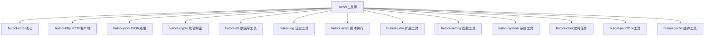
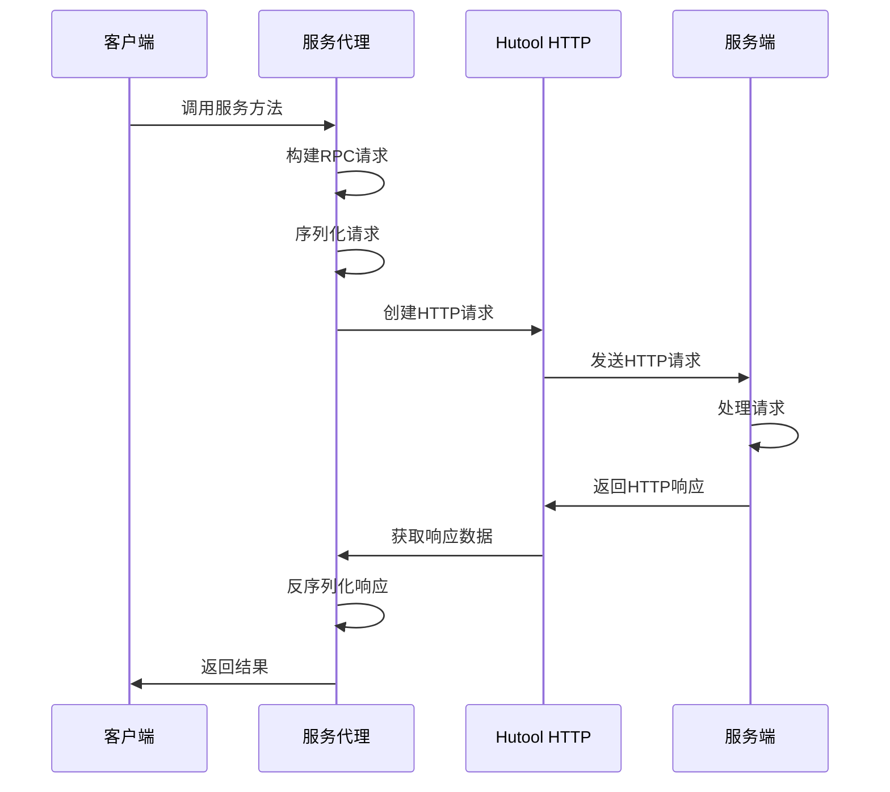

# Hutool工具库应用

## 1. 什么是Hutool工具库？

Hutool是一个小而全的Java工具类库，它旨在通过提供一系列的工具方法集，使Java开发变得更加简单和高效。Hutool涵盖了字符串处理、IO操作、加密解密、日期处理、HTTP客户端、JSON处理等多个方面，提供了非常丰富的API。

### 1.1 Hutool的主要特点

- **全面性**：提供了Java开发中常用的工具类和方法
- **无依赖性**：除了JDK外，不依赖任何第三方库
- **高可用性**：经过严格测试，可直接用于生产环境
- **易用性**：API设计简洁明了，使用方便
- **模块化**：根据功能划分为多个可选模块，可按需引入

### 1.2 Hutool的主要模块



## 2. 在RPC项目中的应用

在本RPC框架项目中，Hutool工具库主要被用于简化HTTP通信实现，提高开发效率。项目中添加了对Hutool的依赖：

```xml
<!-- https://doc.hutool.cn/ -->
<dependency>
    <groupId>cn.hutool</groupId>
    <artifactId>hutool-all</artifactId>
    <version>5.8.16</version>
</dependency>
```

### 2.1 HTTP通信应用

Hutool的HTTP客户端模块是RPC框架中使用最多的部分。在RPC框架中，客户端需要向服务端发送请求，服务端处理完成后返回响应，这个过程通过HTTP协议实现。Hutool的HTTP模块大大简化了这一过程。

#### 2.1.1 客户端代理中的应用

在服务代理实现类`ServiceProxy`中，Hutool的HTTP工具用于发送RPC请求：

```java
// 发送请求
String url = "http://localhost:8081";
try(
    HttpResponse httpResponse = HttpRequest.post(url)
    .body(bodyBytes)
    .execute()){
        // 处理响应
        byte[] result = httpResponse.bodyBytes();
        // 反序列化响应
        RpcResponse rpcResponse = serializer.deserialize(result, RpcResponse.class);
        // ...
}
```

上述代码使用Hutool的`HttpRequest`和`HttpResponse`类完成了HTTP请求的发送和响应处理。相比使用原生的Java HTTP API或其他库如Apache HttpClient，Hutool提供了更简洁的API。

#### 2.1.2 静态代理中的应用

在`UserServiceProxy`类中，也使用了类似的方式进行HTTP通信：

```java
try(HttpResponse httpResponse = HttpRequest.post("http://localhost:8080")
    .body(bodyBytes)
    .execute()){
    // 处理响应
    result = httpResponse.bodyBytes();
}
```

### 2.2 RPC调用流程中的Hutool应用

下面的流程图展示了Hutool在RPC调用过程中的应用位置：



## 3. 使用Hutool的优势

在RPC框架中使用Hutool带来了以下几方面的优势：

### 3.1 简化代码

- **流式API**: Hutool提供链式调用的API，使代码更加简洁易读
- **异常处理**: 内置异常处理机制，减少了异常处理的冗余代码
- **自动资源管理**: 支持try-with-resources语法，简化资源管理

### 3.2 提高开发效率

- **开箱即用**: 无需复杂配置，引入依赖后即可使用
- **丰富的工具方法**: 提供了大量实用的工具方法，减少了"重复造轮子"的工作
- **详细的文档**: Hutool提供了详细的API文档和使用示例

### 3.3 性能优化

- **连接池管理**: Hutool HTTP客户端支持连接池，提高并发性能
- **内存优化**: 对字节数组等资源进行了优化处理，减少内存占用

## 4. 潜在的其他Hutool应用场景

除了HTTP通信外，Hutool在RPC框架中还有许多潜在的应用场景：

### 4.1 JSON处理

使用Hutool的JSON模块可以实现RPC框架中的序列化和反序列化：

```java
// 对象转JSON字符串
String jsonStr = JSONUtil.toJsonStr(object);

// JSON字符串转对象
User user = JSONUtil.toBean(jsonStr, User.class);
```

### 4.2 加密解密

在RPC框架中实现数据安全传输：

```java
// 对数据进行加密
String encrypted = SecureUtil.aes(key.getBytes()).encryptHex(data);

// 对数据进行解密
String decrypted = SecureUtil.aes(key.getBytes()).decryptStr(encrypted);
```

### 4.3 配置管理

使用Hutool的Setting模块管理RPC框架的配置：

```java
// 创建Setting实例
Setting setting = new Setting("rpc-config.setting");

// 获取配置项
String serverHost = setting.getStr("server.host");
int serverPort = setting.getInt("server.port");
```

### 4.4 日志记录

使用Hutool的Log模块统一RPC框架的日志处理：

```java
// 创建Log对象
Log log = LogFactory.get();

// 记录日志
log.info("RPC服务启动成功，端口: {}", port);
log.error("调用服务失败", e);
```

## 5. 最佳实践和建议

在RPC框架中使用Hutool工具库时，可以参考以下最佳实践：

1. **按需引入**：如果不需要全部功能，可以只引入需要的模块，减小依赖体积
2. **版本统一**：在项目中统一Hutool的版本，避免版本冲突
3. **深入了解**：充分了解Hutool的API功能，避免"重复造轮子"
4. **异常处理**：即使Hutool简化了操作，也应当做好异常处理
5. **性能考虑**：在高并发场景下，注意连接池、缓存等性能优化配置

## 6. 结论

Hutool工具库通过其简洁、功能丰富的API，在RPC框架中发挥了重要作用，特别是在HTTP通信方面大大简化了开发工作。通过合理使用Hutool提供的各种工具类和方法，可以有效提高开发效率，减少冗余代码，使RPC框架的实现更加简洁优雅。随着项目的发展，Hutool还可以在序列化、配置管理、安全加密等多个方面发挥更大的作用。 