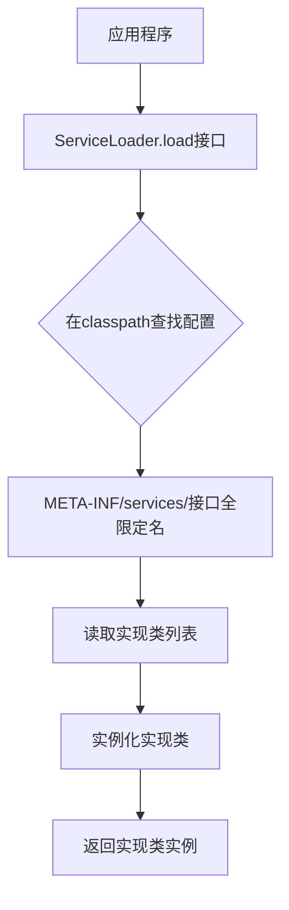
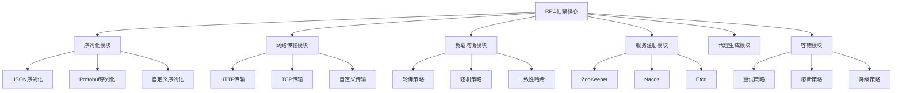

# Java SPI机制与动态扩展实现

## 什么是Java的SPI机制？

SPI（Service Provider Interface）是JDK内置的一种服务发现机制，它允许程序在运行时动态地发现和加载实现了特定接口的类。SPI机制是Java中实现插件化、模块化架构的重要技术基础。

Java SPI的核心思想是：**接口的定义与实现分离，程序可以在运行时发现接口的实现类**。这种机制使得程序具有极高的可扩展性，允许第三方为系统提供实现，而不需要修改原有代码。

## Java SPI的工作原理



Java SPI的核心工作流程：

1. 在jar包的`META-INF/services`目录下创建一个以"接口全限定名"为名字的文件
2. 文件内容为接口实现类的全限定名，每行一个实现类
3. 在代码中使用`ServiceLoader.load(接口.class)`方法加载接口的所有实现
4. ServiceLoader会搜索classpath下所有jar包中的配置文件，并实例化文件中指定的实现类

### 核心API：ServiceLoader

ServiceLoader是Java SPI机制的核心类，它负责加载和实例化服务提供者：

```java
// 加载某接口的所有实现
ServiceLoader<Interface> serviceLoader = ServiceLoader.load(Interface.class);

// 遍历所有实现
for (Interface instance : serviceLoader) {
    // 使用实现类实例
    instance.someMethod();
}
```

### 配置文件示例

假设有一个序列化接口`com.example.Serializer`，它有两个实现类：`com.example.JsonSerializer`和`com.example.ProtobufSerializer`。

配置文件路径为：`META-INF/services/com.example.Serializer`，内容如下：

```
com.example.JsonSerializer
com.example.ProtobufSerializer
```

## Java SPI的应用场景

Java SPI机制在很多知名框架和库中都有应用，例如：

1. **JDBC**：`java.sql.Driver`接口使用SPI机制，数据库驱动只需实现该接口并提供配置文件，Java程序就能自动发现和加载驱动

2. **日志框架**：SLF4J使用SPI机制加载具体的日志实现，如Logback、Log4j等

3. **Java Sound API**：通过SPI机制加载音频设备和格式的实现

4. **JavaFX**：使用SPI机制加载特定平台的实现

5. **Dubbo**：使用SPI机制实现了多种扩展点，如协议、序列化、负载均衡等

## SPI机制与RPC框架

在RPC框架中，SPI机制是实现模块化和可扩展性的关键技术。通过SPI，RPC框架可以将各个组件抽象为接口，并提供默认实现，同时允许用户自定义实现来替换默认行为。

### RPC框架中适合使用SPI机制的组件



1. **序列化/反序列化器**：支持JSON、Protobuf、Hessian等多种序列化方式

2. **负载均衡策略**：轮询、随机、一致性哈希等不同算法

3. **注册中心实现**：支持ZooKeeper、Etcd、Nacos等不同的注册中心

4. **网络传输实现**：HTTP、TCP、自定义协议等

5. **代理生成器**：支持JDK动态代理、CGLIB等不同的代理方式

6. **编解码器**：处理不同的消息格式和协议

7. **容错策略**：重试、熔断、降级等机制

## 如何在RPC框架中实现SPI机制

### 1. 定义扩展点接口

首先，为每个可扩展的组件定义清晰的接口：

```java
/**
 * 序列化器接口
 */
public interface Serializer {
    /**
     * 序列化
     */
    <T> byte[] serialize(T obj) throws Exception;
    
    /**
     * 反序列化
     */
    <T> T deserialize(byte[] data, Class<T> clazz) throws Exception;
}

/**
 * 负载均衡器接口
 */
public interface LoadBalancer {
    /**
     * 从可用服务列表中选择一个
     */
    ServiceInstance select(List<ServiceInstance> instances, RpcRequest request);
}
```

### 2. 提供默认实现

为每个接口提供一个或多个默认实现：

```java
/**
 * JSON序列化实现
 */
public class JsonSerializer implements Serializer {
    @Override
    public <T> byte[] serialize(T obj) throws Exception {
        // JSON序列化实现
    }
    
    @Override
    public <T> T deserialize(byte[] data, Class<T> clazz) throws Exception {
        // JSON反序列化实现
    }
}

/**
 * 随机负载均衡实现
 */
public class RandomLoadBalancer implements LoadBalancer {
    @Override
    public ServiceInstance select(List<ServiceInstance> instances, RpcRequest request) {
        // 随机选择实现
    }
}
```

### 3. 创建SPI配置文件

在`META-INF/services`目录下创建配置文件：

```
// META-INF/services/com.ming.rpc.protocol.serialize.Serializer
com.ming.rpc.protocol.serialize.JsonSerializer
com.ming.rpc.protocol.serialize.ProtobufSerializer
com.ming.rpc.protocol.serialize.JdkSerializer

// META-INF/services/com.ming.rpc.client.loadbalance.LoadBalancer
com.ming.rpc.client.loadbalance.RandomLoadBalancer
com.ming.rpc.client.loadbalance.RoundRobinLoadBalancer
com.ming.rpc.client.loadbalance.ConsistentHashLoadBalancer
```

### 4. 实现扩展加载器

为了更好地管理SPI扩展，可以实现一个扩展加载器：

```java
/**
 * SPI扩展加载器
 */
public class ExtensionLoader<T> {
    private static final Map<Class<?>, ExtensionLoader<?>> EXTENSION_LOADERS = new ConcurrentHashMap<>();
    private static final Map<Class<?>, Object> EXTENSION_INSTANCES = new ConcurrentHashMap<>();
    
    private final Class<T> type;
    private final Map<String, Class<?>> extensionClasses = new ConcurrentHashMap<>();
    
    private ExtensionLoader(Class<T> type) {
        this.type = type;
        loadExtensionClasses();
    }
    
    public static <T> ExtensionLoader<T> getExtensionLoader(Class<T> type) {
        if (type == null) {
            throw new IllegalArgumentException("Extension type should not be null.");
        }
        if (!type.isInterface()) {
            throw new IllegalArgumentException("Extension type must be an interface.");
        }
        
        ExtensionLoader<T> loader = (ExtensionLoader<T>) EXTENSION_LOADERS.get(type);
        if (loader == null) {
            EXTENSION_LOADERS.putIfAbsent(type, new ExtensionLoader<T>(type));
            loader = (ExtensionLoader<T>) EXTENSION_LOADERS.get(type);
        }
        return loader;
    }
    
    public T getExtension(String name) {
        if (name == null || name.isEmpty()) {
            throw new IllegalArgumentException("Extension name should not be null or empty.");
        }
        
        Class<?> clazz = extensionClasses.get(name);
        if (clazz == null) {
            return null;
        }
        
        T instance = (T) EXTENSION_INSTANCES.get(clazz);
        if (instance == null) {
            try {
                EXTENSION_INSTANCES.putIfAbsent(clazz, clazz.newInstance());
                instance = (T) EXTENSION_INSTANCES.get(clazz);
            } catch (Exception e) {
                throw new RuntimeException("Error creating extension " + name, e);
            }
        }
        return instance;
    }
    
    public T getDefaultExtension() {
        // 返回默认扩展实现
        // 可以通过注解或配置指定默认实现
    }
    
    private void loadExtensionClasses() {
        // 加载META-INF/services/下的配置文件
        // 解析配置文件中的实现类
        // 填充extensionClasses映射
    }
}
```

### 5. 在框架中使用扩展加载器

在框架的关键位置使用扩展加载器获取实现：

```java
// 获取默认序列化器
Serializer serializer = ExtensionLoader.getExtensionLoader(Serializer.class)
                          .getDefaultExtension();

// 根据配置获取指定序列化器
String serializerName = config.getSerializerName(); // 从配置中获取
Serializer serializer = ExtensionLoader.getExtensionLoader(Serializer.class)
                          .getExtension(serializerName);
```

### 6. 支持用户自定义扩展

在文档中说明如何添加自定义扩展：

1. 实现相应的接口
2. 在`META-INF/services`目录下创建或修改配置文件
3. 在配置或代码中指定使用的扩展名称

## 项目中使用SPI机制的示例

在learn-RPC项目中，序列化模块是一个很好的SPI应用示例。首先，我们定义了`Serializer`接口：

```java
public interface Serializer {
    <T> byte[] serialize(T obj) throws Exception;
    <T> T deserialize(byte[] data, Class<T> clazz) throws Exception;
}
```

然后提供了默认的JDK序列化实现：

```java
public class JdkSerializer implements Serializer {
    @Override
    public <T> byte[] serialize(T obj) throws Exception {
        ByteArrayOutputStream bos = new ByteArrayOutputStream();
        ObjectOutputStream oos = new ObjectOutputStream(bos);
        oos.writeObject(obj);
        return bos.toByteArray();
    }
    
    @Override
    public <T> T deserialize(byte[] data, Class<T> clazz) throws Exception {
        ObjectInputStream ois = new ObjectInputStream(new ByteArrayInputStream(data));
        return (T) ois.readObject();
    }
}
```

为了支持SPI，在META-INF/services目录下创建文件：

```
// META-INF/services/com.ming.rpc.protocol.serialize.Serializer
com.ming.rpc.protocol.serialize.JdkSerializer
```

然后，用户可以实现自己的序列化器并添加到SPI配置中：

```java
public class JsonSerializer implements Serializer {
    private final ObjectMapper mapper = new ObjectMapper();
    
    @Override
    public <T> byte[] serialize(T obj) throws Exception {
        return mapper.writeValueAsBytes(obj);
    }
    
    @Override
    public <T> T deserialize(byte[] data, Class<T> clazz) throws Exception {
        return mapper.readValue(data, clazz);
    }
}
```

添加到META-INF/services/com.ming.rpc.protocol.serialize.Serializer文件：

```
com.ming.rpc.protocol.serialize.JdkSerializer
com.example.JsonSerializer
```

## SPI机制的优缺点

### 优点

1. **高度的可扩展性**：允许第三方为系统提供实现，实现解耦
2. **不修改源码的情况下改变行为**：通过替换实现来改变系统行为
3. **运行时动态加载**：在运行时发现并加载实现，增强了灵活性
4. **面向接口编程**：促进了接口与实现分离的良好设计实践

### 缺点

1. **懒加载且无法按需加载**：ServiceLoader会一次性加载所有实现
2. **无法感知实现变化**：无法监听实现的变更
3. **无法定义加载顺序**：无法控制多个实现的加载优先级
4. **无法方便地指定使用哪个实现**：不支持别名机制
5. **依赖于约定的配置文件路径**：必须遵循特定的目录结构

## SPI机制的扩展和改进

为了弥补Java SPI机制的不足，一些框架实现了自己的扩展机制，如：

1. **Dubbo的扩展机制**：支持扩展点自动激活、扩展点自适应、扩展点自动装配等特性

2. **Spring的SPI机制**：通过SpringFactoriesLoader实现，支持按优先级排序、按条件加载等特性

这些改进主要包括：

- 支持扩展点分组和优先级排序
- 支持条件激活，根据配置决定使用哪个实现
- 支持依赖注入，扩展点之间可以相互依赖
- 支持动态适配，根据参数决定使用哪个实现
- 支持扩展点缓存，提高性能

## 总结

Java SPI机制是一种强大的服务发现机制，它通过定义接口与实现的分离，提供了高度的可扩展性。在RPC框架中，SPI机制是实现模块化和插件化的重要技术手段，可以让框架支持多种协议、序列化方式、负载均衡策略等。

通过正确使用SPI机制，RPC框架可以：

1. 保持核心代码稳定的同时支持功能扩展
2. 允许用户自定义实现特定组件，满足个性化需求
3. 实现"微内核+插件"的架构设计
4. 降低各模块间的耦合度，提高代码可维护性

在实际应用中，我们可以借鉴Dubbo等成熟框架的扩展机制，在Java原生SPI的基础上进行增强，实现更加灵活、强大的模块动态扩展能力。 