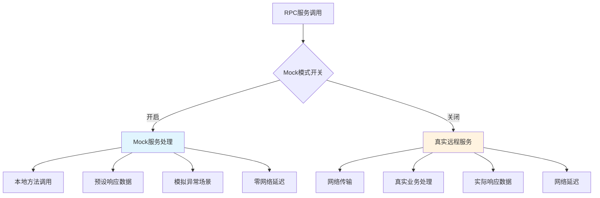
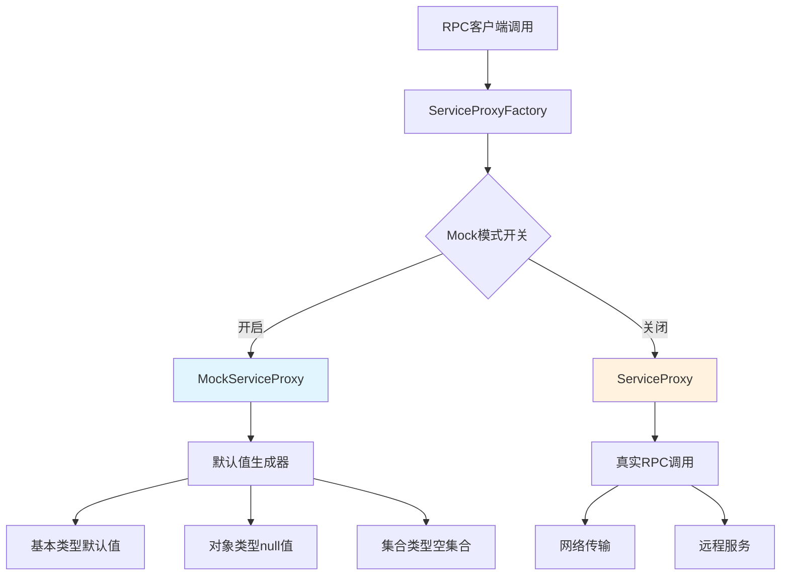
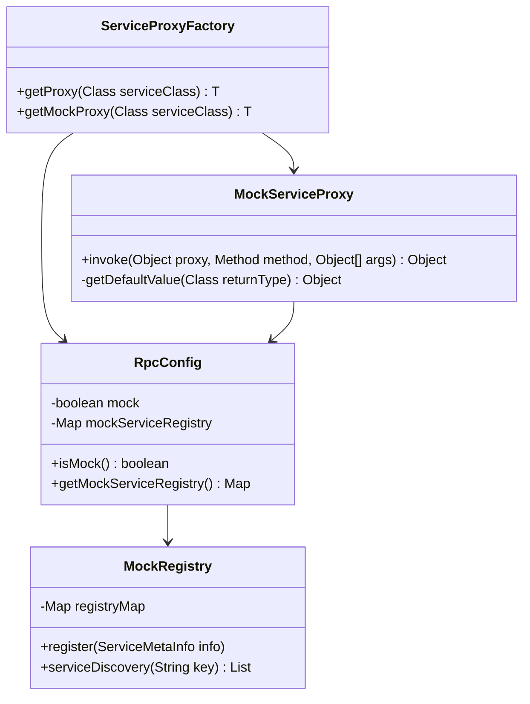
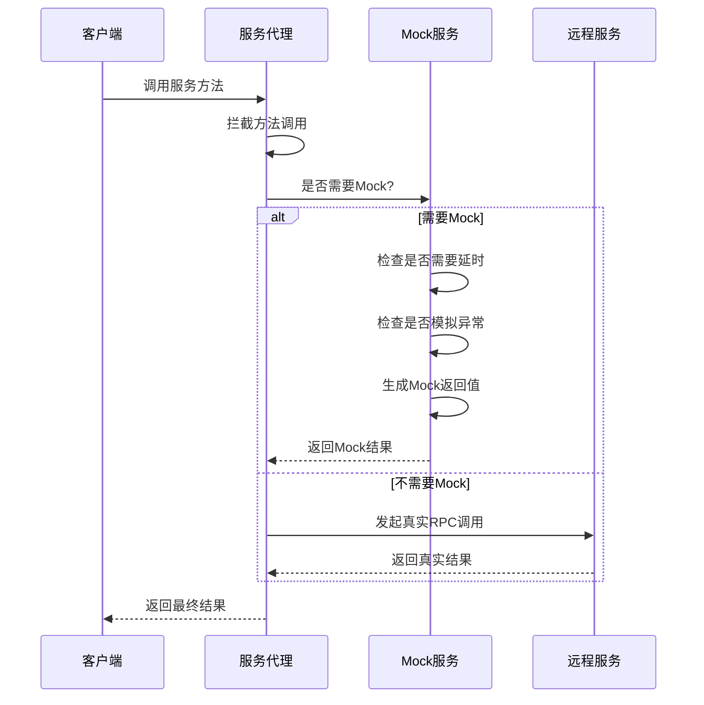

# Ming RPC Framework Mock服务实现详解

## 📖 概述

Mock服务是Ming RPC Framework的重要组成部分，它通过创建模拟对象来代替真实的远程服务，为开发和测试提供了强大的支持。在分布式开发环境中，Mock服务能够有效降低服务间的依赖，提高开发效率和测试质量。

### 🎯 Mock服务的核心价值

#### 开发阶段价值
1. **降低依赖性**: 开发过程中，即使依赖的远程服务不可用，也能继续开发和测试
2. **并行开发**: 服务提供者和消费者可以并行开发，不必等待对方完成
3. **快速验证**: 无需搭建完整的分布式环境即可验证业务逻辑

#### 测试阶段价值
1. **加速测试**: 无需等待远程服务的响应，可以大大提高测试速度
2. **控制测试环境**: 可以模拟各种场景，包括正常响应、异常响应、超时等
3. **隔离测试**: 确保测试只关注于消费者代码的正确性，不受提供者问题的影响

#### 运维阶段价值
1. **故障隔离**: 在服务故障时提供降级响应
2. **性能测试**: 模拟高并发场景进行压力测试
3. **灰度发布**: 在新版本发布时提供兜底机制

### 🔄 Mock服务与实际服务的对比



### 📊 Mock vs 真实服务对比

| 特性 | Mock服务 | 真实服务 |
|------|---------|---------|
| **响应速度** | 极快(本地调用) | 依赖网络和处理时间 |
| **数据真实性** | 模拟数据 | 真实业务数据 |
| **环境依赖** | 无外部依赖 | 需要完整环境 |
| **测试控制** | 完全可控 | 受外部因素影响 |
| **开发成本** | 需要编写Mock逻辑 | 无额外成本 |
| **适用场景** | 开发、测试、演示 | 生产环境 |

## 🏗️ Ming RPC Framework Mock服务架构

### 整体设计架构


### 核心组件关系


## 🔧 Mock服务实现详解

### 1. Mock配置管理
**文件路径**: `rpc-core/src/main/java/com/ming/rpc/config/RpcConfig.java`

```java
@Data
public class RpcConfig {
    /**
     * 模拟调用开关
     */
    private boolean mock = false;

    /**
     * Mock服务注册表
     * key: 服务接口全限定名
     * value: Mock实现类的Class对象
     */
    private final Map<String, Class<?>> mockServiceRegistry = new HashMap<>();
}
```

### 2. 服务代理工厂
**文件路径**: `rpc-core/src/main/java/com/ming/rpc/proxy/ServiceProxyFactory.java`

```java
public class ServiceProxyFactory {
    /**
     * 获取服务代理对象
     * 根据配置决定返回Mock代理还是真实代理
     */
    public static <T> T getProxy(Class<T> serviceClass) {
        if (RpcApplication.getRpcConfig().isMock()) {
            return getMockProxy(serviceClass);
        }

        return (T) Proxy.newProxyInstance(
            serviceClass.getClassLoader(),
            new Class[] { serviceClass },
            new ServiceProxy()
        );
    }

    /**
     * 获取Mock代理对象
     */
    public static <T> T getMockProxy(Class<T> serviceClass) {
        return (T) Proxy.newProxyInstance(
            serviceClass.getClassLoader(),
            new Class[] { serviceClass },
            new MockServiceProxy()
        );
    }
}
```

### 3. Mock服务代理实现
**文件路径**: `rpc-core/src/main/java/com/ming/rpc/proxy/MockServiceProxy.java`

```java
public class MockServiceProxy implements InvocationHandler {
    /**
     * 调用代理 - 根据方法返回类型生成默认返回值
     */
    @Override
    public Object invoke(Object proxy, Method method, Object[] args) throws Throwable {
        Class<?> returnType = method.getReturnType();

        // 基本类型处理
        if (returnType == boolean.class || returnType == Boolean.class) {
            return false;
        }
        if (returnType == int.class || returnType == Integer.class) {
            return 0;
        }
        if (returnType == long.class || returnType == Long.class) {
            return 0L;
        }
        if (returnType == byte.class || returnType == Byte.class) {
            return (byte) 0;
        }
        if (returnType == short.class || returnType == Short.class) {
            return (short) 0;
        }
        if (returnType == float.class || returnType == Float.class) {
            return 0.0f;
        }
        if (returnType == double.class || returnType == Double.class) {
            return 0.0d;
        }
        if (returnType == char.class || returnType == Character.class) {
            return '\0';
        }
        if (returnType == String.class) {
            return "";
        }

        // 数组类型
        if (returnType.isArray()) {
            return Array.newInstance(returnType.getComponentType(), 0);
        }

        // 集合类型
        if (List.class.isAssignableFrom(returnType)) {
            return new ArrayList<>();
        }
        if (Set.class.isAssignableFrom(returnType)) {
            return new HashSet<>();
        }
        if (Map.class.isAssignableFrom(returnType)) {
            return new HashMap<>();
        }

        // 其他对象类型返回null
        return null;
    }
}
```

### 4. Mock注册中心实现
**文件路径**: `rpc-core/src/test/java/com/ming/rpc/registry/MockRegistry.java`

```java
/**
 * 用于测试的Mock注册中心实现
 */
public class MockRegistry implements Registry {
    /**
     * 注册信息存储
     */
    private final Map<String, List<ServiceMetaInfo>> registryMap = new ConcurrentHashMap<>();

    @Override
    public void init(RegistryConfig registryConfig) {
        // Mock注册中心无需初始化
    }

    @Override
    public void register(ServiceMetaInfo serviceMetaInfo) throws Exception {
        List<ServiceMetaInfo> serviceMetaInfos = registryMap.getOrDefault(
            serviceMetaInfo.getServiceKey(), new ArrayList<>());
        serviceMetaInfos.add(serviceMetaInfo);
        registryMap.put(serviceMetaInfo.getServiceKey(), serviceMetaInfos);
    }

    @Override
    public void unregister(ServiceMetaInfo serviceMetaInfo) {
        List<ServiceMetaInfo> serviceMetaInfos = registryMap.getOrDefault(
            serviceMetaInfo.getServiceKey(), new ArrayList<>());
        serviceMetaInfos.remove(serviceMetaInfo);
        registryMap.put(serviceMetaInfo.getServiceKey(), serviceMetaInfos);
    }

    @Override
    public List<ServiceMetaInfo> serviceDiscovery(String serviceKey) {
        return registryMap.getOrDefault(serviceKey, new ArrayList<>());
    }

    @Override
    public void destroy() {
        registryMap.clear();
    }

    @Override
    public void heartbeat() {
        // Mock注册中心无需心跳
    }

    @Override
    public void watch(String serviceKey) {
        // Mock注册中心无需监听
    }
}
```

## 📚 Mock服务使用指南

### 1. 基础配置使用

#### 启用Mock模式
```yaml
# application.yml
rpc:
  mock: true  # 启用Mock模式
  registryConfig:
    registry: MOCK  # 使用Mock注册中心
```

#### 代码中启用Mock
```java
// 通过配置启用Mock
RpcConfig rpcConfig = RpcApplication.getRpcConfig();
rpcConfig.setMock(true);

// 获取Mock代理
UserService userService = ServiceProxyFactory.getProxy(UserService.class);
```

### 2. 服务降级Mock实现

#### 注册Mock服务实现
```java
// 定义Mock服务实现
public class UserServiceMock implements UserService {
    @Override
    public User getUser(User user) {
        User mockUser = new User();
        mockUser.setName("Mock User: " + user.getName());
        mockUser.setAge(25);
        return mockUser;
    }

    @Override
    public boolean saveUser(User user) {
        // 模拟保存成功
        return true;
    }
}

// 注册Mock服务
RpcConfig rpcConfig = RpcApplication.getRpcConfig();
rpcConfig.getMockServiceRegistry().put(
    UserService.class.getName(),
    UserServiceMock.class
);
```

#### 容错策略中的Mock应用
```java
/**
 * 服务降级策略测试
 */
@Test
public void testFailBackWithMock() {
    // 注册Mock服务
    RpcConfig rpcConfig = RpcApplication.getRpcConfig();
    rpcConfig.getMockServiceRegistry().put(
        GreetingService.class.getName(),
        GreetingServiceMock.class
    );

    // 模拟服务调用异常
    Exception exception = new RuntimeException("Service unavailable");

    // 执行容错处理
    FailBackTolerantStrategy strategy = new FailBackTolerantStrategy();
    RpcResponse response = strategy.doTolerant(context, exception);

    // 验证降级响应
    assertEquals("Mocked Greeting for test", response.getData());
}
```

### 3. 测试中的Mock应用

#### 单元测试Mock配置
```java
@Test
public void testMockProxy() {
    // 启用Mock模式
    RpcConfig rpcConfig = RpcApplication.getRpcConfig();
    rpcConfig.setMock(true);

    // 获取Mock代理
    TestService testService = ServiceProxyFactory.getMockProxy(TestService.class);

    // 验证Mock返回值
    assertEquals("", testService.hello("world"));
    assertEquals(0, testService.add(5, 10));
    assertEquals(false, testService.isValid());
    assertNull(testService.getObject());
}
```

#### 集成测试Mock配置
```java
@SpringBootTest
@TestPropertySource(properties = {
    "rpc.mock=true",
    "rpc.registryConfig.registry=MOCK"
})
public class MockIntegrationTest {

    @RpcReference
    private UserService userService;

    @Test
    public void testMockService() {
        User user = new User();
        user.setName("TestUser");

        // 调用Mock服务
        User result = userService.getUser(user);

        // 验证Mock返回的默认值
        assertNotNull(result);
        // Mock代理返回null（对象类型默认值）
        assertNull(result);
    }
}
```

### 4. Mock数据类型支持

#### 基本类型Mock返回值
| 类型 | Mock返回值 |
|------|-----------|
| boolean/Boolean | false |
| int/Integer | 0 |
| long/Long | 0L |
| byte/Byte | (byte) 0 |
| short/Short | (short) 0 |
| float/Float | 0.0f |
| double/Double | 0.0d |
| char/Character | '\0' |
| String | "" |

#### 复杂类型Mock返回值
| 类型 | Mock返回值 |
|------|-----------|
| 数组类型 | 空数组 |
| List | new ArrayList<>() |
| Set | new HashSet<>() |
| Map | new HashMap<>() |
| 自定义对象 | null |

### 5. Mock注册中心使用

#### 配置Mock注册中心
```java
// 使用Mock注册中心进行测试
RegistryConfig registryConfig = new RegistryConfig();
registryConfig.setRegistry("MOCK");

// 创建Mock注册中心
Registry mockRegistry = new MockRegistry();
mockRegistry.init(registryConfig);

// 注册服务
ServiceMetaInfo serviceInfo = new ServiceMetaInfo();
serviceInfo.setServiceName("UserService");
serviceInfo.setServiceHost("localhost");
serviceInfo.setServicePort(8080);
mockRegistry.register(serviceInfo);

// 服务发现
List<ServiceMetaInfo> services = mockRegistry.serviceDiscovery("UserService:1.0");
```

## 4. Mock配置文件示例

Mock服务可以通过JSON格式的配置文件进行配置：

```json
{
  "com.ming.example.common.service.UserService#getUser": {
    "result": {
      "name": "MockUser",
      "age": 30,
      "email": "mock@example.com"
    },
    "delay": 100,
    "exception": null
  },
  "com.ming.example.common.service.UserService#saveUser": {
    "result": true,
    "delay": 0,
    "exception": null
  },
  "com.ming.example.common.service.UserService#deleteUser": {
    "result": null,
    "delay": 50,
    "exception": "java.lang.IllegalArgumentException: User not found"
  }
}
```

## 5. Mock服务调用流程

以下是启用Mock服务后的调用流程：



## 6. 使用案例

### 6.1 基于配置文件的Mock使用

```java
public class MockServiceExample {
    public static void main(String[] args) {
        // 设置Mock配置文件路径
        System.setProperty("rpc.mock.config", "mock-config.json");
        
        // 获取服务代理
        UserService userService = ServiceProxyFactory.getProxy(UserService.class);
        
        // 调用服务方法（会被Mock）
        User user = new User();
        user.setName("TestUser");
        
        User result = userService.getUser(user);
        System.out.println("Mock结果: " + result.getName());  // 输出: Mock结果: MockUser
        
        try {
            // 这个方法在Mock配置中设置了抛出异常
            userService.deleteUser(user);
        } catch (IllegalArgumentException e) {
            System.out.println("捕获到预期的异常: " + e.getMessage());  // 输出: 捕获到预期的异常: User not found
        }
    }
}
```

### 6.2 基于注解的Mock使用

```java
public class AnnotationMockExample {
    @MockService(
        result = "{\"name\":\"AnnotationMockUser\", \"age\":25}",
        delay = 50
    )
    private UserService userService;
    
    public void init() {
        // 初始化注解Mock服务
        AnnotationMockInitializer.init(this);
        
        // 使用带Mock注解的服务
        User user = new User();
        user.setName("TestUser");
        
        User result = userService.getUser(user);
        System.out.println("注解Mock结果: " + result.getName());  // 输出: 注解Mock结果: AnnotationMockUser
    }
    
    public static void main(String[] args) {
        new AnnotationMockExample().init();
    }
}
```

### 6.3 编程式Mock使用

```java
public class ProgrammaticMockExample {
    public static void main(String[] args) {
        // 创建编程式Mock服务
        ProgrammaticMockService mockService = new ProgrammaticMockService();
        
        // 注册Mock行为
        mockService.register("com.ming.example.common.service.UserService", "getUser", args -> {
            User mockUser = new User();
            mockUser.setName("ProgrammaticMockUser");
            mockUser.setAge(35);
            return mockUser;
        });
        
        // 设置全局Mock服务
        ServiceProxyFactory.setMockService(mockService);
        
        // 使用服务
        UserService userService = ServiceProxyFactory.getProxy(UserService.class);
        User result = userService.getUser(new User());
        System.out.println("编程式Mock结果: " + result.getName());  // 输出: 编程式Mock结果: ProgrammaticMockUser
    }
}
```

## 7. 在测试中使用Mock服务

Mock服务在单元测试和集成测试中特别有用：

```java
public class UserServiceTest {
    private UserService userService;
    
    @Before
    public void setup() {
        // 设置Mock配置
        System.setProperty("rpc.mock.config", "test-mock-config.json");
        
        // 获取带Mock功能的服务代理
        userService = ServiceProxyFactory.getProxy(UserService.class);
    }
    
    @Test
    public void testGetUser() {
        User user = new User();
        user.setName("TestUser");
        
        User result = userService.getUser(user);
        
        assertNotNull(result);
        assertEquals("MockUser", result.getName());
        assertEquals(30, result.getAge());
    }
    
    @Test(expected = IllegalArgumentException.class)
    public void testDeleteUserException() {
        User user = new User();
        user.setName("TestUser");
        
        // 这个方法在Mock配置中会抛出异常
        userService.deleteUser(user);
    }
}
```

## 🎯 最佳实践

### 1. Mock使用场景

#### 适合Mock的场景
- ✅ **单元测试**: 隔离外部依赖，专注业务逻辑测试
- ✅ **集成测试**: 模拟不稳定的外部服务
- ✅ **开发阶段**: 依赖服务尚未开发完成
- ✅ **演示环境**: 提供稳定的演示数据
- ✅ **性能测试**: 消除外部服务的性能影响

#### 不适合Mock的场景
- ❌ **生产环境**: 应使用真实服务
- ❌ **端到端测试**: 需要验证完整链路
- ❌ **数据一致性测试**: 需要真实的数据交互
- ❌ **安全测试**: 需要真实的安全验证

### 2. Mock配置管理

#### 环境隔离配置
```yaml
# 开发环境 application-dev.yml
rpc:
  mock: true
  registryConfig:
    registry: MOCK

# 测试环境 application-test.yml
rpc:
  mock: false
  registryConfig:
    registry: etcd
    address: http://test-etcd:2379

# 生产环境 application-prod.yml
rpc:
  mock: false
  registryConfig:
    registry: etcd
    address: http://prod-etcd-cluster:2379
```

#### 条件化Mock配置
```java
@Configuration
@Profile("test")
public class MockConfiguration {

    @Bean
    @ConditionalOnProperty(name = "rpc.mock", havingValue = "true")
    public UserService mockUserService() {
        return new UserServiceMock();
    }
}
```

### 3. Mock数据管理

#### Mock数据工厂
```java
public class MockDataFactory {

    public static User createMockUser(String name) {
        User user = new User();
        user.setName("Mock_" + name);
        user.setAge(25);
        user.setEmail(name.toLowerCase() + "@mock.com");
        user.setCreateTime(new Date());
        return user;
    }

    public static List<User> createMockUserList(int count) {
        return IntStream.range(0, count)
            .mapToObj(i -> createMockUser("User" + i))
            .collect(Collectors.toList());
    }
}
```

#### Mock数据版本管理
```java
public class MockDataVersion {
    public static final String V1_0 = "1.0";
    public static final String V2_0 = "2.0";

    public static User createUserByVersion(String version, String name) {
        switch (version) {
            case V1_0:
                return createV1User(name);
            case V2_0:
                return createV2User(name);
            default:
                return createMockUser(name);
        }
    }
}
```

### 4. Mock服务监控

#### Mock调用日志
```java
public class MockServiceProxy implements InvocationHandler {
    private static final Logger log = LoggerFactory.getLogger(MockServiceProxy.class);

    @Override
    public Object invoke(Object proxy, Method method, Object[] args) throws Throwable {
        String methodName = method.getName();
        Class<?> returnType = method.getReturnType();

        log.info("Mock调用: {}.{}() -> {}",
            proxy.getClass().getInterfaces()[0].getSimpleName(),
            methodName,
            returnType.getSimpleName()
        );

        Object result = getDefaultValue(returnType);

        log.debug("Mock返回值: {}", result);
        return result;
    }
}
```

#### Mock统计信息
```java
@Component
public class MockStatistics {
    private final AtomicLong mockCallCount = new AtomicLong(0);
    private final Map<String, AtomicLong> methodCallCount = new ConcurrentHashMap<>();

    public void recordMockCall(String methodName) {
        mockCallCount.incrementAndGet();
        methodCallCount.computeIfAbsent(methodName, k -> new AtomicLong(0))
                      .incrementAndGet();
    }

    public MockStats getStatistics() {
        return new MockStats(mockCallCount.get(), new HashMap<>(methodCallCount));
    }
}
```

## 🚀 扩展功能规划

### 1. 智能Mock数据生成
- **数据生成器**: 基于字段类型和注解自动生成Mock数据
- **规则引擎**: 支持自定义数据生成规则
- **数据关联**: 支持关联对象的一致性生成

### 2. Mock行为录制回放
- **录制模式**: 记录真实服务的请求响应
- **回放模式**: 基于录制数据提供Mock响应
- **数据脱敏**: 自动脱敏敏感数据

### 3. 可视化Mock管理
- **Mock控制台**: 可视化管理Mock配置
- **实时监控**: 监控Mock调用情况
- **A/B测试**: 支持多版本Mock数据对比

## 📋 总结

Ming RPC Framework的Mock服务实现提供了完整的Mock解决方案：

### 核心特性
- ✅ **透明切换**: 通过配置开关轻松切换Mock和真实服务
- ✅ **类型完整**: 支持所有Java基本类型和常用集合类型
- ✅ **测试友好**: 与JUnit等测试框架无缝集成
- ✅ **Spring Boot集成**: 支持Spring Boot自动配置
- ✅ **容错集成**: 与容错机制结合提供服务降级

### 技术优势
- **零侵入**: 无需修改业务代码即可启用Mock
- **高性能**: 本地调用，零网络延迟
- **易扩展**: 支持自定义Mock实现
- **配置灵活**: 支持多种配置方式

### 应用价值
- **开发效率**: 降低服务间依赖，提高并行开发效率
- **测试质量**: 提供稳定的测试环境，提高测试可靠性
- **故障隔离**: 在服务故障时提供降级能力
- **成本节约**: 减少测试环境的资源消耗

### 使用建议
1. **开发阶段**: 启用Mock模式快速开发
2. **单元测试**: 使用Mock隔离外部依赖
3. **集成测试**: 选择性Mock不稳定服务
4. **生产环境**: 禁用Mock，使用真实服务
5. **故障处理**: 结合容错机制提供服务降级

Ming RPC Framework的Mock服务为分布式开发提供了强大的支持，通过合理使用Mock功能，可以显著提高开发效率和测试质量，为项目的成功交付提供有力保障。