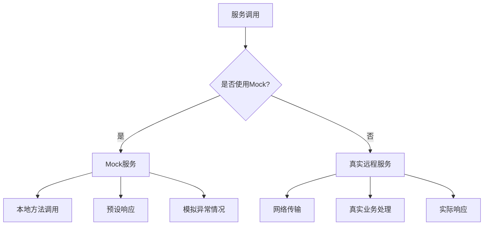
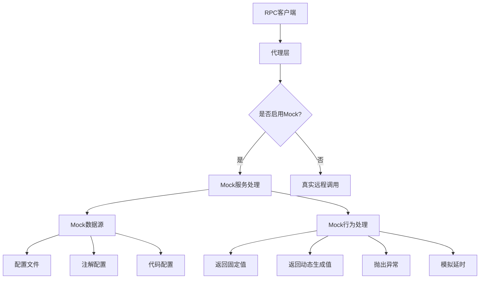
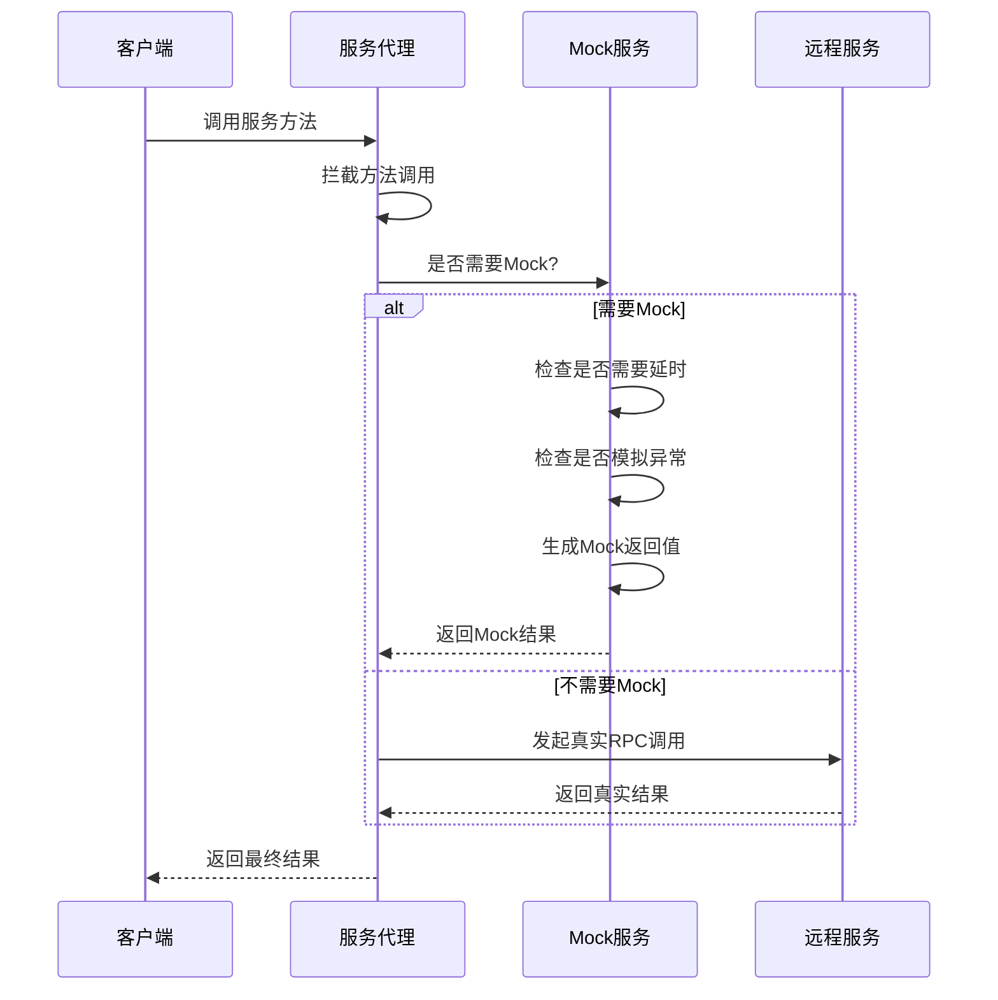

# Mock服务实现

## 1. 什么是Mock服务

Mock是一种在软件开发过程中常用的测试技术，它通过创建模拟对象来代替真实对象，以便在受控的环境中进行测试。在RPC框架中，Mock服务是指在不依赖于真实远程服务的情况下，模拟远程服务的行为，以便进行本地测试或开发。

### 1.1 Mock服务的作用

Mock服务在RPC框架中有以下几个重要作用：

1. **降低依赖性**：开发过程中，即使依赖的远程服务不可用，也能继续开发和测试
2. **加速测试**：无需等待远程服务的响应，可以大大提高测试速度
3. **控制测试环境**：可以模拟各种场景，包括正常响应、异常响应、超时等
4. **并行开发**：服务提供者和消费者可以并行开发，不必等待对方完成
5. **隔离测试**：确保测试只关注于消费者代码的正确性，不受提供者问题的影响

### 1.2 Mock服务与实际服务的区别



## 2. RPC框架中的Mock服务需求

在一个完善的RPC框架中，Mock服务通常需要满足以下需求：

### 2.1 功能需求

1. **透明切换**：在消费者代码不变的情况下，能够轻松切换Mock与真实服务
2. **灵活配置**：可以通过配置文件、注解或编程方式启用Mock服务
3. **多样化返回值**：支持返回固定值、动态生成的值或按规则生成的值
4. **异常模拟**：能够模拟服务调用异常、超时等情况
5. **延时模拟**：模拟真实网络环境中的延时
6. **条件Mock**：根据不同的调用参数返回不同的结果

### 2.2 非功能需求

1. **易用性**：提供简单直观的API，降低使用门槛
2. **可扩展性**：允许开发者自定义Mock行为
3. **兼容性**：与RPC框架的其他功能（如负载均衡、重试）保持兼容
4. **开发环境集成**：能够与常见的测试框架（如JUnit、Mock框架）集成

## 3. Mock服务实现设计

针对上述需求，我们可以设计一个灵活的Mock服务实现方案：

### 3.1 整体架构



### 3.2 Mock服务接口设计

```java
/**
 * Mock服务接口
 * 定义了Mock服务的核心能力
 */
public interface MockService {
    /**
     * 判断是否应该对指定服务进行Mock
     *
     * @param serviceName 服务名称
     * @param methodName 方法名称
     * @param args 方法参数
     * @return 是否应该进行Mock
     */
    boolean shouldMock(String serviceName, String methodName, Object[] args);
    
    /**
     * 获取Mock的返回结果
     *
     * @param serviceName 服务名称
     * @param methodName 方法名称
     * @param returnType 返回值类型
     * @param args 方法参数
     * @return Mock的返回结果
     * @throws RpcMockException 如果模拟异常场景
     */
    Object getMockResult(String serviceName, String methodName, Class<?> returnType, Object[] args) throws RpcMockException;
}
```

### 3.3 基于配置文件的Mock实现

```java
/**
 * 基于配置文件的Mock服务实现
 */
public class ConfigurableMockService implements MockService {
    private Map<String, MockConfig> mockConfigs = new HashMap<>();
    
    public ConfigurableMockService(String configPath) {
        // 加载配置文件
        loadConfig(configPath);
    }
    
    @Override
    public boolean shouldMock(String serviceName, String methodName, Object[] args) {
        String key = generateKey(serviceName, methodName);
        return mockConfigs.containsKey(key);
    }
    
    @Override
    public Object getMockResult(String serviceName, String methodName, Class<?> returnType, Object[] args) throws RpcMockException {
        String key = generateKey(serviceName, methodName);
        MockConfig config = mockConfigs.get(key);
        
        if (config == null) {
            return null;
        }
        
        // 处理延时
        if (config.getDelay() > 0) {
            try {
                Thread.sleep(config.getDelay());
            } catch (InterruptedException e) {
                Thread.currentThread().interrupt();
            }
        }
        
        // 处理异常
        if (config.getException() != null) {
            throw new RpcMockException(config.getException());
        }
        
        // 返回结果
        return config.getResult();
    }
    
    private String generateKey(String serviceName, String methodName) {
        return serviceName + "#" + methodName;
    }
    
    private void loadConfig(String configPath) {
        // 加载配置文件逻辑...
    }
}
```

### 3.4 基于注解的Mock实现

```java
/**
 * 标记需要Mock的服务
 */
@Target({ElementType.FIELD})
@Retention(RetentionPolicy.RUNTIME)
@Documented
public @interface MockService {
    /**
     * 是否启用Mock
     */
    boolean enable() default true;
    
    /**
     * Mock返回值的JSON字符串（适用于简单类型）
     */
    String result() default "";
    
    /**
     * 模拟的异常类型
     */
    Class<? extends Exception> exception() default None.class;
    
    /**
     * 模拟延时（毫秒）
     */
    long delay() default 0;
    
    /**
     * 空异常类，用作默认值
     */
    class None extends Exception {
        private static final long serialVersionUID = 1L;
    }
}
```

### 3.5 集成到RPC框架

要将Mock服务集成到现有的RPC框架中，需要修改服务代理工厂：

```java
public class ServiceProxyFactory {
    private static MockService mockService;
    
    static {
        // 初始化MockService
        String mockConfig = System.getProperty("rpc.mock.config");
        if (mockConfig != null && !mockConfig.isEmpty()) {
            mockService = new ConfigurableMockService(mockConfig);
        }
    }
    
    public static <T> T getProxy(Class<T> serviceClass) {
        return (T) Proxy.newProxyInstance(
            serviceClass.getClassLoader(),
            new Class[]{serviceClass},
            new MockableServiceProxy(serviceClass)
        );
    }
    
    private static class MockableServiceProxy implements InvocationHandler {
        private final Class<?> serviceClass;
        private final ServiceProxy realProxy;
        
        public MockableServiceProxy(Class<?> serviceClass) {
            this.serviceClass = serviceClass;
            this.realProxy = new ServiceProxy();
        }
        
        @Override
        public Object invoke(Object proxy, Method method, Object[] args) throws Throwable {
            // 如果是Object类的方法，直接调用
            if (method.getDeclaringClass() == Object.class) {
                return method.invoke(this, args);
            }
            
            // 判断是否需要Mock
            String serviceName = serviceClass.getName();
            String methodName = method.getName();
            
            if (mockService != null && mockService.shouldMock(serviceName, methodName, args)) {
                try {
                    return mockService.getMockResult(serviceName, methodName, method.getReturnType(), args);
                } catch (RpcMockException e) {
                    throw e.getCause();
                }
            }
            
            // 不需要Mock，执行真实调用
            return realProxy.invoke(proxy, method, args);
        }
    }
}
```

## 4. Mock配置文件示例

Mock服务可以通过JSON格式的配置文件进行配置：

```json
{
  "com.ming.example.common.service.UserService#getUser": {
    "result": {
      "name": "MockUser",
      "age": 30,
      "email": "mock@example.com"
    },
    "delay": 100,
    "exception": null
  },
  "com.ming.example.common.service.UserService#saveUser": {
    "result": true,
    "delay": 0,
    "exception": null
  },
  "com.ming.example.common.service.UserService#deleteUser": {
    "result": null,
    "delay": 50,
    "exception": "java.lang.IllegalArgumentException: User not found"
  }
}
```

## 5. Mock服务调用流程

以下是启用Mock服务后的调用流程：



## 6. 使用案例

### 6.1 基于配置文件的Mock使用

```java
public class MockServiceExample {
    public static void main(String[] args) {
        // 设置Mock配置文件路径
        System.setProperty("rpc.mock.config", "mock-config.json");
        
        // 获取服务代理
        UserService userService = ServiceProxyFactory.getProxy(UserService.class);
        
        // 调用服务方法（会被Mock）
        User user = new User();
        user.setName("TestUser");
        
        User result = userService.getUser(user);
        System.out.println("Mock结果: " + result.getName());  // 输出: Mock结果: MockUser
        
        try {
            // 这个方法在Mock配置中设置了抛出异常
            userService.deleteUser(user);
        } catch (IllegalArgumentException e) {
            System.out.println("捕获到预期的异常: " + e.getMessage());  // 输出: 捕获到预期的异常: User not found
        }
    }
}
```

### 6.2 基于注解的Mock使用

```java
public class AnnotationMockExample {
    @MockService(
        result = "{\"name\":\"AnnotationMockUser\", \"age\":25}",
        delay = 50
    )
    private UserService userService;
    
    public void init() {
        // 初始化注解Mock服务
        AnnotationMockInitializer.init(this);
        
        // 使用带Mock注解的服务
        User user = new User();
        user.setName("TestUser");
        
        User result = userService.getUser(user);
        System.out.println("注解Mock结果: " + result.getName());  // 输出: 注解Mock结果: AnnotationMockUser
    }
    
    public static void main(String[] args) {
        new AnnotationMockExample().init();
    }
}
```

### 6.3 编程式Mock使用

```java
public class ProgrammaticMockExample {
    public static void main(String[] args) {
        // 创建编程式Mock服务
        ProgrammaticMockService mockService = new ProgrammaticMockService();
        
        // 注册Mock行为
        mockService.register("com.ming.example.common.service.UserService", "getUser", args -> {
            User mockUser = new User();
            mockUser.setName("ProgrammaticMockUser");
            mockUser.setAge(35);
            return mockUser;
        });
        
        // 设置全局Mock服务
        ServiceProxyFactory.setMockService(mockService);
        
        // 使用服务
        UserService userService = ServiceProxyFactory.getProxy(UserService.class);
        User result = userService.getUser(new User());
        System.out.println("编程式Mock结果: " + result.getName());  // 输出: 编程式Mock结果: ProgrammaticMockUser
    }
}
```

## 7. 在测试中使用Mock服务

Mock服务在单元测试和集成测试中特别有用：

```java
public class UserServiceTest {
    private UserService userService;
    
    @Before
    public void setup() {
        // 设置Mock配置
        System.setProperty("rpc.mock.config", "test-mock-config.json");
        
        // 获取带Mock功能的服务代理
        userService = ServiceProxyFactory.getProxy(UserService.class);
    }
    
    @Test
    public void testGetUser() {
        User user = new User();
        user.setName("TestUser");
        
        User result = userService.getUser(user);
        
        assertNotNull(result);
        assertEquals("MockUser", result.getName());
        assertEquals(30, result.getAge());
    }
    
    @Test(expected = IllegalArgumentException.class)
    public void testDeleteUserException() {
        User user = new User();
        user.setName("TestUser");
        
        // 这个方法在Mock配置中会抛出异常
        userService.deleteUser(user);
    }
}
```

## 8. 最佳实践

在RPC框架中使用Mock服务时，可以参考以下最佳实践：

### 8.1 明确Mock的边界

- 只Mock必要的服务，避免过度使用Mock
- 在测试环境中使用Mock，生产环境中禁用Mock
- 考虑哪些服务适合Mock，哪些服务必须使用真实实现

### 8.2 Mock数据管理

- 将Mock数据与测试代码分离，便于维护
- 使用专门的Mock数据工厂创建复杂的Mock对象
- 根据不同的测试场景准备不同的Mock数据

### 8.3 维护Mock数据的真实性

- Mock数据应尽可能接近真实数据
- 定期更新Mock数据，与真实服务保持同步
- 避免使用过于简单的Mock数据，可能掩盖真实问题

### 8.4 明确的Mock标记

- 使用明确的配置或注解标记需要Mock的服务
- 在日志中清晰标记哪些调用被Mock了
- 考虑在开发环境中提供Mock服务的可视化管理界面

## 9. 未来扩展

为了使Mock服务更加完善，可以考虑以下扩展：

1. **场景Mock**：支持定义一系列相关的Mock行为，模拟完整的业务场景
2. **数据生成器**：集成数据生成器，自动生成符合特定规则的Mock数据
3. **记录与回放**：记录真实服务的响应，用于后续的Mock回放
4. **部分Mock**：支持只Mock部分方法或部分数据
5. **智能Mock**：根据历史调用模式，自动生成合理的Mock数据

## 10. 结论

Mock服务是RPC框架中非常重要的一个功能，它可以大大提高开发和测试效率，降低服务间的耦合度。通过合理设计和实现Mock服务，可以使RPC框架更加灵活和易用。

在本文中，我们介绍了Mock服务的概念、需求、设计方案和使用案例。这些内容可以作为实现和使用RPC框架Mock服务的指导。虽然当前的learn-RPC项目尚未实现完整的Mock功能，但本文提供的设计方案可以作为后续实现的参考。 