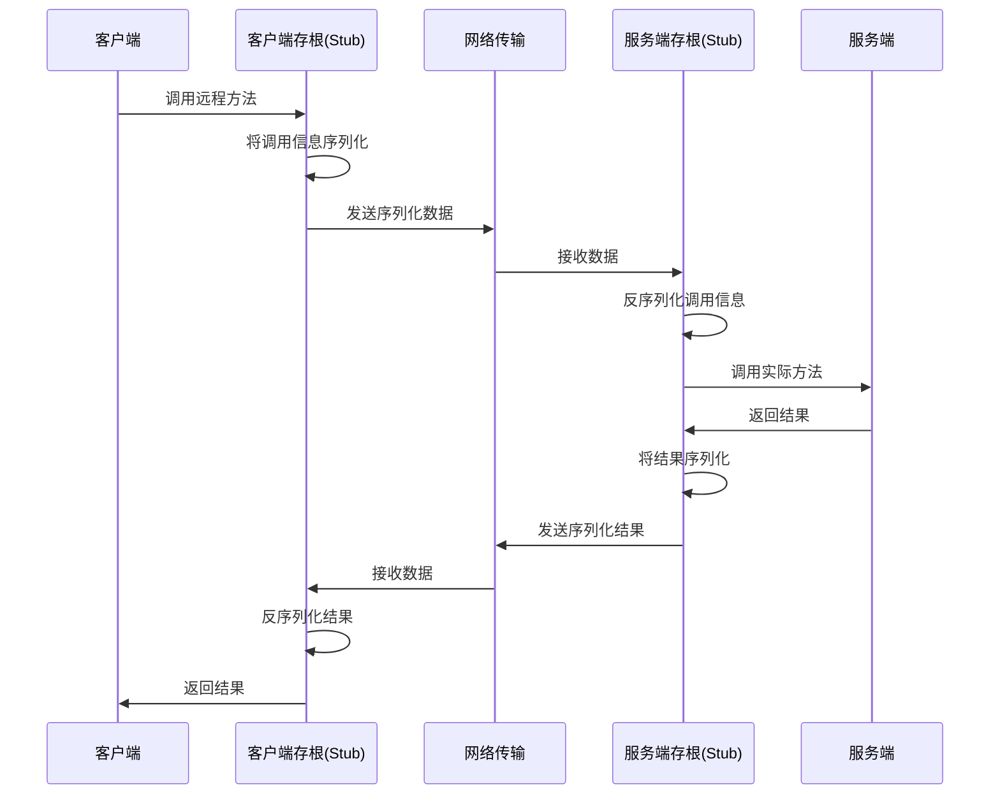
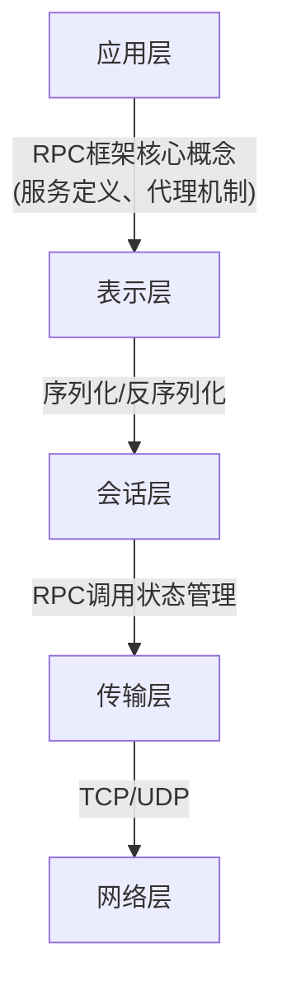

# Ming RPC Framework 基础原理与技术对比详解

## 📖 概述

RPC（Remote Procedure Call，远程过程调用）是分布式系统中的核心技术，它使得程序能够调用另一个地址空间的过程或函数，就像调用本地程序一样。Ming RPC Framework作为一个完整的RPC解决方案，不仅实现了RPC的核心功能，还提供了丰富的企业级特性。

### 🎯 学习目标
1. **理解RPC原理**: 深入了解RPC的工作机制和核心概念
2. **技术对比分析**: 掌握RPC与HTTP API的区别和适用场景
3. **框架选型指导**: 了解主流RPC框架的特点和选择标准
4. **实践应用**: 通过Ming RPC Framework学习RPC的实际应用

## 🔍 什么是 RPC 框架？它有什么优点？

### RPC的概念与原理

RPC（Remote Procedure Call，远程过程调用）是一种分布式计算技术，允许程序调用另一个地址空间（通常是网络上的另一台机器）的过程（函数/方法），就像调用本地过程一样，而不需要显式编写网络通信代码。

RPC的基本工作流程如下：

RPC框架是指实现上述RPC调用过程的软件框架，它封装了复杂的底层通信细节，使开发者可以像调用本地方法一样调用远程服务。

### RPC框架的优点

1. **透明性**：
   - 对开发者屏蔽底层网络通信细节
   - 远程调用与本地调用在代码上几乎一致，简化开发
   - 例如：`userService.getUser(user)` 可能是本地调用，也可能是远程调用，但代码完全一样

2. **高效性**：
   - 专为远程方法调用设计的通信协议，比通用协议更高效
   - 针对RPC场景优化的序列化机制，减少数据传输量
   - 连接复用机制，降低建立连接的开销

3. **类型安全**：
   - 保持了Java等静态类型语言的类型检查优势
   - 在项目中，RpcRequest携带参数类型信息，确保类型匹配
   - 编译时可发现类型错误，减少运行时异常

4. **服务治理能力**：
   - 服务注册与发现
   - 负载均衡
   - 故障容错（重试、熔断等）
   - 流量控制

5. **跨语言支持**：
   - 使用IDL（接口定义语言）描述服务接口
   - 支持多语言客户端和服务端
   - 解决异构系统集成问题

6. **促进服务化架构**：
   - 便于实现微服务架构
   - 支持服务的独立部署和扩展
   - 便于实现系统的横向扩展

## RPC 和 HTTP 有什么区别？RPC 算是计算机网络哪一层的协议？

### RPC与HTTP的区别

| 特性 | RPC | HTTP(REST) |
|-----|-----|------------|
| **概念层次** | 编程模型/远程调用范式 | 应用层协议 |
| **设计理念** | 面向过程/方法调用 | 面向资源操作 |
| **通信协议** | 多样（TCP/HTTP/HTTP2等） | HTTP |
| **传输格式** | 多样（二进制/JSON等） | 通常为JSON/XML |
| **接口定义** | IDL或语言接口 | API文档（如OpenAPI） |
| **类型系统** | 通常强类型 | 弱类型（基于文本） |
| **使用场景** | 系统内部通信，对性能敏感 | 系统间集成，开放API |
| **优势** | 效率高、类型安全 | 标准化、可理解性强 |

需要注意的是，RPC和HTTP并不是完全对立的概念：

1. **RPC可以使用HTTP作为传输协议**：
   - 如本项目中的learn-RPC框架和gRPC就是基于HTTP协议实现的
   - gRPC使用HTTP/2作为传输协议

2. **关注点不同**：
   - RPC关注的是"如何像调用本地方法一样调用远程方法"
   - HTTP关注的是"如何通过统一的资源操作方式交换数据"

3. **抽象层次不同**：
   - RPC是一种远程调用的编程范式，关注的是编程模型
   - HTTP是一个具体的应用层协议，关注的是通信规范

### RPC在网络分层模型中的位置

RPC本身不是一个协议，而是一种编程模型或框架，它跨越了多个网络层次：

- **RPC的核心理念**属于**应用层**，因为它定义了应用间交互的模式
- **序列化/反序列化**机制属于**表示层**
- **调用状态管理**属于**会话层**
- 而**具体的通信实现**则可能使用**传输层**的TCP/UDP或**应用层**的HTTP等协议

在本项目中，learn-RPC框架使用HTTP作为传输协议，所以从实现上看，它工作在应用层之上，构建了一个更高级别的抽象。

## 你了解过哪些 RPC 框架，你的项目和它们相比有什么不同？

### 主流RPC框架介绍

1. **gRPC**（Google开发）
   - 基于HTTP/2协议
   - 使用Protocol Buffers作为IDL和序列化机制
   - 支持多种编程语言
   - 支持流式RPC（单向流、服务端流、客户端流、双向流）
   - 提供丰富的拦截器机制

2. **Dubbo**（阿里巴巴开发）
   - 基于TCP自定义协议
   - 支持多种序列化协议（Hessian、JSON等）
   - 集成丰富的服务治理功能
   - 主要面向Java生态系统
   - 提供服务自动发现、负载均衡等功能

3. **Thrift**（Facebook开发）
   - 包含自己的接口定义语言（IDL）
   - 支持多种语言
   - 高效的二进制序列化
   - 提供多种传输层选项

4. **Spring Cloud**（微服务生态）
   - 基于HTTP的RESTful服务
   - 与Spring生态深度集成
   - 丰富的服务治理组件
   - 基于Feign的声明式客户端

### learn-RPC与主流框架的对比

| 特性 | learn-RPC | gRPC | Dubbo | Thrift |
|------|---------|------|-------|--------|
| **通信协议** | HTTP | HTTP/2 | TCP（自定义） | 多种传输协议 |
| **序列化机制** | Java原生序列化 | Protocol Buffers | 多种（Hessian等） | 自定义二进制格式 |
| **服务注册** | 本地注册表 | 需配合外部注册中心 | ZooKeeper/Nacos等 | 需自行实现 |
| **负载均衡** | 未实现 | 客户端负载均衡 | 多种策略 | 需自行实现 |
| **语言支持** | 仅Java | 多语言 | 主要Java | 多语言 |
| **易用性** | 简单，学习成本低 | 中等 | 中等 | 较复杂 |
| **性能** | 一般 | 高 | 高 | 高 |
| **功能完备性** | 基础功能 | 完备 | 非常完备 | 完备 |

## 🚀 主流RPC框架深度对比

### 1. gRPC (Google)
**特点**:
- ✅ 基于HTTP/2，支持流式传输
- ✅ Protocol Buffers序列化，性能优秀
- ✅ 强类型接口定义，跨语言支持好
- ✅ 生态丰富，社区活跃
- ❌ 学习曲线较陡峭
- ❌ 调试相对困难

**适用场景**: 微服务架构、跨语言通信、对性能要求高的场景

### 2. Apache Dubbo (阿里巴巴)
**特点**:
- ✅ 功能丰富，服务治理能力强
- ✅ 支持多种协议和序列化方式
- ✅ 完善的监控和管理功能
- ✅ 与Spring生态集成好
- ❌ 主要面向Java生态
- ❌ 配置相对复杂

**适用场景**: Java微服务、企业级应用、需要完善服务治理的场景

### 3. Apache Thrift (Facebook)
**特点**:
- ✅ 跨语言支持好
- ✅ 性能优秀
- ✅ IDL定义接口
- ✅ 支持多种传输协议
- ❌ 社区活跃度一般
- ❌ 功能相对简单

**适用场景**: 跨语言通信、对性能要求高、接口相对稳定的场景

### 4. Spring Cloud OpenFeign
**特点**:
- ✅ 与Spring生态集成完美
- ✅ 使用简单，学习成本低
- ✅ 支持负载均衡和熔断
- ✅ 基于HTTP，调试友好
- ❌ 性能相对较低
- ❌ 主要面向Java

**适用场景**: Spring Cloud微服务、快速开发、对性能要求不高的场景

## 🎯 Ming RPC Framework的特点与定位

Ming RPC Framework是一个**生产级的RPC框架**，其设计理念在于**提供完整、可靠、高性能的RPC解决方案**。主要特点包括：

### 核心特色
1. **完整功能体系**: 涵盖序列化、负载均衡、容错、重试、注册中心等全套功能
2. **多协议支持**: 同时支持HTTP和TCP协议，满足不同场景需求
3. **插件化架构**: 基于SPI机制实现高度可扩展
4. **生产级特性**: 提供完善的监控、日志、配置管理
5. **易于使用**: 支持注解驱动和Spring Boot集成

### 技术优势
- **高性能**: 优化的序列化和网络通信
- **高可用**: 完善的容错和重试机制
- **易扩展**: SPI机制支持自定义扩展
- **易集成**: Spring Boot Starter开箱即用

### 适用场景
- ✅ 微服务架构的内部通信
- ✅ 对性能和可靠性要求高的场景
- ✅ 需要完整服务治理功能的项目
- ✅ Java技术栈的企业级应用

## 📊 框架选择指南

### 选择标准
| 考虑因素 | gRPC | Dubbo | Thrift | OpenFeign | Ming RPC |
|---------|------|-------|--------|-----------|----------|
| 性能要求 | 高 | 高 | 高 | 中等 | 高 |
| 跨语言需求 | 强 | 弱 | 强 | 弱 | 中等 |
| 学习成本 | 高 | 中等 | 中等 | 低 | 中等 |
| 生态完整性 | 好 | 极好 | 一般 | 好 | 好 |
| 社区活跃度 | 极高 | 高 | 中等 | 高 | 新兴 |

### 选择建议
1. **高性能跨语言**: 选择gRPC
2. **Java企业级**: 选择Dubbo
3. **简单快速**: 选择OpenFeign
4. **学习RPC原理**: 选择Ming RPC Framework
5. **平衡性能和易用性**: 选择Ming RPC Framework

## 📋 总结

RPC技术是分布式系统的重要基础，不同的RPC框架有各自的特点和适用场景。Ming RPC Framework作为一个现代化的RPC解决方案，在保持高性能的同时，提供了完整的功能体系和良好的易用性，既适合学习RPC原理，也可用于生产环境的微服务架构。

### 核心价值
- **技术学习**: 通过完整的实现了解RPC的工作原理
- **生产应用**: 提供可靠的分布式通信解决方案
- **架构演进**: 支持从单体到微服务的架构转型
- **技术积累**: 为团队提供RPC技术的深度理解

选择合适的RPC框架需要综合考虑性能、易用性、生态支持、团队技术栈等多个因素。Ming RPC Framework通过其完整的功能实现和清晰的代码结构，为开发者提供了一个优秀的RPC学习和应用平台。