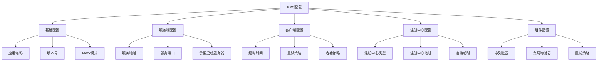
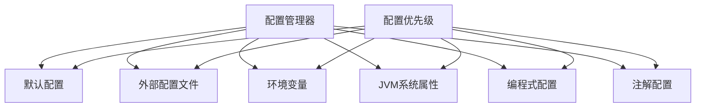
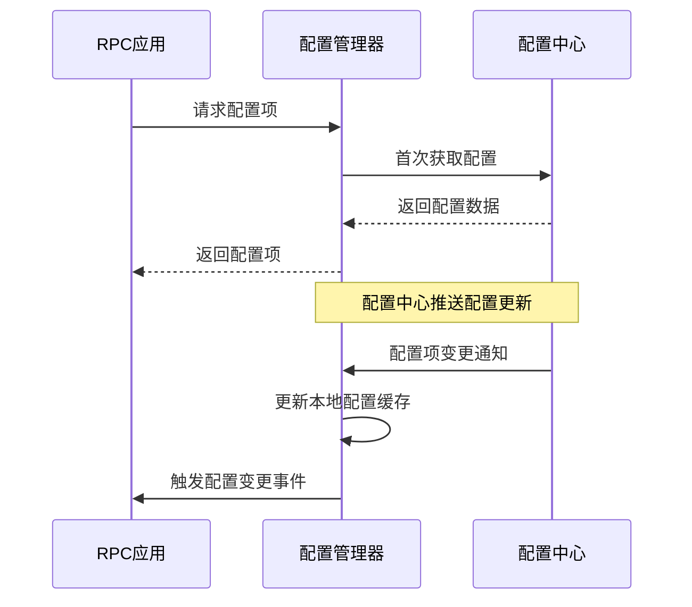

# Ming RPC Framework 配置管理详解

## 📖 概述

配置管理是Ming RPC Framework的核心基础设施，它直接影响框架的灵活性、可扩展性和易用性。通过完善的配置管理机制，框架能够在不同的环境和场景下灵活适应，无需修改代码就可以调整框架的行为。

### 🎯 配置管理的价值
1. **环境适配**: 支持开发、测试、生产等不同环境的配置
2. **行为控制**: 通过配置调整框架的运行行为
3. **性能调优**: 通过配置优化框架性能
4. **功能开关**: 通过配置启用或禁用特定功能

### 🔧 配置涉及的方面
- **服务端配置**: 监听地址、端口、线程池参数等
- **客户端配置**: 超时时间、重试策略、负载均衡策略等
- **协议配置**: 序列化方式、网络协议等
- **注册中心配置**: 连接地址、认证信息等
- **通用配置**: 应用名称、版本号、日志级别等

## 🏗️ Ming RPC Framework配置体系

### 配置层次结构


## 🔧 核心配置类实现

### 1. RPC主配置类
**文件路径**: `rpc-core/src/main/java/com/ming/rpc/config/RpcConfig.java`

```java
@Data
public class RpcConfig {
    /**
     * 名称
     */
    private String name = "ming-rpc";

    /**
     * 版本号
     */
    private String version = "1.0";

    /**
     * 服务器主机名
     */
    private String serverHost = "localhost";

    /**
     * 服务器端口号
     */
    private Integer serverPort = 8080;

    /**
     * 模拟调用
     */
    private boolean mock = false;

    /**
     * 序列化器
     */
    private String serializer = SerializerKeys.JDK;

    /**
     * 注册中心配置
     */
    private RegistryConfig registryConfig = new RegistryConfig();

    /**
     * 负载均衡器
     */
    private String loadBalancer = LoadBalancerKeys.ROUND_ROBIN;

    /**
     * 重试策略
     */
    private String retryStrategy = RetryStrategyKeys.NO;

    /**
     * 容错策略
     */
    private String tolerantStrategy = TolerantStrategyKeys.FAIL_FAST;
}
```

### 2. 注册中心配置类
**文件路径**: `rpc-core/src/main/java/com/ming/rpc/config/RegistryConfig.java`

```java
@Data
public class RegistryConfig {
    /**
     * 注册中心类别
     */
    private String registry = "etcd";

    /**
     * 注册中心地址
     */
    private String address = "http://localhost:2380";

    /**
     * 用户名
     */
    private String username;

    /**
     * 密码
     */
    private String password;

    /**
     * 超时时间（单位：毫秒）
     */
    private Long timeout = 10000L;
}
```

### 3. Spring Boot配置属性类
**文件路径**: `ming-rpc-spring-boot-starter/src/main/java/com/ming/rpc/springboot/starter/config/RpcConfigurationProperties.java`

```java
@ConfigurationProperties(prefix = "rpc")
@Data
public class RpcConfigurationProperties {
    /**
     * 名称
     */
    private String name = "ming-rpc";

    /**
     * 版本号
     */
    private String version = "1.0";

    /**
     * 服务器主机名
     */
    private String serverHost = "localhost";

    /**
     * 服务器端口号
     */
    private Integer serverPort = 8080;

    /**
     * 是否需要启动服务器
     */
    private Boolean needServer = true;

    /**
     * 模拟调用
     */
    private Boolean mock = false;

    /**
     * 序列化器
     */
    private String serializer = "JDK";

    /**
     * 负载均衡器
     */
    private String loadBalancer = "ROUND_ROBIN";

    /**
     * 重试策略
     */
    private String retryStrategy = "NO";

    /**
     * 容错策略
     */
    private String tolerantStrategy = "FAIL_FAST";

    /**
     * 注册中心配置
     */
    @NestedConfigurationProperty
    private RegistryConfigProperties registryConfig = new RegistryConfigProperties();
}
```
## 📁 配置加载机制

### 1. 配置工具类
**文件路径**: `rpc-core/src/main/java/com/ming/rpc/utils/ConfigUtils.java`

```java
public class ConfigUtils {
    /**
     * 加载配置对象
     * @param tClass 配置类
     * @param prefix 配置前缀
     * @return 配置对象
     */
    public static <T> T loadConfig(Class<T> tClass, String prefix) {
        return loadConfig(tClass, prefix, "");
    }

    /**
     * 加载配置对象，支持区分环境
     * @param tClass 配置类
     * @param prefix 配置前缀
     * @param environment 环境
     * @return 配置对象
     */
    public static <T> T loadConfig(Class<T> tClass, String prefix, String environment) {
        StringBuilder configFileBuilder = new StringBuilder("application");
        if (StrUtil.isNotBlank(environment)) {
            configFileBuilder.append("-").append(environment);
        }
        configFileBuilder.append(".properties");

        Props props = new Props(configFileBuilder.toString());
        return props.toBean(tClass, prefix);
    }
}
```

### 2. 配置加载顺序
框架按照以下优先级加载配置：

1. **命令行参数** (最高优先级)
2. **系统环境变量**
3. **application-{profile}.properties/yml文件**
4. **application.properties/yml文件**
5. **默认配置** (最低优先级)

### 3. 配置文件支持格式

#### Properties文件
```properties
# application.properties
rpc.name=ming-rpc-app
rpc.version=1.0
rpc.serverHost=localhost
rpc.serverPort=8080
rpc.mock=false
rpc.serializer=JDK
rpc.loadBalancer=ROUND_ROBIN
rpc.retryStrategy=NO
rpc.tolerantStrategy=FAIL_FAST

# 注册中心配置
rpc.registryConfig.registry=etcd
rpc.registryConfig.address=http://localhost:2379
rpc.registryConfig.timeout=10000
```

#### YAML文件
```yaml
# application.yml
rpc:
  name: ming-rpc-app
  version: 1.0
  serverHost: localhost
  serverPort: 8080
  mock: false
  serializer: JDK
  loadBalancer: ROUND_ROBIN
  retryStrategy: NO
  tolerantStrategy: FAIL_FAST

  registryConfig:
    registry: etcd
    address: http://localhost:2379
    timeout: 10000
```

#### 环境特定配置
```yaml
# application-dev.yml (开发环境)
rpc:
  serverHost: localhost
  mock: true
  registryConfig:
    registry: MOCK

# application-prod.yml (生产环境)
rpc:
  serverHost: 0.0.0.0
  mock: false
  registryConfig:
    registry: etcd
    address: http://etcd-cluster:2379
```

## 🌟 Spring Boot集成配置

### 1. 自动配置类
**文件路径**: `ming-rpc-spring-boot-starter/src/main/java/com/ming/rpc/springboot/starter/config/RpcAutoConfiguration.java`

```java
@Configuration
@EnableConfigurationProperties(RpcConfigurationProperties.class)
@ConditionalOnProperty(prefix = "rpc", name = "enabled", havingValue = "true", matchIfMissing = true)
public class RpcAutoConfiguration {

    @Bean
    @ConditionalOnMissingBean
    public RpcConfig rpcConfig(RpcConfigurationProperties properties) {
        RpcConfig rpcConfig = new RpcConfig();

        // 复制属性
        BeanUtil.copyProperties(properties, rpcConfig);

        // 处理注册中心配置
        if (properties.getRegistryConfig() != null) {
            RegistryConfig registryConfig = new RegistryConfig();
            BeanUtil.copyProperties(properties.getRegistryConfig(), registryConfig);
            rpcConfig.setRegistryConfig(registryConfig);
        }

        return rpcConfig;
    }

    @Bean
    @ConditionalOnMissingBean
    public RpcInitBootstrap rpcInitBootstrap(RpcConfig rpcConfig) {
        return new RpcInitBootstrap(rpcConfig);
    }

    @Bean
    @ConditionalOnMissingBean
    public RpcProviderBootstrap rpcProviderBootstrap(RpcConfig rpcConfig) {
        return new RpcProviderBootstrap(rpcConfig);
    }

    @Bean
    @ConditionalOnMissingBean
    public RpcConsumerBootstrap rpcConsumerBootstrap(RpcConfig rpcConfig) {
        return new RpcConsumerBootstrap(rpcConfig);
    }
}
```

### 2. Spring Boot配置示例
```yaml
# application.yml
rpc:
  name: user-service
  version: 1.0
  serverHost: 0.0.0.0
  serverPort: 8080
  needServer: true
  mock: false
  serializer: JSON
  loadBalancer: ROUND_ROBIN
  retryStrategy: FIXED_INTERVAL
  tolerantStrategy: FAIL_OVER

  registryConfig:
    registry: etcd
    address: http://localhost:2379
    timeout: 10000

# 多环境配置
spring:
  profiles:
    active: dev

---
spring:
  profiles: dev
rpc:
  mock: true
  registryConfig:
    registry: MOCK

---
spring:
  profiles: prod
rpc:
  serverHost: 0.0.0.0
  registryConfig:
    registry: etcd
    address: http://etcd-cluster:2379
```

### 3. 注解配置
项目中定义了注解用于服务配置：

#### @RpcService注解
```java
@Target({ElementType.TYPE})
@Retention(RetentionPolicy.RUNTIME)
@Documented
public @interface RpcService {
    /**
     * 服务接口类
     */
    Class<?> interfaceClass() default void.class;

    /**
     * 服务版本
     */
    String version() default RpcConstant.DEFAULT_SERVICE_VERSION;

    /**
     * 服务分组
     */
    String group() default RpcConstant.DEFAULT_SERVICE_GROUP;
}
```

#### @RpcReference注解
```java
@Target({ElementType.FIELD})
@Retention(RetentionPolicy.RUNTIME)
@Documented
public @interface RpcReference {
    /**
     * 服务接口类
     */
    Class<?> interfaceClass() default void.class;

    /**
     * 服务版本
     */
    String version() default RpcConstant.DEFAULT_SERVICE_VERSION;

    /**
     * 服务分组
     */
    String group() default RpcConstant.DEFAULT_SERVICE_GROUP;

    /**
     * 负载均衡器
     */
    String loadBalancer() default LoadBalancerKeys.ROUND_ROBIN;

    /**
     * 重试策略
     */
    String retryStrategy() default RetryStrategyKeys.NO;

    /**
     * 容错策略
     */
    String tolerantStrategy() default TolerantStrategyKeys.FAIL_FAST;

    /**
     * 模拟调用
     */
    boolean mock() default false;
}
```

### 3.3 包级别配置说明

项目中通过`package-info.java`文件对配置模块进行了说明，表明了配置管理的设计意图：

```java
/**
 * 此包包含RPC框架的配置相关类。
 * 
 * 主要负责：
 * - 服务配置
 * - 客户端配置
 * - 注册中心配置
 * - 协议配置
 * - 线程池配置
 */
package com.ming.rpc.config;
```

### 3.4 引导类配置加载

在`RpcBootstrap`类中，通过初始化方法加载和应用配置：

```java
/**
 * RPC框架启动器
 */
public class RpcBootstrap {
    /**
     * 启动RPC框架
     * @param basePackage 要扫描的基础包
     */
    public static void init(String basePackage) {
        // 扫描带有@RpcService注解的类
        Set<Class<?>> serviceClasses = scanServiceClasses(basePackage);
        
        // 注册服务
        registerServices(serviceClasses);
        
        // 启动服务器
        startServer();
        
        // 初始化客户端引用
        initReferences(basePackage);
    }
    
    // ...其他方法
}
```

## 4. 配置管理优化设计

对于一个成熟的RPC框架，配置管理通常需要更加灵活和强大的机制。以下是一个理想的配置管理设计：

### 4.1 多层次配置源



不同的配置源有不同的优先级，高优先级的配置会覆盖低优先级的配置。

### 4.2 配置中心集成

对于分布式环境，可以集成配置中心（如Apollo、Nacos等），实现配置的动态更新：



### 4.3 类型安全的配置访问

设计类型安全的配置API，避免类型转换错误：

```java
// 配置定义
public interface RpcConfig {
    // 获取服务器端口，默认8080
    @ConfigProperty(key = "server.port", defaultValue = "8080")
    int getServerPort();
    
    // 获取超时时间，默认3000ms
    @ConfigProperty(key = "client.timeout", defaultValue = "3000")
    long getClientTimeout();
    
    // 获取序列化方式，默认JDK
    @ConfigProperty(key = "protocol.serialization", defaultValue = "JDK")
    String getSerialization();
}
```

## 📚 配置使用指南

### 1. 基础配置示例

#### 服务提供者配置
```yaml
# Provider application.yml
rpc:
  name: user-service-provider
  version: 1.0
  serverHost: 0.0.0.0
  serverPort: 8080
  needServer: true
  serializer: JSON

  registryConfig:
    registry: etcd
    address: http://localhost:2379
```

#### 服务消费者配置
```yaml
# Consumer application.yml
rpc:
  name: user-service-consumer
  version: 1.0
  needServer: false
  loadBalancer: ROUND_ROBIN
  retryStrategy: FIXED_INTERVAL
  tolerantStrategy: FAIL_OVER

  registryConfig:
    registry: etcd
    address: http://localhost:2379
```

### 2. 配置项详解

| 配置项 | 类型 | 默认值 | 说明 |
|--------|------|--------|------|
| `rpc.name` | String | ming-rpc | RPC应用名称 |
| `rpc.version` | String | 1.0 | RPC应用版本 |
| `rpc.serverHost` | String | localhost | RPC服务器主机 |
| `rpc.serverPort` | Integer | 8080 | RPC服务器端口 |
| `rpc.needServer` | Boolean | true | 是否需要启动RPC服务器 |
| `rpc.mock` | Boolean | false | 是否启用Mock模式 |
| `rpc.serializer` | String | JDK | 序列化器类型 |
| `rpc.loadBalancer` | String | ROUND_ROBIN | 负载均衡策略 |
| `rpc.retryStrategy` | String | NO | 重试策略 |
| `rpc.tolerantStrategy` | String | FAIL_FAST | 容错策略 |

### 3. 注册中心配置

| 配置项 | 类型 | 默认值 | 说明 |
|--------|------|--------|------|
| `rpc.registryConfig.registry` | String | etcd | 注册中心类型 |
| `rpc.registryConfig.address` | String | http://localhost:2379 | 注册中心地址 |
| `rpc.registryConfig.username` | String | - | 用户名 |
| `rpc.registryConfig.password` | String | - | 密码 |
| `rpc.registryConfig.timeout` | Long | 10000 | 连接超时时间(毫秒) |

### 4. 组件配置选项

#### 序列化器选项
- `JDK`: Java原生序列化
- `JSON`: JSON序列化
- `HESSIAN`: Hessian序列化
- `KRYO`: Kryo序列化

#### 负载均衡策略
- `ROUND_ROBIN`: 轮询
- `RANDOM`: 随机
- `CONSISTENT_HASH`: 一致性哈希

#### 重试策略
- `NO`: 不重试
- `FIXED_INTERVAL`: 固定间隔重试

#### 容错策略
- `FAIL_FAST`: 快速失败
- `FAIL_SAFE`: 静默处理
- `FAIL_BACK`: 故障转移

#### 注册中心类型
- `ETCD`: Etcd注册中心
- `ZOOKEEPER`: ZooKeeper注册中心
- `CONSUL`: Consul注册中心
- `NACOS`: Nacos注册中心
- `MOCK`: Mock注册中心(测试用)

## 🎯 最佳实践

### 1. 环境配置管理
```yaml
# 基础配置 application.yml
rpc:
  name: ${spring.application.name}
  version: 1.0

# 开发环境 application-dev.yml
rpc:
  mock: true
  registryConfig:
    registry: MOCK

# 测试环境 application-test.yml
rpc:
  registryConfig:
    registry: etcd
    address: http://test-etcd:2379

# 生产环境 application-prod.yml
rpc:
  serverHost: 0.0.0.0
  registryConfig:
    registry: etcd
    address: http://prod-etcd-cluster:2379
```

### 2. 配置外部化
```bash
# 通过环境变量覆盖配置
export RPC_REGISTRY_CONFIG_ADDRESS=http://external-etcd:2379
export RPC_SERVER_HOST=0.0.0.0

# 通过命令行参数覆盖配置
java -jar app.jar --rpc.registryConfig.address=http://external-etcd:2379
```

### 3. 配置验证
```java
@Component
@Validated
public class RpcConfigValidator {

    @EventListener
    public void validateConfig(ApplicationReadyEvent event) {
        RpcConfig config = applicationContext.getBean(RpcConfig.class);

        // 验证端口范围
        if (config.getServerPort() < 1024 || config.getServerPort() > 65535) {
            throw new IllegalArgumentException("Invalid server port: " + config.getServerPort());
        }

        // 验证注册中心地址
        if (StrUtil.isBlank(config.getRegistryConfig().getAddress())) {
            throw new IllegalArgumentException("Registry address cannot be empty");
        }
    }
}
```

## 📋 总结

Ming RPC Framework的配置管理系统提供了完整的配置解决方案：

### 核心特性
- ✅ **多格式支持**: Properties、YAML等配置文件格式
- ✅ **环境隔离**: 支持多环境配置管理
- ✅ **Spring Boot集成**: 无缝集成Spring Boot配置体系
- ✅ **注解驱动**: 通过注解简化配置
- ✅ **类型安全**: 强类型配置属性绑定

### 技术优势
- **灵活性**: 支持多种配置来源和格式
- **可维护性**: 清晰的配置结构和文档
- **扩展性**: 易于添加新的配置项和组件
- **安全性**: 支持配置验证和类型检查

### 使用建议
1. **开发环境**: 使用Mock模式快速开发
2. **测试环境**: 使用真实注册中心验证功能
3. **生产环境**: 使用集群化注册中心保证高可用
4. **配置管理**: 通过配置中心统一管理配置
5. **监控告警**: 监控配置变更和异常情况

通过完善的配置管理机制，Ming RPC Framework能够适应各种部署环境和使用场景，为分布式应用提供灵活可靠的RPC通信能力。
}

// 配置使用
RpcConfig config = ConfigFactory.create(RpcConfig.class);
int port = config.getServerPort();
```

## 5. 配置管理实现方案

为了改进当前项目的配置管理，可以采取以下实现方案：

### 5.1 配置文件支持

添加对properties或YAML格式配置文件的支持：

**rpc.properties示例：**
```properties
# 服务器配置
server.host=127.0.0.1
server.port=8081

# 客户端配置
client.timeout=5000
client.retries=3

# 协议配置
protocol.serialization=JDK
```

**配置加载实现：**
```java
public class PropertiesConfigLoader {
    private static Properties properties = new Properties();
    
    static {
        try (InputStream input = PropertiesConfigLoader.class.getClassLoader()
                .getResourceAsStream("rpc.properties")) {
            if (input != null) {
                properties.load(input);
            }
        } catch (IOException e) {
            // 处理异常
        }
    }
    
    public static String getString(String key, String defaultValue) {
        return properties.getProperty(key, defaultValue);
    }
    
    public static int getInt(String key, int defaultValue) {
        String value = getString(key, null);
        if (value != null) {
            try {
                return Integer.parseInt(value);
            } catch (NumberFormatException e) {
                // 处理异常
            }
        }
        return defaultValue;
    }
    
    // 其他类型的getter方法...
}
```

### 5.2 配置项统一管理

创建配置常量类，统一管理所有配置项的键名：

```java
public class ConfigKeys {
    // 服务器配置键
    public static final String SERVER_HOST = "server.host";
    public static final String SERVER_PORT = "server.port";
    
    // 客户端配置键
    public static final String CLIENT_TIMEOUT = "client.timeout";
    public static final String CLIENT_RETRIES = "client.retries";
    
    // 协议配置键
    public static final String PROTOCOL_SERIALIZATION = "protocol.serialization";
    
    // 避免实例化
    private ConfigKeys() {}
}
```

### 5.3 配置优先级管理

实现配置优先级管理，按照"代码 > JVM参数 > 环境变量 > 配置文件 > 默认值"的顺序：

```java
public class ConfigManager {
    // 获取配置值
    public static String getConfig(String key, String defaultValue) {
        // 1. 检查代码中的配置覆盖
        String value = ProgrammaticConfig.get(key);
        if (value != null) {
            return value;
        }
        
        // 2. 检查JVM系统属性
        value = System.getProperty(key);
        if (value != null) {
            return value;
        }
        
        // 3. 检查环境变量
        value = System.getenv(key.replace('.', '_').toUpperCase());
        if (value != null) {
            return value;
        }
        
        // 4. 检查配置文件
        value = PropertiesConfigLoader.getString(key, null);
        if (value != null) {
            return value;
        }
        
        // 5. 使用默认值
        return defaultValue;
    }
    
    // 其他类型的getter方法...
}
```

## 6. 配置管理最佳实践

在RPC框架中实施配置管理时，可以参考以下最佳实践：

### 6.1 配置设计原则

1. **默认配置优先**：为所有配置项提供合理的默认值，使框架开箱即用
2. **覆盖机制清晰**：明确定义配置的覆盖优先级，避免混淆
3. **分层分类管理**：按照功能模块对配置进行分类，便于管理
4. **文档完善**：为每个配置项提供详细的说明文档

### 6.2 配置使用建议

1. **集中管理**：使用专门的配置管理类，避免配置分散
2. **类型安全**：提供类型安全的配置访问方法，减少运行时错误
3. **缓存配置**：频繁使用的配置项应该缓存，避免重复解析
4. **动态刷新**：支持配置的动态刷新，无需重启应用
5. **配置验证**：加入配置验证机制，及早发现配置错误

### 6.3 在本项目中的应用

针对当前项目，可以采取以下步骤改进配置管理：

1. 将硬编码的配置项抽取到配置文件中
2. 实现基本的配置加载和访问机制
3. 统一配置项的命名和使用方式
4. 为配置项添加详细的注释和文档
5. 在示例代码中展示正确的配置使用方式

## 7. 结论

配置管理是RPC框架的重要组成部分，良好的配置管理可以显著提升框架的灵活性和易用性。本项目目前的配置管理以硬编码和注解为主，适合学习和示例演示，但在实际生产环境中，应该采用更加完善和灵活的配置管理机制。

通过实现多层次配置源、配置优先级管理、类型安全的配置访问等特性，可以使RPC框架在不同环境中更加灵活地适应各种需求，为使用者提供更好的开发体验。 