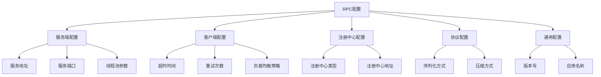
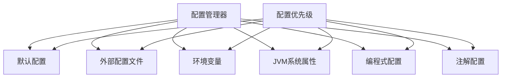
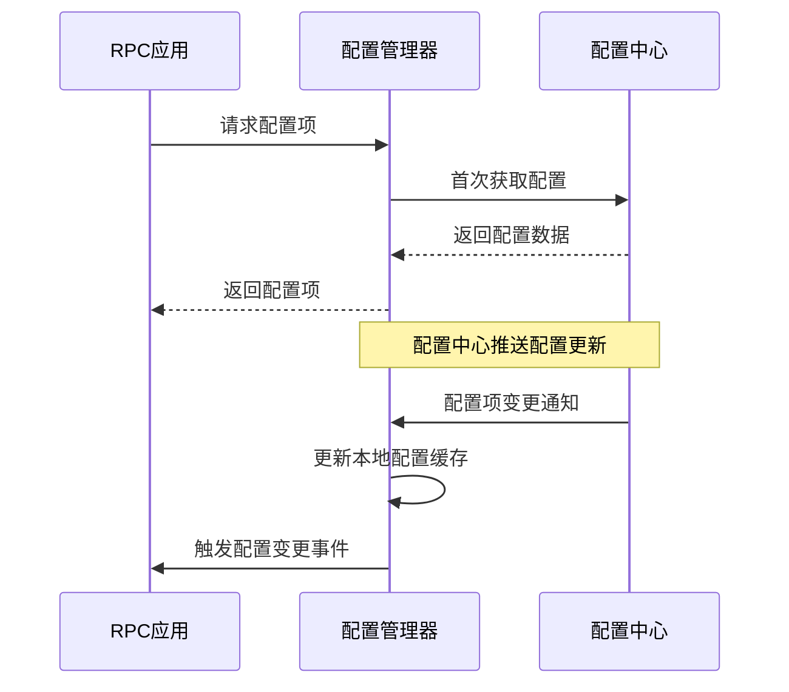

# RPC配置管理

## 1. 配置在RPC框架中的重要性

配置管理是RPC框架中非常重要的一个环节，它直接影响框架的灵活性、可扩展性和易用性。通过良好的配置管理机制，可以让框架在不同的环境和场景下都能灵活适应，无需修改代码就可以调整框架的行为。

在RPC框架中，配置通常涉及多个方面：
- 服务端配置（如监听地址、端口、线程池参数等）
- 客户端配置（如超时时间、重试策略、负载均衡策略等）
- 协议配置（如序列化方式、压缩方式等）
- 注册中心配置（如连接地址、认证信息等）
- 通用配置（如日志级别、监控配置等）

## 2. learn-RPC项目中的配置类型

本项目作为一个学习用的简易RPC框架，目前包含了以下几类配置：

### 2.1 配置层次结构



### 2.2 关键配置项说明

1. **服务端配置**
   - `server.host`: 服务器监听的主机地址
   - `server.port`: 服务器监听的端口号
   - `server.threadPool.coreSize`: 核心线程池大小
   - `server.threadPool.maxSize`: 最大线程池大小

2. **客户端配置**
   - `client.timeout`: 调用超时时间(毫秒)
   - `client.retries`: 失败重试次数
   - `client.loadBalance`: 负载均衡策略(轮询、随机、一致性哈希等)

3. **注册中心配置**
   - `registry.type`: 注册中心类型(本地、ZooKeeper、Etcd等)
   - `registry.address`: 注册中心地址

4. **协议配置**
   - `protocol.serialization`: 序列化方式(JDK、JSON等)
   - `protocol.compression`: 压缩方式(无压缩、GZIP等)

5. **通用配置**
   - `application.name`: 应用名称
   - `application.version`: 应用版本

## 3. 当前项目配置实现方式

在当前的learn-RPC项目中，配置管理采用了以下几种方式实现：

### 3.1 硬编码配置

目前，项目中多处使用了硬编码的方式设置配置项，如在`ServiceProxy`中直接硬编码服务器地址：

```java
// 发送请求
// 这里地址硬编码了，后续需要使用注册中心和服务发现机制解决
String url = "http://localhost:8081";
```

同样，在`EasyProviderExample`中也硬编码了服务器端口：

```java
int port = 8081;
```

硬编码的优点是简单直接，适合初期开发和示例代码；但缺点是不灵活，每次修改配置都需要重新编译代码。

### 3.2 注解配置

项目中定义了一些注解用于配置，如`@RpcService`和`@RpcReference`注解：

```java
/**
 * 标记RPC服务提供者
 */
@Target({ElementType.TYPE})
@Retention(RetentionPolicy.RUNTIME)
@Documented
public @interface RpcService {
    /**
     * 服务接口类
     */
    Class<?> interfaceClass() default void.class;
    
    /**
     * 服务版本
     */
    String version() default "";
    
    /**
     * 服务分组
     */
    String group() default "";
}

/**
 * 标记RPC服务消费者
 */
@Target({ElementType.FIELD})
@Retention(RetentionPolicy.RUNTIME)
@Documented
public @interface RpcReference {
    /**
     * 服务版本
     */
    String version() default "";
    
    /**
     * 服务分组
     */
    String group() default "";
    
    /**
     * 超时时间，单位毫秒
     */
    long timeout() default 3000;
    
    /**
     * 重试次数
     */
    int retries() default 2;
}
```

注解配置的优点是与代码紧密集成，使用方便；缺点是配置与代码耦合，修改配置可能需要重新编译。

### 3.3 包级别配置说明

项目中通过`package-info.java`文件对配置模块进行了说明，表明了配置管理的设计意图：

```java
/**
 * 此包包含RPC框架的配置相关类。
 * 
 * 主要负责：
 * - 服务配置
 * - 客户端配置
 * - 注册中心配置
 * - 协议配置
 * - 线程池配置
 */
package com.ming.rpc.config;
```

### 3.4 引导类配置加载

在`RpcBootstrap`类中，通过初始化方法加载和应用配置：

```java
/**
 * RPC框架启动器
 */
public class RpcBootstrap {
    /**
     * 启动RPC框架
     * @param basePackage 要扫描的基础包
     */
    public static void init(String basePackage) {
        // 扫描带有@RpcService注解的类
        Set<Class<?>> serviceClasses = scanServiceClasses(basePackage);
        
        // 注册服务
        registerServices(serviceClasses);
        
        // 启动服务器
        startServer();
        
        // 初始化客户端引用
        initReferences(basePackage);
    }
    
    // ...其他方法
}
```

## 4. 配置管理优化设计

对于一个成熟的RPC框架，配置管理通常需要更加灵活和强大的机制。以下是一个理想的配置管理设计：

### 4.1 多层次配置源



不同的配置源有不同的优先级，高优先级的配置会覆盖低优先级的配置。

### 4.2 配置中心集成

对于分布式环境，可以集成配置中心（如Apollo、Nacos等），实现配置的动态更新：



### 4.3 类型安全的配置访问

设计类型安全的配置API，避免类型转换错误：

```java
// 配置定义
public interface RpcConfig {
    // 获取服务器端口，默认8080
    @ConfigProperty(key = "server.port", defaultValue = "8080")
    int getServerPort();
    
    // 获取超时时间，默认3000ms
    @ConfigProperty(key = "client.timeout", defaultValue = "3000")
    long getClientTimeout();
    
    // 获取序列化方式，默认JDK
    @ConfigProperty(key = "protocol.serialization", defaultValue = "JDK")
    String getSerialization();
}

// 配置使用
RpcConfig config = ConfigFactory.create(RpcConfig.class);
int port = config.getServerPort();
```

## 5. 配置管理实现方案

为了改进当前项目的配置管理，可以采取以下实现方案：

### 5.1 配置文件支持

添加对properties或YAML格式配置文件的支持：

**rpc.properties示例：**
```properties
# 服务器配置
server.host=127.0.0.1
server.port=8081

# 客户端配置
client.timeout=5000
client.retries=3

# 协议配置
protocol.serialization=JDK
```

**配置加载实现：**
```java
public class PropertiesConfigLoader {
    private static Properties properties = new Properties();
    
    static {
        try (InputStream input = PropertiesConfigLoader.class.getClassLoader()
                .getResourceAsStream("rpc.properties")) {
            if (input != null) {
                properties.load(input);
            }
        } catch (IOException e) {
            // 处理异常
        }
    }
    
    public static String getString(String key, String defaultValue) {
        return properties.getProperty(key, defaultValue);
    }
    
    public static int getInt(String key, int defaultValue) {
        String value = getString(key, null);
        if (value != null) {
            try {
                return Integer.parseInt(value);
            } catch (NumberFormatException e) {
                // 处理异常
            }
        }
        return defaultValue;
    }
    
    // 其他类型的getter方法...
}
```

### 5.2 配置项统一管理

创建配置常量类，统一管理所有配置项的键名：

```java
public class ConfigKeys {
    // 服务器配置键
    public static final String SERVER_HOST = "server.host";
    public static final String SERVER_PORT = "server.port";
    
    // 客户端配置键
    public static final String CLIENT_TIMEOUT = "client.timeout";
    public static final String CLIENT_RETRIES = "client.retries";
    
    // 协议配置键
    public static final String PROTOCOL_SERIALIZATION = "protocol.serialization";
    
    // 避免实例化
    private ConfigKeys() {}
}
```

### 5.3 配置优先级管理

实现配置优先级管理，按照"代码 > JVM参数 > 环境变量 > 配置文件 > 默认值"的顺序：

```java
public class ConfigManager {
    // 获取配置值
    public static String getConfig(String key, String defaultValue) {
        // 1. 检查代码中的配置覆盖
        String value = ProgrammaticConfig.get(key);
        if (value != null) {
            return value;
        }
        
        // 2. 检查JVM系统属性
        value = System.getProperty(key);
        if (value != null) {
            return value;
        }
        
        // 3. 检查环境变量
        value = System.getenv(key.replace('.', '_').toUpperCase());
        if (value != null) {
            return value;
        }
        
        // 4. 检查配置文件
        value = PropertiesConfigLoader.getString(key, null);
        if (value != null) {
            return value;
        }
        
        // 5. 使用默认值
        return defaultValue;
    }
    
    // 其他类型的getter方法...
}
```

## 6. 配置管理最佳实践

在RPC框架中实施配置管理时，可以参考以下最佳实践：

### 6.1 配置设计原则

1. **默认配置优先**：为所有配置项提供合理的默认值，使框架开箱即用
2. **覆盖机制清晰**：明确定义配置的覆盖优先级，避免混淆
3. **分层分类管理**：按照功能模块对配置进行分类，便于管理
4. **文档完善**：为每个配置项提供详细的说明文档

### 6.2 配置使用建议

1. **集中管理**：使用专门的配置管理类，避免配置分散
2. **类型安全**：提供类型安全的配置访问方法，减少运行时错误
3. **缓存配置**：频繁使用的配置项应该缓存，避免重复解析
4. **动态刷新**：支持配置的动态刷新，无需重启应用
5. **配置验证**：加入配置验证机制，及早发现配置错误

### 6.3 在本项目中的应用

针对当前项目，可以采取以下步骤改进配置管理：

1. 将硬编码的配置项抽取到配置文件中
2. 实现基本的配置加载和访问机制
3. 统一配置项的命名和使用方式
4. 为配置项添加详细的注释和文档
5. 在示例代码中展示正确的配置使用方式

## 7. 结论

配置管理是RPC框架的重要组成部分，良好的配置管理可以显著提升框架的灵活性和易用性。本项目目前的配置管理以硬编码和注解为主，适合学习和示例演示，但在实际生产环境中，应该采用更加完善和灵活的配置管理机制。

通过实现多层次配置源、配置优先级管理、类型安全的配置访问等特性，可以使RPC框架在不同环境中更加灵活地适应各种需求，为使用者提供更好的开发体验。 