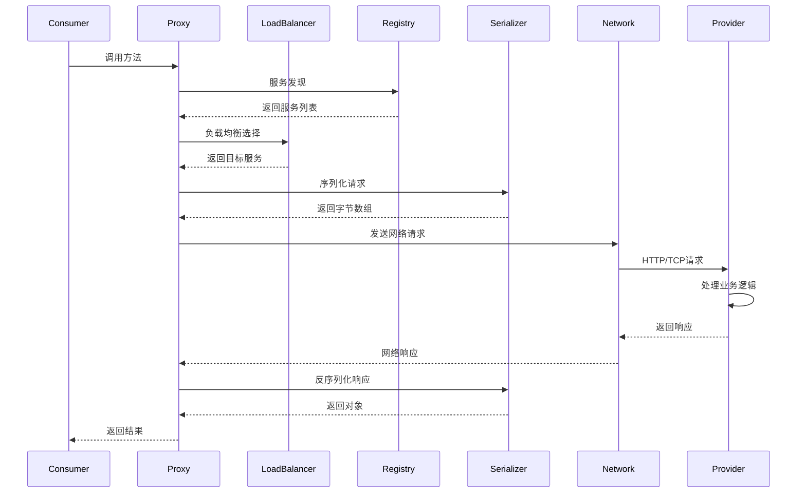

# Ming RPC Framework 技术架构详解

## 🏗️ 整体架构设计

### 分层架构

Ming RPC Framework采用经典的分层架构设计，从上到下分为：

```
┌─────────────────────────────────────────────────────────────┐
│                  Application Layer                          │
│  ┌─────────────────┐  ┌─────────────────┐                  │
│  │   Provider App  │  │   Consumer App  │                  │
│  │   @RpcService   │  │  @RpcReference  │                  │
│  └─────────────────┘  └─────────────────┘                  │
├─────────────────────────────────────────────────────────────┤
│                Spring Boot Integration                      │
│  ┌─────────────────┐  ┌─────────────────┐                  │
│  │ Auto Configure  │  │ Bean Processor  │                  │
│  │   @EnableRpc    │  │  Proxy Factory  │                  │
│  └─────────────────┘  └─────────────────┘                  │
├─────────────────────────────────────────────────────────────┤
│                    RPC Core Layer                          │
│  ┌─────────────┐ ┌─────────────┐ ┌─────────────┐          │
│  │   Client    │ │   Server    │ │   Registry  │          │
│  │   Proxy     │ │   Handler   │ │   Center    │          │
│  └─────────────┘ └─────────────┘ └─────────────┘          │
├─────────────────────────────────────────────────────────────┤
│                  Component Layer                           │
│  ┌─────────────┐ ┌─────────────┐ ┌─────────────┐          │
│  │ Serializer  │ │Load Balancer│ │Fault Tolerant│          │
│  │   Factory   │ │   Factory   │ │   Factory   │          │
│  └─────────────┘ └─────────────┘ └─────────────┘          │
├─────────────────────────────────────────────────────────────┤
│                   Network Layer                            │
│  ┌─────────────┐ ┌─────────────┐ ┌─────────────┐          │
│  │   Vert.x    │ │    HTTP     │ │   Protocol  │          │
│  │   Server    │ │   Client    │ │   Handler   │          │
│  └─────────────┘ └─────────────┘ └─────────────┘          │
└─────────────────────────────────────────────────────────────┘
```

## 🔧 核心组件详解

### 1. 序列化器 (Serializer)

#### 设计模式
- **策略模式**: 不同序列化算法的可插拔实现
- **工厂模式**: 统一的序列化器创建接口

#### 实现类型
```java
public interface Serializer {
    <T> byte[] serialize(T object) throws IOException;
    <T> T deserialize(byte[] bytes, Class<T> type) throws IOException;
}

// JDK序列化器
public class JdkSerializer implements Serializer {
    @Override
    public <T> byte[] serialize(T object) throws IOException {
        ByteArrayOutputStream outputStream = new ByteArrayOutputStream();
        ObjectOutputStream objectOutputStream = new ObjectOutputStream(outputStream);
        objectOutputStream.writeObject(object);
        objectOutputStream.close();
        return outputStream.toByteArray();
    }
}

// JSON序列化器
public class JsonSerializer implements Serializer {
    private static final ObjectMapper OBJECT_MAPPER = new ObjectMapper();
    
    @Override
    public <T> byte[] serialize(T object) throws IOException {
        return OBJECT_MAPPER.writeValueAsBytes(object);
    }
}
```

#### 性能对比
| 序列化器 | 序列化速度 | 反序列化速度 | 数据大小 | 跨语言支持 |
|---------|-----------|-------------|----------|-----------|
| JDK     | 中等      | 中等        | 大       | 否        |
| JSON    | 快        | 快          | 中等     | 是        |
| Hessian | 快        | 快          | 小       | 是        |

### 2. 负载均衡器 (LoadBalancer)

#### 算法实现

**轮询算法 (Round Robin)**
```java
public class RoundRobinLoadBalancer implements LoadBalancer {
    private final AtomicInteger currentIndex = new AtomicInteger(0);
    
    @Override
    public ServiceMetaInfo select(Map<String, Object> requestParams, 
                                 List<ServiceMetaInfo> serviceMetaInfoList) {
        if (serviceMetaInfoList.isEmpty()) {
            return null;
        }
        
        int size = serviceMetaInfoList.size();
        if (size == 1) {
            return serviceMetaInfoList.get(0);
        }
        
        int index = currentIndex.getAndIncrement() % size;
        return serviceMetaInfoList.get(index);
    }
}
```

**一致性哈希算法 (Consistent Hash)**
```java
public class ConsistentHashLoadBalancer implements LoadBalancer {
    private final TreeMap<Integer, ServiceMetaInfo> virtualNodes = new TreeMap<>();
    private static final int VIRTUAL_NODE_NUM = 100;
    
    @Override
    public ServiceMetaInfo select(Map<String, Object> requestParams, 
                                 List<ServiceMetaInfo> serviceMetaInfoList) {
        if (serviceMetaInfoList.isEmpty()) {
            return null;
        }
        
        // 构建虚拟节点环
        buildVirtualNodes(serviceMetaInfoList);
        
        // 获取调用请求的hash值
        int hash = getHash(requestParams);
        
        // 选择最近的大于等于该hash值的虚拟节点
        Map.Entry<Integer, ServiceMetaInfo> entry = virtualNodes.ceilingEntry(hash);
        if (entry == null) {
            entry = virtualNodes.firstEntry();
        }
        
        return entry.getValue();
    }
}
```

### 3. 容错机制 (Fault Tolerance)

#### 容错策略

**快速失败 (Fail Fast)**
```java
public class FailFastTolerantStrategy implements TolerantStrategy {
    @Override
    public RpcResponse doTolerant(Map<String, Object> context, Exception e) {
        throw new RuntimeException("服务调用失败", e);
    }
}
```

**故障转移 (Fail Back)**
```java
public class FailBackTolerantStrategy implements TolerantStrategy {
    @Override
    public RpcResponse doTolerant(Map<String, Object> context, Exception e) {
        // 获取其他可用服务节点
        List<ServiceMetaInfo> serviceList = getOtherServices(context);
        
        for (ServiceMetaInfo service : serviceList) {
            try {
                // 尝试调用备用服务
                return callService(service, context);
            } catch (Exception ex) {
                log.warn("备用服务调用失败: {}", ex.getMessage());
            }
        }
        
        // 所有备用服务都失败，返回默认响应
        return createDefaultResponse();
    }
}
```

### 4. 服务注册与发现

#### 注册中心接口
```java
public interface Registry {
    void init(RegistryConfig registryConfig);
    void register(ServiceMetaInfo serviceMetaInfo) throws Exception;
    void unRegister(ServiceMetaInfo serviceMetaInfo) throws Exception;
    List<ServiceMetaInfo> serviceDiscovery(String serviceKey);
    void destroy();
    void heartBeat();
}
```

#### ETCD实现
```java
public class EtcdRegistry implements Registry {
    private Client client;
    private KV kvClient;
    private static final String ETCD_ROOT_PATH = "/rpc/";
    
    @Override
    public void register(ServiceMetaInfo serviceMetaInfo) throws Exception {
        // 创建Lease和KV客户端
        Lease leaseClient = client.getLeaseClient();
        
        // 创建一个30秒的租约
        long leaseId = leaseClient.grant(30).get().getID();
        
        // 设置要存储的键值对
        String registerKey = ETCD_ROOT_PATH + serviceMetaInfo.getServiceNodeKey();
        ByteSequence key = ByteSequence.from(registerKey, StandardCharsets.UTF_8);
        ByteSequence value = ByteSequence.from(JSONUtil.toJsonStr(serviceMetaInfo), StandardCharsets.UTF_8);
        
        // 将键值对与租约关联并存储
        PutOption putOption = PutOption.builder().withLeaseId(leaseId).build();
        kvClient.put(key, value, putOption).get();
        
        // 添加节点信息到本地缓存
        localRegisterNodeKeySet.add(registerKey);
    }
}
```

## 🔄 请求处理流程

### 1. 服务调用时序图



### 2. 详细处理步骤

#### Consumer端处理流程
1. **方法拦截**: 动态代理拦截接口方法调用
2. **服务发现**: 从注册中心获取可用服务列表
3. **负载均衡**: 根据策略选择目标服务节点
4. **请求构建**: 构造RpcRequest对象
5. **序列化**: 将请求对象序列化为字节数组
6. **网络传输**: 通过HTTP/TCP发送请求
7. **响应处理**: 接收并反序列化响应
8. **容错处理**: 异常情况下的容错策略
9. **结果返回**: 返回最终结果给调用方

#### Provider端处理流程
1. **服务启动**: 启动网络服务器监听端口
2. **服务注册**: 向注册中心注册服务信息
3. **请求接收**: 接收来自Consumer的请求
4. **反序列化**: 将字节数组反序列化为请求对象
5. **服务查找**: 根据服务名查找本地服务实例
6. **方法调用**: 通过反射调用目标方法
7. **结果序列化**: 将返回结果序列化
8. **响应发送**: 发送响应给Consumer
9. **心跳维护**: 定期向注册中心发送心跳

## 🔌 Spring Boot集成原理

### 1. 自动配置机制

#### 配置类结构
```java
@Configuration
@EnableConfigurationProperties(RpcConfigurationProperties.class)
@ConditionalOnProperty(prefix = "rpc", name = "enabled", havingValue = "true", matchIfMissing = true)
public class RpcAutoConfiguration {
    
    @Bean
    @ConditionalOnMissingBean
    public RpcConfig rpcConfig(RpcConfigurationProperties properties) {
        RpcConfig config = new RpcConfig();
        BeanUtils.copyProperties(properties, config);
        return config;
    }
    
    @Bean
    @ConditionalOnProperty(name = "rpc.needServer", havingValue = "true")
    public WebServer webServer() {
        return new VertxHttpServer();
    }
    
    @Bean
    public RpcServiceBeanPostProcessor rpcServiceBeanPostProcessor() {
        return new RpcServiceBeanPostProcessor();
    }
}
```

#### 配置属性绑定
```java
@ConfigurationProperties(prefix = "rpc")
@Data
public class RpcConfigurationProperties {
    private String name = "ming-rpc";
    private String version = "1.0";
    private String serverHost = "localhost";
    private Integer serverPort = 8080;
    private String serializer = "JDK";
    private String loadBalancer = "ROUND_ROBIN";
    private String retryStrategy = "NO";
    private String tolerantStrategy = "FAIL_FAST";
    private Boolean mock = false;
    
    @NestedConfigurationProperty
    private RegistryConfigProperties registryConfig = new RegistryConfigProperties();
}
```

### 2. 注解处理机制

#### Bean后置处理器
```java
@Component
public class RpcServiceBeanPostProcessor implements BeanPostProcessor {
    
    @Override
    public Object postProcessAfterInitialization(Object bean, String beanName) throws BeansException {
        Class<?> beanClass = bean.getClass();
        
        // 处理@RpcService注解
        RpcService rpcService = beanClass.getAnnotation(RpcService.class);
        if (rpcService != null) {
            processRpcService(bean, beanClass, rpcService);
        }
        
        // 处理@RpcReference注解
        processRpcReference(bean, beanClass);
        
        return bean;
    }
    
    private void processRpcService(Object bean, Class<?> beanClass, RpcService rpcService) {
        // 获取服务接口
        Class<?>[] interfaces = beanClass.getInterfaces();
        for (Class<?> interfaceClass : interfaces) {
            String serviceName = interfaceClass.getName();
            String serviceVersion = rpcService.serviceVersion();
            
            // 注册到本地注册表
            LocalRegistry.register(serviceName, beanClass);
            
            // 注册到远程注册中心
            ServiceMetaInfo serviceMetaInfo = new ServiceMetaInfo();
            serviceMetaInfo.setServiceName(serviceName);
            serviceMetaInfo.setServiceVersion(serviceVersion);
            serviceMetaInfo.setServiceHost(rpcConfig.getServerHost());
            serviceMetaInfo.setServicePort(rpcConfig.getServerPort());
            
            try {
                registry.register(serviceMetaInfo);
            } catch (Exception e) {
                throw new RuntimeException("服务注册失败", e);
            }
        }
    }
}
```

### 3. 代理工厂实现

#### 动态代理创建
```java
public class ServiceProxyFactory {
    
    public static <T> T getProxy(Class<T> serviceClass) {
        if (RpcApplication.getRpcConfig().isMock()) {
            return getMockProxy(serviceClass);
        }
        
        return (T) Proxy.newProxyInstance(
            serviceClass.getClassLoader(),
            new Class[]{serviceClass},
            new ServiceProxy()
        );
    }
    
    public static <T> T getMockProxy(Class<T> serviceClass) {
        return (T) Proxy.newProxyInstance(
            serviceClass.getClassLoader(),
            new Class[]{serviceClass},
            new MockServiceProxy()
        );
    }
}
```

## 📊 性能优化策略

### 1. 网络层优化
- **异步IO**: 使用Vert.x实现高性能异步网络通信
- **连接复用**: HTTP Keep-Alive减少连接开销
- **批量处理**: 支持批量请求减少网络往返

### 2. 序列化优化
- **缓存机制**: 缓存序列化器实例避免重复创建
- **字节码优化**: 使用高性能序列化库
- **压缩传输**: 支持Gzip压缩减少传输数据量

### 3. 内存优化
- **对象池**: 复用RpcRequest/RpcResponse对象
- **弱引用缓存**: 使用WeakHashMap缓存代理对象
- **及时释放**: 请求处理完成后及时释放资源

### 4. 并发优化
- **线程池**: 使用线程池处理请求避免频繁创建线程
- **无锁算法**: 负载均衡使用原子操作避免锁竞争
- **异步处理**: 支持异步调用提高并发能力

## 🔍 监控与诊断

### 1. 日志体系
- **结构化日志**: 使用JSON格式便于日志分析
- **链路追踪**: 支持分布式链路追踪
- **性能指标**: 记录请求耗时、成功率等指标

### 2. 健康检查
- **服务健康**: 定期检查服务可用性
- **注册中心健康**: 监控注册中心连接状态
- **资源监控**: 监控CPU、内存、网络使用情况

### 3. 故障诊断
- **异常堆栈**: 完整的异常信息记录
- **请求重放**: 支持请求重放便于问题复现
- **性能分析**: 提供性能分析工具

这个技术架构文档详细介绍了Ming RPC Framework的核心技术实现，为开发者提供了深入理解框架原理的参考资料。
