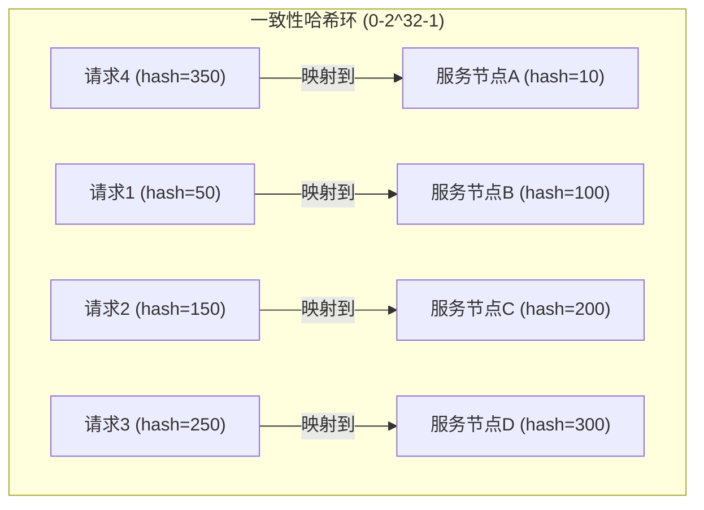
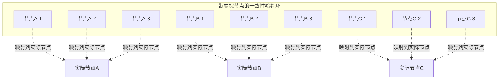
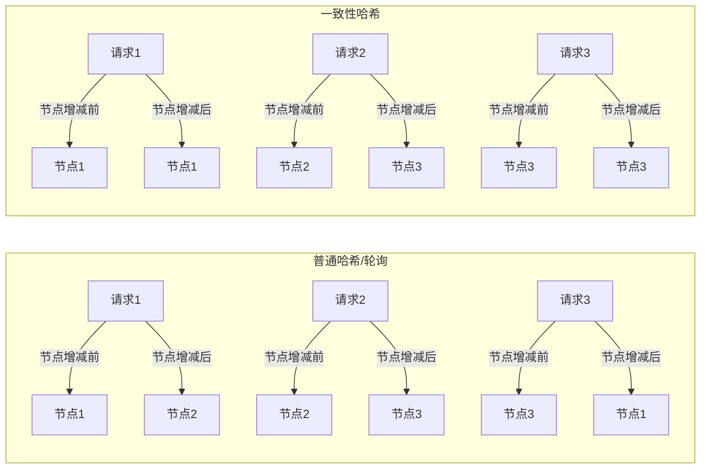
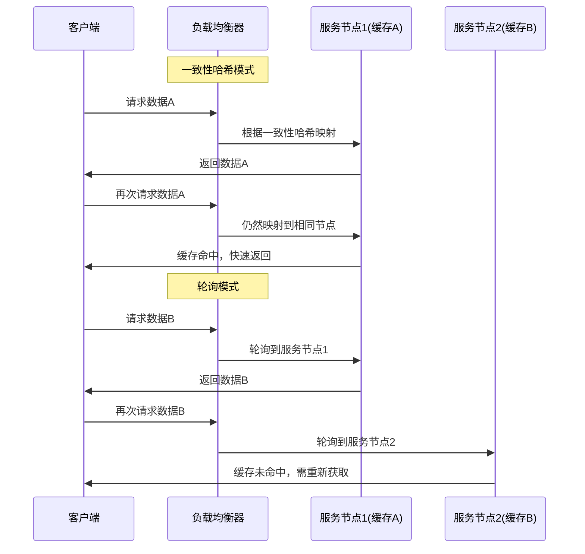

# 一致性Hash算法原理与优势

## 什么是一致性Hash算法？

一致性哈希（Consistent Hashing）算法是一种特殊的哈希算法，主要用于分布式系统中，解决传统哈希算法在节点增删时导致大量数据重新分布的问题。它是由MIT的Karger等人在1997年提出的，用于解决分布式缓存系统中的数据分布问题。

## 一致性Hash算法的原理



### 核心思想

1. **哈希环构建**：
   - 将整个哈希值空间组织成一个虚拟的圆环，范围通常是0到2^32-1
   - 每个服务节点通过哈希函数映射到环上的某个位置

2. **数据映射**：
   - 将请求或数据也通过相同的哈希函数映射到环上
   - 数据映射到的节点是沿着环顺时针方向遇到的第一个服务节点

3. **节点变化处理**：
   - 当有节点加入或离开时，只会影响相邻节点之间的数据分布
   - 大部分数据映射关系保持不变

### 虚拟节点机制

为解决数据分布不均的问题，一致性哈希算法引入了虚拟节点（Virtual Node）的概念：



- 每个物理节点对应哈希环上的多个虚拟节点
- 虚拟节点通过在节点标识符上加入编号等方式生成
- 数据映射到虚拟节点，然后由虚拟节点映射到实际的物理节点
- 大大增加了节点在环上的分布密度，使数据分布更均匀

## 一致性Hash算法相比轮询算法的优势

### 1. 节点变化时的稳定性



**普通轮询/哈希算法**：
- 当节点数量变化时，可能导致大部分甚至全部映射关系改变
- 在分布式系统中，这意味着大规模的数据迁移，造成系统负载剧增
- 缓存命中率大幅下降，影响系统性能

**一致性哈希算法**：
- 当节点加入或离开时，只有少部分数据需要重新映射
- 大大减少了数据迁移的成本
- 保持了大部分缓存的有效性，系统性能更稳定

### 2. 缓存一致性与命中率



**轮询算法**：
- 同一请求可能被分配到不同服务节点
- 导致每个节点都需要缓存相同的数据，浪费资源
- 或者缓存频繁未命中，影响性能

**一致性哈希算法**：
- 相同参数的请求总是被路由到相同的服务节点（粘性会话）
- 大大提高缓存命中率
- 减少了跨节点的数据同步需求

### 3. 负载均衡的灵活性

**轮询算法**：
- 简单轮询无法考虑节点的实际处理能力差异
- 加权轮询需要手动设置和调整权重

**一致性哈希算法**：
- 通过调整虚拟节点数量，可以灵活控制节点负载
- 性能更强的节点可以设置更多的虚拟节点
- 动态调整更加灵活

### 4. 适用于分布式场景

**轮询算法**：
- 适用于无状态服务
- 在服务实例完全相同的场景下表现良好

**一致性哈希算法**：
- 特别适合有状态服务，如缓存服务、会话管理等
- 在服务节点频繁变动的环境中表现更佳
- 适用于异构系统，各节点性能不一的情况

## 在RPC框架中应用一致性哈希算法

在RPC框架中，一致性哈希算法可以作为负载均衡策略的一部分，特别适用于以下场景：

1. **有状态服务调用**：当服务需要维护会话状态或缓存时，一致性哈希可以确保相同请求总是路由到相同节点

2. **缓存优化**：通过保证相同请求路由到相同节点，大大提高服务端缓存效率

3. **服务弹性伸缩**：在服务动态扩容或缩容时，一致性哈希可以最小化重新路由的请求数量

实现示例：

```java
public class ConsistentHashLoadBalancer implements LoadBalancer {
    private final int virtualNodes; // 虚拟节点数
    private final SortedMap<Integer, ServiceInstance> circle = new TreeMap<>();
    
    public ConsistentHashLoadBalancer(int virtualNodes) {
        this.virtualNodes = virtualNodes;
    }
    
    @Override
    public ServiceInstance select(List<ServiceInstance> instances, RpcRequest request) {
        // 重建哈希环
        buildConsistentHashCircle(instances);
        
        // 计算请求的哈希值
        int hash = hash(request.getServiceName() + request.getMethodName() 
                        + Arrays.toString(request.getArgs()));
        
        // 沿环顺时针查找第一个节点
        if (!circle.containsKey(hash)) {
            SortedMap<Integer, ServiceInstance> tailMap = circle.tailMap(hash);
            hash = tailMap.isEmpty() ? circle.firstKey() : tailMap.firstKey();
        }
        
        // 返回选中的节点
        return circle.get(hash);
    }
    
    private void buildConsistentHashCircle(List<ServiceInstance> instances) {
        circle.clear();
        for (ServiceInstance instance : instances) {
            for (int i = 0; i < virtualNodes; i++) {
                int hash = hash(instance.toString() + "#" + i);
                circle.put(hash, instance);
            }
        }
    }
    
    private int hash(String key) {
        // FNV1_32_HASH算法
        final int p = 16777619;
        int hash = (int) 2166136261L;
        for (int i = 0; i < key.length(); i++)
            hash = (hash ^ key.charAt(i)) * p;
        hash += hash << 13;
        hash ^= hash >> 7;
        hash += hash << 3;
        hash ^= hash >> 17;
        hash += hash << 5;
        return hash < 0 ? Math.abs(hash) : hash;
    }
}
```

## 总结

一致性哈希算法通过其独特的设计，解决了分布式系统中节点变动导致的大规模数据重分布问题，在保持系统稳定性和高性能方面具有显著优势。相比传统的轮询算法，它特别适合需要保持会话一致性、高缓存命中率的场景，是分布式RPC框架中不可或缺的负载均衡算法之一。 