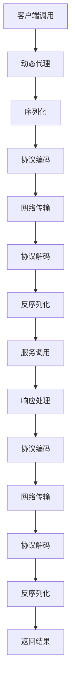
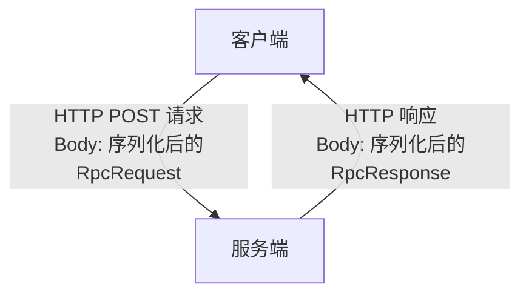
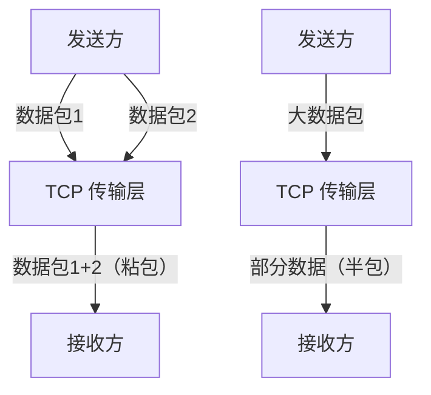
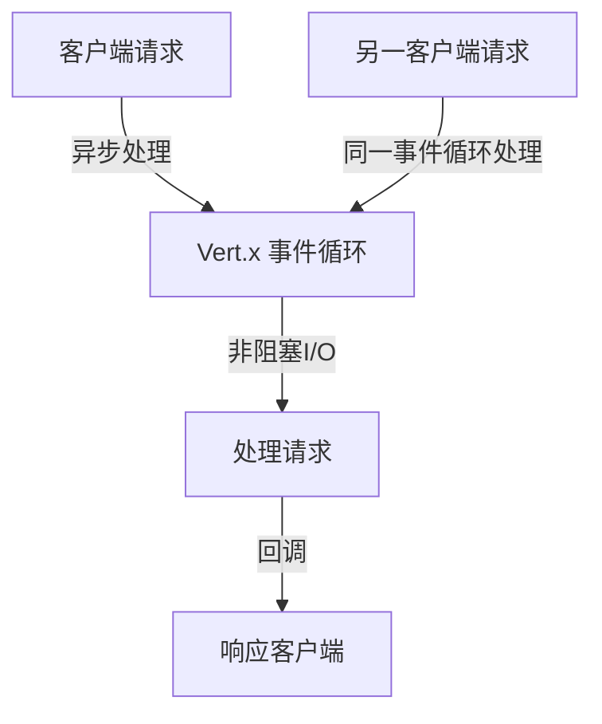

# Ming RPC Framework 协议与网络通信详解

## 📖 概述

协议与网络通信是Ming RPC Framework的核心基础设施，负责在分布式环境中实现服务提供者和消费者之间的可靠通信。框架采用多协议支持的设计理念，既提供简单易用的HTTP协议，也支持高性能的TCP协议，满足不同场景的需求。

### 🎯 设计目标
1. **高性能**: 通过优化的协议设计和网络通信实现高吞吐量
2. **可靠性**: 提供可靠的消息传输和错误处理机制
3. **可扩展**: 支持多种协议和编解码方式
4. **易调试**: 提供友好的调试和监控能力

### 🌐 网络通信在RPC中的位置


## 🔌 RPC框架采用的协议设计

### 协议设计

本 RPC 框架采用了基于 HTTP 协议的通信方式，并在其上构建了自定义的应用层协议。具体协议设计如下：

- **底层传输协议**：HTTP 协议
- **应用层协议**：自定义的 RPC 请求响应格式
  - **请求格式**：序列化后的 `RpcRequest` 对象
  - **响应格式**：序列化后的 `RpcResponse` 对象



### RPC 请求与响应结构

**RpcRequest 类结构**：
```java
public class RpcRequest implements Serializable {
    private String serviceName;    // 服务名称，通常是接口全限定名
    private String methodName;     // 方法名
    private Object[] args;         // 方法参数值
    private Class<?>[] parameterTypes;  // 方法参数类型
}
```

**RpcResponse 类结构**：
```java
public class RpcResponse implements Serializable {
    private Object data;          // 返回数据
    private Class<?> dataType;    // 数据类型
    private String message;       // 响应消息
    private Exception exception;  // 异常信息
}
```

### 为什么要自定义协议？

1. **满足特定需求**：RPC 调用需要传递方法调用的特定信息（如服务名、方法名、参数类型等），这些信息需要有专门的数据结构来承载。

2. **简化实现**：基于 HTTP 协议构建自定义协议，可以利用 HTTP 的成熟基础设施，避免从底层 TCP/IP 开始实现，同时保持良好的可调试性。

3. **灵活性与可扩展性**：
   - 可以根据需要自定义序列化方式（目前使用 JDK 序列化，未来可扩展支持 JSON、Protobuf 等）
   - 可以扩展协议字段，支持额外功能（如超时控制、服务版本等）

4. **封装实现细节**：自定义协议允许在不影响调用方的情况下优化底层实现，对 RPC 框架的使用者保持透明。

### 协议的优势

1. **易于理解和调试**：基于 HTTP 的协议相比纯 TCP 协议更易于调试，可以使用常见的 HTTP 工具进行测试。

2. **广泛的兼容性**：HTTP 协议被广泛支持，几乎所有编程语言和平台都能处理 HTTP 请求，为跨语言、跨平台调用提供了可能。

3. **无需处理低级网络问题**：利用 HTTP 协议和 Vert.x 框架，避免了手动处理 TCP 连接管理、粘包半包等复杂问题。

## 什么是 TCP 协议的半包粘包问题？你在项目中是如何解决该问题的？

### TCP 半包粘包问题解析

**半包（Incomplete Packet）**：
- 定义：接收方一次读取到的数据少于发送方一次发送的数据
- 原因：TCP 缓冲区大小限制、网络带宽限制等

**粘包（Sticky Packet）**：
- 定义：接收方一次读取到的数据包含发送方多次发送的数据
- 原因：TCP 是面向流的协议，没有消息边界；Nagle 算法可能合并小数据包



### 本 RPC 框架的解决方案

本项目通过使用 HTTP 协议和 Vert.x 框架巧妙地避开了 TCP 粘包半包问题：

1. **利用 HTTP 协议特性**：
   - HTTP 协议是应用层协议，有明确的消息边界
   - HTTP 头部包含 Content-Length 或使用分块传输编码，明确指示消息体大小

2. **Vert.x 的处理机制**：
   - 服务端使用 `request.bodyHandler()` 确保完整接收请求体后再处理
   ```java
   request.bodyHandler(body -> {
       byte[] bytes = body.getBytes();
       RpcRequest rpcRequest = serializer.deserialize(bytes, RpcRequest.class);
       // 处理请求...
   });
   ```
   
   - 客户端使用 WebClient 发送请求并等待完整响应
   ```java
   webClient.request(HttpMethod.POST, port, host, "/")
           .sendBuffer(Buffer.buffer(requestBytes), ar -> {
               // 处理响应...
           });
   ```

3. **完整性保证**：
   - Vert.x 的 HTTP 实现自动处理了 HTTP 消息的解析和组装
   - 应用层只需处理完整的 HTTP 请求和响应

通过这种设计，RPC 框架避免了直接处理 TCP 协议的复杂性，利用 HTTP 协议和 Vert.x 框架提供的抽象，简化了实现并提高了可靠性。

## 你是如何实现项目中的网络通信的？为什么选择了 Vert.x 框架？

### 网络通信实现方式

本项目使用 Vert.x 框架实现了基于 HTTP 的 RPC 通信：

**服务端实现**：
```java
// 创建 Vertx 实例
Vertx vertx = Vertx.vertx();
// 创建 HTTP 服务器
io.vertx.core.http.HttpServer server = vertx.createHttpServer();
// 设置请求处理器
server.requestHandler(new HttpServerHandler());
// 监听指定端口
server.listen(port, result -> {
    if (result.succeeded()) {
        System.out.println("Server is now listening on port " + port);
    } else {
        System.out.println("Failed to start server: " + result.cause());
    }
});
```

**客户端实现**：
```java
// 创建 WebClient
WebClient webClient = WebClient.create(vertx, options);
// 发送 RPC 请求
webClient.request(HttpMethod.POST, port, host, "/")
        .sendBuffer(Buffer.buffer(requestBytes), ar -> {
            // 处理响应
        });
```

### 为什么选择 Vert.x 框架？

1. **高性能的异步非阻塞模型**：
   - Vert.x 基于事件循环模型，采用非阻塞 I/O
   - 能高效处理大量并发连接，适合 RPC 框架的高并发场景
   - 单个事件循环线程可以处理多个连接，减少资源消耗

2. **简洁易用的 API**：
   - 提供了直观的 API，如 `vertx.createHttpServer()`、`server.requestHandler()`
   - 异步操作使用回调、Promise 或 Future 模式，代码清晰可读
   - 降低了网络编程的复杂度



3. **模块化和可扩展性**：
   - Vert.x 提供丰富的模块，如 Web、WebClient、Config 等
   - 支持多种协议（HTTP/1.x、HTTP/2、WebSocket 等）
   - 便于未来扩展 RPC 框架功能

4. **轻量级**：
   - 启动快速，资源占用少
   - 适合微服务架构，无需重量级应用服务器

5. **可靠性**：
   - 成熟的框架，社区活跃，文档完善
   - 在生产环境中被广泛使用和验证

## 🚀 Ming RPC Framework网络通信实现

### HTTP通信实现

#### HTTP服务器
**文件路径**: `rpc-core/src/main/java/com/ming/rpc/server/http/VertxHttpServer.java`

```java
public class VertxHttpServer implements HttpServer {
    public void doStart(int port) {
        // 创建Vertx实例
        Vertx vertx = Vertx.vertx();

        // 创建HTTP服务器
        io.vertx.core.http.HttpServer server = vertx.createHttpServer();

        // 处理请求
        server.requestHandler(new HttpServerHandler());

        // 启动HTTP服务器并监听端口
        server.listen(port, "0.0.0.0", result -> {
            if (result.succeeded()) {
                System.out.println("Vertx HTTP Server started on port " + port);
            } else {
                System.err.println("Failed to start Vertx HTTP Server: " + result.cause().getMessage());
            }
        });
    }
}
```

#### HTTP请求处理器
**文件路径**: `rpc-core/src/main/java/com/ming/rpc/server/http/HttpServerHandler.java`

```java
public class HttpServerHandler implements Handler<HttpServerRequest> {
    @Override
    public void handle(HttpServerRequest request) {
        // 指定序列化器
        final Serializer serializer = SerializerFactory.getInstance(RpcApplication.getRpcConfig().getSerializer());

        // 异步处理HTTP请求
        request.bodyHandler(body -> {
            byte[] bytes = body.getBytes();
            RpcRequest rpcRequest = null;
            try {
                rpcRequest = serializer.deserialize(bytes, RpcRequest.class);
            } catch (Exception e) {
                e.printStackTrace();
                request.response().setStatusCode(500).end("Internal Server Error");
                return;
            }

            // 构造响应结果对象
            RpcResponse rpcResponse = new RpcResponse();
            if (rpcRequest == null) {
                rpcResponse.setMessage("Request is null");
                doResponse(request, rpcResponse, serializer);
                return;
            }

            try {
                // 获取要调用的服务实现类，通过反射调用
                Class<?> implClass = LocalRegistry.get(rpcRequest.getServiceName());
                Method method = implClass.getMethod(rpcRequest.getMethodName(), rpcRequest.getParameterTypes());
                Object result = method.invoke(implClass.newInstance(), rpcRequest.getArgs());

                // 封装返回结果
                rpcResponse.setData(result);
                rpcResponse.setDataType(method.getReturnType());
                rpcResponse.setMessage("ok");
                rpcResponse.setMessageType(RpcResponse.MessageType.SUCCESS);
            } catch (Exception e) {
                e.printStackTrace();
                rpcResponse.setMessage("Internal Server Error");
                rpcResponse.setMessageType(RpcResponse.MessageType.FAILURE);
            }

            // 响应
            doResponse(request, rpcResponse, serializer);
        });
    }
}
```

### TCP通信实现

#### TCP服务器
**文件路径**: `rpc-core/src/main/java/com/ming/rpc/server/tcp/VertexTcpServer.java`

```java
@Slf4j
public class VertexTcpServer {
    public void doStart(int port) {
        // 创建 Vert.x 实例
        Vertx vertx = Vertx.vertx();

        // 创建 TCP 服务端
        NetServer netServer = vertx.createNetServer();

        // 设置 TCP 服务端监听端口
        netServer.connectHandler(new TcpServerHandler());

        // 启动 TCP 服务端
        netServer.listen(port, ar -> {
            if (ar.succeeded()) {
                log.info("TCP 服务端启动成功，监听端口：{}", port);
            } else {
                log.error("TCP 服务端启动失败，监听端口：{}", port, ar.cause());
            }
        });
    }
}
```

#### TCP客户端
**文件路径**: `rpc-core/src/main/java/com/ming/rpc/server/tcp/VertexTcpClient.java`

```java
public class VertexTcpClient {
    public static RpcResponse doRequest(RpcRequest rpcRequest, ServiceMetaInfo serviceMetaInfo)
            throws InterruptedException, ExecutionException {
        // 发送 TCP 请求
        Vertx vertx = Vertx.vertx();
        NetClient netClient = vertx.createNetClient();
        CompletableFuture<RpcResponse> responseFuture = new CompletableFuture<>();

        netClient.connect(serviceMetaInfo.getServicePort(), serviceMetaInfo.getServiceHost(), result -> {
            if (result.succeeded()) {
                NetSocket socket = result.result();

                // 发送数据
                ProtocolMessage.Header header = new ProtocolMessage.Header();
                header.setMagic(ProtocolConstant.PROTOCOL_MAGIC);
                header.setVersion(ProtocolConstant.PROTOCOL_VERSION);
                header.setSerializer((byte) ProtocolMessageSerializerEnum.getEnumByValue(RpcApplication.getRpcConfig().getSerializer()).getKey());
                header.setType((byte) ProtocolMessageTypeEnum.REQUEST.getKey());
                header.setRequestId(IdUtil.getSnowflakeNextId());

                ProtocolMessage<RpcRequest> protocolMessage = new ProtocolMessage<>(header, rpcRequest);
                try {
                    Buffer encodeBuffer = ProtocolMessageEncoder.encode(protocolMessage);
                    socket.write(encodeBuffer);
                } catch (Exception e) {
                    throw new RuntimeException("协议消息编码错误", e);
                }

                // 接收响应
                TcpBufferHandlerWrapper bufferHandlerWrapper = new TcpBufferHandlerWrapper(buffer -> {
                    try {
                        ProtocolMessage<RpcResponse> rpcResponseProtocolMessage =
                            (ProtocolMessage<RpcResponse>) ProtocolMessageDecoder.decode(buffer);
                        responseFuture.complete(rpcResponseProtocolMessage.getBody());
                    } catch (Exception e) {
                        throw new RuntimeException("协议消息解码错误", e);
                    }
                });
                socket.handler(bufferHandlerWrapper);
            } else {
                System.err.println("Failed to connect to TCP server");
            }
        });

        RpcResponse rpcResponse = responseFuture.get();
        netClient.close();
        return rpcResponse;
    }
}
```

## 📊 协议对比

基于项目实际实现的协议对比：

| 协议 | 性能 | 调试难度 | 实现复杂度 | 适用场景 |
|------|------|---------|-----------|----------|
| HTTP | 中等 | 简单 | 低 | 开发测试、Web集成 |
| TCP | 高 | 困难 | 高 | 生产环境、高性能 |

## 🔧 使用指南

### 配置网络协议
在RPC配置中指定使用的协议：

```yaml
rpc:
  serverHost: localhost
  serverPort: 8080
  # 其他配置...
```

### 启动HTTP服务器
```java
// 启动HTTP服务器
HttpServer httpServer = new VertxHttpServer();
httpServer.doStart(8080);
```

### 启动TCP服务器
```java
// 启动TCP服务器
VertexTcpServer tcpServer = new VertexTcpServer();
tcpServer.doStart(8888);
```

## 🎯 最佳实践

### 1. 协议选择
- **开发环境**: 使用HTTP协议，便于调试和测试
- **生产环境**: 使用TCP协议，获得更好的性能
- **混合部署**: 同时支持HTTP和TCP，满足不同需求

### 2. 性能优化
- 使用连接池管理网络连接
- 启用Keep-Alive减少连接开销
- 合理设置超时时间

### 3. 错误处理
- 实现完善的异常处理机制
- 提供详细的错误信息
- 支持优雅的服务降级

### 4. 监控和调试
- 记录网络通信日志
- 监控连接数和响应时间
- 提供调试工具和接口

## 📋 总结

Ming RPC Framework通过精心设计的协议和网络通信架构，提供了高效、可靠的分布式通信解决方案：

### 核心优势
- ✅ **多协议支持**: HTTP和TCP两种协议，满足不同场景需求
- ✅ **高性能**: 基于Vert.x的异步非阻塞架构，支持高并发
- ✅ **易调试**: HTTP协议便于开发和调试
- ✅ **可扩展**: 支持自定义协议和编解码器

### 技术特色
- **异步非阻塞**: 基于Vert.x事件循环模型，高效处理并发
- **协议编解码**: 完整的协议消息编解码机制
- **半包粘包处理**: TCP协议的完整消息边界处理
- **错误处理**: 完善的异常处理和错误恢复机制

Ming RPC Framework的协议与网络通信为分布式RPC调用提供了强有力的基础设施支撑，确保了服务间通信的高效性和可靠性。