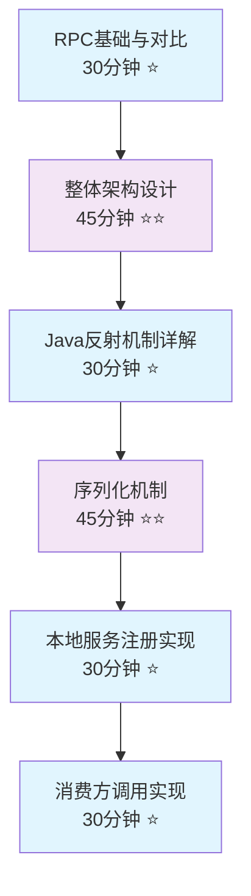
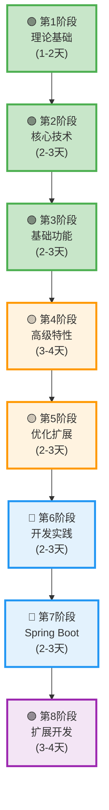

# Ming RPC Framework 学习导航 📚

## 🎯 导航说明

本导航文档专为初学者设计，将帮助你循序渐进地掌握Ming RPC Framework的核心技术和实现原理。文档按照学习难度和逻辑关系进行分类，建议按照推荐顺序进行学习。

### 📖 如何使用本导航
- **🟢 必读**: 核心概念，必须掌握
- **🟡 进阶**: 深入理解，建议学习  
- **🔵 实战**: 动手实践，加深理解
- **🟣 扩展**: 高级特性，可选学习
- **⏱️ 时间**: 建议学习时间
- **📊 难度**: ⭐(简单) ⭐⭐(中等) ⭐⭐⭐(困难)

## 🚀 快速入门路径 (2-3天)

适合想要快速了解RPC框架基本原理的学习者：



1. [RPC基础与对比](./RPC基础与对比.md) - 30分钟 ⭐
2. [整体架构设计](./整体架构设计.md) - 45分钟 ⭐⭐
3. [Java反射机制详解](./Java反射机制详解.md) - 30分钟 ⭐
4. [序列化机制](./序列化机制.md) - 45分钟 ⭐⭐
5. [本地服务注册实现](./本地服务注册实现.md) - 30分钟 ⭐
6. [消费方调用实现](./消费方调用实现.md) - 30分钟 ⭐

## 📚 完整学习路径

### 🗺️ 学习路径图



### 📋 各阶段详细内容

#### 🟢 第1阶段: 理论基础 (1-2天)
- RPC基础与对比 → 整体架构设计

#### 🟢 第2阶段: 核心技术原理 (2-3天)
- Java反射机制 → 序列化机制 → 协议与网络通信 → Java SPI机制

#### 🟢 第3阶段: 基础功能实现 (2-3天)
- 本地服务注册 → 消费方调用 → 服务注册中心

#### 🟡 第4阶段: 高级特性 (3-4天)
- 负载均衡 → 容错机制 → 重试机制 → 一致性Hash算法

#### 🟡 第5阶段: 优化与扩展 (2-3天)
- 缓存优化 → 缓存一致性 → 服务有效性 → Etcd注册中心

#### 🔵 第6阶段: 开发实践 (2-3天)
- 注解驱动 → 设计模式 → 工具库应用 → Mock服务

#### 🔵 第7阶段: Spring Boot集成 (2-3天)
- 集成概述 → 开发指南 → 架构详解 → 测试报告 → 项目总结

#### 🟣 第8阶段: 扩展开发 (3-4天)
- 配置管理 → SPI工厂模式 → 扩展计划
```

### 第一阶段：理论基础 🟢 (1-2天)

**学习目标**: 理解RPC的基本概念和整体架构

| 文档 | 描述 | 时间 | 难度 |
|------|------|------|------|
| [RPC基础与对比](./RPC基础与对比.md) | RPC概念、与HTTP区别、框架对比 | 30分钟 | ⭐ |
| [整体架构设计](./整体架构设计.md) | 框架整体架构、模块关系、设计模式 | 45分钟 | ⭐⭐ |

**学习重点**:
- 理解RPC的工作原理和优势
- 掌握Ming RPC Framework的整体架构
- 了解各模块之间的关系

### 第二阶段：核心技术原理 🟢 (2-3天)

**学习目标**: 掌握RPC框架的核心技术实现

| 文档 | 描述 | 时间 | 难度 |
|------|------|------|------|
| [Java反射机制详解](./Java反射机制详解.md) | 反射原理、动态代理实现 | 30分钟 | ⭐ |
| [序列化机制](./序列化机制.md) | 多种序列化方式、性能对比 | 45分钟 | ⭐⭐ |
| [协议与网络通信](./协议与网络通信.md) | 网络通信协议、HTTP/TCP实现 | 60分钟 | ⭐⭐ |
| [Java SPI机制与动态扩展实现](./Java%20SPI机制与动态扩展实现.md) | SPI原理、插件化架构 | 60分钟 | ⭐⭐⭐ |

**学习重点**:
- 理解动态代理在RPC中的作用
- 掌握序列化的重要性和实现方式
- 了解网络通信的底层实现
- 理解SPI机制如何实现框架扩展

### 第三阶段：基础功能实现 🟢 (2-3天)

**学习目标**: 理解RPC框架的基础功能实现

| 文档 | 描述 | 时间 | 难度 |
|------|------|------|------|
| [本地服务注册实现](./本地服务注册实现.md) | 本地注册表实现原理 | 30分钟 | ⭐ |
| [消费方调用实现](./消费方调用实现.md) | 客户端调用流程和实现 | 30分钟 | ⭐ |
| [服务注册中心原理与实现](./服务注册中心原理与实现.md) | 分布式服务注册与发现 | 60分钟 | ⭐⭐ |

**学习重点**:
- 理解服务注册的基本原理
- 掌握客户端如何发起远程调用
- 了解分布式环境下的服务发现机制

### 第四阶段：高级特性 🟡 (3-4天)

**学习目标**: 掌握RPC框架的高级特性和优化策略

| 文档 | 描述 | 时间 | 难度 |
|------|------|------|------|
| [负载均衡原理与实现](./负载均衡原理与实现.md) | 多种负载均衡算法实现 | 60分钟 | ⭐⭐ |
| [容错机制原理与实现](./容错机制原理与实现.md) | 故障处理和容错策略 | 45分钟 | ⭐⭐ |
| [重试机制原理与实现](./重试机制原理与实现.md) | 智能重试策略实现 | 45分钟 | ⭐⭐ |
| [一致性Hash算法原理与优势](./一致性Hash算法原理与优势.md) | 分布式负载均衡算法 | 60分钟 | ⭐⭐⭐ |

**学习重点**:
- 理解负载均衡在分布式系统中的重要性
- 掌握容错和重试机制的设计思路
- 了解一致性Hash算法的应用场景

### 第五阶段：优化与扩展 🟡 (2-3天)

**学习目标**: 学习系统优化和扩展技术

| 文档 | 描述 | 时间 | 难度 |
|------|------|------|------|
| [服务注册信息缓存优化](./服务注册信息缓存优化.md) | 缓存机制提升性能 | 45分钟 | ⭐⭐ |
| [服务注册信息缓存更新与一致性保障](./服务注册信息缓存更新与一致性保障.md) | 缓存一致性保障 | 60分钟 | ⭐⭐⭐ |
| [注册中心服务信息有效性保障](./注册中心服务信息有效性保障.md) | 服务健康检查机制 | 45分钟 | ⭐⭐ |
| [Etcd注册中心优势与特性](./Etcd注册中心优势与特性.md) | 生产级注册中心选型 | 45分钟 | ⭐⭐ |

**学习重点**:
- 理解缓存在分布式系统中的作用
- 掌握数据一致性的保障机制
- 了解生产环境的注册中心选型

### 第六阶段：开发实践 🔵 (2-3天)

**学习目标**: 掌握实际开发中的最佳实践

| 文档 | 描述 | 时间 | 难度 |
|------|------|------|------|
| [注解驱动与开发成本优化](./注解驱动与开发成本优化.md) | 简化开发的注解机制 | 45分钟 | ⭐⭐ |
| [设计模式应用](./设计模式应用.md) | 框架中的设计模式实践 | 60分钟 | ⭐⭐ |
| [Hutool工具库应用](./Hutool工具库应用.md) | 实用工具库的使用 | 30分钟 | ⭐ |
| [Mock服务实现](./Mock服务实现.md) | 测试环境的Mock服务 | 45分钟 | ⭐⭐ |

**学习重点**:
- 学习如何简化RPC服务的开发
- 理解设计模式在框架中的应用
- 掌握测试和Mock的最佳实践

### 第七阶段：Spring Boot集成 🔵 (2-3天)

**学习目标**: 掌握Spring Boot环境下的RPC框架使用

| 文档 | 描述 | 时间 | 难度 |
|------|------|------|------|
| [Spring Boot集成README](./springboot-start/README.md) | Spring Boot集成概述 | 15分钟 | ⭐ |
| [Spring Boot开发指南](./springboot-start/开发指南.md) | 详细的开发指导 | 60分钟 | ⭐⭐ |
| [Spring Boot技术架构详解](./springboot-start/技术架构详解.md) | 集成架构设计 | 45分钟 | ⭐⭐ |
| [Spring Boot测试报告](./springboot-start/测试报告.md) | 测试用例和结果 | 30分钟 | ⭐ |
| [Spring Boot项目总结](./springboot-start/项目总结.md) | 项目经验总结 | 30分钟 | ⭐ |

**学习重点**:
- 掌握Spring Boot Starter的开发
- 理解自动配置的实现原理
- 学习集成测试的最佳实践

### 第八阶段：扩展开发 🟣 (3-4天)

**学习目标**: 学习框架的扩展开发和未来规划

| 文档 | 描述 | 时间 | 难度 |
|------|------|------|------|
| [第一阶段配置管理系统](./扩展版/第一阶段配置管理系统.md) | 配置中心的设计与实现 | 60分钟 | ⭐⭐⭐ |
| [第二阶段SPI机制和工厂模式](./扩展版/第二阶段SPI机制和工厂模式.md) | 高级扩展机制 | 60分钟 | ⭐⭐⭐ |
| [项目后续扩展开发计划](./扩展版/项目后续扩展开发计划.md) | 未来发展规划 | 30分钟 | ⭐⭐ |

**学习重点**:
- 理解配置中心的重要性
- 掌握高级扩展机制的设计
- 了解框架的发展方向

## 📖 补充学习材料

### 基础知识补充
| 文档 | 描述 | 时间 | 难度 |
|------|------|------|------|
| [雪花算法与分布式ID生成](./雪花算法与分布式ID生成.md) | 分布式ID生成策略 | 45分钟 | ⭐⭐ |

### 测试与验证
| 文档 | 描述 | 时间 | 难度 |
|------|------|------|------|
| [TCP通信模块测试成功](./TCP通信模块测试成功.md) | TCP通信测试案例 | 30分钟 | ⭐ |

### 面试准备
| 文档 | 描述 | 时间 | 难度 |
|------|------|------|------|
| [拷打面试题](./拷打面试题.md) | RPC相关面试题解析 | 60分钟 | ⭐⭐ |

## 🎓 学习建议

### 对于不同水平的学习者

**🔰 初学者 (0-1年经验)**
- 重点学习第1-3阶段，理解基本概念和原理
- 建议配合代码实践，动手运行示例
- 不要急于学习高级特性，先打好基础

**🚀 进阶者 (1-3年经验)**  
- 完整学习1-6阶段，重点关注设计思路
- 尝试自己实现某些功能模块
- 思考如何在实际项目中应用

**🏆 高级者 (3年以上经验)**
- 学习全部内容，重点关注架构设计
- 研究扩展开发，尝试贡献代码
- 思考框架的优化和改进方向

### 学习方法建议

1. **理论与实践结合**: 每学完一个模块，都要运行相关代码
2. **循序渐进**: 不要跳跃式学习，按照推荐顺序进行
3. **做好笔记**: 记录重点概念和自己的理解
4. **多思考**: 思考为什么要这样设计，有没有更好的方案
5. **实践应用**: 尝试在自己的项目中使用学到的技术

## 📞 学习支持

如果在学习过程中遇到问题，建议：
1. 仔细阅读相关文档和代码注释
2. 查看项目的示例代码
3. 参考测试用例了解使用方法
4. 在项目Issues中搜索相关问题

---

**祝你学习愉快！🎉**

> 💡 **提示**: 这个学习导航会根据项目的发展持续更新，建议定期查看最新版本。
