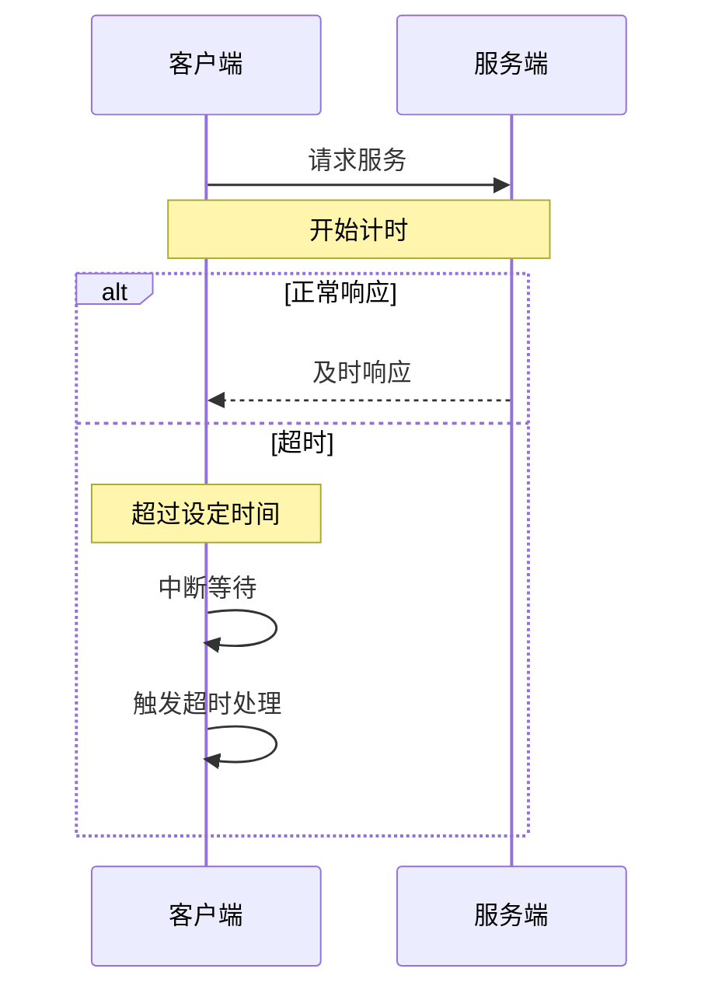
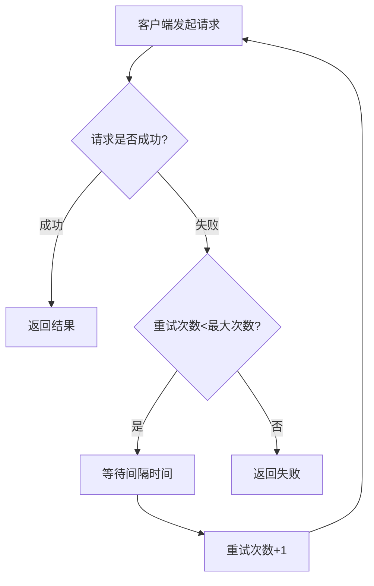
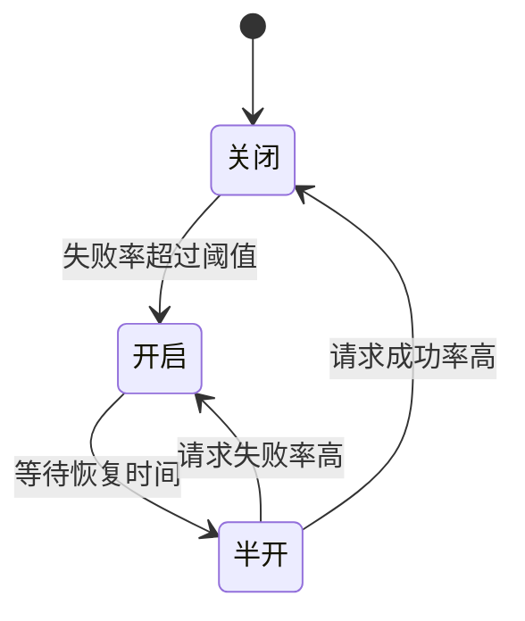
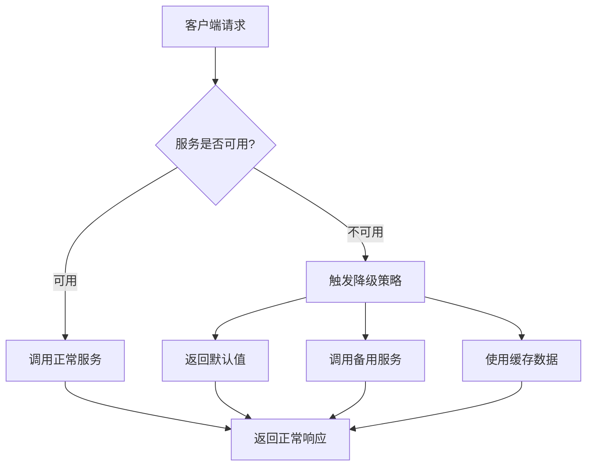
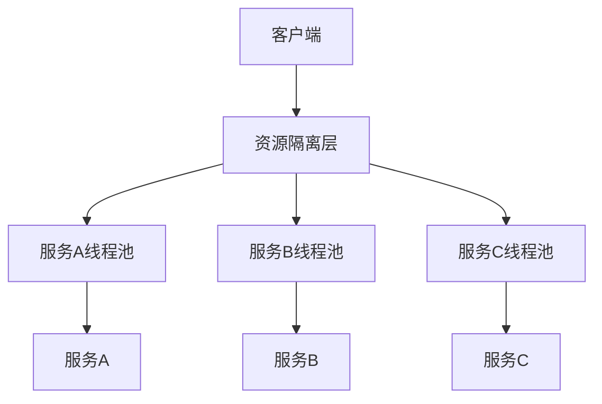
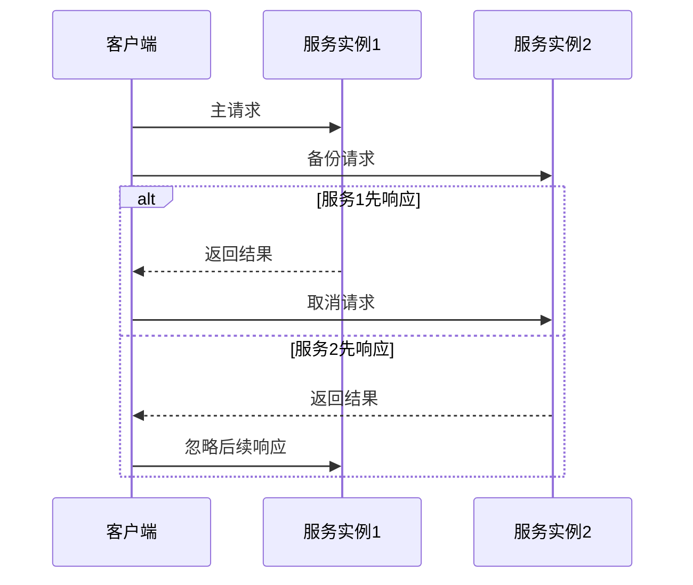

# 容错机制原理与实现

## 为什么要使用容错机制？

在分布式系统特别是RPC框架中，容错机制是保证系统可靠性和稳定性的关键组件。使用容错机制的主要原因有：

1. **提高系统可用性**：在分布式环境中，网络故障、服务宕机等问题是不可避免的，容错机制可以在这些情况下保持系统的基本可用

2. **防止级联故障**：在微服务架构中，一个服务的故障可能导致调用链上的所有服务都受到影响，造成"雪崩效应"，容错机制可以阻止故障蔓延

3. **减少错误影响范围**：通过隔离策略，将故障限制在特定的服务或模块内，避免影响其他正常运行的部分

4. **优化用户体验**：在服务降级时提供基本功能或友好的错误提示，而不是完全的服务中断

5. **提供系统恢复能力**：当故障排除后，系统能够自动恢复正常服务，无需人工干预

## 常见的容错策略

### 1. 超时控制



**原理**：为每个请求设置一个最大等待时间，超过这个时间没有响应则认为请求失败。

**优点**：
- 防止请求无限期阻塞
- 快速释放资源
- 实现简单

**适用场景**：
- 所有RPC调用都应该有超时设置
- 特别适用于对实时性要求高的场景

**实现示例**：
```java
// 在HttpClient中设置连接超时
WebClientOptions options = new WebClientOptions();
options.setKeepAlive(true);
options.setConnectTimeout(5000); // 5秒连接超时
```

### 2. 重试机制



**原理**：当请求失败时，按照特定策略自动重新发送请求，直到成功或达到最大重试次数。

**常见重试策略**：
- **立即重试**：失败后立即进行下一次尝试
- **固定间隔重试**：每次重试之间等待固定的时间
- **指数退避重试**：重试间隔呈指数增长（如1s, 2s, 4s, 8s...）
- **带抖动的重试**：在基本重试策略上增加随机因素，避免重试风暴

**优点**：
- 对临时性故障（如网络抖动）有良好的恢复能力
- 增加请求成功率

**缺点**：
- 可能导致重复处理（需要考虑幂等性）
- 增加系统负载

**实现示例**：
```java
public RpcResponse sendRequestWithRetry(RpcRequest rpcRequest, String host, int port, 
                                       int maxRetries, long retryInterval) {
    int attempts = 0;
    RpcResponse response = null;
    Exception lastException = null;
    
    while (attempts < maxRetries) {
        try {
            response = sendRequest(rpcRequest, host, port);
            if (response != null && response.getException() == null) {
                return response; // 请求成功，返回结果
            }
        } catch (Exception e) {
            lastException = e;
        }
        
        attempts++;
        if (attempts < maxRetries) {
            try {
                // 等待一段时间后重试
                Thread.sleep(retryInterval);
            } catch (InterruptedException ie) {
                Thread.currentThread().interrupt();
                break;
            }
        }
    }
    
    // 达到最大重试次数，创建错误响应
    RpcResponse errorResponse = new RpcResponse();
    errorResponse.setException(lastException);
    errorResponse.setMessage("请求失败，重试" + maxRetries + "次后仍未成功");
    return errorResponse;
}
```

### 3. 熔断机制



**原理**：类似电路熔断器，监控服务调用的失败率，当失败率达到阈值时，暂时切断服务调用，防止更多请求发送到已经出问题的服务。

**状态转换**：
- **关闭状态（Closed）**：正常运行，所有请求正常发送
- **开启状态（Open）**：熔断触发，所有请求快速失败，不会发送到目标服务
- **半开状态（Half-Open）**：熔断超时后进入，允许部分请求通过以探测服务是否恢复

**优点**：
- 防止级联故障，避免雪崩效应
- 减轻已经出问题的服务的负载，给其恢复的机会
- 快速失败，避免请求长时间等待

**实现示例**：
```java
public class CircuitBreaker {
    private State state = State.CLOSED;
    private int failureThreshold; // 失败阈值
    private long resetTimeout; // 重置超时时间
    private int failureCount; // 失败计数
    private long lastFailureTime; // 最后一次失败时间
    
    public enum State {
        CLOSED, OPEN, HALF_OPEN
    }
    
    public CircuitBreaker(int failureThreshold, long resetTimeout) {
        this.failureThreshold = failureThreshold;
        this.resetTimeout = resetTimeout;
    }
    
    public synchronized boolean allowRequest() {
        if (state == State.OPEN) {
            // 检查是否达到重置时间
            if (System.currentTimeMillis() - lastFailureTime >= resetTimeout) {
                state = State.HALF_OPEN;
            } else {
                return false; // 熔断器打开，快速失败
            }
        }
        
        return true; // 关闭或半开状态，允许请求
    }
    
    public synchronized void recordSuccess() {
        if (state == State.HALF_OPEN) {
            // 半开状态下成功，重置熔断器
            reset();
        }
    }
    
    public synchronized void recordFailure() {
        failureCount++;
        lastFailureTime = System.currentTimeMillis();
        
        if (state == State.HALF_OPEN || failureCount >= failureThreshold) {
            // 半开状态下失败，或者失败次数达到阈值，开启熔断器
            state = State.OPEN;
        }
    }
    
    private void reset() {
        state = State.CLOSED;
        failureCount = 0;
    }
}
```

### 4. 服务降级



**原理**：当服务不可用或响应过慢时，返回一个预定义的默认值或从其他途径获取数据，而不是等待原始服务响应或返回错误。

**降级策略**：
- **返回默认值**：直接返回硬编码或配置的默认值
- **使用缓存**：返回上一次成功调用的结果
- **调用备用服务**：切换到功能较简单但更稳定的备用实现

**优点**：
- 保证基本可用性
- 减少用户等待时间
- 在资源紧张时优先保证核心功能

**实现示例**：
```java
public Object callWithFallback(RpcRequest request, String host, int port) {
    try {
        // 尝试正常调用
        RpcResponse response = httpClient.sendRequest(request, host, port);
        if (response.getException() != null) {
            throw response.getException();
        }
        return response.getData();
    } catch (Exception e) {
        // 服务调用失败，执行降级逻辑
        return getFallbackValue(request);
    }
}

private Object getFallbackValue(RpcRequest request) {
    String methodName = request.getMethodName();
    
    // 根据不同的方法提供不同的降级策略
    switch (methodName) {
        case "getUserById":
            // 返回默认用户
            return new User(0, "默认用户", 0);
        case "getProductList":
            // 返回空列表
            return new ArrayList<>();
        default:
            // 默认返回null
            return null;
    }
}
```

### 5. 隔离策略



**原理**：将不同的服务调用隔离在不同的资源池（如线程池、连接池）中，当一个服务出现问题时，只会耗尽该服务的资源池，而不会影响其他服务。

**隔离方式**：
- **线程隔离**：不同服务使用不同的线程池
- **信号量隔离**：限制每个服务的并发调用数量
- **进程隔离**：不同服务部署在不同的进程或容器中

**优点**：
- 防止资源耗尽
- 限制故障范围
- 精细控制系统资源分配

**实现示例**：
```java
public class IsolationExecutor {
    private final Map<String, ThreadPoolExecutor> serviceThreadPools = new ConcurrentHashMap<>();
    
    // 为每个服务创建独立的线程池
    public ThreadPoolExecutor getOrCreateThreadPool(String serviceName) {
        return serviceThreadPools.computeIfAbsent(serviceName, key -> {
            return new ThreadPoolExecutor(
                10,                     // 核心线程数
                20,                     // 最大线程数
                60, TimeUnit.SECONDS,   // 空闲线程超时时间
                new ArrayBlockingQueue<>(100), // 工作队列
                new ThreadFactory() {
                    @Override
                    public Thread newThread(Runnable r) {
                        Thread t = new Thread(r);
                        t.setName("service-" + serviceName + "-thread");
                        return t;
                    }
                },
                new ThreadPoolExecutor.CallerRunsPolicy() // 拒绝策略
            );
        });
    }
    
    // 使用隔离的线程池执行服务调用
    public <T> CompletableFuture<T> executeWithIsolation(String serviceName, Supplier<T> task) {
        ThreadPoolExecutor threadPool = getOrCreateThreadPool(serviceName);
        CompletableFuture<T> future = new CompletableFuture<>();
        
        threadPool.submit(() -> {
            try {
                T result = task.get();
                future.complete(result);
            } catch (Exception e) {
                future.completeExceptionally(e);
            }
        });
        
        return future;
    }
}
```

### 6. 备份请求



**原理**：同时向多个服务实例发送相同的请求，使用最先返回的响应，忽略其他响应。

**优点**：
- 减少延迟，尤其是在服务响应时间波动大的情况下
- 提高系统可用性，规避个别慢实例

**缺点**：
- 增加系统资源消耗
- 重复处理同一请求（需要考虑幂等性）

**实现示例**：
```java
public RpcResponse sendBackupRequests(RpcRequest request, List<ServiceInstance> instances, 
                                    long backupAfterMillis) {
    if (instances.isEmpty()) {
        throw new IllegalArgumentException("No service instances available");
    }
    
    // 创建响应Future
    CompletableFuture<RpcResponse> responseFuture = new CompletableFuture<>();
    
    // 发送主请求
    ServiceInstance primary = instances.get(0);
    sendAsyncRequest(request, primary.getHost(), primary.getPort())
        .thenAccept(responseFuture::complete)
        .exceptionally(ex -> {
            // 主请求异常，不完成Future（等待备份请求）
            return null;
        });
    
    // 如果有多个实例，延迟发送备份请求
    if (instances.size() > 1) {
        ScheduledExecutorService scheduler = Executors.newSingleThreadScheduledExecutor();
        scheduler.schedule(() -> {
            // 如果主请求还没有完成，发送备份请求
            if (!responseFuture.isDone()) {
                ServiceInstance backup = instances.get(1);
                sendAsyncRequest(request, backup.getHost(), backup.getPort())
                    .thenAccept(responseFuture::complete)
                    .exceptionally(ex -> {
                        responseFuture.completeExceptionally(ex);
                        return null;
                    });
            }
        }, backupAfterMillis, TimeUnit.MILLISECONDS);
    }
    
    try {
        // 等待响应（可以设置超时）
        return responseFuture.get(10, TimeUnit.SECONDS);
    } catch (Exception e) {
        RpcResponse errorResponse = new RpcResponse();
        errorResponse.setException(e);
        errorResponse.setMessage("所有请求都失败: " + e.getMessage());
        return errorResponse;
    }
}

private CompletableFuture<RpcResponse> sendAsyncRequest(RpcRequest request, String host, int port) {
    CompletableFuture<RpcResponse> future = new CompletableFuture<>();
    new Thread(() -> {
        try {
            RpcResponse response = httpClient.sendRequest(request, host, port);
            future.complete(response);
        } catch (Exception e) {
            future.completeExceptionally(e);
        }
    }).start();
    return future;
}
```

## 项目中的容错机制实现

在当前的learn-RPC项目中，已经实现了基本的超时控制：

```java
// 在HttpClient构造函数中设置超时
WebClientOptions options = new WebClientOptions();
options.setKeepAlive(true);
options.setConnectTimeout(5000); // 5秒连接超时
```

但尚未实现更复杂的容错机制。为了提高RPC框架的可靠性和稳定性，可以考虑以下扩展：

1. **集成熔断器**：可以引入Hystrix或Resilience4j等开源容错库，或者自行实现熔断器机制

2. **添加重试策略**：在HttpClient中实现自动重试逻辑，处理临时性网络故障

3. **服务降级支持**：允许为服务定义降级策略，在服务不可用时执行备选方案

4. **线程池隔离**：为不同的服务调用使用独立的线程池，防止一个服务的问题影响其他服务

5. **异常处理增强**：更细致地区分不同类型的异常，针对不同异常采取不同的处理策略

## 容错机制的注意事项

1. **幂等性考虑**：实现重试机制时，需要确保被调用的操作是幂等的，即多次调用不会产生不同的结果

2. **超时设置**：合理设置超时时间，太短可能导致正常请求被中断，太长则会占用系统资源

3. **熔断阈值调整**：熔断阈值设置需要根据具体业务场景进行调整，过低或过高都会影响系统可用性

4. **降级策略设计**：降级返回的结果应当符合业务预期，避免引入更多错误

5. **资源使用监控**：容错机制本身也会消耗系统资源，需要监控其资源使用情况，避免过度消耗

## 总结

容错机制是RPC框架中不可或缺的组成部分，通过合理的容错策略设计，可以显著提高系统的可靠性、可用性和用户体验。在实际应用中，通常需要结合多种容错策略，如超时控制、重试机制、熔断机制等，以应对各种不同类型的故障场景。 