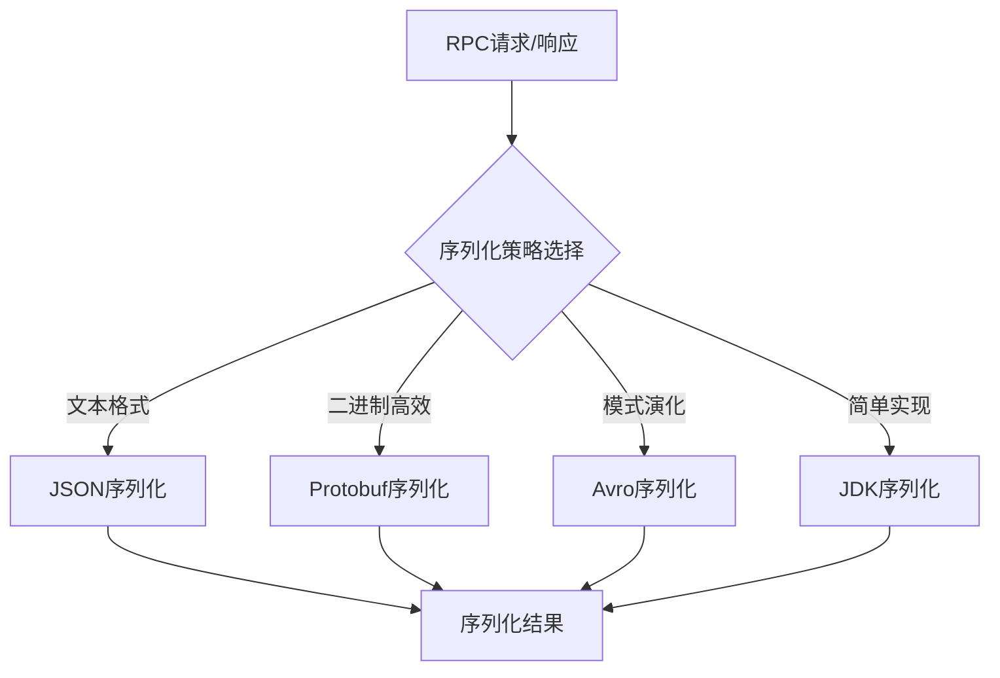
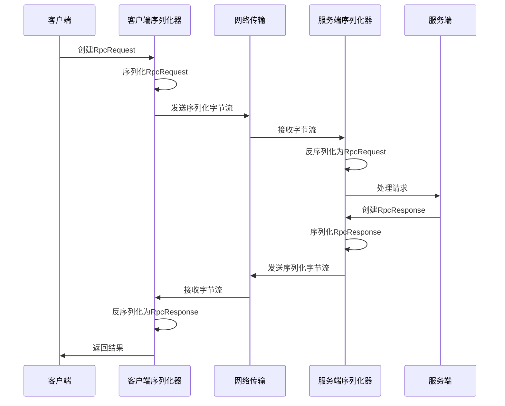

# 序列化机制在 learn-RPC 项目中的应用

## 面试题目

什么是序列化和反序列化？你在项目中是如何处理序列化和反序列化的？

## 引言

序列化（Serialization）和反序列化（Deserialization）是分布式系统和网络通信中的关键概念。在RPC框架中，序列化机制承担着将内存中的对象转换为可传输字节流的重要任务。本文将深入探讨序列化的基本概念、learn-RPC项目中的序列化实现，以及相关的最佳实践和优化建议。

## 1. 什么是序列化和反序列化

### 1.1 基本概念

**序列化**是将内存中的对象转换为字节序列的过程，使其可以被存储或通过网络传输。

**反序列化**是将字节序列恢复为内存中对象的过程。

在RPC（远程过程调用）框架中，序列化和反序列化是实现跨进程通信的核心机制：
- 客户端将调用信息（方法名、参数等）序列化后通过网络发送
- 服务端接收到字节流后反序列化为调用信息，执行相应方法
- 服务端将执行结果序列化后发送回客户端
- 客户端接收到字节流后反序列化为结果对象

### 1.2 序列化的重要性

序列化在RPC框架中的重要性体现在以下几个方面：

1. **数据交换**：实现不同进程间、不同机器间的数据交换
2. **持久化**：支持将对象状态保存到存储介质
3. **跨语言通信**：通过通用的序列化格式，支持不同语言、不同平台间的通信

## 2. learn-RPC项目中的序列化实现

在learn-RPC项目中，我们采用了可扩展的序列化设计，主要包含以下组件：

### 2.1 序列化接口设计

项目定义了`Serializer`接口作为序列化的抽象：

```java
public interface Serializer {
  /**
   * serialize object 
   * @param object 
   * @param <T>
   * @return
   * @throws IOException
   */
  <T> byte[] serialize(T object) throws IOException;

  /**
   * deserialize object
   * @param <T>
   * @param bytes
   * @param type
   * @return
   * @throws IOException
   */
  <T> T deserialize(byte[] bytes, Class<T> type) throws IOException;
}
```

这个接口定义了两个核心方法：
- `serialize`：将对象序列化为字节数组
- `deserialize`：将字节数组反序列化为对象

### 2.2 JDK序列化实现

项目默认使用了JDK自带的序列化机制，通过`JdkSerializer`类实现：

```java
public class JdkSerializer implements Serializer {
    @Override
    public <T> byte[] serialize(T object) throws IOException {
        ByteArrayOutputStream outputStream = new ByteArrayOutputStream();
        ObjectOutputStream objectOutputStream = new ObjectOutputStream(outputStream);
        objectOutputStream.writeObject(object);
        objectOutputStream.close();
        return outputStream.toByteArray();
    }

    @Override
    public <T> T deserialize(byte[] bytes, Class<T> type) throws IOException {
        ByteArrayInputStream inputStream = new ByteArrayInputStream(bytes);
        ObjectInputStream objectInputStream = new ObjectInputStream(inputStream);
        try {
            return (T) objectInputStream.readObject();
        } catch (ClassNotFoundException e) {
            throw new RuntimeException(e);
        } finally {
            objectInputStream.close();
        }
    }
}
```

### 2.3 序列化的使用场景

在项目中，序列化主要用于以下几个场景：

1. **客户端请求发送**：

```java
// 在HttpClient中序列化请求
byte[] requestBytes = serializer.serialize(rpcRequest);
webClient.request(HttpMethod.POST, port, host, "/")
        .sendBuffer(Buffer.buffer(requestBytes), ar -> {
            // 处理响应
        });
```

2. **服务端请求处理**：

```java
// 在HttpServerHandler中反序列化请求
byte[] bytes = body.getBytes();
RpcRequest rpcRequest = serializer.deserialize(bytes, RpcRequest.class);
```

3. **服务端响应返回**：

```java
// 序列化响应对象
byte[] bytes = serializer.serialize(rpcResponse);
response.end(Buffer.buffer(bytes));
```

4. **客户端响应处理**：

```java
// 反序列化响应
Buffer responseBuffer = ar.result().body();
RpcResponse rpcResponse = serializer.deserialize(
        responseBuffer.getBytes(), 
        RpcResponse.class
);
```

### 2.4 序列化数据结构

项目中涉及序列化的主要数据结构包括：

**RpcRequest**：
```java
@Data
@Builder
@AllArgsConstructor
@NoArgsConstructor
public class RpcRequest implements Serializable{
    private String serviceName;
    private String methodName;
    private Object[] args;
    private Class<?>[] parameterTypes;
}
```

**RpcResponse**：
```java
@Data
@Builder
@AllArgsConstructor
@NoArgsConstructor
public class RpcResponse implements Serializable{
    private Object data;
    private Class<?> dataType;
    private String message;
    private Exception exception;
}
```

这两个类都实现了`Serializable`接口，以支持JDK序列化。

## 3. 序列化设计的优势与不足

### 3.1 当前设计的优势

1. **接口抽象**：通过`Serializer`接口抽象出序列化行为，符合面向接口编程原则
2. **可扩展性**：可以轻松添加新的序列化实现，如JSON、Protobuf等
3. **简单易用**：JDK序列化使用简单，无需额外依赖
4. **完整对象图**：JDK序列化可以保留完整的对象关系图

### 3.2 当前实现的局限性

1. **性能开销**：JDK序列化性能相对较低，序列化后的数据量较大
2. **跨语言限制**：仅支持Java平台，无法与其他语言直接交互
3. **安全性问题**：JDK序列化存在已知的安全漏洞
4. **版本兼容性**：对类结构变更敏感，可能导致反序列化失败

## 4. 序列化机制的改进方向

### 4.1 使用更高效的序列化框架

可以考虑引入以下序列化框架来提升性能和兼容性：

1. **JSON序列化**：
   - 使用Jackson、Gson等库
   - 优势：可读性好，跨语言支持广泛
   - 适用场景：与Web前端交互，调试方便

2. **Protocol Buffers (Protobuf)**：
   - Google开发的高效二进制序列化框架
   - 优势：高效紧凑，强类型，跨语言
   - 适用场景：高性能系统间通信

3. **Avro**：
   - Apache的序列化系统，支持模式演化
   - 优势：支持模式兼容性变更，紧凑高效
   - 适用场景：需要支持版本演化的系统



### 4.2 序列化安全性增强

1. **添加序列化版本控制**：
   ```java
   private static final long serialVersionUID = 1L;
   ```

2. **使用transient关键字**：
   ```java
   private transient String sensitiveField;
   ```

3. **自定义序列化控制**：
   ```java
   private void writeObject(ObjectOutputStream out) throws IOException {
       out.defaultWriteObject();
       // 自定义序列化逻辑
   }
   
   private void readObject(ObjectInputStream in) throws IOException, ClassNotFoundException {
       in.defaultReadObject();
       // 自定义反序列化逻辑和校验
   }
   ```

### 4.3 序列化策略的动态配置

可以设计一个序列化工厂，根据配置动态选择不同的序列化实现：

```java
public class SerializerFactory {
    public static Serializer getSerializer(String type) {
        switch (type) {
            case "jdk": return new JdkSerializer();
            case "json": return new JsonSerializer();
            case "protobuf": return new ProtobufSerializer();
            default: return new JdkSerializer();
        }
    }
}
```

## 5. 序列化在RPC框架中的完整流程



## 总结

序列化和反序列化是RPC框架的核心组件，直接影响着框架的性能、兼容性和安全性。learn-RPC项目采用了可扩展的序列化设计，默认使用JDK序列化实现，简单易用但存在性能和跨语言限制。

未来可以考虑引入多种序列化实现，如JSON、Protobuf等，并通过配置方式灵活选择，以满足不同场景的需求。同时，注意增强序列化的安全性和版本兼容性，避免潜在的安全风险和兼容性问题。

通过对序列化机制的深入理解和优化，可以显著提升RPC框架的整体性能和可用性，为构建高效、可靠的分布式系统奠定基础。 