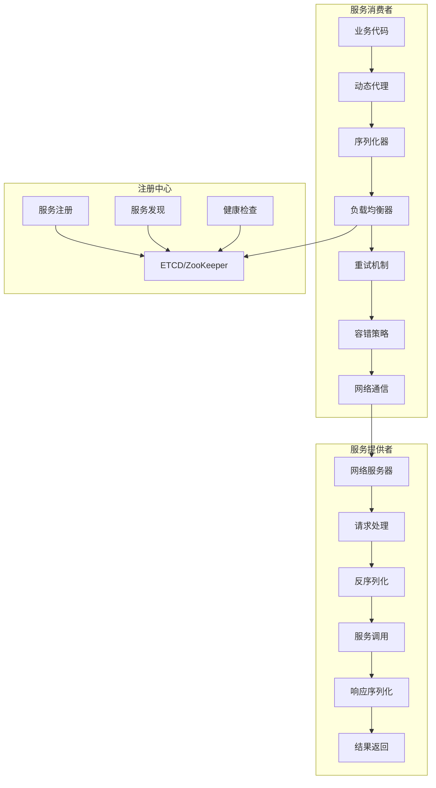
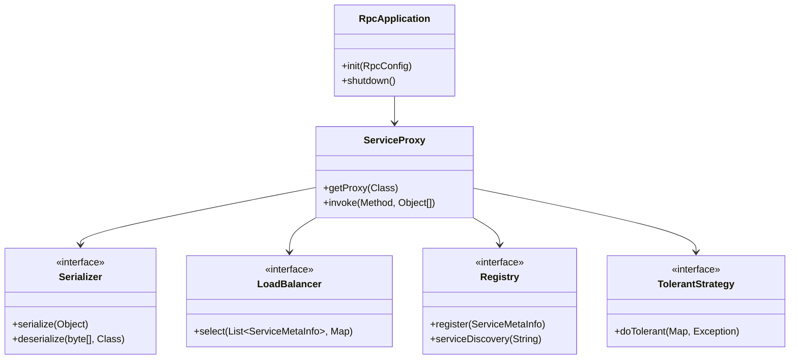
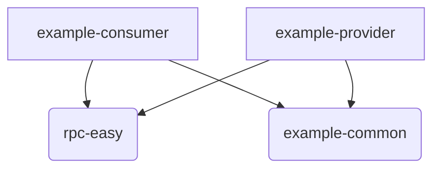

# Ming RPC Framework 整体架构设计详解

## 📖 项目概述

Ming RPC Framework是一个完整的、生产级的分布式RPC框架，采用现代化的架构设计和先进的技术栈。框架通过模块化设计、插件化扩展、配置驱动等方式，为分布式系统提供高性能、高可用、易扩展的远程服务调用解决方案。

### 🎯 设计目标
- **高性能**: 通过优化的序列化、网络通信和负载均衡实现高吞吐量
- **高可用**: 提供完善的容错机制、重试策略和服务治理能力
- **易扩展**: 基于SPI机制实现插件化架构，支持自定义扩展
- **易使用**: 提供注解驱动开发和Spring Boot集成，降低使用门槛

### 📦 项目模块结构
```
ming-rpc/
├── rpc-core/                    # 核心框架实现
├── rpc-easy/                    # 简化版RPC实现
├── ming-rpc-spring-boot-starter/ # Spring Boot集成
├── example-common/              # 示例公共接口
├── example-provider/            # 服务提供者示例
├── example-consumer/            # 服务消费者示例
├── example-springboot-provider/ # Spring Boot提供者示例
└── example-springboot-consumer/ # Spring Boot消费者示例
```

## 🏗️ 核心架构设计

### 整体架构图


### 核心组件关系


## 模块详解

### 4.1 `rpc-easy` (核心框架)

这是整个项目的核心，它提供了实现RPC所需的所有基础能力。

-   **作用**: 封装RPC通信的底层细节，包括服务端的请求处理、客户端的代理生成和网络传输。
-   **关键组件**:
    -   `server`:
        -   `VertexHttpServer`: 基于 Vert.x 实现的HTTP服务器。
        -   `HttpServerHandler`: 核心的请求处理器。它负责接收请求、反序列化、查找服务、反射调用、序列化响应并最终返回给客户端。
    -   `client`:
        -   `ServiceProxyFactory`: 服务代理工厂，使用Java动态代理为服务接口生成代理对象。这是消费者能够进行透明调用的关键。
        -   `HttpClient`: 基于 Vert.x WebClient 实现的HTTP客户端，负责向服务端发送序列化后的RPC请求并接收响应。
    -   `registry`:
        -   `LocalRegistry`: 一个基于 `ConcurrentHashMap` 的简单内存式服务注册中心。服务提供者通过它来“发布”自己的服务。
    -   `protocol`:
        -   `Serializer`: 定义了序列化和反序列化的接口标准。
        -   `JdkSerializer`: `Serializer` 接口的默认实现，使用Java内置的序列化能力。
    -   `model`:
        -   `RpcRequest`: 定义了RPC请求的数据结构，包含了服务名、方法名、参数类型和参数值等信息。
        -   `RpcResponse`: 定义了RPC响应的数据结构，包含了正常返回的数据、异常信息等。

### 4.2 `example-common` (公共模块)

-   **作用**: 存放了服务提供者和消费者都需要依赖的公共代码，避免了代码重复。
-   **关键组件**:
    -   `UserService.java`: 定义了服务接口，这是客户端和服务端之间的“契约”。
    -   `User.java`: 定义了数据传输模型（DTO）。

### 4.3 `example-provider` (服务提供者示例)

-   **作用**: 演示了如何使用 `rpc-easy` 框架来发布一个RPC服务。
-   **启动流程**:
    1.  在 `EasyProviderExample` 的 `main` 方法中，首先将 `UserService` 接口和它的实现类 `UserServiceImpl` 注册到 `LocalRegistry` 中。
    2.  然后，创建并启动 `VertexHttpServer`，在指定端口（如8081）上监听进来的RPC请求。

### 4.4 `example-consumer` (服务消费者示例)

-   **作用**: 演示了如何调用一个远程RPC服务。
-   **调用流程**:
    1.  在 `EasyConsumerExample` 的 `main` 方法中，通过 `ServiceProxyFactory.getProxy(UserService.class)` 获取 `UserService` 接口的代理对象。
    2.  然后，像调用一个本地方法一样，直接使用该代理对象调用 `getUser` 方法。所有复杂的网络通信和序列化工作都由代理对象在底层自动完成。

## 模块关系

### 依赖关系图



### 关系说明

-   `consumer` 和 `provider` 都需要知道服务接口 (`UserService`) 和数据模型 (`User`) 是什么，因此它们都依赖于 `common` 模块。
-   `consumer` 和 `provider` 都需要使用RPC框架的核心功能（如代理、服务器、注册中心等），因此它们都依赖于 `rpc-easy` 模块。

## 如何运行

1.  **启动服务提供者**:
    -   找到 `example-provider` 模块下的 `EasyProviderExample.java` 类。
    -   运行它的 `main` 方法。
    -   控制台将显示 "Server is now listening on port 8081"，表示服务已成功启动。
2.  **启动服务消费者**:
    -   找到 `example-consumer` 模块下的 `EasyConsumerExample.java` 类。
    -   运行它的 `main` 方法。
    -   控制台将显示一次RPC调用的全过程，并最终打印出从服务端返回的结果 "返回结果：张三"。

## 总结与展望

`learn-RPC` 项目通过最少的代码实现了一个功能完备的RPC框架，核心知识点包括：

-   Java动态代理
-   Java反射机制
-   基于Vert.x的HTTP服务器和客户端
-   Java序列化

## 🛠️ 技术栈与核心组件

### 核心技术栈
| 技术领域 | 技术选型 | 作用 |
|---------|---------|------|
| 开发语言 | Java 8+ | 基础开发语言 |
| 动态代理 | JDK Dynamic Proxy | 实现透明远程调用 |
| 序列化 | JDK/JSON/Hessian/Kryo | 数据传输序列化 |
| 网络通信 | HTTP/TCP | 底层通信协议 |
| 注册中心 | ETCD/ZooKeeper | 服务注册与发现 |
| 负载均衡 | 轮询/随机/一致性哈希 | 流量分发 |
| 容错机制 | 重试/熔断/降级 | 系统可靠性保障 |
| 配置管理 | Properties/YAML | 配置驱动 |
| 扩展机制 | SPI | 插件化架构 |

### 核心组件详解

#### 1. 动态代理组件
**文件路径**: `rpc-core/src/main/java/com/ming/rpc/proxy/ServiceProxy.java`

```java
public class ServiceProxy implements InvocationHandler {
    @Override
    public Object invoke(Object proxy, Method method, Object[] args) throws Throwable {
        // 构建RPC请求
        RpcRequest rpcRequest = RpcRequest.builder()
            .serviceName(method.getDeclaringClass().getName())
            .methodName(method.getName())
            .parameterTypes(method.getParameterTypes())
            .args(args)
            .build();

        // 执行RPC调用
        return doRequest(rpcRequest);
    }
}
```

#### 2. 服务注册组件
**文件路径**: `rpc-core/src/main/java/com/ming/rpc/registry/LocalRegistry.java`

```java
public class LocalRegistry {
    private static final Map<String, Class<?>> map = new ConcurrentHashMap<>();

    public static void register(String serviceName, Class<?> implClass) {
        map.put(serviceName, implClass);
    }

    public static Class<?> get(String serviceName) {
        return map.get(serviceName);
    }
}
```

#### 3. 网络服务器组件
**文件路径**: `rpc-core/src/main/java/com/ming/rpc/server/HttpServer.java`

```java
public class HttpServer {
    public void doStart(int port) {
        // 启动HTTP服务器
        // 处理RPC请求
        // 调用业务服务
        // 返回响应结果
    }
}
```

## 🎯 设计模式应用

### 1. 代理模式 (Proxy Pattern)
- **应用场景**: 服务消费者端的透明调用
- **实现方式**: JDK动态代理
- **核心价值**: 屏蔽网络通信细节，提供本地调用体验

### 2. 工厂模式 (Factory Pattern)
- **应用场景**: 各种组件的创建和管理
- **实现方式**: SerializerFactory、LoadBalancerFactory等
- **核心价值**: 统一对象创建，支持配置驱动

### 3. 策略模式 (Strategy Pattern)
- **应用场景**: 序列化器、负载均衡器、容错策略
- **实现方式**: 接口抽象 + 多种实现
- **核心价值**: 算法可替换，支持运行时切换

### 4. 观察者模式 (Observer Pattern)
- **应用场景**: 服务注册中心的变更通知
- **实现方式**: Watch机制
- **核心价值**: 实时感知服务状态变化

### 5. 单例模式 (Singleton Pattern)
- **应用场景**: SPI实例缓存、配置管理
- **实现方式**: ConcurrentHashMap缓存
- **核心价值**: 避免重复创建，提高性能

## 📈 扩展性设计

### 1. SPI扩展机制
```java
// 序列化器扩展
public class CustomSerializer implements Serializer {
    // 自定义序列化实现
}

// 负载均衡器扩展
public class CustomLoadBalancer implements LoadBalancer {
    // 自定义负载均衡实现
}
```

### 2. 配置驱动扩展
```yaml
rpc:
  serializer: custom      # 使用自定义序列化器
  loadBalancer: custom    # 使用自定义负载均衡器
  registry: custom        # 使用自定义注册中心
```

### 3. 注解驱动扩展
```java
@RpcService(version = "2.0", group = "user")
public class UserServiceV2Impl implements UserService {
    // 服务实现
}

@RpcReference(version = "2.0", group = "user")
private UserService userService;
```

## 📋 总结

Ming RPC Framework通过精心设计的架构，提供了完整、可靠的分布式RPC解决方案：

### 核心优势
- ✅ **完整的功能体系**: 涵盖服务注册、发现、调用、治理等全流程
- ✅ **插件化架构**: 基于SPI机制实现高度可扩展
- ✅ **生产级特性**: 提供负载均衡、容错、重试等企业级功能
- ✅ **易于使用**: 支持注解驱动和Spring Boot集成
- ✅ **高性能设计**: 优化的序列化和网络通信

### 技术特色
- **模块化设计**: 清晰的模块划分，职责明确
- **配置驱动**: 支持灵活的配置管理
- **多协议支持**: HTTP、TCP等多种通信协议
- **多注册中心**: ETCD、ZooKeeper等多种注册中心
- **完善的监控**: 支持性能监控和故障诊断

Ming RPC Framework为分布式系统提供了强有力的技术支撑，既适合学习RPC原理，也可用于生产环境的微服务架构。