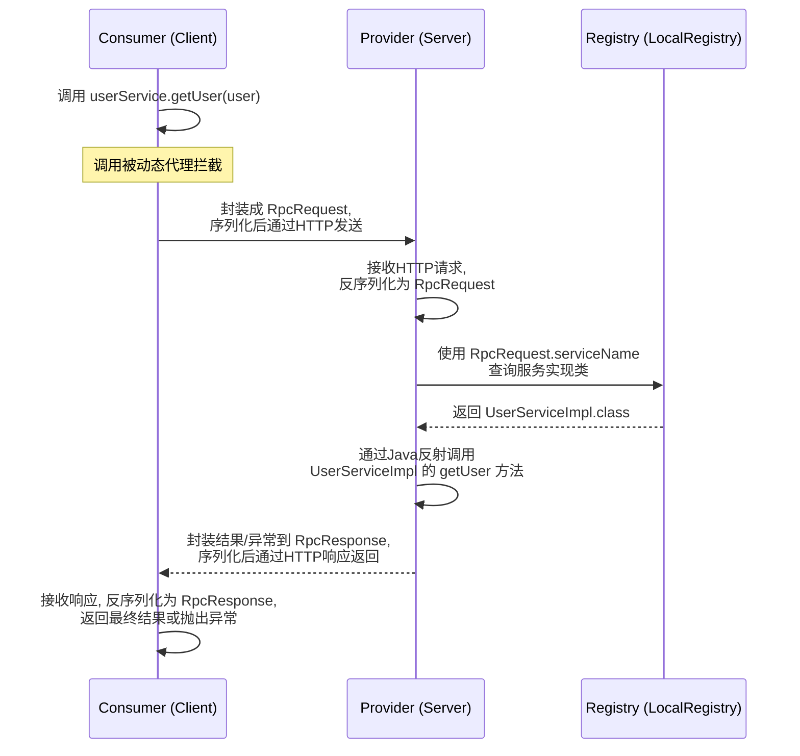
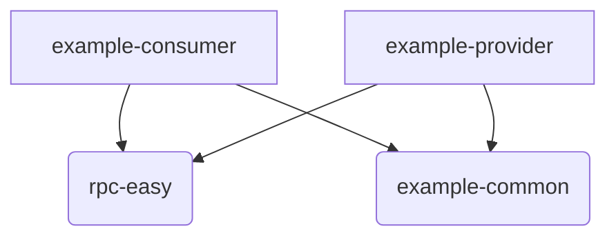

# learn-RPC 项目

## 引言

欢迎来到 `learn-RPC` 项目！这是一个为了帮助开发者、尤其是Java初学者理解远程过程调用（RPC）核心原理而构建的简易RPC框架。本项目通过一个清晰、精简的代码结构，展示了实现一个RPC框架所涉及的关键技术和设计思路。

本指南的目标读者是对RPC概念感到好奇，并希望通过一个实际项目来学习其内部工作机制的开发者。

项目主要包含四个模块：
-   `rpc-easy`: 核心的RPC框架实现。
-   `example-common`: 服务提供者与消费者之间共享的公共接口和模型。
-   `example-provider`: 一个如何暴露RPC服务的示例。
-   `example-consumer`: 一个如何调用RPC服务的示例。

## 核心架构设计

本RPC框架采用了一个经典的客户端-服务器（Client-Server）架构。其核心设计理念在于将远程方法调用伪装成一次本地方法调用，对上层使用者屏蔽底层的网络通信细节。

### RPC 调用流程图

下面的流程图清晰地展示了从服务消费者发起请求到服务提供者返回响应的完整过程：

### 设计理念

-   **通信协议**: 框架选择简单且通用的 **HTTP** 作为底层通信协议。这使得调试和理解变得容易，因为其请求和响应可以使用常见的网络工具进行观察。
-   **动态代理**: 在客户端，我们利用 **Java 的动态代理 (`java.lang.reflect.Proxy`)** 技术。当消费者调用一个接口方法时，这个调用会被代理拦截，代理逻辑负责将调用信息（如服务名、方法名、参数）打包并通过网络发送出去，从而实现了对开发者的透明调用。
-   **服务注册**: 为了让服务器知道哪些服务可以被调用，我们实现了一个简单的 **本地服务注册中心 (`LocalRegistry`)**。服务提供者在启动时，会将自己的服务接口和具体实现类注册到这个注册中心。
-   **序列化**: 数据在网络中传输需要进行序列化和反序列化。本框架默认使用了 **Java 原生的序列化机制 (`JdkSerializer`)**，它能够方便地将Java对象转换为字节流。

## 模块详解

### 4.1 `rpc-easy` (核心框架)

这是整个项目的核心，它提供了实现RPC所需的所有基础能力。

-   **作用**: 封装RPC通信的底层细节，包括服务端的请求处理、客户端的代理生成和网络传输。
-   **关键组件**:
    -   `server`:
        -   `VertexHttpServer`: 基于 Vert.x 实现的HTTP服务器。
        -   `HttpServerHandler`: 核心的请求处理器。它负责接收请求、反序列化、查找服务、反射调用、序列化响应并最终返回给客户端。
    -   `client`:
        -   `ServiceProxyFactory`: 服务代理工厂，使用Java动态代理为服务接口生成代理对象。这是消费者能够进行透明调用的关键。
        -   `HttpClient`: 基于 Vert.x WebClient 实现的HTTP客户端，负责向服务端发送序列化后的RPC请求并接收响应。
    -   `registry`:
        -   `LocalRegistry`: 一个基于 `ConcurrentHashMap` 的简单内存式服务注册中心。服务提供者通过它来“发布”自己的服务。
    -   `protocol`:
        -   `Serializer`: 定义了序列化和反序列化的接口标准。
        -   `JdkSerializer`: `Serializer` 接口的默认实现，使用Java内置的序列化能力。
    -   `model`:
        -   `RpcRequest`: 定义了RPC请求的数据结构，包含了服务名、方法名、参数类型和参数值等信息。
        -   `RpcResponse`: 定义了RPC响应的数据结构，包含了正常返回的数据、异常信息等。

### 4.2 `example-common` (公共模块)

-   **作用**: 存放了服务提供者和消费者都需要依赖的公共代码，避免了代码重复。
-   **关键组件**:
    -   `UserService.java`: 定义了服务接口，这是客户端和服务端之间的“契约”。
    -   `User.java`: 定义了数据传输模型（DTO）。

### 4.3 `example-provider` (服务提供者示例)

-   **作用**: 演示了如何使用 `rpc-easy` 框架来发布一个RPC服务。
-   **启动流程**:
    1.  在 `EasyProviderExample` 的 `main` 方法中，首先将 `UserService` 接口和它的实现类 `UserServiceImpl` 注册到 `LocalRegistry` 中。
    2.  然后，创建并启动 `VertexHttpServer`，在指定端口（如8081）上监听进来的RPC请求。

### 4.4 `example-consumer` (服务消费者示例)

-   **作用**: 演示了如何调用一个远程RPC服务。
-   **调用流程**:
    1.  在 `EasyConsumerExample` 的 `main` 方法中，通过 `ServiceProxyFactory.getProxy(UserService.class)` 获取 `UserService` 接口的代理对象。
    2.  然后，像调用一个本地方法一样，直接使用该代理对象调用 `getUser` 方法。所有复杂的网络通信和序列化工作都由代理对象在底层自动完成。

## 模块关系

### 依赖关系图

### 关系说明

-   `consumer` 和 `provider` 都需要知道服务接口 (`UserService`) 和数据模型 (`User`) 是什么，因此它们都依赖于 `common` 模块。
-   `consumer` 和 `provider` 都需要使用RPC框架的核心功能（如代理、服务器、注册中心等），因此它们都依赖于 `rpc-easy` 模块。

## 如何运行

1.  **启动服务提供者**:
    -   找到 `example-provider` 模块下的 `EasyProviderExample.java` 类。
    -   运行它的 `main` 方法。
    -   控制台将显示 "Server is now listening on port 8081"，表示服务已成功启动。
2.  **启动服务消费者**:
    -   找到 `example-consumer` 模块下的 `EasyConsumerExample.java` 类。
    -   运行它的 `main` 方法。
    -   控制台将显示一次RPC调用的全过程，并最终打印出从服务端返回的结果 "返回结果：张三"。

## 总结与展望

`learn-RPC` 项目通过最少的代码实现了一个功能完备的RPC框架，核心知识点包括：

-   Java动态代理
-   Java反射机制
-   基于Vert.x的HTTP服务器和客户端
-   Java序列化

为了让这个框架更强大，未来可以从以下几个方面进行扩展：
-   **可插拔的序列化**: 引入如 `Kryo`, `Hessian` 等更高性能的序列化库。
-   **可插拔的注册中心**: 对接 `ZooKeeper`, `Nacos` 等专业的注册中心，以支持服务自动发现和治理。
-   **负载均衡**: 当一个服务有多个提供者时，在客户端实现负载均衡策略（如轮询、随机等）。
-   **配置中心**: 将RPC框架的配置（如端口、超时时间等）外部化，方便管理。 