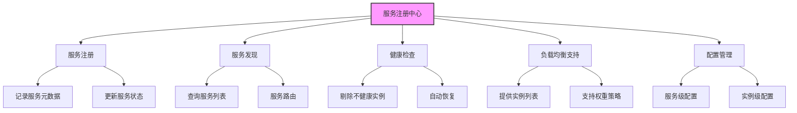
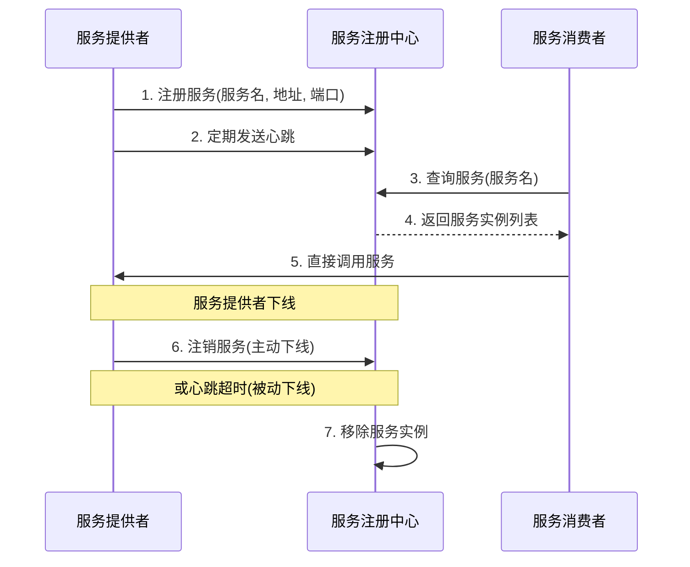
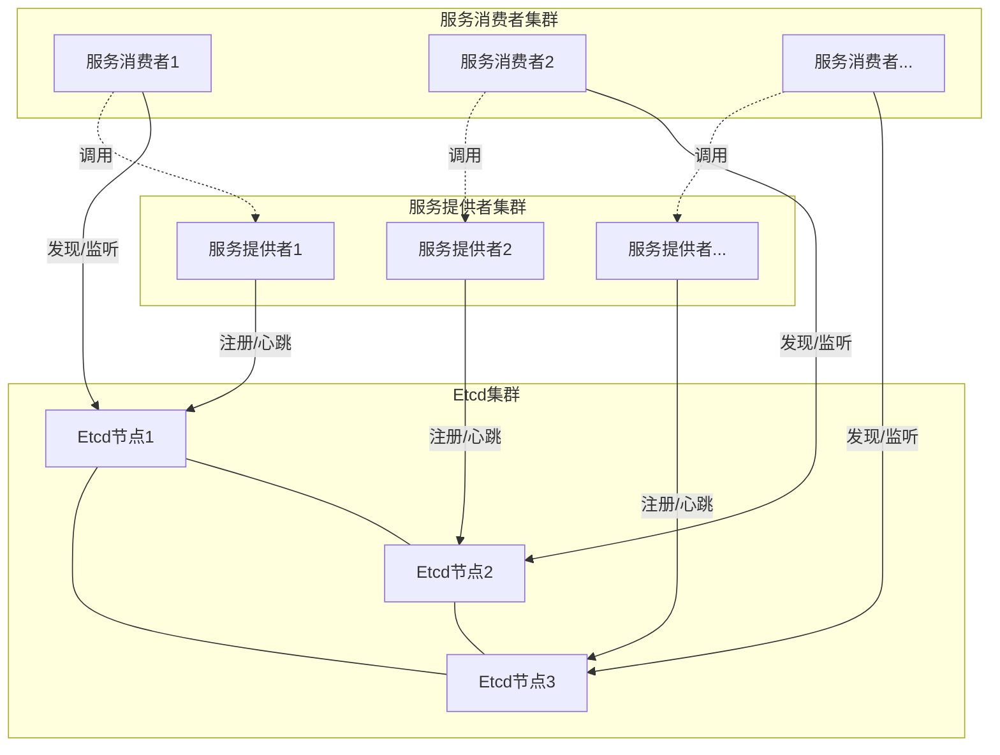
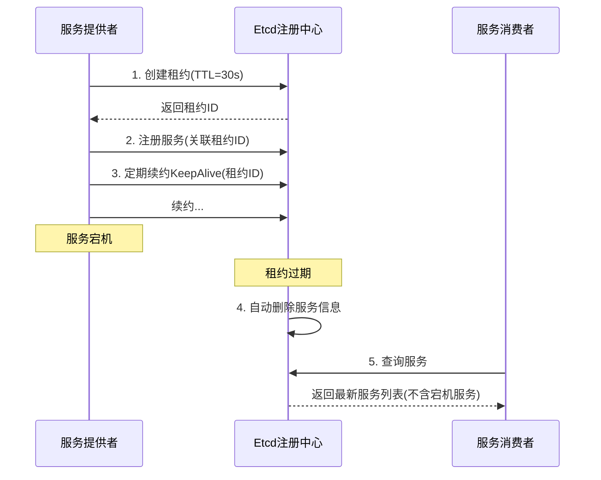
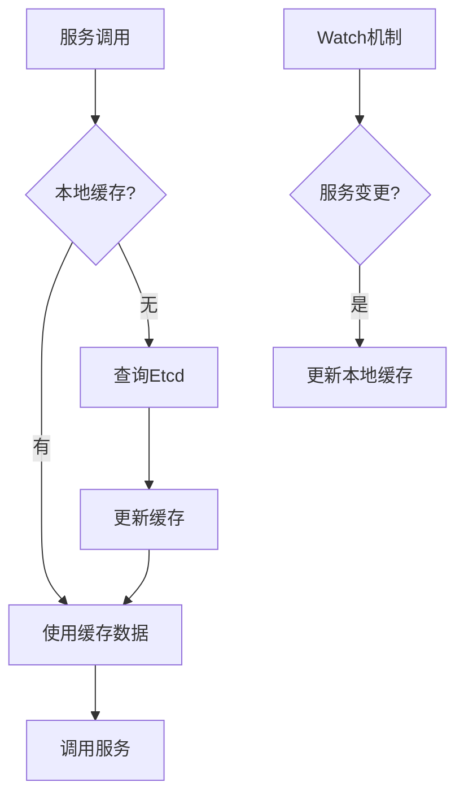

# 服务注册中心原理与实现

## 问题

> 项目中的服务注册中心有什么作用？是基于什么技术实现的？

## 引言

在分布式RPC框架中，服务注册中心是一个核心组件，它解决了分布式环境下服务定位与发现的关键问题。随着微服务架构的广泛应用，服务实例数量剧增，服务部署位置也经常变动，如何让服务消费者能够准确、高效地找到服务提供者，成为分布式系统必须解决的问题。本文将详细介绍服务注册中心的原理与实现方式。

## 服务注册中心的基本概念

### 什么是服务注册中心

服务注册中心是分布式系统中的一个独立组件，用于记录和管理服务的注册信息，使服务消费者能够动态发现服务提供者的网络位置。它充当服务提供者和服务消费者之间的协调者，解耦了服务之间的直接依赖。

### 服务注册中心的核心功能



1. **服务注册**：服务提供者启动时，将自己的网络地址、服务接口等信息注册到注册中心
2. **服务发现**：服务消费者根据服务名称从注册中心获取可用的服务实例列表
3. **健康检查**：定期检测服务实例的健康状态，剔除不可用的服务实例
4. **负载均衡支持**：为服务消费者提供必要的信息，以便进行负载均衡
5. **配置管理**：存储和分发服务相关的配置信息

### 服务注册中心工作原理



上图展示了服务注册中心的基本工作流程：

1. 服务提供者启动时向注册中心注册自己的服务信息
2. 服务提供者定期向注册中心发送心跳，表明自己处于可用状态
3. 服务消费者从注册中心查询所需服务的实例列表
4. 注册中心返回符合条件的服务实例信息
5. 服务消费者根据获取的信息直接调用服务提供者
6. 服务提供者下线时主动通知注册中心注销服务
7. 如果服务提供者异常宕机，注册中心通过心跳超时机制检测到并移除相应服务实例

## 本地注册中心实现

在我们的RPC框架中，首先实现了一个简单的本地注册中心（LocalRegistry），它主要用于单机环境下的服务注册和发现。

### LocalRegistry实现分析

LocalRegistry使用ConcurrentHashMap作为内存存储，提供了服务的注册、查询和注销功能：

```java
public class LocalRegistry {
    private static final Map<String, Class<?>> map = new ConcurrentHashMap<>();

    // 注册服务
    public static void register(String serviceName, Class<?> implClass) {
        System.out.println("注册服务: " + serviceName + " -> " + implClass.getName());
        map.put(serviceName, implClass);
    }

    // 获取服务
    public static Class<?> get(String serviceName) {
        Class<?> implClass = map.get(serviceName);
        if (implClass == null) {
            System.out.println("未找到服务: " + serviceName);
        }
        return implClass;
    }

    // 注销服务
    public static void remove(String serviceName) {
        map.remove(serviceName);
    }
    
    // 列出所有已注册的服务
    public static Set<String> listServices() {
        return map.keySet();
    }
}
```

### 本地注册中心的局限性

本地注册中心虽然实现简单，但存在明显的局限性：

1. **单点故障**：注册信息只存储在单个JVM内存中，程序重启后数据丢失
2. **无法跨进程共享**：不同进程无法共享注册数据
3. **不支持分布式场景**：无法满足分布式系统的服务发现需求
4. **缺乏健康检查**：不具备服务健康状态的监控能力

因此，在实际的分布式环境下，我们需要使用更强大的分布式服务注册中心。

## 基于Etcd的服务注册中心设计

为了满足分布式环境的需求，我们选择使用Etcd实现分布式服务注册中心。

### 为什么选择Etcd

Etcd是一个分布式、可靠的键值存储系统，具有以下优势：

1. **强一致性**：基于Raft算法，保证数据的一致性
2. **可靠性高**：支持集群部署，避免单点故障
3. **易于使用**：提供简洁的HTTP/gRPC API
4. **Watch机制**：支持数据变更实时通知
5. **TTL特性**：支持键值自动过期，便于实现健康检查
6. **原子操作**：支持事务操作，保证数据一致性

### 架构设计

基于Etcd的服务注册中心架构如下：



### 数据模型设计

在Etcd中，我们采用以下方式组织服务数据：

1. **键设计**：使用层次化的键结构，方便管理和查询
   ```
   /services/{serviceName}/{serviceInstanceId}
   ```

2. **值设计**：服务实例信息序列化为JSON存储
   ```json
   {
     "id": "instance-001",
     "name": "userService",
     "address": "192.168.1.100",
     "port": 8080,
     "version": "1.0.0",
     "protocol": "http",
     "status": "UP",
     "metadata": {
       "weight": 100,
       "tags": ["master", "v1"]
     },
     "timestamp": 1617235200000
   }
   ```

### 核心接口设计

首先，我们设计服务注册中心的核心接口：

```java
public interface Registry {
    /**
     * 注册服务
     * @param serviceInstance 服务实例信息
     */
    void register(ServiceInstance serviceInstance);
    
    /**
     * 注销服务
     * @param serviceInstance 服务实例信息
     */
    void unregister(ServiceInstance serviceInstance);
    
    /**
     * 发现服务
     * @param serviceName 服务名称
     * @return 服务实例列表
     */
    List<ServiceInstance> discover(String serviceName);
    
    /**
     * 订阅服务变更
     * @param serviceName 服务名称
     * @param listener 变更监听器
     */
    void subscribe(String serviceName, ServiceChangeListener listener);
    
    /**
     * 取消订阅
     * @param serviceName 服务名称
     * @param listener 变更监听器
     */
    void unsubscribe(String serviceName, ServiceChangeListener listener);
    
    /**
     * 关闭注册中心客户端
     */
    void close();
}
```

### 服务实例模型

```java
public class ServiceInstance {
    private String id;         // 实例唯一标识
    private String name;       // 服务名称
    private String address;    // 服务地址
    private int port;          // 服务端口
    private String version;    // 服务版本
    private String protocol;   // 服务协议
    private String status;     // 服务状态
    private Map<String, String> metadata; // 元数据
    private long timestamp;    // 注册时间戳
    
    // getter, setter 和其他必要方法
}
```

### 基于Etcd的注册中心实现

下面是基于Etcd实现的注册中心核心代码示例：

```java
public class EtcdRegistry implements Registry {
    private static final String SERVICE_PREFIX = "/services/";
    private static final long DEFAULT_TTL = 30; // 租约TTL，单位秒
    
    private final Client etcdClient;
    private final long ttl;
    private final Map<String, Lease> serviceLeases;
    private final Map<String, List<ServiceChangeListener>> listeners;
    
    public EtcdRegistry(String[] endpoints) {
        this(endpoints, DEFAULT_TTL);
    }
    
    public EtcdRegistry(String[] endpoints, long ttl) {
        this.etcdClient = Client.builder()
                .endpoints(endpoints)
                .build();
        this.ttl = ttl;
        this.serviceLeases = new ConcurrentHashMap<>();
        this.listeners = new ConcurrentHashMap<>();
    }
    
    @Override
    public void register(ServiceInstance serviceInstance) {
        try {
            // 创建租约
            Lease lease = etcdClient.getLeaseClient();
            LeaseGrantResponse leaseResponse = lease.grant(ttl).get();
            long leaseId = leaseResponse.getID();
            
            // 存储租约信息
            serviceLeases.put(serviceInstance.getId(), lease);
            
            // 构建服务实例键值
            String serviceKey = buildServiceKey(serviceInstance);
            ByteSequence key = ByteSequence.from(serviceKey, StandardCharsets.UTF_8);
            ByteSequence value = ByteSequence.from(
                    objectMapper.writeValueAsString(serviceInstance), StandardCharsets.UTF_8);
            
            // 将服务信息关联到租约并存储
            KV kvClient = etcdClient.getKVClient();
            kvClient.put(key, value, PutOption.newBuilder().withLeaseId(leaseId).build()).get();
            
            // 设置租约自动续约
            lease.keepAlive(leaseId, new StreamObserver<LeaseKeepAliveResponse>() {
                @Override
                public void onNext(LeaseKeepAliveResponse response) {
                    // 续约成功
                }
                
                @Override
                public void onError(Throwable throwable) {
                    // 续约失败，尝试重新注册
                    reRegister(serviceInstance);
                }
                
                @Override
                public void onCompleted() {
                    // 完成
                }
            });
            
            System.out.println("服务注册成功: " + serviceInstance.getName() + 
                    "(" + serviceInstance.getId() + ")");
        } catch (Exception e) {
            throw new RuntimeException("服务注册失败", e);
        }
    }
    
    @Override
    public void unregister(ServiceInstance serviceInstance) {
        try {
            // 删除服务实例信息
            String serviceKey = buildServiceKey(serviceInstance);
            ByteSequence key = ByteSequence.from(serviceKey, StandardCharsets.UTF_8);
            etcdClient.getKVClient().delete(key).get();
            
            // 取消租约
            Lease lease = serviceLeases.remove(serviceInstance.getId());
            if (lease != null) {
                lease.revoke(lease.getLeaseID()).get();
            }
            
            System.out.println("服务注销成功: " + serviceInstance.getName() + 
                    "(" + serviceInstance.getId() + ")");
        } catch (Exception e) {
            throw new RuntimeException("服务注销失败", e);
        }
    }
    
    @Override
    public List<ServiceInstance> discover(String serviceName) {
        try {
            // 构建服务前缀
            String servicePrefix = SERVICE_PREFIX + serviceName + "/";
            ByteSequence prefixKey = ByteSequence.from(servicePrefix, StandardCharsets.UTF_8);
            
            // 查询所有匹配的服务实例
            GetResponse response = etcdClient.getKVClient().get(
                    prefixKey, GetOption.newBuilder().withPrefix(prefixKey).build()).get();
            
            List<ServiceInstance> instances = new ArrayList<>();
            for (KeyValue kv : response.getKvs()) {
                String value = kv.getValue().toString(StandardCharsets.UTF_8);
                ServiceInstance instance = objectMapper.readValue(value, ServiceInstance.class);
                instances.add(instance);
            }
            
            return instances;
        } catch (Exception e) {
            throw new RuntimeException("服务发现失败", e);
        }
    }
    
    @Override
    public void subscribe(String serviceName, ServiceChangeListener listener) {
        // 获取指定服务的监听器列表，不存在则创建
        List<ServiceChangeListener> serviceListeners = listeners.computeIfAbsent(
                serviceName, k -> new CopyOnWriteArrayList<>());
        
        // 添加监听器
        if (!serviceListeners.contains(listener)) {
            serviceListeners.add(listener);
        }
        
        // 若首次订阅，则启动Watch
        if (serviceListeners.size() == 1) {
            watchServiceChange(serviceName);
        }
    }
    
    @Override
    public void unsubscribe(String serviceName, ServiceChangeListener listener) {
        List<ServiceChangeListener> serviceListeners = listeners.get(serviceName);
        if (serviceListeners != null) {
            serviceListeners.remove(listener);
            
            // 若无监听器，则取消Watch
            if (serviceListeners.isEmpty()) {
                listeners.remove(serviceName);
                // 取消Watch的具体实现
            }
        }
    }
    
    @Override
    public void close() {
        if (etcdClient != null) {
            etcdClient.close();
        }
    }
    
    // 启动服务变更监听
    private void watchServiceChange(String serviceName) {
        String servicePrefix = SERVICE_PREFIX + serviceName + "/";
        ByteSequence prefixKey = ByteSequence.from(servicePrefix, StandardCharsets.UTF_8);
        
        Watch watchClient = etcdClient.getWatchClient();
        watchClient.watch(prefixKey, WatchOption.newBuilder().withPrefix(prefixKey).build(), 
                new Watch.Listener() {
                    @Override
                    public void onNext(WatchResponse response) {
                        for (WatchEvent event : response.getEvents()) {
                            processWatchEvent(serviceName, event);
                        }
                    }
                    
                    @Override
                    public void onError(Throwable throwable) {
                        // 处理错误，可能需要重新建立监听
                    }
                    
                    @Override
                    public void onCompleted() {
                        // 监听完成
                    }
                });
    }
    
    // 处理监听事件
    private void processWatchEvent(String serviceName, WatchEvent event) {
        try {
            ServiceInstance instance = null;
            
            // 解析服务实例
            if (event.getEventType() == WatchEvent.EventType.PUT) {
                String value = event.getKeyValue().getValue().toString(StandardCharsets.UTF_8);
                instance = objectMapper.readValue(value, ServiceInstance.class);
            }
            
            // 通知所有监听器
            List<ServiceChangeListener> serviceListeners = listeners.get(serviceName);
            if (serviceListeners != null) {
                for (ServiceChangeListener listener : serviceListeners) {
                    if (event.getEventType() == WatchEvent.EventType.PUT) {
                        listener.onServiceInstanceAdded(instance);
                    } else if (event.getEventType() == WatchEvent.EventType.DELETE) {
                        String key = event.getKeyValue().getKey().toString(StandardCharsets.UTF_8);
                        String instanceId = extractInstanceId(key);
                        listener.onServiceInstanceRemoved(instanceId);
                    }
                }
            }
        } catch (Exception e) {
            System.err.println("处理服务变更事件失败: " + e.getMessage());
        }
    }
    
    // 从key中提取实例ID
    private String extractInstanceId(String key) {
        return key.substring(key.lastIndexOf("/") + 1);
    }
    
    // 构建服务键
    private String buildServiceKey(ServiceInstance instance) {
        return SERVICE_PREFIX + instance.getName() + "/" + instance.getId();
    }
    
    // 服务重新注册
    private void reRegister(ServiceInstance serviceInstance) {
        try {
            register(serviceInstance);
        } catch (Exception e) {
            System.err.println("服务重新注册失败: " + e.getMessage());
            // 可以实现重试机制
        }
    }
}
```

### 服务变更监听接口

```java
public interface ServiceChangeListener {
    /**
     * 服务实例增加时回调
     * @param serviceInstance 新增的服务实例
     */
    void onServiceInstanceAdded(ServiceInstance serviceInstance);
    
    /**
     * 服务实例移除时回调
     * @param instanceId 被移除的服务实例ID
     */
    void onServiceInstanceRemoved(String instanceId);
}
```

## 实现中的关键问题与解决方案

### 1. 服务健康检查

在基于Etcd的注册中心实现中，我们利用Etcd的租约（Lease）机制实现健康检查：



这种机制有以下优势：
- **简单高效**：无需额外的健康检查组件
- **自动清理**：服务异常宕机后，租约到期自动清除
- **优雅下线**：服务主动下线时可以释放租约

### 2. 服务信息缓存

为了提高性能并减轻Etcd的压力，服务消费者应该实现本地缓存：



缓存策略：
- **初始化加载**：首次使用服务时从Etcd加载并缓存
- **Watch机制**：监听服务变更实时更新缓存
- **定期刷新**：设置缓存过期时间，定期全量刷新

### 3. 高可用保障

为了保证注册中心的高可用，我们采取以下措施：

1. **Etcd集群部署**：通常部署3-5个节点的Etcd集群
2. **客户端连接多个节点**：配置多个Etcd节点地址
3. **自动重连机制**：连接断开后自动尝试重连
4. **操作超时与重试**：设置合理的操作超时时间和重试策略

```java
// Etcd客户端高可用配置示例
Client client = Client.builder()
    .endpoints("http://etcd1:2379", "http://etcd2:2379", "http://etcd3:2379")
    .retryMaxDuration(Duration.ofSeconds(10))
    .retryDelay(100)  // 初始重试延迟(ms)
    .retryMaxDelay(1000) // 最大重试延迟(ms)
    .build();
```

### 4. 一致性保证

Etcd基于Raft共识算法，提供了强一致性保证。在使用时，我们可以：

1. **利用事务操作**：确保复杂操作的原子性
2. **指定操作隔离级别**：根据需求选择合适的隔离级别
3. **乐观锁机制**：使用ModRevision实现乐观锁

```java
// 使用事务确保操作原子性示例
Txn txn = kvClient.txn();
txn.If(
    // 如果key不存在
    Compare.createRevision(key, CompareTarget.EQUAL, 0)
).Then(
    // 则创建key
    Op.put(key, value, PutOption.DEFAULT)
).Else(
    // 否则获取现有值
    Op.get(key, GetOption.DEFAULT)
).commit();
```

## 本地注册中心与Etcd注册中心对比

|  特性  | 本地注册中心 | Etcd注册中心 |
|--------|-------------|-------------|
| 部署复杂度 | 简单，无需额外部署 | 需要部署Etcd集群 |
| 适用场景 | 单机、开发测试 | 分布式生产环境 |
| 服务发现 | 进程内直接获取 | 跨进程、跨网络 |
| 可靠性 | 低，单点故障 | 高，集群容错 |
| 一致性 | 仅进程内一致 | 分布式一致性 |
| 健康检查 | 无内置机制 | 基于租约自动检查 |
| 数据持久化 | 内存，不持久 | 持久化存储 |
| 通知机制 | 无 | Watch实时通知 |
| 扩展性 | 有限 | 良好 |

## 总结

服务注册中心是分布式RPC框架中的关键组件，它解决了服务发现的核心问题。在本项目中，我们首先实现了简单的本地注册中心，适用于开发和测试环境；对于生产环境，我们设计了基于Etcd的分布式服务注册中心，利用Etcd的强一致性、高可用性和实时通知能力，为RPC框架提供可靠的服务注册发现功能。

通过合理的接口设计和实现，我们的服务注册中心可以支持服务的动态上下线、自动健康检查，并为负载均衡提供必要的信息，满足了微服务架构中服务治理的基本需求。 