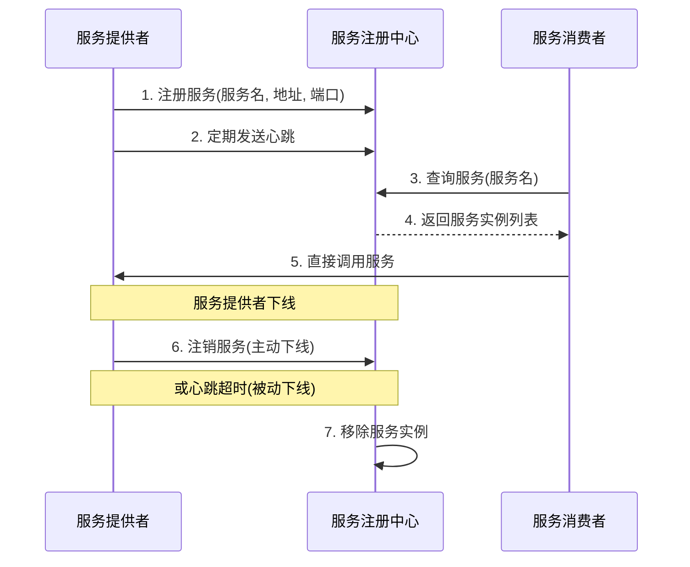

# Ming RPC Framework 服务注册中心原理与实现详解

## 📖 概述

服务注册中心是分布式RPC框架的核心基础设施，负责服务的注册、发现、健康检查和配置管理。Ming RPC Framework实现了一套完整的、可扩展的服务注册中心体系，支持多种注册中心实现，通过SPI机制实现动态扩展。

## 🎯 服务注册中心的作用

### 核心价值
1. **服务发现**: 让服务消费者能够动态发现服务提供者的网络位置
2. **服务注册**: 服务提供者启动时自动注册到注册中心
3. **健康检查**: 定期检测服务实例的健康状态，剔除不可用实例
4. **负载均衡支持**: 为负载均衡器提供可用服务实例列表
5. **配置管理**: 集中管理服务相关的配置信息

### 在RPC中的位置
```
服务提供者 → 服务注册 → 注册中心 ← 服务发现 ← 服务消费者
```

## 🏗️ 架构设计

### 接口定义
**文件路径**: `rpc-core/src/main/java/com/ming/rpc/registry/Registry.java`

```java
public interface Registry {
    /**
     * 初始化
     * @param registryConfig 注册中心配置
     */
    void init(RegistryConfig registryConfig);

    /**
     * 注册服务，服务端
     * @param serviceMetaInfo 服务元信息
     */
    void register(ServiceMetaInfo serviceMetaInfo) throws Exception;

    /**
     * 注销服务，服务端
     * @param serviceMetaInfo 服务元信息
     */
    void unregister(ServiceMetaInfo serviceMetaInfo);

    /**
     * 服务发现（获取某服务所有节点，消费端）
     * @param serviceKey 服务键名
     * @return
     */
    List<ServiceMetaInfo> serviceDiscovery(String serviceKey);

    /**
     * 心跳检测 （ 服务端）
     */
    void heartbeat();

     /**
      * 监听（消费端)
      * @param serviceNodeKey
      */
      void watch(String serviceNodeKey);

      /**
       * 服务销毁
       */
      void destroy();
}
```

### 服务元信息模型
**文件路径**: `rpc-core/src/main/java/com/ming/rpc/model/ServiceMetaInfo.java`

```java
@Data
public class ServiceMetaInfo implements Serializable {
    /**
     * 服务名称
     */
    private String serviceName;

    /**
     * 服务版本号
     */
    private String serviceVersion = RpcConstant.DEFAULT_SERVICE_VERSION;

    /**
     * 服务域名
     */
    private String serviceHost;

    /**
     * 服务端口
     */
    private Integer servicePort;

    /**
     * 服务分组（暂未实现）
     */
    private String serviceGroup = "default";

    /**
     * 获取服务键名
     */
    public String getServiceKey() {
        return String.format("%s:%s", serviceName, serviceVersion);
    }

    /**
     * 获取服务注册节点键名
     */
    public String getServiceNodeKey() {
        return String.format("%s/%s:%s", getServiceKey(), serviceHost, servicePort);
    }

    /**
     * 获取完整服务地址
     */
    public String getServiceAddress() {
        if(!StrUtil.contains(serviceHost, "http")) {
            return String.format("http://%s:%s", serviceHost, servicePort);
        }
        return String.format("%s:%s", serviceHost, servicePort);
    }
}
```

### 服务注册中心工作原理



上图展示了服务注册中心的基本工作流程：

1. 服务提供者启动时向注册中心注册自己的服务信息
2. 服务提供者定期向注册中心发送心跳，表明自己处于可用状态
3. 服务消费者从注册中心查询所需服务的实例列表
4. 注册中心返回符合条件的服务实例信息
5. 服务消费者根据获取的信息直接调用服务提供者
6. 服务提供者下线时主动通知注册中心注销服务
7. 如果服务提供者异常宕机，注册中心通过心跳超时机制检测到并移除相应服务实例

## 🔧 注册中心实现

### 1. ETCD注册中心
**文件路径**: `rpc-core/src/main/java/com/ming/rpc/registry/EtcdRegistry.java`

```java
public class EtcdRegistry implements Registry {
    private Client client;
    private KV kvClient;
    private static final String ETCD_ROOT_PATH = "/rpc/";

    @Override
    public void init(RegistryConfig registryConfig) {
        client = Client.builder()
                .endpoints(registryConfig.getAddress())
                .connectTimeout(Duration.ofMillis(registryConfig.getTimeout()))
                .build();
        kvClient = client.getKVClient();
        heartbeat();
    }

    @Override
    public void register(ServiceMetaInfo serviceMetaInfo) throws Exception {
        // 创建Lease 和KV 客户端
        Lease leaseClient = client.getLeaseClient();

        // 创建一个30秒的租约
        long leaseId = leaseClient.grant(30).get().getID();

        // 设置要存储的键值对
        String registerKey = ETCD_ROOT_PATH + serviceMetaInfo.getServiceNodeKey();
        ByteSequence key = ByteSequence.from(registerKey, StandardCharsets.UTF_8);
        ByteSequence value = ByteSequence.from(JSONUtil.toJsonStr(serviceMetaInfo), StandardCharsets.UTF_8);

        // 将键值对与租约关联起来，并设置过期时间
        PutOption putOption = PutOption.builder().withLeaseId(leaseId).build();
        kvClient.put(key, value, putOption).get();
        // 添加节点信息到本地缓存
        localRegisterNodeKeySet.add(registerKey);
    }

    @Override
    public List<ServiceMetaInfo> serviceDiscovery(String serviceKey) {
        // 优先从缓存获取服务
        List<ServiceMetaInfo> cachedServiceMetaInfoList = registryServiceMultiCache.readCache(serviceKey);
        if(cachedServiceMetaInfoList != null){
            return cachedServiceMetaInfoList;
        }

        // 前缀搜索，结尾一定要加 '/'
        String searchPrefix = ETCD_ROOT_PATH + serviceKey + "/";

        try {
            // 前缀搜索
            GetOption getOption = GetOption.builder().isPrefix(true).build();
            List<KeyValue> keyValues = kvClient.get(ByteSequence.from(searchPrefix, StandardCharsets.UTF_8), getOption).get().getKvs();
            // 解析服务信息
            List<ServiceMetaInfo> serviceMetaInfoList = keyValues.stream()
            .map(keyValue -> {
                String key = keyValue.getKey().toString(StandardCharsets.UTF_8);
                // 监听KEY的变化
                watch(key);
                // 解析服务信息
                String value = keyValue.getValue().toString(StandardCharsets.UTF_8);
                return JSONUtil.toBean(value, ServiceMetaInfo.class);
            }).collect(Collectors.toList());
            // 写入服务缓存
            registryServiceMultiCache.writeCache(serviceKey, serviceMetaInfoList);
            return serviceMetaInfoList;
        } catch (Exception e) {
            throw new RuntimeException("服务发现失败", e);
        }
    }
}
```

**特点**:
- ✅ 高性能，低延迟的分布式键值存储
- ✅ 基于Raft算法保证强一致性
- ✅ 支持TTL租约机制，自动清理过期服务
- ✅ 支持前缀搜索和Watch监听
- ❌ 需要额外部署ETCD集群

**适用场景**: 高性能要求、强一致性需求的生产环境
### 2. ZooKeeper注册中心
**文件路径**: `rpc-core/src/main/java/com/ming/rpc/registry/ZooKeeperRgistry.java`

```java
public class ZooKeeperRgistry implements Registry {
    private CuratorFramework client;
    private ServiceDiscovery<ServiceMetaInfo> serviceDiscovery;
    private final Set<String> localRegisterNodeKeySet = new ConcurrentHashSet<>();
    private final RegistryServiceCache registryServiceCache = new RegistryServiceCache();

    @Override
    public void init(RegistryConfig registryConfig) {
        // 构建客户端
        client = CuratorFrameworkFactory
                .builder()
                .connectString(registryConfig.getAddress())
                .retryPolicy(new ExponentialBackoffRetry(Math.toIntExact(registryConfig.getTimeout()), 3))
                .build();

        // 构建 serviceDiscovery 实例
        serviceDiscovery = ServiceDiscoveryBuilder.builder(ServiceMetaInfo.class)
                .client(client)
                .basePath(ZK_ROOT_PATH)
                .serializer(JsonInstanceSerializer.forType(ServiceMetaInfo.class))
                .build();

        try {
            // 启动客户端和服务发现
            client.start();
            serviceDiscovery.start();
        } catch (Exception e) {
            throw new RuntimeException(e);
        }
    }

    @Override
    public void register(ServiceMetaInfo serviceMetaInfo) throws Exception {
        // 注册到 ZK 中
        serviceDiscovery.registerService(buildServiceInstance(serviceMetaInfo));

        // 添加节点信息到本地缓存
        String serviceNodeKey = buildServiceNodeKey(serviceMetaInfo);
        localRegisterNodeKeySet.add(serviceNodeKey);
    }

    @Override
    public List<ServiceMetaInfo> serviceDiscovery(String serviceKey) {
        // 优先从缓存获取
        List<ServiceMetaInfo> cachedServiceMetaInfoList = registryServiceCache.readCache(serviceKey);
        if (cachedServiceMetaInfoList != null) {
            return cachedServiceMetaInfoList;
        }
        // 缓存未命中，从注册中心读取并设置监听
        return discoverAndCache(serviceKey);
    }

    private List<ServiceMetaInfo> discoverAndCache(String serviceKey) {
        try {
            // 从注册中心读取
            Collection<ServiceInstance<ServiceMetaInfo>> serviceInstanceCollection = serviceDiscovery.queryForInstances(serviceKey);
            // 首次发现，建立监听
            watch(serviceKey);
            // 写入缓存
            List<ServiceMetaInfo> serviceMetaInfoList = serviceInstanceCollection.stream()
                    .map(ServiceInstance::getPayload)
                    .collect(Collectors.toList());
            registryServiceCache.writeCache(serviceKey, serviceMetaInfoList);
            return serviceMetaInfoList;
        } catch (Exception e) {
            throw new RuntimeException("获取服务列表失败", e);
        }
    }
}
```

**特点**:
- ✅ 成熟稳定，广泛应用于大数据生态
- ✅ 强一致性保证，基于ZAB协议
- ✅ 支持监听机制，实时感知服务变化
- ✅ 树形数据结构，便于管理
- ❌ 性能相对较低，运维复杂度高

**适用场景**: 对一致性要求极高的企业级应用

### 3. Mock注册中心 (测试用)
**文件路径**: `rpc-core/src/test/java/com/ming/rpc/registry/MockRegistry.java`

```java
public class MockRegistry implements Registry {
    private final Map<String, List<ServiceMetaInfo>> registryMap = new ConcurrentHashMap<>();

    @Override
    public void init(RegistryConfig registryConfig) {
        // Mock 注册中心无需初始化
    }

    @Override
    public void register(ServiceMetaInfo serviceMetaInfo) throws Exception {
        List<ServiceMetaInfo> serviceMetaInfos = registryMap.getOrDefault(serviceMetaInfo.getServiceKey(), new ArrayList<>());
        serviceMetaInfos.add(serviceMetaInfo);
        registryMap.put(serviceMetaInfo.getServiceKey(), serviceMetaInfos);
    }

    @Override
    public void unregister(ServiceMetaInfo serviceMetaInfo) {
        List<ServiceMetaInfo> serviceMetaInfos = registryMap.getOrDefault(serviceMetaInfo.getServiceKey(), new ArrayList<>());
        serviceMetaInfos.remove(serviceMetaInfo);
        registryMap.put(serviceMetaInfo.getServiceKey(), serviceMetaInfos);
    }

    @Override
    public List<ServiceMetaInfo> serviceDiscovery(String serviceKey) {
        return registryMap.getOrDefault(serviceKey, new ArrayList<>());
    }

    @Override
    public void destroy() {
        registryMap.clear();
    }

    @Override
    public void heartbeat() {
        // 测试无需心跳
    }

    @Override
    public void watch(String serviceNodeKey) {
        // 测试无需监听
    }
}
```

**特点**:
- ✅ 轻量级，无需外部依赖
- ✅ 适用于单元测试和开发环境
- ✅ 实现简单，启动快速
- ❌ 仅内存存储，重启后数据丢失
- ❌ 不支持分布式场景

**适用场景**: 单元测试、开发环境、演示环境

## 🏭 工厂模式与SPI机制

### 注册中心工厂
**文件路径**: `rpc-core/src/main/java/com/ming/rpc/registry/RegistryFactory.java`

```java
public class RegistryFactory {
    static {
        SpiLoader.load(Registry.class);
    }

    /**
     * 默认注册中心
     */
    private static final Registry DEFAULT_REGISTRY = new EtcdRegistry();

    /**
     * 获取实例
     * @param key 注册中心类型
     * @return 注册中心
     */
    public static Registry getInstance(String key) {
        return SpiLoader.getInstance(Registry.class, key);
    }
}
```

### 注册中心常量
**文件路径**: `rpc-core/src/main/java/com/ming/rpc/registry/RegistryKeys.java`

```java
public interface RegistryKeys {
    String ETCD = "etcd";
    String ZOOKEEPER = "zookeeper";
    String CONSUL = "consul";
    String REDIS = "redis";
    String NACOS = "nacos";
}
```

### SPI配置文件
**文件路径**: `rpc-core/src/main/resources/META-INF/rpc/system/com.ming.rpc.registry.Registry`

```
etcd=com.ming.rpc.registry.EtcdRegistry
zookeeper=com.ming.rpc.registry.ZooKeeperRgistry
consul=com.ming.rpc.registry.ConsulRegistry
redis=com.ming.rpc.registry.RedisRegistry
nacos=com.ming.rpc.registry.NacosRegistry
```

## 🧪 测试验证

### 注册中心测试
**文件路径**: `rpc-core/src/test/java/com/ming/rpc/registry/`

项目为每个注册中心都提供了完整的测试用例：

1. **EtcdRegistryTest** - ETCD注册中心测试
2. **ZooKeeperRegistryTest** - ZooKeeper注册中心测试
3. **MockRegistryTest** - Mock注册中心测试

### 测试示例
```java
@Test
public void testRegisterAndDiscover() {
    // Given
    ServiceMetaInfo serviceMetaInfo = new ServiceMetaInfo();
    serviceMetaInfo.setServiceName("testService");
    serviceMetaInfo.setServiceVersion("1.0");
    serviceMetaInfo.setServiceHost("localhost");
    serviceMetaInfo.setServicePort(8080);

    // When
    registry.register(serviceMetaInfo);
    List<ServiceMetaInfo> discoveredServices = registry.serviceDiscovery(serviceMetaInfo.getServiceKey());

    // Then
    assertEquals(1, discoveredServices.size());
    assertEquals(serviceMetaInfo.getServiceName(), discoveredServices.get(0).getServiceName());
}
```
## 📊 注册中心对比

基于项目实际支持的注册中心对比：

| 注册中心 | 一致性模型 | 性能 | 运维复杂度 | 生态支持 | 适用场景 |
|---------|-----------|------|-----------|----------|----------|
| ETCD    | CP        | 高   | 中等      | 好       | 高性能、强一致性 |
| ZooKeeper | CP      | 中等 | 高        | 极好     | 企业级、大数据 |
| Mock    | -         | 极高 | 极低      | -        | 测试、开发 |
| 数据库  | ACID      | 低   | 中等      | 好       | 数据持久化 |

## 🔧 使用指南

### 配置注册中心
在RPC配置中指定注册中心：

```yaml
rpc:
  registry:
    type: etcd  # 可选: etcd, zookeeper, consul, redis, nacos
    address: http://localhost:2379
    timeout: 10000
    username: ""
    password: ""
```

### 代码中使用
```java
// 通过工厂获取注册中心
Registry registry = RegistryFactory.getInstance(RegistryKeys.ETCD);

// 初始化注册中心
RegistryConfig config = new RegistryConfig();
config.setAddress("http://localhost:2379");
registry.init(config);

// 注册服务
ServiceMetaInfo serviceMetaInfo = new ServiceMetaInfo();
serviceMetaInfo.setServiceName("UserService");
serviceMetaInfo.setServiceHost("localhost");
serviceMetaInfo.setServicePort(8080);
registry.register(serviceMetaInfo);

// 发现服务
List<ServiceMetaInfo> services = registry.serviceDiscovery("UserService:1.0");
```

## 🎯 最佳实践

### 1. 注册中心选择
- **生产环境**: 使用ETCD或ZooKeeper，保证高可用性
- **开发测试**: 使用Mock注册中心，快速启动
- **数据持久化**: 使用数据库注册中心，保证数据不丢失
- **大数据场景**: 使用ZooKeeper，与Hadoop生态集成

### 2. 性能优化
- 启用服务发现缓存，减少注册中心访问
- 合理设置心跳间隔，平衡实时性和性能
- 使用连接池管理注册中心连接

### 3. 高可用部署
- 注册中心集群部署，避免单点故障
- 配置多个注册中心地址，实现故障转移
- 定期备份注册中心数据

### 4. 监控和运维
- 监控注册中心的健康状态和性能指标
- 记录服务注册和发现的操作日志
- 设置告警机制，及时发现问题

## 📈 扩展开发

### 添加新的注册中心
1. 实现`Registry`接口
2. 在SPI配置文件中注册
3. 添加对应的测试用例
4. 更新注册中心常量

### 示例：添加Redis注册中心
```java
public class RedisRegistry implements Registry {
    @Override
    public void init(RegistryConfig registryConfig) {
        // Redis注册中心初始化
    }

    @Override
    public void register(ServiceMetaInfo serviceMetaInfo) throws Exception {
        // Redis注册中心注册实现
    }

    @Override
    public List<ServiceMetaInfo> serviceDiscovery(String serviceKey) {
        // Redis注册中心服务发现实现
    }
}
```

## 📋 总结

Ming RPC Framework的服务注册中心通过精心设计的架构，提供了完整、可靠的服务注册与发现解决方案：

### 核心优势
- ✅ **多种注册中心支持**: ETCD、ZooKeeper、Mock、数据库等多种实现
- ✅ **SPI机制扩展**: 通过SPI机制实现注册中心的动态加载和扩展
- ✅ **工厂模式管理**: 统一的注册中心工厂管理和创建
- ✅ **完善的测试**: 每个注册中心都有对应的测试用例验证
- ✅ **场景适配**: 针对不同场景提供最优的注册中心选择

### 技术特色
- **可插拔设计**: 通过接口抽象和SPI机制实现可插拔
- **服务缓存**: 支持多服务缓存，提高服务发现性能
- **心跳机制**: 自动心跳续约，保证服务实例的实时性
- **监听机制**: 支持服务变更监听，实时感知服务状态

Ming RPC Framework的服务注册中心为分布式RPC调用提供了强有力的基础设施支撑，确保了服务的可发现性和高可用性。