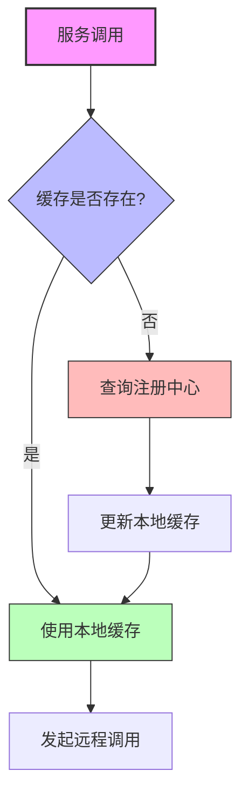
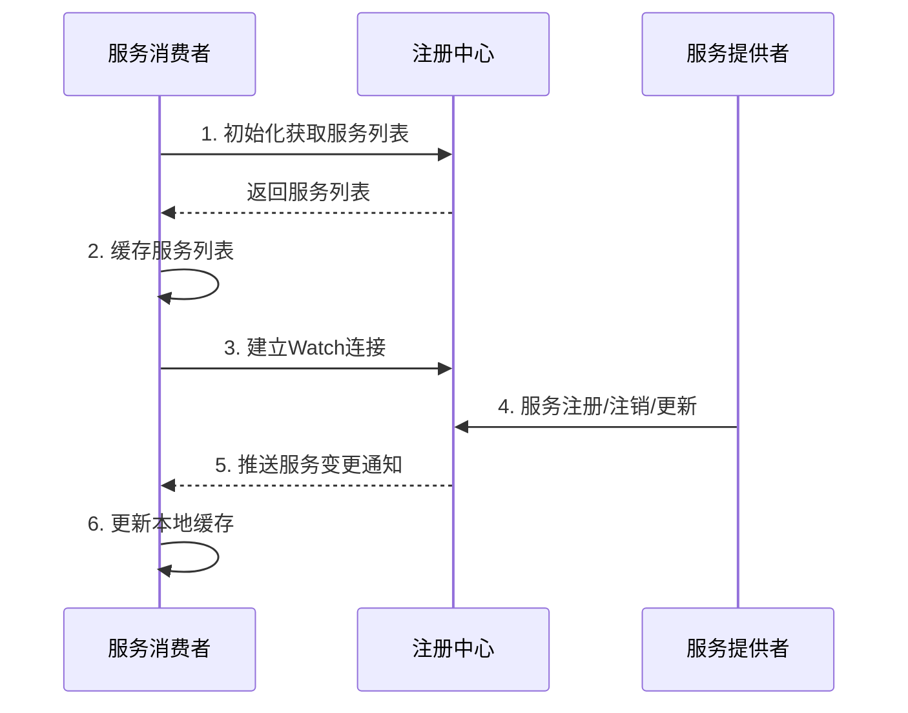
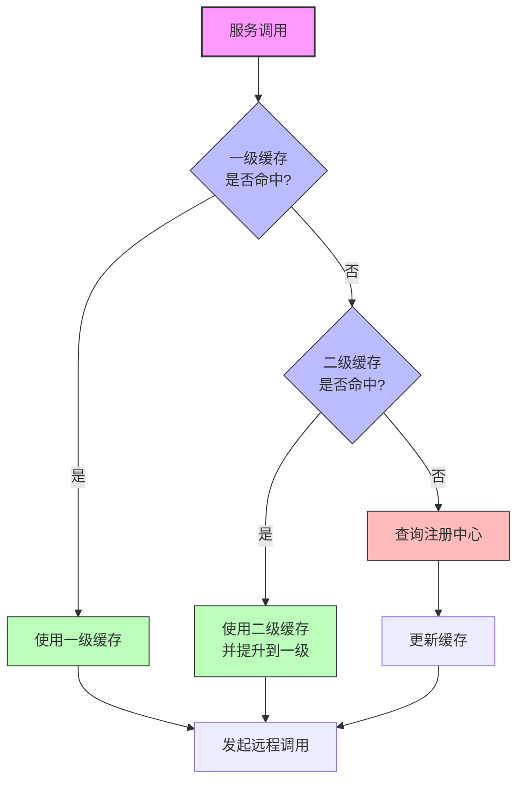

# 服务注册信息缓存优化

## 问题

> 服务消费者每次都要从注册中心获取服务注册信息么？有没有办法进行优化？

## 引言

在分布式RPC框架中，服务消费者需要从注册中心获取服务提供者的地址、端口等信息才能进行远程调用。如果每次发起RPC调用都直接查询注册中心，将带来以下问题：

1. **增加网络开销**：每次调用都需要与注册中心交互
2. **增加调用延迟**：查询注册中心会增加RPC调用的总耗时
3. **增加注册中心负载**：频繁的查询会给注册中心带来较大压力
4. **降低系统可用性**：当注册中心暂时不可用时，服务调用也会受到影响

因此，优化服务消费者获取服务注册信息的方式，对提高系统性能和可用性至关重要。

## 服务注册信息获取优化策略

### 1. 本地缓存机制

最基本也是最有效的优化手段是在服务消费者端实现本地缓存。



#### 工作流程

1. **首次调用**：从注册中心获取完整的服务提供者列表
2. **缓存存储**：将服务信息存储在本地内存中
3. **后续调用**：直接使用缓存中的服务信息，不再查询注册中心
4. **定期更新**：按设定的时间间隔刷新缓存

#### 缓存实现要点

- **缓存结构**：通常使用并发安全的Map存储，服务名作为key，服务实例列表作为value
- **过期策略**：设置适当的缓存过期时间，避免长时间使用过期数据
- **容量控制**：防止缓存无限增长，可以使用LRU、LFU等淘汰算法
- **线程安全**：确保在多线程环境下正确读写缓存

#### 代码示例

```java
public class ServiceDiscoveryCache {
    // 服务缓存，key为服务名，value为服务实例列表
    private final ConcurrentHashMap<String, List<ServiceInstance>> cache = new ConcurrentHashMap<>();
    // 缓存过期时间，默认60秒
    private final long expireTime = 60 * 1000;
    // 缓存时间戳记录
    private final ConcurrentHashMap<String, Long> cacheTimestamp = new ConcurrentHashMap<>();
    
    private final RegistryService registryService;
    
    public ServiceDiscoveryCache(RegistryService registryService) {
        this.registryService = registryService;
    }
    
    public List<ServiceInstance> getServiceInstances(String serviceName) {
        // 检查缓存是否存在且未过期
        if (cache.containsKey(serviceName)) {
            long timestamp = cacheTimestamp.getOrDefault(serviceName, 0L);
            if (System.currentTimeMillis() - timestamp < expireTime) {
                return cache.get(serviceName);
            }
        }
        
        // 缓存不存在或已过期，从注册中心获取
        List<ServiceInstance> instances = registryService.getInstances(serviceName);
        if (instances != null && !instances.isEmpty()) {
            cache.put(serviceName, instances);
            cacheTimestamp.put(serviceName, System.currentTimeMillis());
        }
        
        return instances;
    }
    
    // 主动刷新缓存
    public void refreshCache(String serviceName) {
        List<ServiceInstance> instances = registryService.getInstances(serviceName);
        if (instances != null) {
            cache.put(serviceName, instances);
            cacheTimestamp.put(serviceName, System.currentTimeMillis());
        }
    }
    
    // 清除缓存
    public void invalidateCache(String serviceName) {
        cache.remove(serviceName);
        cacheTimestamp.remove(serviceName);
    }
}
```

### 2. 基于Watch机制的实时更新

仅靠本地缓存和定期刷新机制，会导致服务信息变更不能及时感知。结合注册中心的Watch机制，可以实现服务信息的实时更新。



#### 工作流程

1. **初始化阶段**：获取完整服务列表并缓存
2. **建立Watch连接**：监听服务路径，订阅变更通知
3. **正常调用**：使用缓存中的服务信息进行调用
4. **接收通知**：当服务信息变化时，接收变更通知
5. **更新缓存**：根据通知更新本地缓存

#### 实现要点

- **长连接监听**：使用Etcd的Watch API建立长连接
- **事件类型处理**：根据不同事件类型(PUT/DELETE)进行相应处理
- **增量更新**：只更新变更的服务实例，而非全量刷新
- **异步处理**：通知处理应在独立线程中进行，不影响正常调用
- **连接管理**：处理连接中断、重连等异常情况

#### 代码示例

```java
public class ServiceDiscoveryWatcher {
    private final ServiceDiscoveryCache cache;
    private final EtcdClient etcdClient;
    private final ExecutorService watchExecutor = Executors.newSingleThreadExecutor();
    private volatile boolean running = true;
    
    public ServiceDiscoveryWatcher(ServiceDiscoveryCache cache, EtcdClient etcdClient) {
        this.cache = cache;
        this.etcdClient = etcdClient;
    }
    
    public void watchService(String serviceName) {
        String servicePath = "/services/" + serviceName;
        watchExecutor.submit(() -> {
            try {
                while (running) {
                    Watch.Watcher watcher = etcdClient.getWatchClient().watch(
                            ByteSequence.from(servicePath, StandardCharsets.UTF_8)
                    );
                    
                    try {
                        for (WatchResponse response : watcher) {
                            for (WatchEvent event : response.getEvents()) {
                                processWatchEvent(serviceName, event);
                            }
                        }
                    } catch (Exception e) {
                        // 处理连接异常，稍后重试
                        Thread.sleep(1000);
                    }
                }
            } catch (Exception e) {
                // 处理异常
            }
        });
    }
    
    private void processWatchEvent(String serviceName, WatchEvent event) {
        WatchEvent.EventType eventType = event.getEventType();
        KeyValue kv = event.getKeyValue();
        String key = kv.getKey().toString(StandardCharsets.UTF_8);
        
        if (eventType == WatchEvent.EventType.PUT) {
            // 新增或更新服务实例
            ServiceInstance instance = deserializeInstance(kv.getValue().toString(StandardCharsets.UTF_8));
            cache.updateInstance(serviceName, instance);
        } else if (eventType == WatchEvent.EventType.DELETE) {
            // 删除服务实例
            String instanceId = extractInstanceId(key);
            cache.removeInstance(serviceName, instanceId);
        }
    }
    
    // 其他辅助方法...
    
    public void stop() {
        running = false;
        watchExecutor.shutdown();
    }
}
```

### 3. 定期全量同步

作为Watch机制的补充，定期从注册中心拉取全量服务列表进行同步，确保本地缓存的完整性和准确性。

#### 工作流程

1. **定时任务**：按设定的时间间隔（如每分钟）执行
2. **拉取列表**：从注册中心获取完整服务列表
3. **比对更新**：与本地缓存进行比对，更新差异
4. **重置时间戳**：刷新缓存时间戳

#### 实现要点

- **调度机制**：使用ScheduledExecutorService等实现定时任务
- **错峰执行**：不同服务的同步时间适当错开，避免注册中心压力集中
- **异常处理**：同步失败时保留现有缓存，并记录错误日志
- **同步粒度**：可按服务粒度进行同步，减少不必要的更新

#### 代码示例

```java
public class ServiceDiscoverySynchronizer {
    private final ServiceDiscoveryCache cache;
    private final RegistryService registryService;
    private final ScheduledExecutorService scheduler = Executors.newSingleThreadScheduledExecutor();
    
    public ServiceDiscoverySynchronizer(ServiceDiscoveryCache cache, RegistryService registryService) {
        this.cache = cache;
        this.registryService = registryService;
    }
    
    public void startPeriodicSync(Set<String> serviceNames, long periodSeconds) {
        scheduler.scheduleAtFixedRate(() -> {
            for (String serviceName : serviceNames) {
                try {
                    syncService(serviceName);
                } catch (Exception e) {
                    // 记录同步失败，但不中断其他服务的同步
                    logger.error("Failed to sync service: " + serviceName, e);
                }
                
                // 错峰执行，避免同时请求注册中心
                Thread.sleep(100);
            }
        }, periodSeconds, periodSeconds, TimeUnit.SECONDS);
    }
    
    private void syncService(String serviceName) {
        // 从注册中心获取完整列表
        List<ServiceInstance> latestInstances = registryService.getInstances(serviceName);
        
        // 更新本地缓存
        cache.updateServiceInstances(serviceName, latestInstances);
    }
    
    public void stop() {
        scheduler.shutdown();
    }
}
```

### 4. 高级优化策略

除了基本的缓存和更新机制外，还可以实施以下高级优化策略：

#### 缓存预热

在应用启动时，预先加载常用服务的信息到缓存中，避免冷启动时的性能问题。

```java
public void preloadServices(List<String> serviceNames) {
    for (String serviceName : serviceNames) {
        cache.refreshCache(serviceName);
    }
}
```

#### 多级缓存

实现近期使用缓存和全量缓存两级结构，对频繁访问的服务采用更激进的缓存策略。



#### 差量更新

对于大规模服务场景，可以实现差量更新机制，只传输和处理变化的部分。

```java
private void updateServiceDiff(String serviceName, List<ServiceInstance> latestInstances) {
    List<ServiceInstance> currentInstances = cache.getServiceInstances(serviceName);
    
    // 找出新增的实例
    List<ServiceInstance> addedInstances = findAddedInstances(latestInstances, currentInstances);
    for (ServiceInstance instance : addedInstances) {
        cache.addInstance(serviceName, instance);
    }
    
    // 找出删除的实例
    List<ServiceInstance> removedInstances = findRemovedInstances(latestInstances, currentInstances);
    for (ServiceInstance instance : removedInstances) {
        cache.removeInstance(serviceName, instance.getId());
    }
    
    // 找出更新的实例
    List<ServiceInstance> updatedInstances = findUpdatedInstances(latestInstances, currentInstances);
    for (ServiceInstance instance : updatedInstances) {
        cache.updateInstance(serviceName, instance);
    }
}
```

#### 故障容错

当注册中心暂时不可用时，继续使用缓存中的服务信息，同时实施退避策略减少对注册中心的请求。

```java
public List<ServiceInstance> getServiceInstancesWithFallback(String serviceName) {
    try {
        return getServiceInstances(serviceName);
    } catch (RegistryCenterException e) {
        // 注册中心访问失败，使用缓存数据
        List<ServiceInstance> cachedInstances = cache.getServiceInstancesNoRefresh(serviceName);
        if (cachedInstances != null && !cachedInstances.isEmpty()) {
            logger.warn("Using cached service instances for " + serviceName + " due to registry center error");
            return cachedInstances;
        }
        throw e;
    }
}
```

## 缓存一致性保障

虽然缓存可以提高性能，但也带来了一致性挑战。以下策略可以提高缓存与注册中心数据的一致性：

### Watch机制

如前所述，基于Etcd的Watch机制是保证缓存实时更新的最佳手段。

### 缓存过期策略

为缓存设置合理的过期时间，确保即使出现更新失败，缓存最终也会刷新。

```java
public boolean isCacheExpired(String serviceName) {
    long timestamp = cacheTimestamp.getOrDefault(serviceName, 0L);
    return System.currentTimeMillis() - timestamp > expireTime;
}
```

### 双重检查

在重要操作前进行双重检查，先检查缓存再验证注册中心。

```java
public List<ServiceInstance> getServiceInstancesWithDoubleCheck(String serviceName) {
    // 首先检查缓存
    List<ServiceInstance> instances = cache.getServiceInstancesNoRefresh(serviceName);
    
    // 如果缓存为空或实例很少，双重检查注册中心
    if (instances == null || instances.size() <= 1) {
        try {
            List<ServiceInstance> registryInstances = registryService.getInstances(serviceName);
            if (registryInstances != null && !registryInstances.isEmpty()) {
                cache.updateServiceInstances(serviceName, registryInstances);
                return registryInstances;
            }
        } catch (Exception e) {
            // 注册中心查询失败，继续使用缓存
            logger.error("Failed to double check with registry", e);
        }
    }
    
    return instances;
}
```

### 错误监控

监控缓存与注册中心的数据差异，当发现显著不一致时进行告警和修复。

```java
public void validateCacheConsistency() {
    for (String serviceName : cache.getAllServiceNames()) {
        List<ServiceInstance> cachedInstances = cache.getServiceInstancesNoRefresh(serviceName);
        List<ServiceInstance> registryInstances = registryService.getInstances(serviceName);
        
        if (isDifferentSignificantly(cachedInstances, registryInstances)) {
            logger.warn("Cache inconsistency detected for service: " + serviceName);
            cache.updateServiceInstances(serviceName, registryInstances);
            // 触发告警
            alertService.sendAlert("Cache inconsistency detected for " + serviceName);
        }
    }
}
```

## 性能对比

实施缓存优化后，服务发现性能会有显著提升：

| 场景 | 无缓存 | 有缓存 | 缓存+Watch机制 |
|------|--------|--------|---------------|
| 单次查询延迟 | 10-50ms | <1ms | <1ms |
| 每秒查询QPS | ~100 | >10000 | >10000 |
| 注册中心负载 | 高 | 低 | 低 |
| 变更感知延迟 | 0ms | 取决于刷新间隔 | <100ms |
| 故障容错能力 | 无 | 有限 | 较强 |

## 最佳实践

### 缓存参数配置

- **缓存过期时间**：根据服务变更频率调整，通常为30秒至5分钟
- **全量同步间隔**：建议1-5分钟，根据服务规模和变更频率调整
- **Watch连接数**：控制Watch连接数量，避免过多连接占用资源

### 缓存处理策略

- **按需加载**：不要一次性加载全部服务，按实际需要缓存
- **定期清理**：清理长时间未使用的服务缓存，减少内存占用
- **区分环境**：开发环境可以减少缓存时间，提高开发效率

### 监控与告警

- **缓存命中率**：监控缓存命中率，低于阈值时进行优化
- **同步失败**：监控缓存同步失败事件，及时发现问题
- **不一致检测**：定期检测缓存与注册中心的一致性

## 总结

服务消费者不需要每次调用都从注册中心获取服务注册信息，通过本地缓存、Watch机制和定期同步的组合策略，可以在保证服务信息相对实时性的同时，大幅提升服务调用性能和系统可用性。

缓存优化是一种在性能和一致性之间寻找平衡的艺术，需要根据具体业务场景和系统规模，调整缓存策略和参数，以达到最佳效果。同时，完善的监控和告警机制也是确保缓存系统健康运行的重要保障。

最终，一个设计良好的服务发现缓存系统，应该具备高效、实时、可靠的特性，为RPC框架提供强有力的支撑。 