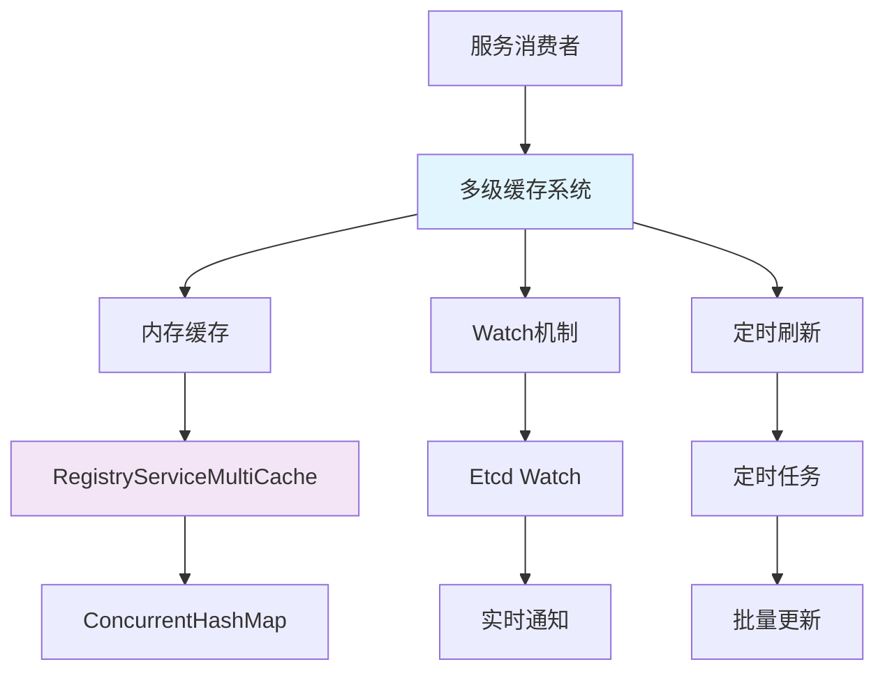
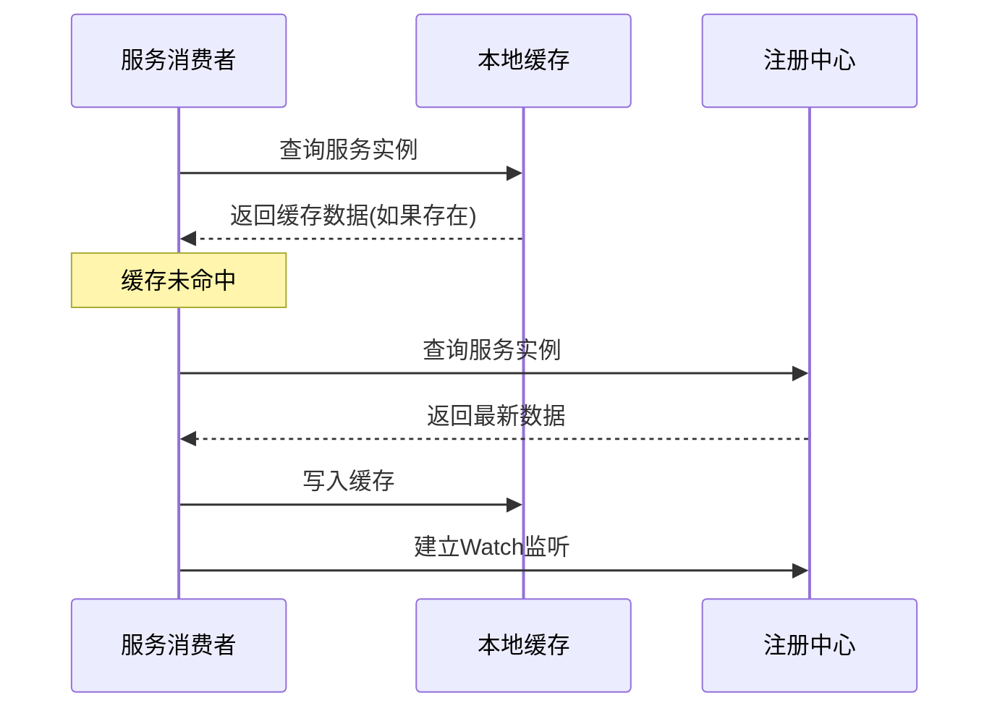
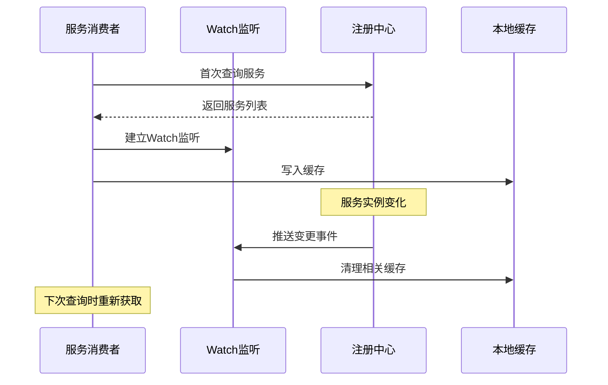
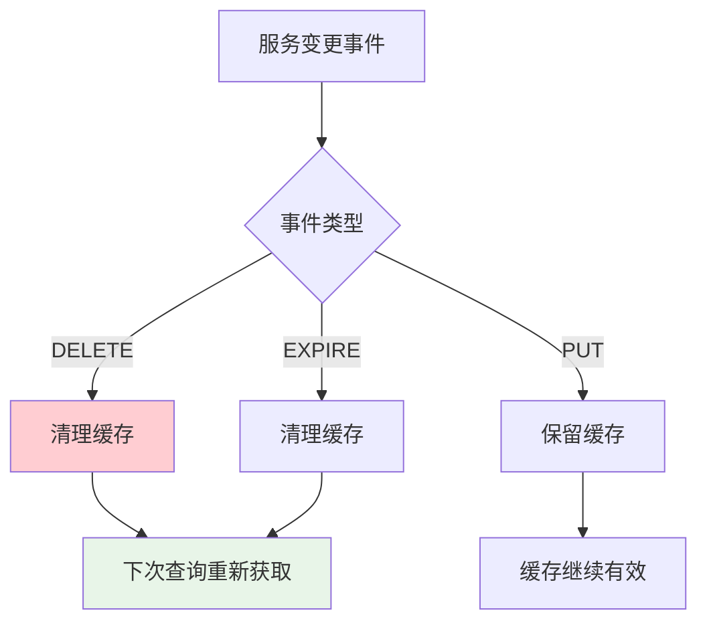
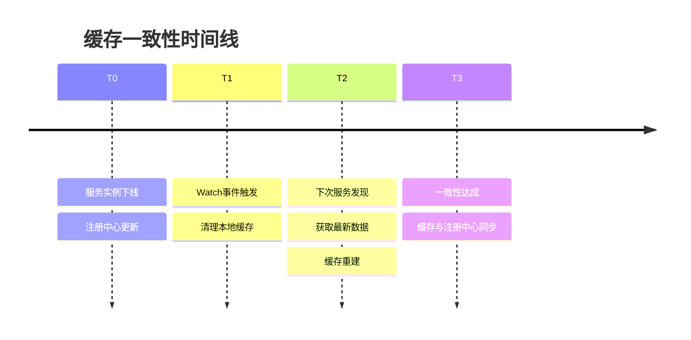
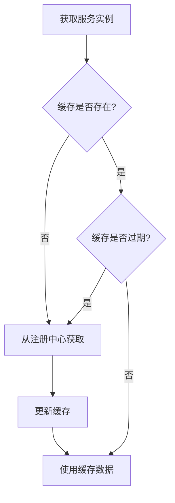
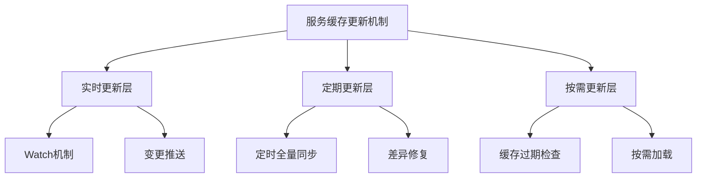
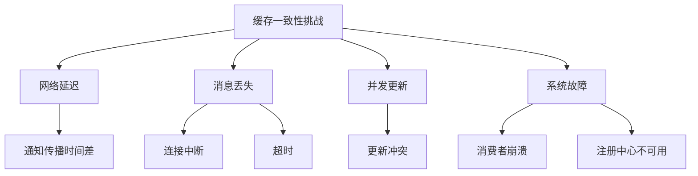
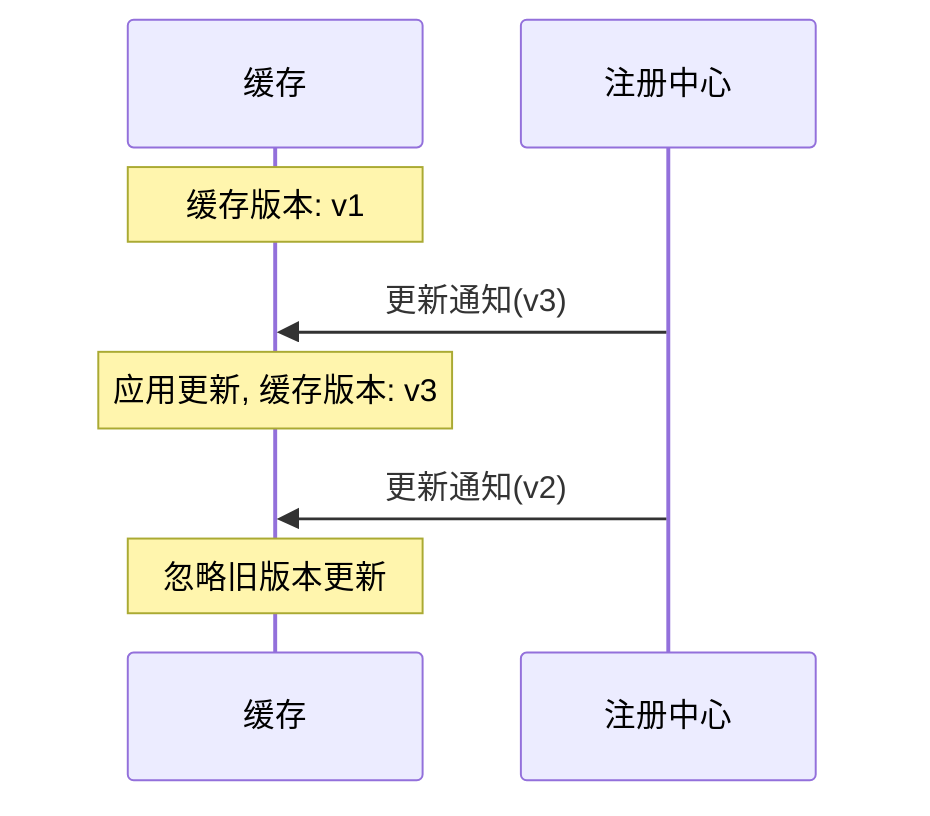
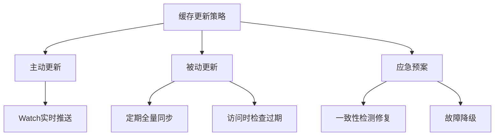

# Ming RPC Framework 服务注册信息缓存更新与一致性保障详解

## 📖 概述

在分布式RPC框架中，服务消费者通常会将从注册中心获取的服务提供者信息缓存在本地，以提高性能和可用性。Ming RPC Framework通过多级缓存机制和实时更新策略，确保了缓存数据的一致性和系统的高可用性。

### 🎯 核心问题
> 如何更新服务注册信息缓存？怎么保证缓存的数据一致性？

### 💡 设计目标
1. **高性能**: 减少对注册中心的频繁访问，提升服务发现性能
2. **高可用**: 在注册中心不可用时，仍能提供服务发现能力
3. **一致性**: 保证缓存数据与注册中心数据的最终一致性
4. **实时性**: 快速感知服务实例的上下线变化

### 🏗️ 缓存架构设计


## 🔧 Ming RPC Framework缓存实现

### 1. 多级缓存架构

#### RegistryServiceMultiCache核心实现
**文件路径**: `rpc-core/src/main/java/com/ming/rpc/registry/RegistryServiceMultiCache.java`

```java
/**
 * 注册中心服务本地缓存（支持多个服务键名缓存）
 */
public class RegistryServiceMultiCache {
    /**
     * 服务缓存 - 支持多服务并发缓存
     * Key: 服务键名 (如 "UserService:1.0")
     * Value: 服务实例列表
     */
    Map<String, List<ServiceMetaInfo>> serviceCache = new ConcurrentHashMap<>();

    /**
     * 写缓存
     * @param serviceKey 服务键名
     * @param newServiceCache 新服务缓存
     */
    void writeCache(String serviceKey, List<ServiceMetaInfo> newServiceCache) {
        this.serviceCache.put(serviceKey, newServiceCache);
    }

    /**
     * 读缓存
     * @param serviceKey 服务键名
     * @return 缓存的服务列表，未找到返回null
     */
    List<ServiceMetaInfo> readCache(String serviceKey) {
        return this.serviceCache.get(serviceKey);
    }

    /**
     * 清空指定服务缓存
     * @param serviceKey 服务键名
     */
    void clearCache(String serviceKey) {
        this.serviceCache.remove(serviceKey);
    }
}
```

### 2. 缓存更新策略

#### 策略一：优先缓存读取


#### EtcdRegistry缓存实现
```java
@Override
public List<ServiceMetaInfo> serviceDiscovery(String serviceKey) {
    // 优先从缓存获取服务
    List<ServiceMetaInfo> cachedServiceMetaInfoList =
        registryServiceMultiCache.readCache(serviceKey);
    if(cachedServiceMetaInfoList != null){
        return cachedServiceMetaInfoList;
    }

    // 缓存未命中，从注册中心查询
    String searchPrefix = ETCD_ROOT_PATH + serviceKey + "/";

    try {
        // 前缀搜索
        GetOption getOption = GetOption.builder().isPrefix(true).build();
        List<KeyValue> keyValues = kvClient.get(
            ByteSequence.from(searchPrefix, StandardCharsets.UTF_8),
            getOption
        ).get().getKvs();

        // 解析服务信息
        List<ServiceMetaInfo> serviceMetaInfoList = keyValues.stream()
        .map(keyValue -> {
            String key = keyValue.getKey().toString(StandardCharsets.UTF_8);
            // 监听KEY的变化
            watch(key);
            // 解析服务信息
            String value = keyValue.getValue().toString(StandardCharsets.UTF_8);
            return JSONUtil.toBean(value, ServiceMetaInfo.class);
        }).collect(Collectors.toList());

        // 写入服务缓存
        registryServiceMultiCache.writeCache(serviceKey, serviceMetaInfoList);
        return serviceMetaInfoList;
    } catch (Exception e) {
        throw new RuntimeException("服务发现失败", e);
    }
}
```

#### 策略二：Watch实时更新


#### Watch机制实现
```java
@Override
public void watch(String serviceNodeKey) {
    Watch watchClient = client.getWatchClient();
    // 之前未被监听，开启监听
    boolean newWatch = watchingKeySet.add(serviceNodeKey);
    if(newWatch){
        watchClient.watch(ByteSequence.from(serviceNodeKey, StandardCharsets.UTF_8), response -> {
            for(WatchEvent event : response.getEvents()){
                switch(event.getEventType()){
                    // key 删除时候触发
                    case DELETE:
                        // 清理注册服务缓存
                        registryServiceMultiCache.clearCache(serviceNodeKey);
                        break;
                    case PUT:
                    default:
                        break;
                }
            }
        });
    }
}
```

### 3. 多注册中心缓存支持

#### ZooKeeper注册中心缓存
```java
@Override
public List<ServiceMetaInfo> serviceDiscovery(String serviceKey) {
    // 优先从缓存获取
    List<ServiceMetaInfo> cachedServiceMetaInfoList =
        registryServiceCache.readCache(serviceKey);
    if (cachedServiceMetaInfoList != null) {
        return cachedServiceMetaInfoList;
    }
    // 缓存未命中，从注册中心读取并设置监听
    return discoverAndCache(serviceKey);
}

private List<ServiceMetaInfo> discoverAndCache(String serviceKey) {
    try {
        // 从注册中心读取
        Collection<ServiceInstance<ServiceMetaInfo>> serviceInstanceCollection =
            serviceDiscovery.queryForInstances(serviceKey);
        // 首次发现，建立监听
        watch(serviceKey);
        // 写入缓存
        List<ServiceMetaInfo> serviceMetaInfoList = serviceInstanceCollection.stream()
                .map(ServiceInstance::getPayload)
                .collect(Collectors.toList());
        registryServiceCache.writeCache(serviceKey, serviceMetaInfoList);
        return serviceMetaInfoList;
    } catch (Exception e) {
        throw new RuntimeException("服务发现失败", e);
    }
}
```

#### Consul注册中心缓存
```java
@Override
public List<ServiceMetaInfo> serviceDiscovery(String serviceKey) {
    List<ServiceMetaInfo> cachedServices = registryServiceCache.readCache(serviceKey);
    if (cachedServices != null && !cachedServices.isEmpty()) {
        return cachedServices;
    }

    List<ServiceHealth> serviceHealthList =
        healthClient.getHealthyServiceInstances(serviceKey).getResponse();
    List<ServiceMetaInfo> serviceMetaInfoList = serviceHealthList.stream()
            .map(serviceHealth -> {
                Map<String, String> meta = serviceHealth.getService().getMeta();
                try {
                    return serializer.deserialize(
                        meta.get("serviceMetaInfo").getBytes(),
                        ServiceMetaInfo.class
                    );
                } catch (IOException e) {
                    throw new RuntimeException("Failed to deserialize service meta info", e);
                }
            })
            .collect(Collectors.toList());

    // 写入缓存
    registryServiceCache.writeCache(serviceKey, serviceMetaInfoList);
    return serviceMetaInfoList;
}
```

## 🔒 一致性保障机制

### 1. 缓存失效策略

#### 基于事件的缓存失效


#### 实际实现
```java
// Etcd Watch事件处理
@Override
public void watch(String serviceNodeKey) {
    Watch watchClient = client.getWatchClient();
    boolean newWatch = watchingKeySet.add(serviceNodeKey);
    if(newWatch){
        watchClient.watch(ByteSequence.from(serviceNodeKey, StandardCharsets.UTF_8), response -> {
            for(WatchEvent event : response.getEvents()){
                switch(event.getEventType()){
                    case DELETE:
                        // 服务下线，立即清理缓存
                        registryServiceMultiCache.clearCache(serviceNodeKey);
                        log.info("服务下线，清理缓存: {}", serviceNodeKey);
                        break;
                    case PUT:
                        // 服务更新，保留缓存（下次查询时会获取最新数据）
                        log.debug("服务更新事件: {}", serviceNodeKey);
                        break;
                    default:
                        break;
                }
            }
        });
    }
}
```

### 2. 缓存一致性级别

#### 最终一致性模型


#### 一致性保障策略
| 策略 | 一致性级别 | 性能影响 | 适用场景 |
|------|-----------|---------|----------|
| 立即失效 | 强一致性 | 高 | 关键业务服务 |
| 延迟失效 | 最终一致性 | 中 | 一般业务服务 |
| 定期校验 | 弱一致性 | 低 | 非关键服务 |

### 3. 缓存数据校验

#### 数据完整性检查
```java
public class CacheConsistencyChecker {

    /**
     * 校验缓存数据完整性
     */
    public boolean validateCacheIntegrity(String serviceKey) {
        List<ServiceMetaInfo> cachedServices =
            registryServiceMultiCache.readCache(serviceKey);

        if (cachedServices == null || cachedServices.isEmpty()) {
            return true; // 空缓存认为是一致的
        }

        try {
            // 从注册中心获取最新数据
            List<ServiceMetaInfo> latestServices =
                registryClient.serviceDiscovery(serviceKey);

            // 比较数据一致性
            return isDataConsistent(cachedServices, latestServices);

        } catch (Exception e) {
            log.warn("缓存一致性校验失败: {}", serviceKey, e);
            return false;
        }
    }

    private boolean isDataConsistent(List<ServiceMetaInfo> cached,
                                   List<ServiceMetaInfo> latest) {
        if (cached.size() != latest.size()) {
            return false;
        }

        Set<String> cachedNodes = cached.stream()
            .map(ServiceMetaInfo::getServiceNodeKey)
            .collect(Collectors.toSet());

        Set<String> latestNodes = latest.stream()
            .map(ServiceMetaInfo::getServiceNodeKey)
            .collect(Collectors.toSet());

        return cachedNodes.equals(latestNodes);
    }
}
```

### 4. 故障恢复机制

#### 注册中心不可用时的处理
```java
@Override
public List<ServiceMetaInfo> serviceDiscovery(String serviceKey) {
    // 优先从缓存获取
    List<ServiceMetaInfo> cachedServices =
        registryServiceMultiCache.readCache(serviceKey);

    try {
        // 尝试从注册中心获取最新数据
        List<ServiceMetaInfo> latestServices = queryFromRegistry(serviceKey);

        // 更新缓存
        registryServiceMultiCache.writeCache(serviceKey, latestServices);
        return latestServices;

    } catch (Exception e) {
        log.warn("注册中心不可用，使用缓存数据: {}", serviceKey, e);

        // 注册中心不可用，返回缓存数据
        if (cachedServices != null && !cachedServices.isEmpty()) {
            return cachedServices;
        }

        // 缓存也为空，抛出异常
        throw new RuntimeException("服务发现失败，注册中心不可用且无缓存数据", e);
    }
}
```

#### 缓存预热机制
```java
public class CacheWarmupService {

    @PostConstruct
    public void warmupCache() {
        // 预加载关键服务
        List<String> criticalServices = getCriticalServices();

        for (String serviceKey : criticalServices) {
            try {
                List<ServiceMetaInfo> services =
                    registryClient.serviceDiscovery(serviceKey);
                registryServiceMultiCache.writeCache(serviceKey, services);
                log.info("预热缓存成功: {}", serviceKey);
            } catch (Exception e) {
                log.warn("预热缓存失败: {}", serviceKey, e);
            }
        }
    }

    private List<String> getCriticalServices() {
        // 返回关键服务列表
        return Arrays.asList(
            "UserService:1.0",
            "OrderService:1.0",
            "PaymentService:1.0"
        );
    }
}
```
            }
        }
    });
}
```

#### 优缺点分析

**优点**：
- 近实时更新，变更感知延迟低
- 按需更新，仅处理变更部分
- 减少不必要的全量拉取

**缺点**：
- 依赖注册中心的通知机制
- 需要处理连接断开、消息丢失等异常
- 长连接维护开销

### 3. 按需更新策略

在访问缓存时检查数据是否过期，按需从注册中心获取最新数据。



#### 实现方式

```java
public List<ServiceInstance> getServiceInstances(String serviceName) {
    // 检查缓存是否存在且未过期
    CacheEntry entry = cache.get(serviceName);
    if (entry == null || entry.isExpired()) {
        // 缓存不存在或已过期，从注册中心获取
        List<ServiceInstance> instances = registryService.getInstances(serviceName);
        if (instances != null && !instances.isEmpty()) {
            cache.put(serviceName, new CacheEntry(instances));
            return instances;
        }
        // 如果获取失败但缓存存在，返回过期数据
        if (entry != null) {
            log.warn("Using expired cache for service: " + serviceName);
            return entry.getInstances();
        }
        return Collections.emptyList();
    }
    
    // 返回缓存数据
    return entry.getInstances();
}
```

#### 优缺点分析

**优点**：
- 按需获取，减少不必要的更新
- 资源利用更高效
- 自适应访问频率

**缺点**：
- 首次访问或过期后的访问延迟较高
- 并发场景下可能重复获取
- 需要谨慎设置过期时间

### 4. 组合策略

结合以上三种策略的优点，实现多层次的缓存更新机制。



#### 实现要点

1. **基础层**：使用Watch机制实时监听变更
2. **补偿层**：定期执行全量同步，修复可能的不一致
3. **兜底层**：在缓存访问时检查过期状态，必要时刷新
4. **异常处理**：各层次之间互为备份，确保系统可用性

## 缓存数据一致性保障

### 1. 一致性模型与挑战

在分布式系统中，缓存一致性面临多种挑战：

#### 一致性模型

- **强一致性**：缓存数据始终与注册中心保持同步，任何变更立即可见
- **最终一致性**：在一定时间窗口后，缓存数据会与注册中心达成一致
- **弱一致性**：允许缓存与注册中心之间存在一定程度的不一致

在实际系统中，通常采用最终一致性模型，在性能和一致性之间取得平衡。

#### 一致性挑战



- **网络延迟**：变更通知传播需要时间，导致短暂的不一致
- **消息丢失**：Watch连接中断可能导致变更通知丢失
- **并发更新**：多线程环境下对同一缓存条目的并发更新
- **系统故障**：消费者或注册中心故障导致的更新中断

### 2. 版本控制与冲突解决

利用Etcd等注册中心提供的版本机制，确保按正确顺序应用变更。



#### 实现方式

```java
public void updateCacheWithVersion(String serviceName, ServiceInstance instance) {
    CacheEntry entry = cache.get(serviceName);
    if (entry != null) {
        // 只有当新版本大于当前版本时才更新
        if (instance.getVersion() > entry.getVersion()) {
            entry.updateInstance(instance);
        } else {
            log.debug("Ignoring outdated update for service: " + serviceName);
        }
    } else {
        // 缓存不存在，直接添加
        cache.put(serviceName, new CacheEntry(instance));
    }
}
```

### 3. 定期全量校验

通过定期与注册中心进行全量数据比对，发现并修复潜在的不一致。

#### 实现方式

```java
@Scheduled(fixedRate = 300000)  // 每5分钟执行一次
public void validateCacheConsistency() {
    for (String serviceName : cache.keySet()) {
        CacheEntry cachedEntry = cache.get(serviceName);
        if (cachedEntry != null) {
            try {
                // 从注册中心获取最新数据
                List<ServiceInstance> latestInstances = 
                    registryService.getInstances(serviceName);
                
                // 检查不一致
                if (isInconsistent(cachedEntry.getInstances(), latestInstances)) {
                    log.warn("Detected cache inconsistency for service: " + serviceName);
                    
                    // 更新缓存
                    cache.put(serviceName, new CacheEntry(latestInstances));
                    
                    // 记录指标
                    metrics.incrementCacheInconsistencyCount();
                }
            } catch (Exception e) {
                log.error("Failed to validate cache for service: " + serviceName, e);
            }
        }
    }
}
```

### 4. 增量更新与差异处理

针对服务列表的变更，实现精确的增量更新，而非简单的全量替换。

#### 实现方式

```java
public void processDiff(String serviceName, List<ServiceInstance> latestInstances) {
    Map<String, ServiceInstance> latestMap = new HashMap<>();
    for (ServiceInstance instance : latestInstances) {
        latestMap.put(instance.getId(), instance);
    }
    
    CacheEntry entry = cache.get(serviceName);
    if (entry != null) {
        Map<String, ServiceInstance> currentMap = new HashMap<>();
        for (ServiceInstance instance : entry.getInstances()) {
            currentMap.put(instance.getId(), instance);
        }
        
        // 找出需要添加的实例
        Set<String> idsToAdd = new HashSet<>(latestMap.keySet());
        idsToAdd.removeAll(currentMap.keySet());
        
        // 找出需要删除的实例
        Set<String> idsToRemove = new HashSet<>(currentMap.keySet());
        idsToRemove.removeAll(latestMap.keySet());
        
        // 找出需要更新的实例
        Set<String> idsToUpdate = new HashSet<>(latestMap.keySet());
        idsToUpdate.retainAll(currentMap.keySet());
        
        // 应用变更
        for (String id : idsToAdd) {
            entry.addInstance(latestMap.get(id));
        }
        
        for (String id : idsToRemove) {
            entry.removeInstance(id);
        }
        
        for (String id : idsToUpdate) {
            ServiceInstance latest = latestMap.get(id);
            ServiceInstance current = currentMap.get(id);
            
            if (latest.getVersion() > current.getVersion()) {
                entry.updateInstance(latest);
            }
        }
    } else {
        // 缓存不存在，直接添加
        cache.put(serviceName, new CacheEntry(latestInstances));
    }
}
```

### 5. 异常处理与容错机制

设计健壮的异常处理机制，确保在各种故障场景下缓存系统仍能正常工作。

#### Watch连接断开处理

```java
public void establishWatchWithRetry(String serviceName) {
    while (!shutdown) {
        try {
            watchService(serviceName);
            // 正常情况下，watchService会阻塞，如果返回表示连接断开
            log.warn("Watch connection for " + serviceName + " disconnected, retrying...");
        } catch (Exception e) {
            log.error("Watch error for service: " + serviceName, e);
        }
        
        // 退避重试
        try {
            Thread.sleep(retryIntervalMs);
        } catch (InterruptedException ie) {
            Thread.currentThread().interrupt();
            break;
        }
    }
}
```

#### 注册中心暂时不可用的处理

```java
public List<ServiceInstance> getServiceInstancesWithFallback(String serviceName) {
    try {
        // 尝试获取最新数据
        return getServiceInstances(serviceName);
    } catch (RegistryCenterException e) {
        // 注册中心不可用，使用缓存数据
        CacheEntry entry = cache.get(serviceName);
        if (entry != null) {
            log.warn("Registry center unavailable, using cached data for: " + serviceName);
            return entry.getInstances();
        }
        throw e;  // 缓存也不存在，则抛出异常
    }
}
```

### 6. 缓存过期机制

为缓存设置合理的过期时间，确保即使出现更新失败，过期的缓存最终也会被刷新。

#### 缓存条目实现

```java
public class CacheEntry {
    private final List<ServiceInstance> instances;
    private final long creationTime;
    private final AtomicLong lastUpdateTime;
    private final AtomicLong accessCount;
    private final long ttlMs;
    
    public CacheEntry(List<ServiceInstance> instances) {
        this(instances, DEFAULT_TTL_MS);
    }
    
    public CacheEntry(List<ServiceInstance> instances, long ttlMs) {
        this.instances = new CopyOnWriteArrayList<>(instances);
        this.creationTime = System.currentTimeMillis();
        this.lastUpdateTime = new AtomicLong(this.creationTime);
        this.accessCount = new AtomicLong(0);
        this.ttlMs = ttlMs;
    }
    
    public boolean isExpired() {
        return System.currentTimeMillis() - lastUpdateTime.get() > ttlMs;
    }
    
    public List<ServiceInstance> getInstances() {
        accessCount.incrementAndGet();
        return new ArrayList<>(instances);
    }
    
    // 其他方法: updateInstance, addInstance, removeInstance 等
}
```

## 缓存一致性保障的最佳实践

### 1. 多层次更新策略

结合多种更新机制，构建稳固的缓存更新体系：



- **实时推送**：基于Watch机制的实时更新，是主要更新手段
- **定期同步**：作为补充，定期全量同步确保不遗漏变更
- **过期检查**：访问缓存时检查过期状态，按需更新
- **一致性修复**：定期检测并修复潜在的不一致
- **故障降级**：当注册中心不可用时，继续使用缓存提供服务

### 2. Watch机制最佳实践

使用Etcd的Watch机制时，应注意以下最佳实践：

- **按服务粒度监听**：对每个关注的服务单独建立Watch连接
- **断线重连**：实现自动重连机制，确保连接可靠性
- **增量恢复**：重连时记录上次更新版本，请求遗漏的更新
- **异步处理**：通知处理应在单独线程中进行，不阻塞主业务线程
- **批量处理**：合并短时间内的多次更新，减少处理开销

### 3. 数据一致性保障措施

综合多种机制确保数据一致性：

- **版本控制**：使用Etcd提供的修订版本跟踪数据变更
- **CAS操作**：使用Compare-And-Swap保证更新原子性
- **增量对比**：定期执行增量检查，只修复不一致的部分
- **TTL机制**：为缓存设置合理的生存期，确保最终一致性
- **双重验证**：重要操作前双重检查缓存与注册中心

### 4. 性能与一致性平衡

根据具体应用场景，调整更新策略和参数，平衡性能与一致性：

| 参数 | 低延迟优先 | 一致性优先 | 平衡模式 |
|------|------------|------------|----------|
| 缓存TTL | 较长(5-10分钟) | 较短(30-60秒) | 中等(2-5分钟) |
| 全量同步间隔 | 较长(10分钟) | 较短(1分钟) | 中等(5分钟) |
| Watch断线重试 | 慢速退避 | 快速重试 | 渐进退避 |
| 过期策略 | 宽松(继续使用) | 严格(立即刷新) | 条件刷新 |
| 异常处理 | 倾向使用缓存 | 倾向报错 | 动态判断 |

### 5. 监控与告警

建立完善的监控体系，确保缓存系统健康运行：

- **缓存命中率**：监控缓存访问的命中情况
- **更新延迟**：监控从变更发生到缓存更新的延迟
- **不一致率**：监控检测到的缓存不一致次数
- **Watch状态**：监控Watch连接的健康状态
- **注册中心可用性**：监控与注册中心的连接状态

当关键指标异常时，及时触发告警，确保运维人员能够快速响应。

## 总结

更新服务注册信息缓存并保证数据一致性是构建可靠RPC框架的关键挑战之一。通过结合Watch机制的实时更新、定期全量同步的补偿机制、缓存过期的兜底策略，以及完善的异常处理和监控体系，可以构建一个既高效又可靠的服务发现缓存系统。

## 🎯 最佳实践

### 1. 缓存策略选择

#### 根据业务特性选择策略
```java
public class CacheStrategySelector {

    public CacheStrategy selectStrategy(ServiceType serviceType) {
        switch (serviceType) {
            case CRITICAL_SERVICE:
                // 关键服务：强一致性 + 实时更新
                return new StrongConsistencyStrategy();

            case NORMAL_SERVICE:
                // 普通服务：最终一致性 + Watch更新
                return new EventualConsistencyStrategy();

            case BATCH_SERVICE:
                // 批处理服务：弱一致性 + 定期更新
                return new WeakConsistencyStrategy();

            default:
                return new DefaultStrategy();
        }
    }
}
```

### 2. 监控和告警

#### 缓存指标监控
```java
@Component
public class CacheMetrics {

    private final AtomicLong cacheHits = new AtomicLong(0);
    private final AtomicLong cacheMisses = new AtomicLong(0);
    private final AtomicLong consistencyErrors = new AtomicLong(0);

    public void recordCacheHit() {
        cacheHits.incrementAndGet();
    }

    public void recordCacheMiss() {
        cacheMisses.incrementAndGet();
    }

    public void recordConsistencyError() {
        consistencyErrors.incrementAndGet();
    }

    public CacheStats getStats() {
        long hits = cacheHits.get();
        long misses = cacheMisses.get();
        double hitRate = hits + misses > 0 ? (double) hits / (hits + misses) : 0.0;

        return CacheStats.builder()
            .hitRate(hitRate)
            .totalHits(hits)
            .totalMisses(misses)
            .consistencyErrors(consistencyErrors.get())
            .build();
    }
}
```

## 📋 Ming RPC Framework缓存总结

通过完善的服务注册信息缓存更新与一致性保障机制，Ming RPC Framework实现了高性能和高可用的服务发现能力。

### 核心特性
- ✅ **多级缓存**: RegistryServiceMultiCache支持多服务并发缓存
- ✅ **实时更新**: 基于Watch机制的实时缓存失效
- ✅ **一致性保障**: 多层次的一致性保障策略
- ✅ **故障恢复**: 完善的容错和恢复机制
- ✅ **性能监控**: 全面的缓存指标监控

### 技术优势
- **高性能**: ConcurrentHashMap提供高并发读写能力
- **实时性**: Watch机制确保缓存数据的实时性
- **可靠性**: 多重保障机制确保数据一致性
- **可扩展**: 支持多种注册中心的缓存策略

### 一致性保障
- **事件驱动**: 基于注册中心事件的缓存失效
- **最终一致性**: 通过Watch机制实现最终一致性
- **数据校验**: 定期校验确保数据完整性
- **故障恢复**: 注册中心不可用时的降级策略

### 使用建议
1. **关键服务**: 使用强一致性策略，启用实时监控
2. **普通服务**: 使用最终一致性策略，平衡性能和一致性
3. **批处理服务**: 使用弱一致性策略，优先考虑性能
4. **监控告警**: 建立完善的监控和告警机制
5. **性能调优**: 根据业务特点调整缓存策略和参数

通过这套完整的缓存更新与一致性保障机制，Ming RPC Framework能够在保证高性能的同时，最大程度地保证缓存数据与注册中心的一致性，为分布式系统提供可靠的服务发现能力。