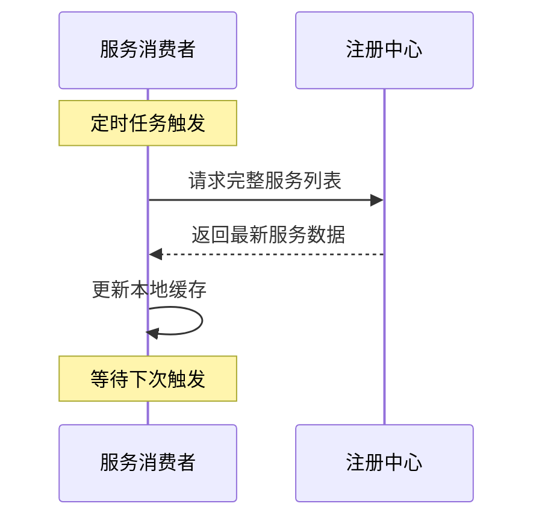
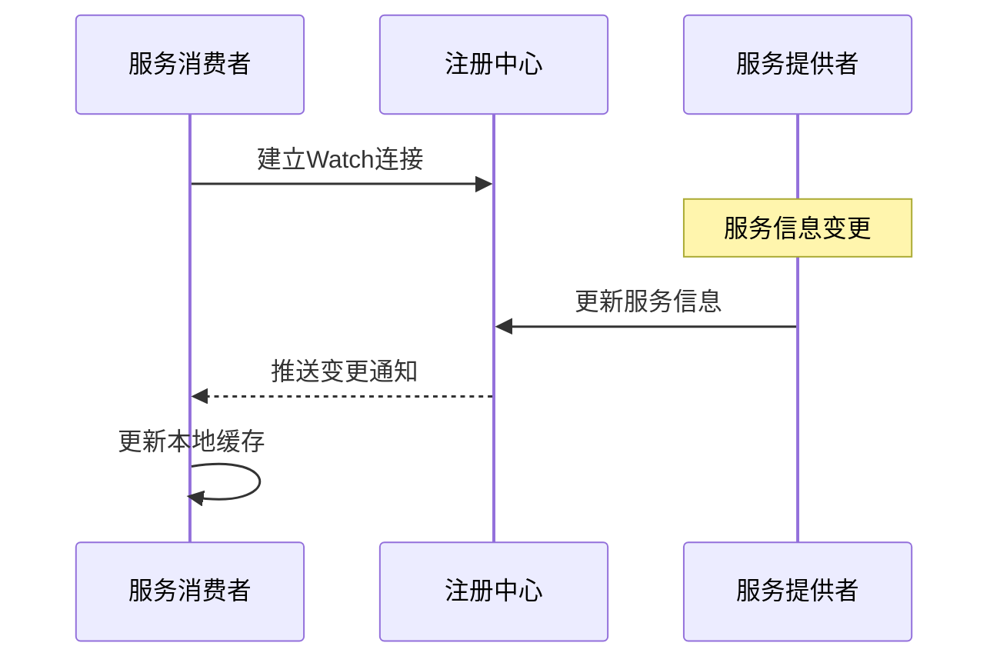
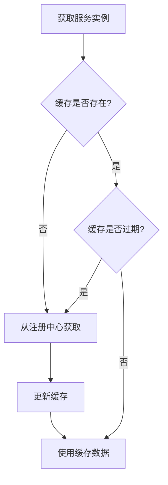
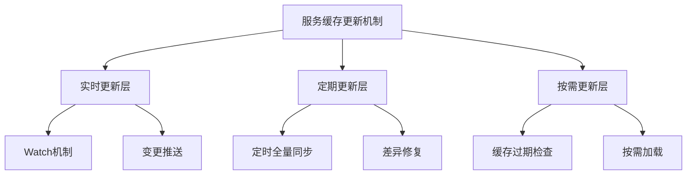
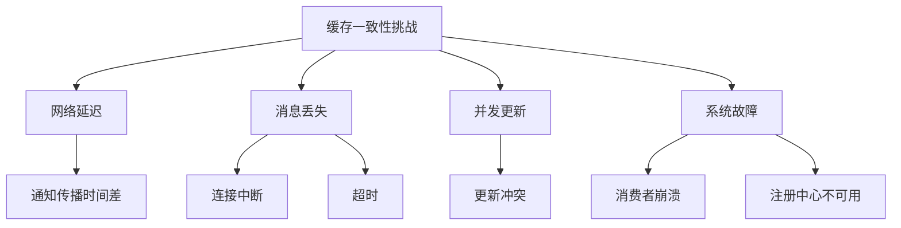
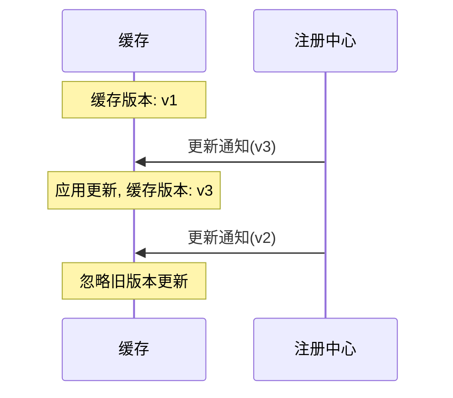
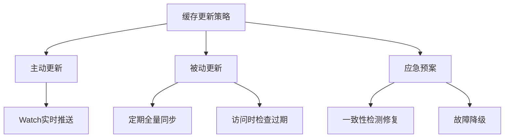

# 服务注册信息缓存更新与一致性保障

## 问题

> 如何更新服务注册信息缓存？怎么保证缓存的数据一致性？

## 引言

在分布式RPC框架中，服务消费者通常会将从注册中心获取的服务提供者信息缓存在本地，以提高性能和可用性。然而，缓存引入了一个新的挑战：如何保证缓存中的数据与注册中心保持一致，特别是在服务实例频繁上下线的动态环境中。

本文将详细探讨服务注册信息缓存的更新策略以及如何保证缓存数据与注册中心的一致性，以构建高效、可靠的服务发现机制。

## 缓存更新策略

### 1. 定时更新策略

最基本的缓存更新方式是通过定时任务周期性地从注册中心拉取最新数据。



#### 实现方式

```java
@Scheduled(fixedRate = 60000)  // 每60秒执行一次
public void refreshServiceCache() {
    for (String serviceName : subscribedServices) {
        try {
            List<ServiceInstance> instances = registryService.getInstances(serviceName);
            serviceCache.updateService(serviceName, instances);
        } catch (Exception e) {
            log.error("Failed to refresh cache for service: " + serviceName, e);
        }
    }
}
```

#### 优缺点分析

**优点**：
- 实现简单，稳定可靠
- 对注册中心的压力可控
- 不依赖注册中心的特殊功能

**缺点**：
- 实时性受更新周期限制
- 更新频率与实时性是一对矛盾
- 无效更新浪费资源

### 2. 基于Watch的实时更新策略

利用注册中心（如Etcd）提供的变更通知机制，实时监听服务信息变化并更新缓存。



#### 实现方式

```java
public void watchService(String serviceName) {
    String servicePath = "/services/" + serviceName;
    watchClient.watch(ByteSequence.from(servicePath, StandardCharsets.UTF_8), 
                      response -> {
        for (WatchEvent event : response.getEvents()) {
            KeyValue kv = event.getKeyValue();
            String key = kv.getKey().toString(StandardCharsets.UTF_8);
            
            if (event.getEventType() == WatchEvent.EventType.PUT) {
                // 新增或更新服务实例
                ServiceInstance instance = deserializeInstance(
                    kv.getValue().toString(StandardCharsets.UTF_8)
                );
                serviceCache.updateInstance(serviceName, instance);
            } else if (event.getEventType() == WatchEvent.EventType.DELETE) {
                // 删除服务实例
                String instanceId = extractInstanceId(key);
                serviceCache.removeInstance(serviceName, instanceId);
            }
        }
    });
}
```

#### 优缺点分析

**优点**：
- 近实时更新，变更感知延迟低
- 按需更新，仅处理变更部分
- 减少不必要的全量拉取

**缺点**：
- 依赖注册中心的通知机制
- 需要处理连接断开、消息丢失等异常
- 长连接维护开销

### 3. 按需更新策略

在访问缓存时检查数据是否过期，按需从注册中心获取最新数据。



#### 实现方式

```java
public List<ServiceInstance> getServiceInstances(String serviceName) {
    // 检查缓存是否存在且未过期
    CacheEntry entry = cache.get(serviceName);
    if (entry == null || entry.isExpired()) {
        // 缓存不存在或已过期，从注册中心获取
        List<ServiceInstance> instances = registryService.getInstances(serviceName);
        if (instances != null && !instances.isEmpty()) {
            cache.put(serviceName, new CacheEntry(instances));
            return instances;
        }
        // 如果获取失败但缓存存在，返回过期数据
        if (entry != null) {
            log.warn("Using expired cache for service: " + serviceName);
            return entry.getInstances();
        }
        return Collections.emptyList();
    }
    
    // 返回缓存数据
    return entry.getInstances();
}
```

#### 优缺点分析

**优点**：
- 按需获取，减少不必要的更新
- 资源利用更高效
- 自适应访问频率

**缺点**：
- 首次访问或过期后的访问延迟较高
- 并发场景下可能重复获取
- 需要谨慎设置过期时间

### 4. 组合策略

结合以上三种策略的优点，实现多层次的缓存更新机制。



#### 实现要点

1. **基础层**：使用Watch机制实时监听变更
2. **补偿层**：定期执行全量同步，修复可能的不一致
3. **兜底层**：在缓存访问时检查过期状态，必要时刷新
4. **异常处理**：各层次之间互为备份，确保系统可用性

## 缓存数据一致性保障

### 1. 一致性模型与挑战

在分布式系统中，缓存一致性面临多种挑战：

#### 一致性模型

- **强一致性**：缓存数据始终与注册中心保持同步，任何变更立即可见
- **最终一致性**：在一定时间窗口后，缓存数据会与注册中心达成一致
- **弱一致性**：允许缓存与注册中心之间存在一定程度的不一致

在实际系统中，通常采用最终一致性模型，在性能和一致性之间取得平衡。

#### 一致性挑战



- **网络延迟**：变更通知传播需要时间，导致短暂的不一致
- **消息丢失**：Watch连接中断可能导致变更通知丢失
- **并发更新**：多线程环境下对同一缓存条目的并发更新
- **系统故障**：消费者或注册中心故障导致的更新中断

### 2. 版本控制与冲突解决

利用Etcd等注册中心提供的版本机制，确保按正确顺序应用变更。



#### 实现方式

```java
public void updateCacheWithVersion(String serviceName, ServiceInstance instance) {
    CacheEntry entry = cache.get(serviceName);
    if (entry != null) {
        // 只有当新版本大于当前版本时才更新
        if (instance.getVersion() > entry.getVersion()) {
            entry.updateInstance(instance);
        } else {
            log.debug("Ignoring outdated update for service: " + serviceName);
        }
    } else {
        // 缓存不存在，直接添加
        cache.put(serviceName, new CacheEntry(instance));
    }
}
```

### 3. 定期全量校验

通过定期与注册中心进行全量数据比对，发现并修复潜在的不一致。

#### 实现方式

```java
@Scheduled(fixedRate = 300000)  // 每5分钟执行一次
public void validateCacheConsistency() {
    for (String serviceName : cache.keySet()) {
        CacheEntry cachedEntry = cache.get(serviceName);
        if (cachedEntry != null) {
            try {
                // 从注册中心获取最新数据
                List<ServiceInstance> latestInstances = 
                    registryService.getInstances(serviceName);
                
                // 检查不一致
                if (isInconsistent(cachedEntry.getInstances(), latestInstances)) {
                    log.warn("Detected cache inconsistency for service: " + serviceName);
                    
                    // 更新缓存
                    cache.put(serviceName, new CacheEntry(latestInstances));
                    
                    // 记录指标
                    metrics.incrementCacheInconsistencyCount();
                }
            } catch (Exception e) {
                log.error("Failed to validate cache for service: " + serviceName, e);
            }
        }
    }
}
```

### 4. 增量更新与差异处理

针对服务列表的变更，实现精确的增量更新，而非简单的全量替换。

#### 实现方式

```java
public void processDiff(String serviceName, List<ServiceInstance> latestInstances) {
    Map<String, ServiceInstance> latestMap = new HashMap<>();
    for (ServiceInstance instance : latestInstances) {
        latestMap.put(instance.getId(), instance);
    }
    
    CacheEntry entry = cache.get(serviceName);
    if (entry != null) {
        Map<String, ServiceInstance> currentMap = new HashMap<>();
        for (ServiceInstance instance : entry.getInstances()) {
            currentMap.put(instance.getId(), instance);
        }
        
        // 找出需要添加的实例
        Set<String> idsToAdd = new HashSet<>(latestMap.keySet());
        idsToAdd.removeAll(currentMap.keySet());
        
        // 找出需要删除的实例
        Set<String> idsToRemove = new HashSet<>(currentMap.keySet());
        idsToRemove.removeAll(latestMap.keySet());
        
        // 找出需要更新的实例
        Set<String> idsToUpdate = new HashSet<>(latestMap.keySet());
        idsToUpdate.retainAll(currentMap.keySet());
        
        // 应用变更
        for (String id : idsToAdd) {
            entry.addInstance(latestMap.get(id));
        }
        
        for (String id : idsToRemove) {
            entry.removeInstance(id);
        }
        
        for (String id : idsToUpdate) {
            ServiceInstance latest = latestMap.get(id);
            ServiceInstance current = currentMap.get(id);
            
            if (latest.getVersion() > current.getVersion()) {
                entry.updateInstance(latest);
            }
        }
    } else {
        // 缓存不存在，直接添加
        cache.put(serviceName, new CacheEntry(latestInstances));
    }
}
```

### 5. 异常处理与容错机制

设计健壮的异常处理机制，确保在各种故障场景下缓存系统仍能正常工作。

#### Watch连接断开处理

```java
public void establishWatchWithRetry(String serviceName) {
    while (!shutdown) {
        try {
            watchService(serviceName);
            // 正常情况下，watchService会阻塞，如果返回表示连接断开
            log.warn("Watch connection for " + serviceName + " disconnected, retrying...");
        } catch (Exception e) {
            log.error("Watch error for service: " + serviceName, e);
        }
        
        // 退避重试
        try {
            Thread.sleep(retryIntervalMs);
        } catch (InterruptedException ie) {
            Thread.currentThread().interrupt();
            break;
        }
    }
}
```

#### 注册中心暂时不可用的处理

```java
public List<ServiceInstance> getServiceInstancesWithFallback(String serviceName) {
    try {
        // 尝试获取最新数据
        return getServiceInstances(serviceName);
    } catch (RegistryCenterException e) {
        // 注册中心不可用，使用缓存数据
        CacheEntry entry = cache.get(serviceName);
        if (entry != null) {
            log.warn("Registry center unavailable, using cached data for: " + serviceName);
            return entry.getInstances();
        }
        throw e;  // 缓存也不存在，则抛出异常
    }
}
```

### 6. 缓存过期机制

为缓存设置合理的过期时间，确保即使出现更新失败，过期的缓存最终也会被刷新。

#### 缓存条目实现

```java
public class CacheEntry {
    private final List<ServiceInstance> instances;
    private final long creationTime;
    private final AtomicLong lastUpdateTime;
    private final AtomicLong accessCount;
    private final long ttlMs;
    
    public CacheEntry(List<ServiceInstance> instances) {
        this(instances, DEFAULT_TTL_MS);
    }
    
    public CacheEntry(List<ServiceInstance> instances, long ttlMs) {
        this.instances = new CopyOnWriteArrayList<>(instances);
        this.creationTime = System.currentTimeMillis();
        this.lastUpdateTime = new AtomicLong(this.creationTime);
        this.accessCount = new AtomicLong(0);
        this.ttlMs = ttlMs;
    }
    
    public boolean isExpired() {
        return System.currentTimeMillis() - lastUpdateTime.get() > ttlMs;
    }
    
    public List<ServiceInstance> getInstances() {
        accessCount.incrementAndGet();
        return new ArrayList<>(instances);
    }
    
    // 其他方法: updateInstance, addInstance, removeInstance 等
}
```

## 缓存一致性保障的最佳实践

### 1. 多层次更新策略

结合多种更新机制，构建稳固的缓存更新体系：



- **实时推送**：基于Watch机制的实时更新，是主要更新手段
- **定期同步**：作为补充，定期全量同步确保不遗漏变更
- **过期检查**：访问缓存时检查过期状态，按需更新
- **一致性修复**：定期检测并修复潜在的不一致
- **故障降级**：当注册中心不可用时，继续使用缓存提供服务

### 2. Watch机制最佳实践

使用Etcd的Watch机制时，应注意以下最佳实践：

- **按服务粒度监听**：对每个关注的服务单独建立Watch连接
- **断线重连**：实现自动重连机制，确保连接可靠性
- **增量恢复**：重连时记录上次更新版本，请求遗漏的更新
- **异步处理**：通知处理应在单独线程中进行，不阻塞主业务线程
- **批量处理**：合并短时间内的多次更新，减少处理开销

### 3. 数据一致性保障措施

综合多种机制确保数据一致性：

- **版本控制**：使用Etcd提供的修订版本跟踪数据变更
- **CAS操作**：使用Compare-And-Swap保证更新原子性
- **增量对比**：定期执行增量检查，只修复不一致的部分
- **TTL机制**：为缓存设置合理的生存期，确保最终一致性
- **双重验证**：重要操作前双重检查缓存与注册中心

### 4. 性能与一致性平衡

根据具体应用场景，调整更新策略和参数，平衡性能与一致性：

| 参数 | 低延迟优先 | 一致性优先 | 平衡模式 |
|------|------------|------------|----------|
| 缓存TTL | 较长(5-10分钟) | 较短(30-60秒) | 中等(2-5分钟) |
| 全量同步间隔 | 较长(10分钟) | 较短(1分钟) | 中等(5分钟) |
| Watch断线重试 | 慢速退避 | 快速重试 | 渐进退避 |
| 过期策略 | 宽松(继续使用) | 严格(立即刷新) | 条件刷新 |
| 异常处理 | 倾向使用缓存 | 倾向报错 | 动态判断 |

### 5. 监控与告警

建立完善的监控体系，确保缓存系统健康运行：

- **缓存命中率**：监控缓存访问的命中情况
- **更新延迟**：监控从变更发生到缓存更新的延迟
- **不一致率**：监控检测到的缓存不一致次数
- **Watch状态**：监控Watch连接的健康状态
- **注册中心可用性**：监控与注册中心的连接状态

当关键指标异常时，及时触发告警，确保运维人员能够快速响应。

## 总结

更新服务注册信息缓存并保证数据一致性是构建可靠RPC框架的关键挑战之一。通过结合Watch机制的实时更新、定期全量同步的补偿机制、缓存过期的兜底策略，以及完善的异常处理和监控体系，可以构建一个既高效又可靠的服务发现缓存系统。

在实际实现中，需要根据具体业务场景的需求，在性能与一致性之间找到适合的平衡点，通过合理的配置参数和机制组合，确保缓存系统能够在各种复杂场景下稳定可靠地运行，为RPC框架提供高效、准确的服务发现能力。 