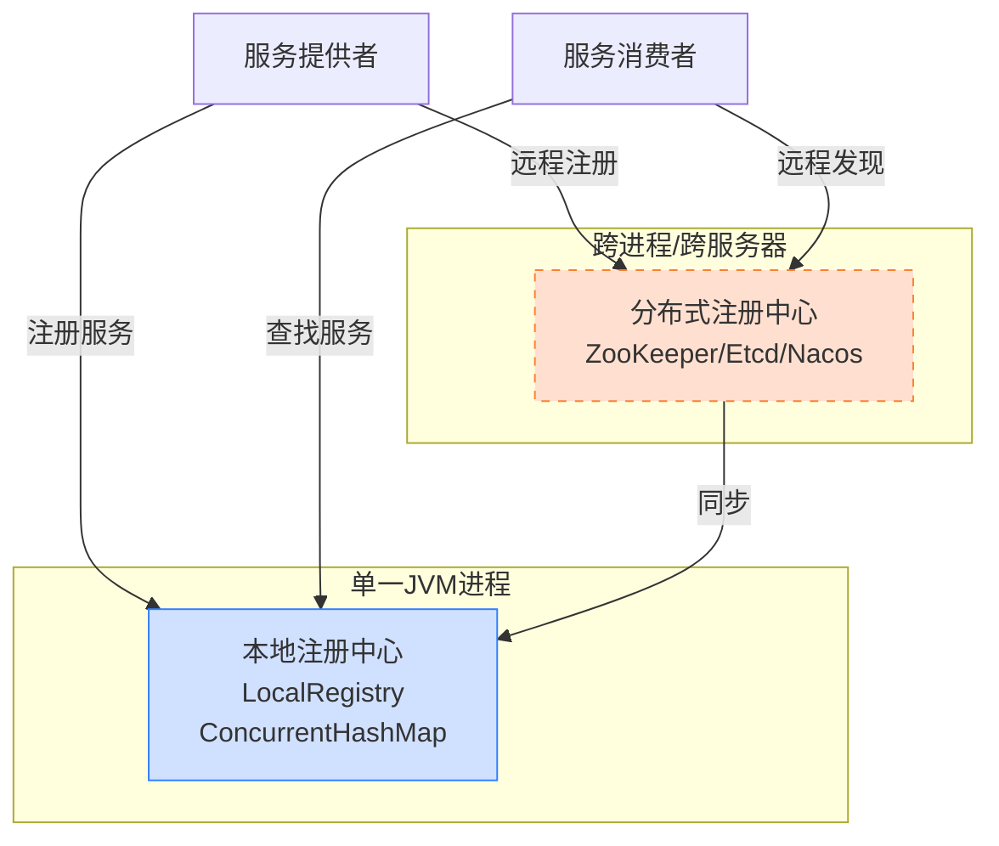

# 本地服务注册的实现与ConcurrentHashMap的应用

## 面试题目

为什么选择了 ConcurrentHashMap 来实现本地服务注册器？它的优势是什么？

## 引言

服务注册是 RPC 框架中的核心组件，它负责管理服务提供者的信息，使消费者能够找到并调用这些服务。在 learn-RPC 项目中，我们实现了一个基于 `ConcurrentHashMap` 的本地服务注册器，用于在单个 JVM 进程内管理服务。本文将详细探讨这一设计选择的原因、实现细节以及 `ConcurrentHashMap` 在高并发场景下的优势。

## 1. 本地服务注册的职责

在 learn-RPC 框架中，本地服务注册器 `LocalRegistry` 主要承担以下职责：

1. **服务注册**：将服务提供者的接口与其实现类关联并存储
2. **服务查找**：根据服务名称（接口全限定名）查找对应的实现类
3. **服务移除**：当服务下线时，从注册表中移除服务
4. **服务列举**：提供查看当前已注册服务列表的能力

## 2. LocalRegistry 的实现

在项目中，`LocalRegistry` 的实现非常简洁高效：

```java
package com.ming.rpc.registry;

import java.util.Map;
import java.util.Set;
import java.util.concurrent.ConcurrentHashMap;

/**
 * LocalRegistry 本地注册中心
 */
public class LocalRegistry {

    private static final Map<String,Class<?>> map = new ConcurrentHashMap<>();

    /**
     * 注册服务
     * @param serviceName 服务名称
     * @param implClass 服务类
     */
    public static void register(String serviceName,Class<?> implClass){
        System.out.println("注册服务: " + serviceName + " -> " + implClass.getName());
        map.put(serviceName,implClass);
    }
    
    /**
     * Get service 
     * @param serviceName 服务名称
     * @return 服务类
     */
    public static Class<?> get(String serviceName){
        Class<?> implClass = map.get(serviceName);
        if (implClass == null) {
            System.out.println("未找到服务: " + serviceName);
        }
        return implClass;
    }

    /**
     * delete service
     * @param serviceName 服务名称
     */
    public static void remove(String serviceName){
        map.remove(serviceName);
    }
    
    /**
     * 列出所有已注册的服务
     * @return 服务名称集合
     */
    public static Set<String> listServices() {
        return map.keySet();
    }
}
```

### 2.1 核心数据结构

```java
private static final Map<String,Class<?>> map = new ConcurrentHashMap<>();
```

这一行代码定义了核心数据结构：一个静态的 `ConcurrentHashMap` 实例。其中：
- **键（Key）**：服务名称，通常是服务接口的全限定名（如 `com.ming.example.common.service.UserService`）
- **值（Value）**：服务实现类的 `Class` 对象（如 `UserServiceImpl.class`）

## 3. 为什么选择 ConcurrentHashMap

在实现本地服务注册器时，我们有多种可选的数据结构，如 `HashMap`、`Hashtable`、`ConcurrentHashMap` 等。那么，为什么特别选择了 `ConcurrentHashMap`？

### 3.1 线程安全需求

RPC 框架运行在多线程环境中：

- **并发注册**：多个服务提供者可能同时注册服务
- **并发查询**：多个客户端请求可能同时查询服务
- **动态变更**：服务可能在运行时动态添加或移除

这要求注册表必须是线程安全的，能够正确处理**并发**操作。

### 3.2 ConcurrentHashMap 的关键优势

相比其他选择，`ConcurrentHashMap` 具有以下优势：

#### 3.2.1 相比 HashMap

- **线程安全**：`HashMap` 不是线程安全的，在多线程环境下可能导致数据不一致或死循环
- **并发修改**：`HashMap` 在并发修改时可能抛出 `ConcurrentModificationException`

#### 3.2.2 相比 Hashtable

- **细粒度锁**：`Hashtable` 使用方法级别的同步（`synchronized` 方法），所有操作都会锁住整个表，而 `ConcurrentHashMap` 使用分段锁或 CAS 操作，允许多个线程同时读写不同部分
- **性能更优**：在高并发场景下，`ConcurrentHashMap` 的性能显著优于 `Hashtable`

#### 3.2.3 相比 Collections.synchronizedMap

- **并发度更高**：`Collections.synchronizedMap` 也是对整个 Map 加锁，而 `ConcurrentHashMap` 支持并发访问
- **读操作无锁**：`ConcurrentHashMap` 的读操作通常不需要加锁，提供了更好的读性能

### 3.3 ConcurrentHashMap 的实现原理

`ConcurrentHashMap` 采用了多种技术来确保并发安全和高性能：

#### 3.3.1 JDK 7 中的实现

- **分段锁（Segment）**：将数据分为多个段，每个段有独立的锁
- **锁分离技术**：读操作不加锁，写操作仅锁定影响的段
- **CAS 操作**：部分操作使用 CAS（Compare-And-Swap）无锁算法

#### 3.3.2 JDK 8 及以后的实现

- **取消分段设计**：移除了 Segment，改为 Node 数组 + 链表 / 红黑树结构
- **CAS + synchronized**：使用 CAS 操作尝试更新，失败则使用 synchronized 锁定桶
- **红黑树优化**：当链表长度超过阈值（默认 8）时，转换为红黑树提升性能

## 4. LocalRegistry 在框架中的应用

### 4.1 服务提供者启动流程

```java
public class EasyProviderExample {
    public static void main(String[] args) {
        // 注册服务
        String serviceName = UserService.class.getName();
        Class<?> implClass = UserServiceImpl.class;
        LocalRegistry.register(serviceName, implClass);
        
        // 启动服务器
        HttpServer httpServer = new VertexHttpServer();
        httpServer.doStart(8081);
    }
}
```

服务提供者在启动时，将服务接口与实现类注册到 `LocalRegistry`。

### 4.2 服务请求处理流程

```java
public class HttpServerHandler implements Handler<HttpServerRequest> {
    @Override
    public void handle(HttpServerRequest request) {
        // ...
        try {
            String serviceName = rpcRequest.getServiceName();
            
            // 从本地注册表查找服务实现
            Class<?> implClass = LocalRegistry.get(serviceName);
            
            if (implClass == null) {
                // 服务未找到，返回错误响应
            }
            
            // 使用反射调用方法
            Method method = implClass.getMethod(rpcRequest.getMethodName(), 
                                               rpcRequest.getParameterTypes());
            Object serviceInstance = implClass.newInstance();
            Object result = method.invoke(serviceInstance, rpcRequest.getArgs());
            
            // 返回结果
        } catch (Exception e) {
            // 异常处理
        }
    }
}
```

当接收到 RPC 请求时，`HttpServerHandler` 根据请求中的服务名从 `LocalRegistry` 查找服务实现类，然后通过反射调用相应的方法。

## 5. ConcurrentHashMap 带来的性能优势

### 5.1 高并发读写性能

在 RPC 框架中，服务查询（读操作）的频率远高于服务注册和移除（写操作）。`ConcurrentHashMap` 的设计特别适合这种读多写少的场景：

- **读操作无锁**：多个线程可以同时读取服务信息，无需等待
- **写操作细粒度锁**：仅锁定需要修改的部分，不影响其他并发操作
- **读写不互斥**：读操作与写操作可以并行执行（读不阻塞写，写不阻塞读）

### 5.2 扩展性

`ConcurrentHashMap` 良好的并发特性使得服务注册器可以轻松扩展：

- **支持更多服务**：可以高效地管理大量服务
- **处理高并发请求**：可以同时处理大量服务查询请求
- **动态更新**：支持运行时动态添加和移除服务

## 6. 本地服务注册的局限性

虽然基于 `ConcurrentHashMap` 的本地服务注册器简单高效，但它也有一些局限性：

### 6.1 单进程限制

本地服务注册只能在单个 JVM 进程内工作，不支持跨进程或跨服务器的服务发现。

### 6.2 持久化问题

服务信息存储在内存中，进程重启后所有注册信息都会丢失。

### 6.3 集群不支持

不支持服务集群和负载均衡等分布式特性。

## 7. 扩展到分布式注册中心

为了克服这些局限性，learn-RPC 框架后续可以扩展支持分布式注册中心（如 ZooKeeper、Etcd、Nacos 等），同时保留 `LocalRegistry` 作为本地缓存或简单场景下的选择。



## 总结

在 learn-RPC 框架中，我们选择使用 `ConcurrentHashMap` 实现本地服务注册器，这一选择基于以下考虑：

1. **线程安全**：`ConcurrentHashMap` 提供了线程安全保证，适合多线程环境
2. **高性能**：通过细粒度锁和无锁读操作，提供了优异的并发性能
3. **读写分离**：特别适合读多写少的服务注册场景
4. **API 简洁**：提供了简单易用的 API，实现代码简洁优雅

虽然本地服务注册有其局限性，但它为单进程环境下的 RPC 调用提供了简单高效的解决方案，同时也为未来扩展到分布式注册中心奠定了基础。通过深入理解 `ConcurrentHashMap` 及其应用，我们不仅掌握了本地服务注册的实现，也加深了对 Java 并发集合的认识。 