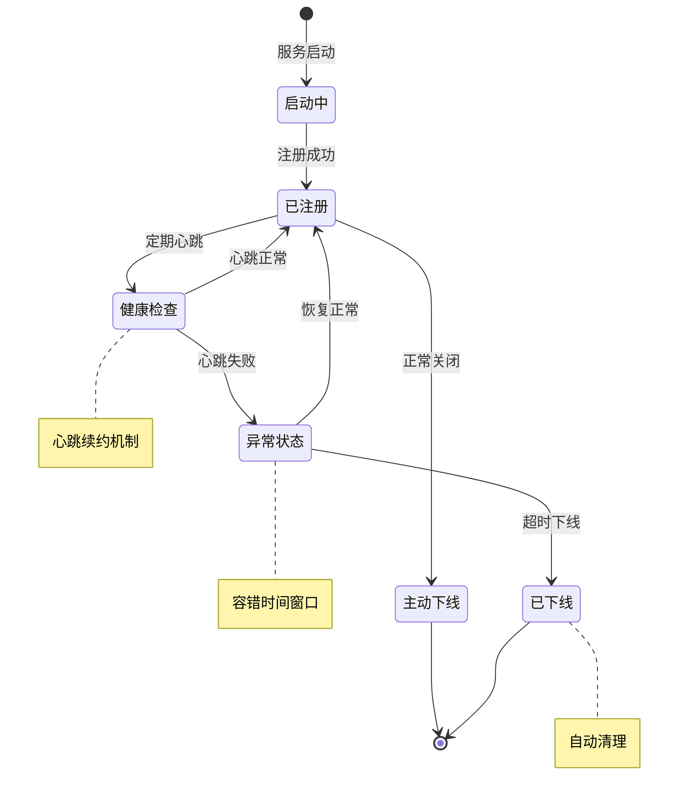
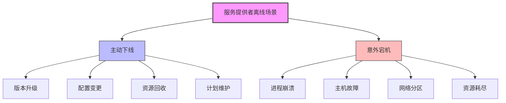
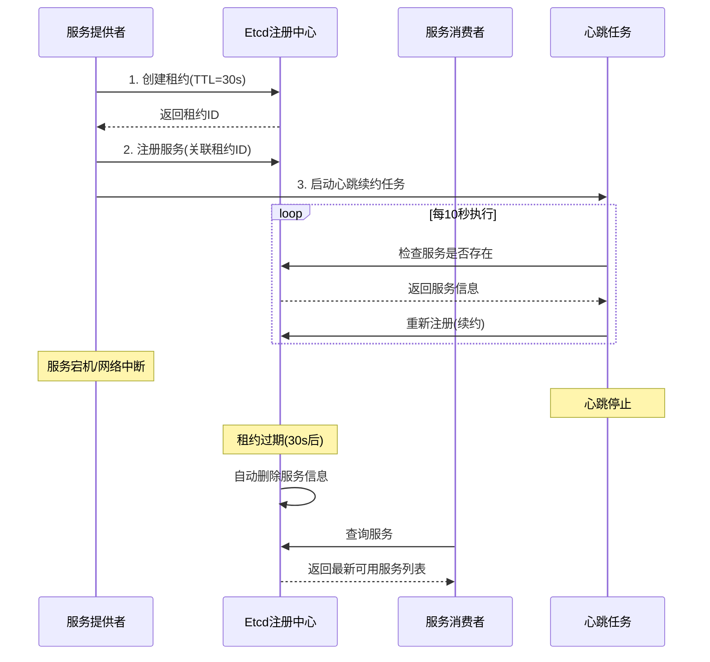
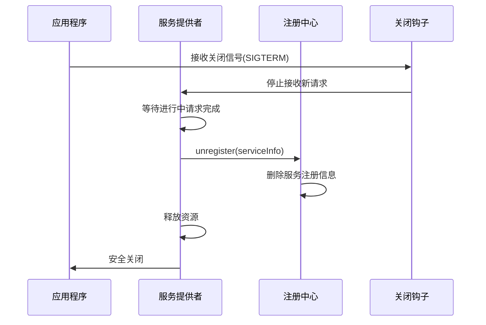
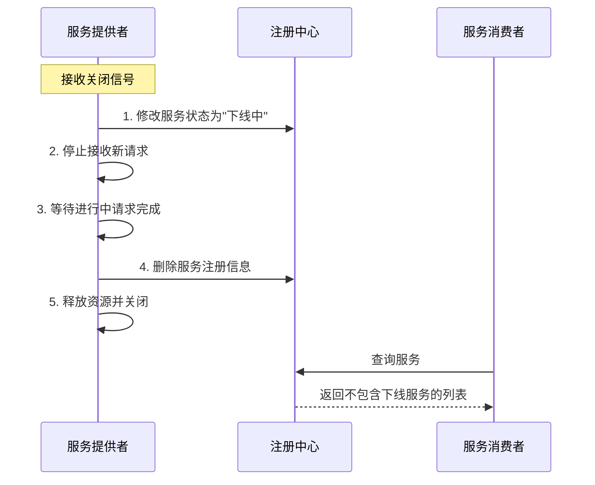
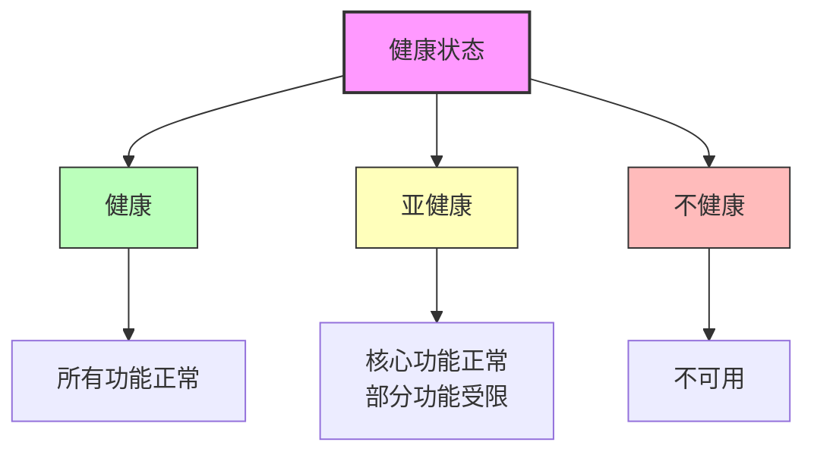
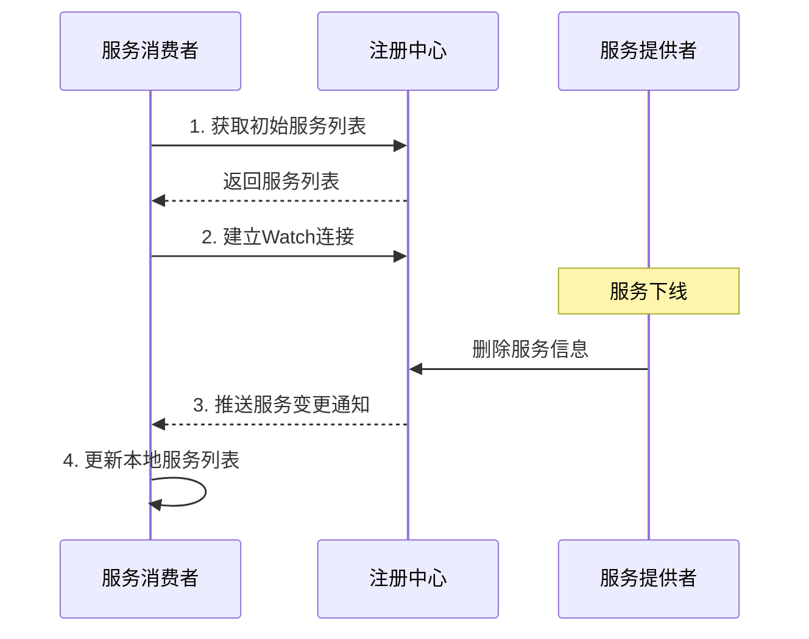

# Ming RPC Framework 注册中心服务信息有效性保障详解

## 📖 概述

在分布式RPC框架中，服务提供者的动态变化是常态。Ming RPC Framework通过多重保障机制确保注册中心上的服务信息始终有效，避免服务消费者调用不可用的服务实例。

### 🎯 核心问题
> 服务提供者节点主动下线或宕机时，如何保证注册中心上服务信息的有效性？

### 💡 有效性保障的价值
1. **系统可用性**: 避免调用不可用的服务实例，提升系统整体可用性
2. **故障隔离**: 快速隔离故障节点，防止故障扩散
3. **用户体验**: 减少因调用失败导致的用户体验下降
4. **资源优化**: 及时释放无效服务信息，优化注册中心性能

### 🔄 服务生命周期管理


## 服务提供者离线场景分析



### 主动下线

主动下线是指服务提供者通过正常流程停止服务的情况。这种情况下，服务实例可以主动通知注册中心其即将不可用的状态。主动下线通常发生在：

- **版本升级**：部署新版本的服务
- **配置变更**：需要重启应用的配置修改
- **资源回收**：释放未充分利用的计算资源
- **计划维护**：系统定期维护和优化

### 意外宕机

意外宕机是指服务提供者由于各种故障突然中断服务的情况。这种情况下，服务实例通常无法主动通知注册中心。意外宕机可能由以下原因导致：

- **进程崩溃**：服务程序异常终止
- **主机故障**：物理机或虚拟机故障
- **网络分区**：服务实例与注册中心之间的网络中断
- **资源耗尽**：内存泄漏、磁盘空间不足、连接池耗尽等

## 🛡️ Ming RPC Framework有效性保障机制

### 1. 基于租约(Lease)的生命周期管理

#### Etcd租约机制实现
**文件路径**: `rpc-core/src/main/java/com/ming/rpc/registry/EtcdRegistry.java`



#### 服务注册实现
```java
@Override
public void register(ServiceMetaInfo serviceMetaInfo) throws Exception {
    // 创建Lease和KV客户端
    Lease leaseClient = client.getLeaseClient();

    // 创建一个30秒的租约
    long leaseId = leaseClient.grant(30).get().getID();

    // 设置要存储的键值对
    String registerKey = ETCD_ROOT_PATH + serviceMetaInfo.getServiceNodeKey();
    ByteSequence key = ByteSequence.from(registerKey, StandardCharsets.UTF_8);
    ByteSequence value = ByteSequence.from(JSONUtil.toJsonStr(serviceMetaInfo), StandardCharsets.UTF_8);

    // 将键值对与租约关联
    PutOption putOption = PutOption.builder().withLeaseId(leaseId).build();
    kvClient.put(key, value, putOption).get();

    // 添加节点信息到本地缓存
    localRegisterNodeKeySet.add(registerKey);
}
```

#### 心跳续约机制
```java
@Override
public void heartbeat() {
    // 10秒续签一次
    CronUtil.schedule("*/10 * * * * *", new Task() {
        @Override
        public void execute() {
            // 遍历本节点所有的Key
            for(String key : localRegisterNodeKeySet) {
               try {
                List<KeyValue> keyValues = kvClient.get(ByteSequence.from(key, StandardCharsets.UTF_8))
                        .get()
                        .getKvs();

                // 该节点已经过期，需要重启节点才能重新注册
                if(CollUtil.isEmpty(keyValues)) {
                    continue;
                }

                // 节点未过期，重新注册，相当于续签
                KeyValue keyValue = keyValues.get(0);
                String value = keyValue.getValue().toString(StandardCharsets.UTF_8);
                ServiceMetaInfo serviceMetaInfo = JSONUtil.toBean(value, ServiceMetaInfo.class);
                register(serviceMetaInfo);

              } catch (Exception e) {
                throw new RuntimeException(key + " 续签失败", e);
              }
            }
         }
    });

    // 支持秒级别定时任务
    CronUtil.setMatchSecond(true);
    // 启动定时任务
    CronUtil.start();
}
```

### 2. 优雅下线机制

#### 主动注销实现
```java
@Override
public void unregister(ServiceMetaInfo serviceMetaInfo) {
    String registerKey = ETCD_ROOT_PATH + serviceMetaInfo.getServiceNodeKey();

    // 从Etcd删除服务信息
    kvClient.delete(ByteSequence.from(registerKey, StandardCharsets.UTF_8));

    // 也要从本地缓存移除
    localRegisterNodeKeySet.remove(registerKey);
}
```

#### 优雅下线流程


#### 关闭钩子实现
```java
public class GracefulShutdownHook {

    public static void registerShutdownHook(Registry registry, ServiceMetaInfo serviceMetaInfo) {
        Runtime.getRuntime().addShutdownHook(new Thread(() -> {
            try {
                log.info("开始优雅关闭服务...");

                // 1. 从注册中心注销服务
                registry.unregister(serviceMetaInfo);
                log.info("服务已从注册中心注销");

                // 2. 等待进行中的请求完成
                Thread.sleep(5000); // 等待5秒

                // 3. 关闭资源
                registry.destroy();
                log.info("服务优雅关闭完成");

            } catch (Exception e) {
                log.error("优雅关闭过程中发生异常", e);
            }
        }));
    }
}
```

### 2. 优雅下线流程

对于主动下线的场景，可以实现优雅下线流程，确保服务消费者不会调用到正在关闭的服务：



#### 实现要点

- **状态标记**：提供者可先将自身状态标记为"下线中"，同时保持注册信息存在
- **请求处理**：拒绝新请求，同时处理完已接收的请求
- **延迟删除**：等待所有请求处理完毕后，再从注册中心删除注册信息
- **资源释放**：关闭连接、释放资源、退出进程

### 3. 健康检查机制

除了基本的心跳机制，更完善的注册中心还会实现多层次的健康检查：

#### 进程级健康检查

检查服务进程是否存活，通常通过心跳或TCP连接探测实现。

#### 应用级健康检查

检查服务的核心功能是否正常，通常通过调用特定的健康检查API实现。

#### 依赖级健康检查

检查服务依赖的关键组件（如数据库、缓存等）是否正常，确保服务能完整提供功能。

#### 健康状态分级



- **健康**：服务完全正常，所有功能可用
- **亚健康**：核心功能正常，部分非关键功能受限
- **不健康**：服务不可用，需要从可用列表中移除

### 4. 分布式一致性保证

使用Etcd作为注册中心的一个重要优势是其基于Raft算法的强一致性保证：

- **原子操作**：服务注册、注销、状态更新等操作都是原子的
- **事务支持**：可以使用事务确保相关操作的一致性
- **线性一致性**：客户端总能读取到最新的服务信息
- **防脑裂**：在网络分区情况下，避免出现多个不一致的决策中心

## 应对特殊场景的策略

### 网络分区

当服务提供者与注册中心之间的网络出现问题，但服务本身可能对某些客户端仍然可用：

- **网络拓扑感知**：让客户端优先选择网络上"邻近"的服务实例
- **多注册中心部署**：在不同网络区域部署注册中心，减少网络分区的影响
- **本地缓存**：客户端缓存服务列表，在注册中心不可用时仍能提供有限服务

### 大规模服务宕机

当大量服务同时宕机（如数据中心故障）时：

- **批量处理**：实现租约批处理和服务批量注销，减轻注册中心压力
- **分级缓存**：采用多级缓存策略，减少注册中心负载
- **限流保护**：对注册中心实施限流措施，保护其不被大量请求击垮

### 服务异常但进程存活

服务进程存在但功能异常（如死锁、资源耗尽）时：

- **深度健康检查**：检测服务的实际功能可用性，而非仅检查进程存活
- **指标监控**：监控关键性能指标（响应时间、错误率等），发现异常时主动下线
- **自我修复**：实现自动重启、资源释放等自愈机制

## 客户端适应策略

服务消费者也需要实现相应策略，以应对服务提供者可能的离线：

### 实时感知服务变化

基于Etcd的Watch机制，客户端可以实时监听服务列表变化：



### 容错机制

- **重试策略**：在服务调用失败时，按特定策略重试其他实例
- **熔断机制**：当服务频繁失败时，暂时熔断以防止雪崩效应
- **降级服务**：在无可用服务时，提供降级功能或返回默认结果

### 本地缓存与定期刷新

- **缓存服务列表**：本地缓存最近获取的服务列表
- **定期全量拉取**：定期从注册中心获取完整服务列表，作为Watch机制的补充
- **缓存过期策略**：实现缓存过期策略，确保不使用过期数据

## 最佳实践

### 租约TTL设置

- **网络稳定环境**：可设置较短的TTL，如10-30秒
- **网络波动环境**：适当延长TTL，如30-60秒
- **混合策略**：结合服务重要性和网络条件动态调整TTL

### 健康检查策略

- **多层次检查**：结合进程级、应用级和依赖级健康检查
- **异步检查**：健康检查应异步执行，不阻塞主要业务流程
- **适当频率**：避免过于频繁的健康检查给系统带来额外负担

### 优雅关闭流程

- **信号处理**：捕获SIGTERM等关闭信号，启动优雅关闭流程
- **双阶段关闭**：先停止接收新请求，再等待处理完成后关闭
- **超时控制**：设置最大等待时间，避免关闭过程无限期等待

### 监控与告警

- **监控注册行为**：监控服务注册、注销的频率和模式
- **异常检测**：检测异常的服务上下线行为，及时告警
- **健康状态分布**：监控整体服务健康状态分布，发现系统性问题

### 3. 多注册中心有效性保障

#### ZooKeeper临时节点机制
**文件路径**: `rpc-core/src/main/java/com/ming/rpc/registry/ZooKeeperRegistry.java`

```java
@Override
public void register(ServiceMetaInfo serviceMetaInfo) throws Exception {
    // 注册到ZK中，使用临时节点
    serviceDiscovery.registerService(buildServiceInstance(serviceMetaInfo));

    // 添加节点信息到本地缓存
    String serviceNodeKey = buildServiceNodeKey(serviceMetaInfo);
    localRegisterNodeKeySet.add(serviceNodeKey);
}

@Override
public void unregister(ServiceMetaInfo serviceMetaInfo) {
    try {
        serviceDiscovery.unregisterService(buildServiceInstance(serviceMetaInfo));
    } catch (Exception e) {
        throw new RuntimeException("注销服务失败", e);
    }
    // 从本地缓存移除
    String serviceNodeKey = buildServiceNodeKey(serviceMetaInfo);
    localRegisterNodeKeySet.remove(serviceNodeKey);
}
```

#### Consul健康检查机制
**文件路径**: `rpc-core/src/main/java/com/ming/rpc/registry/ConsulRegistry.java`

```java
@Override
public List<ServiceMetaInfo> serviceDiscovery(String serviceKey) {
    // 优先从缓存获取
    List<ServiceMetaInfo> cachedServices = registryServiceCache.readCache(serviceKey);
    if (cachedServices != null && !cachedServices.isEmpty()) {
        return cachedServices;
    }

    // 从Consul获取健康的服务实例
    List<ServiceHealth> serviceHealthList =
        healthClient.getHealthyServiceInstances(serviceKey).getResponse();

    List<ServiceMetaInfo> serviceMetaInfoList = serviceHealthList.stream()
            .map(serviceHealth -> {
                Map<String, String> meta = serviceHealth.getService().getMeta();
                try {
                    return serializer.deserialize(
                        meta.get("serviceMetaInfo").getBytes(),
                        ServiceMetaInfo.class
                    );
                } catch (IOException e) {
                    throw new RuntimeException("Failed to deserialize service meta info", e);
                }
            })
            .collect(Collectors.toList());

    // 写入缓存
    registryServiceCache.writeCache(serviceKey, serviceMetaInfoList);
    return serviceMetaInfoList;
}
```

#### Nacos自动心跳机制
**文件路径**: `rpc-core/src/main/java/com/ming/rpc/registry/NacosRegistry.java`

```java
@Override
public void heartbeat() {
    // Nacos客户端自动处理心跳
    // 无需手动实现心跳逻辑
}

@Override
public void watch(String serviceKey) {
    try {
        namingService.subscribe(serviceKey, event -> {
            log.info("Nacos服务变更，清理缓存: {}", serviceKey);
            registryServiceCache.clearCache();
        });
    } catch (NacosException e) {
        log.error("订阅Nacos服务失败", e);
    }
}
```

## 📋 Ming RPC Framework有效性保障总结

Ming RPC Framework通过多重保障机制确保注册中心服务信息的有效性：

### 🎉 核心保障机制
- **租约机制**: Etcd基于租约的自动过期清理
- **临时节点**: ZooKeeper基于会话的临时节点机制
- **健康检查**: Consul基于健康检查的服务状态监控
- **自动心跳**: Nacos客户端自动心跳和推送机制
- **时间戳清理**: 数据库注册中心基于时间戳的过期清理

### 🔧 技术特色
- **多注册中心支持**: 适配不同注册中心的特性
- **自动故障检测**: 快速发现和隔离故障节点
- **优雅下线**: 支持服务的优雅关闭和注销
- **实时监控**: 提供完善的监控和告警机制

### 💡 设计优势
- **高可用性**: 多重保障确保服务信息的准确性
- **快速恢复**: 故障检测和恢复时间在秒级
- **资源优化**: 及时清理无效信息，优化性能
- **运维友好**: 提供丰富的监控和故障排查手段

### 🚀 适用场景
- **微服务架构**: 大规模微服务的动态管理
- **云原生环境**: 容器化部署的服务发现
- **高可用系统**: 对可用性要求极高的业务系统
- **弹性伸缩**: 支持服务实例的动态扩缩容

保证注册中心服务信息的有效性是构建可靠分布式系统的基础。Ming RPC Framework通过合理利用租约机制、实现优雅下线流程、完善健康检查、强化客户端适应策略，有效处理了服务提供者主动下线或意外宕机的情况，确保服务消费者始终能够获取到准确的服务信息，从而提高了系统整体的可用性和稳定性。