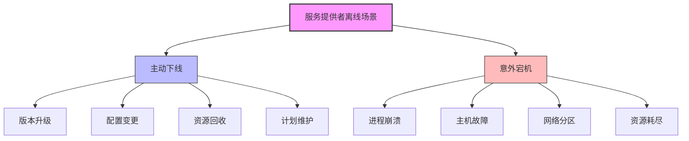
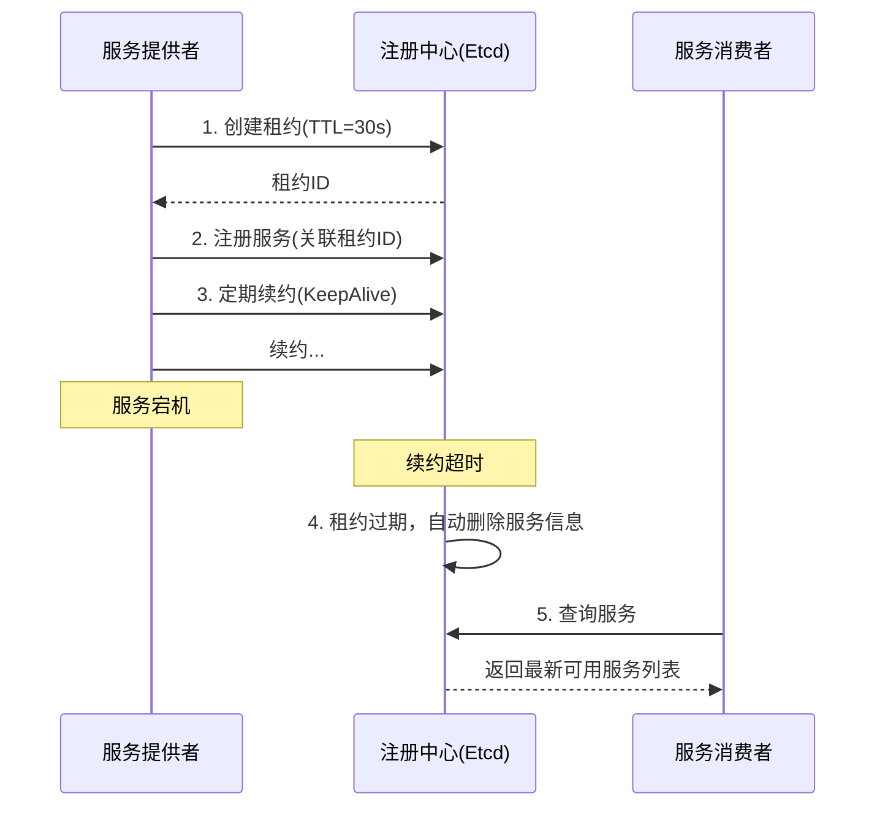
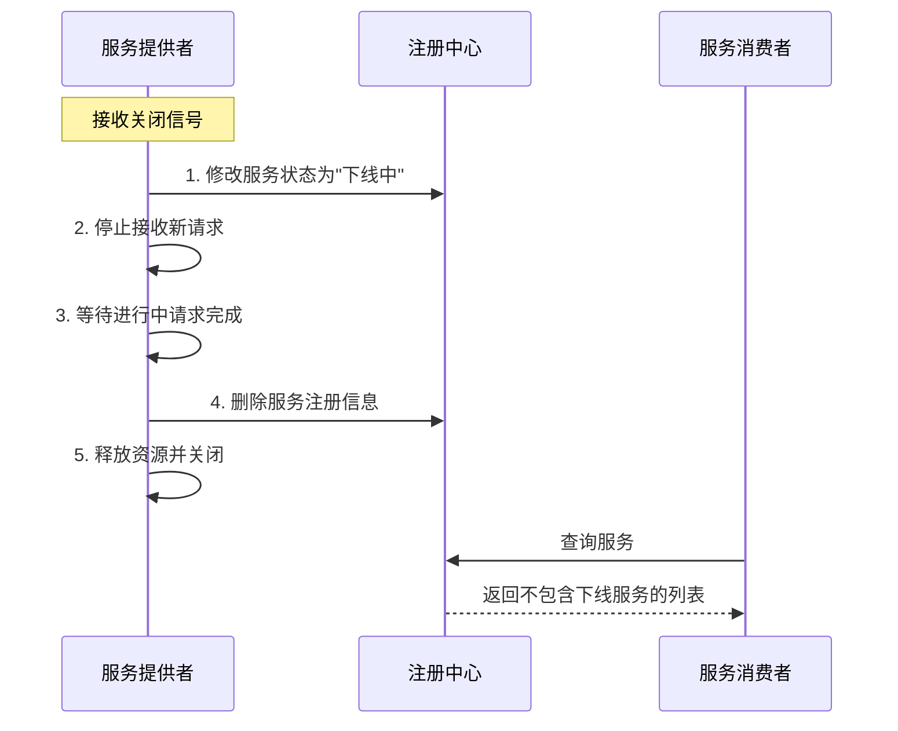
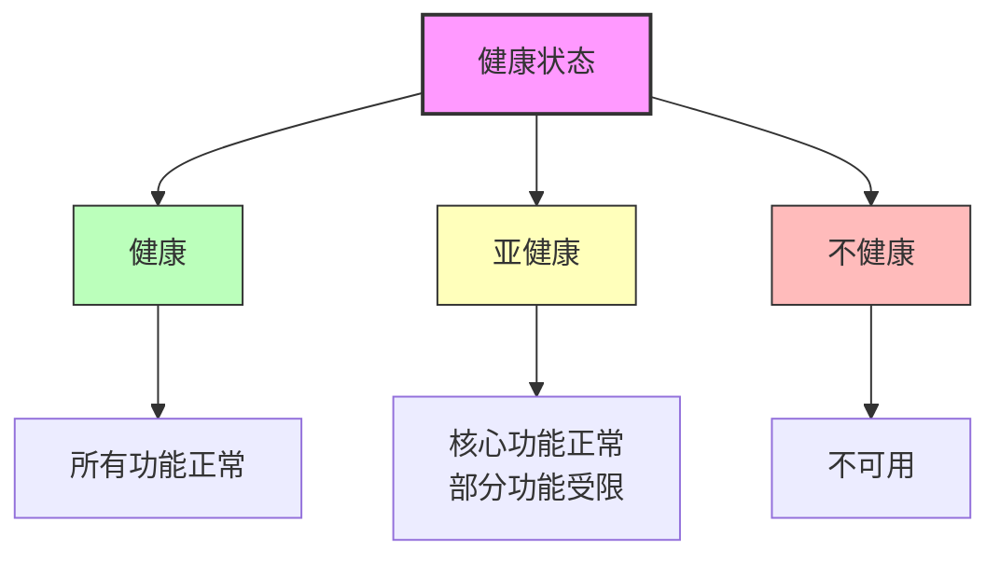
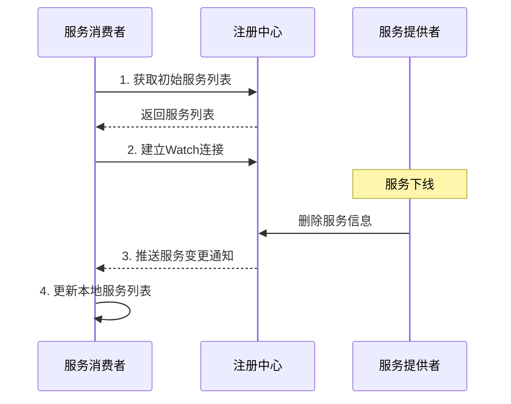

# 注册中心服务信息有效性保障

## 问题

> 服务提供者节点主动下线或宕机时，如何保证注册中心上服务信息的有效性？

## 引言

在分布式RPC框架中，服务提供者可能因为多种原因离线：计划内的维护、版本更新、资源回收，或者意外的宕机、网络故障、硬件错误等。无论是哪种情况，都需要确保注册中心能及时感知这些变化，并更新服务信息，避免服务消费者调用已经不可用的服务实例。

本文将详细探讨如何保证注册中心上服务信息的有效性，特别是在服务提供者节点异常退出的情况下。

## 服务提供者离线场景分析

### 主动下线

主动下线是指服务提供者通过正常流程停止服务的情况。这种情况下，服务实例可以主动通知注册中心其即将不可用的状态。主动下线通常发生在：

- **版本升级**：部署新版本的服务
- **配置变更**：需要重启应用的配置修改
- **资源回收**：释放未充分利用的计算资源
- **计划维护**：系统定期维护和优化

### 意外宕机

意外宕机是指服务提供者由于各种故障突然中断服务的情况。这种情况下，服务实例通常无法主动通知注册中心。意外宕机可能由以下原因导致：

- **进程崩溃**：服务程序异常终止
- **主机故障**：物理机或虚拟机故障
- **网络分区**：服务实例与注册中心之间的网络中断
- **资源耗尽**：内存泄漏、磁盘空间不足、连接池耗尽等

## 注册中心服务信息有效性保障机制

为了应对以上场景，保证注册中心服务信息的有效性，主要采用以下机制：

### 1. 基于租约(Lease)的生命周期管理

#### 工作原理

1. **租约创建**：服务提供者在启动时向注册中心申请一个带有TTL(Time-To-Live)的租约
2. **服务注册**：将服务信息注册到注册中心，并关联到已创建的租约
3. **定期续约**：服务提供者需要在租约到期前定期发送KeepAlive请求，以延长租约有效期
4. **自动清理**：如果服务提供者因故无法续约，租约到期后，关联的服务信息会被自动删除

#### 关键参数配置

- **TTL设置**：租约的生存时间是一个关键参数
  - 太短：可能导致网络抖动时服务被错误下线
  - 太长：可能导致发现服务失效的延迟增加
  - 推荐：通常设置为心跳间隔的3-5倍，如心跳10秒则TTL设为30-50秒

- **续约频率**：通常设置为TTL的1/3左右，确保即使偶尔续约失败也有足够时间重试

### 2. 优雅下线流程

对于主动下线的场景，可以实现优雅下线流程，确保服务消费者不会调用到正在关闭的服务：

#### 实现要点

- **状态标记**：提供者可先将自身状态标记为"下线中"，同时保持注册信息存在
- **请求处理**：拒绝新请求，同时处理完已接收的请求
- **延迟删除**：等待所有请求处理完毕后，再从注册中心删除注册信息
- **资源释放**：关闭连接、释放资源、退出进程

### 3. 健康检查机制

除了基本的心跳机制，更完善的注册中心还会实现多层次的健康检查：

#### 进程级健康检查

检查服务进程是否存活，通常通过心跳或TCP连接探测实现。

#### 应用级健康检查

检查服务的核心功能是否正常，通常通过调用特定的健康检查API实现。

#### 依赖级健康检查

检查服务依赖的关键组件（如数据库、缓存等）是否正常，确保服务能完整提供功能。

#### 健康状态分级

- **健康**：服务完全正常，所有功能可用
- **亚健康**：核心功能正常，部分非关键功能受限
- **不健康**：服务不可用，需要从可用列表中移除

### 4. 分布式一致性保证

使用Etcd作为注册中心的一个重要优势是其基于Raft算法的强一致性保证：

- **原子操作**：服务注册、注销、状态更新等操作都是原子的
- **事务支持**：可以使用事务确保相关操作的一致性
- **线性一致性**：客户端总能读取到最新的服务信息
- **防脑裂**：在网络分区情况下，避免出现多个不一致的决策中心

## 应对特殊场景的策略

### 网络分区

当服务提供者与注册中心之间的网络出现问题，但服务本身可能对某些客户端仍然可用：

- **网络拓扑感知**：让客户端优先选择网络上"邻近"的服务实例
- **多注册中心部署**：在不同网络区域部署注册中心，减少网络分区的影响
- **本地缓存**：客户端缓存服务列表，在注册中心不可用时仍能提供有限服务

### 大规模服务宕机

当大量服务同时宕机（如数据中心故障）时：

- **批量处理**：实现租约批处理和服务批量注销，减轻注册中心压力
- **分级缓存**：采用多级缓存策略，减少注册中心负载
- **限流保护**：对注册中心实施限流措施，保护其不被大量请求击垮

### 服务异常但进程存活

服务进程存在但功能异常（如死锁、资源耗尽）时：

- **深度健康检查**：检测服务的实际功能可用性，而非仅检查进程存活
- **指标监控**：监控关键性能指标（响应时间、错误率等），发现异常时主动下线
- **自我修复**：实现自动重启、资源释放等自愈机制

## 客户端适应策略

服务消费者也需要实现相应策略，以应对服务提供者可能的离线：

### 实时感知服务变化

基于Etcd的Watch机制，客户端可以实时监听服务列表变化：

### 容错机制

- **重试策略**：在服务调用失败时，按特定策略重试其他实例
- **熔断机制**：当服务频繁失败时，暂时熔断以防止雪崩效应
- **降级服务**：在无可用服务时，提供降级功能或返回默认结果

### 本地缓存与定期刷新

- **缓存服务列表**：本地缓存最近获取的服务列表
- **定期全量拉取**：定期从注册中心获取完整服务列表，作为Watch机制的补充
- **缓存过期策略**：实现缓存过期策略，确保不使用过期数据

## 最佳实践

### 租约TTL设置

- **网络稳定环境**：可设置较短的TTL，如10-30秒
- **网络波动环境**：适当延长TTL，如30-60秒
- **混合策略**：结合服务重要性和网络条件动态调整TTL

### 健康检查策略

- **多层次检查**：结合进程级、应用级和依赖级健康检查
- **异步检查**：健康检查应异步执行，不阻塞主要业务流程
- **适当频率**：避免过于频繁的健康检查给系统带来额外负担

### 优雅关闭流程

- **信号处理**：捕获SIGTERM等关闭信号，启动优雅关闭流程
- **双阶段关闭**：先停止接收新请求，再等待处理完成后关闭
- **超时控制**：设置最大等待时间，避免关闭过程无限期等待

### 监控与告警

- **监控注册行为**：监控服务注册、注销的频率和模式
- **异常检测**：检测异常的服务上下线行为，及时告警
- **健康状态分布**：监控整体服务健康状态分布，发现系统性问题

## 总结

保证注册中心服务信息的有效性是构建可靠分布式系统的基础。通过合理利用租约机制、实现优雅下线流程、完善健康检查、强化客户端适应策略，可以有效处理服务提供者主动下线或意外宕机的情况，确保服务消费者始终能够获取到准确的服务信息，从而提高系统整体的可用性和稳定性。

在实际实现中，需要针对具体场景和需求，调整各项参数和策略，找到可靠性与性能之间的平衡点。同时，监控与告警系统的建设也是不可或缺的，它能帮助运维人员及时发现和解决潜在问题，确保服务注册发现机制的健康运行。 