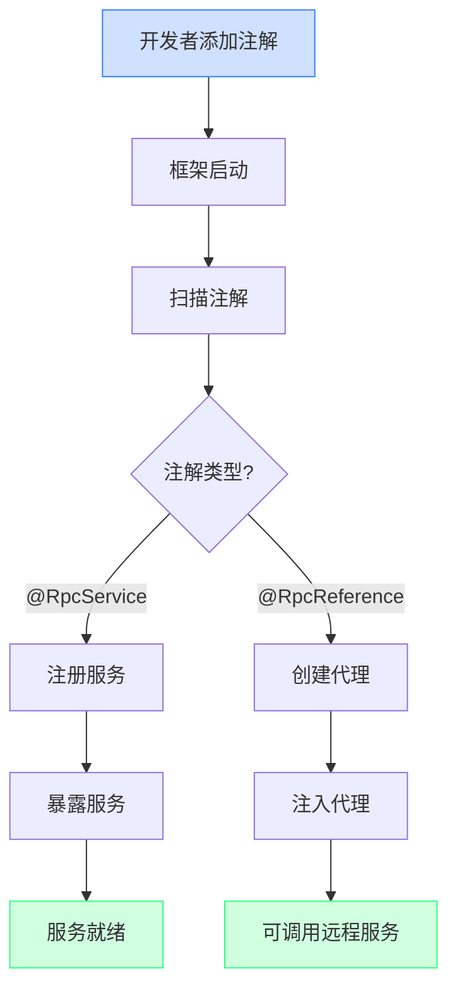

# 注解驱动机制与开发成本优化

## 面试题目

如何简化开发者使用 RPC 框架的成本？怎么通过注解驱动框架的启动？

## 引言

一个优秀的框架不仅要功能强大、性能优越，还要具备良好的开发体验。框架的使用成本直接影响其普及程度和开发效率。本文将详细探讨如何通过注解驱动机制简化 RPC 框架的使用，降低开发者的上手门槛和使用成本。

## 1. 开发者使用成本的痛点

在传统 RPC 框架使用过程中，开发者通常面临以下挑战：

1. **大量样板代码**：需要手动编写服务注册、发现、代理获取等重复性代码
2. **复杂配置**：需要了解并配置框架的各种参数和选项
3. **组件装配**：需要手动管理和装配框架的各个组件
4. **生命周期管理**：需要处理框架和服务的启动、关闭等生命周期事件
5. **多环境适配**：需要为不同环境（开发、测试、生产）维护不同配置

这些挑战增加了使用 RPC 框架的门槛，降低了开发效率。

## 2. 注解驱动的基本原理

注解驱动是现代 Java 框架常用的简化使用成本的手段，其基本原理是：

1. **声明式配置**：通过注解声明意图，而不是编程式实现
2. **反射与字节码增强**：运行时通过反射和字节码技术处理注解
3. **自动化组装**：框架根据注解自动完成组件装配和初始化
4. **约定大于配置**：提供合理默认值，减少必要配置

## 3. 注解驱动框架的设计

在 learn-RPC 框架中，注解驱动机制包含以下关键设计：

### 3.1 核心注解设计

```java
/**
 * 标记RPC服务提供者
 */
@Target({ElementType.TYPE})
@Retention(RetentionPolicy.RUNTIME)
@Documented
public @interface RpcService {
    /**
     * 服务接口类
     */
    Class<?> interfaceClass() default void.class;
    
    /**
     * 服务版本
     */
    String version() default "";
    
    /**
     * 服务分组
     */
    String group() default "";
}

/**
 * 标记RPC服务消费者
 */
@Target({ElementType.FIELD})
@Retention(RetentionPolicy.RUNTIME)
@Documented
public @interface RpcReference {
    /**
     * 服务版本
     */
    String version() default "";
    
    /**
     * 服务分组
     */
    String group() default "";
    
    /**
     * 超时时间，单位毫秒
     */
    long timeout() default 3000;
    
    /**
     * 重试次数
     */
    int retries() default 2;
}
```

### 3.2 自动装配机制

框架需要提供自动扫描和处理注解的能力：

```java
/**
 * RPC框架启动器
 */
public class RpcBootstrap {
    /**
     * 启动RPC框架
     * @param basePackage 要扫描的基础包
     */
    public static void init(String basePackage) {
        // 扫描带有@RpcService注解的类
        Set<Class<?>> serviceClasses = scanServiceClasses(basePackage);
        
        // 注册服务
        registerServices(serviceClasses);
        
        // 启动服务器
        startServer();
        
        // 初始化客户端引用
        initReferences(basePackage);
    }
    
    /**
     * 扫描带有@RpcService注解的类
     */
    private static Set<Class<?>> scanServiceClasses(String basePackage) {
        // 实现类扫描逻辑...
    }
    
    /**
     * 注册服务
     */
    private static void registerServices(Set<Class<?>> serviceClasses) {
        for (Class<?> serviceClass : serviceClasses) {
            RpcService annotation = serviceClass.getAnnotation(RpcService.class);
            
            // 获取服务接口
            Class<?> interfaceClass = annotation.interfaceClass();
            if (interfaceClass == void.class) {
                // 如果未指定接口，则取第一个实现的接口
                interfaceClass = serviceClass.getInterfaces()[0];
            }
            
            // 生成服务唯一标识（考虑版本和分组）
            String serviceName = interfaceClass.getName();
            String version = annotation.version();
            String group = annotation.group();
            String serviceKey = generateServiceKey(serviceName, version, group);
            
            // 注册服务
            LocalRegistry.register(serviceKey, serviceClass);
        }
    }
    
    /**
     * 初始化客户端引用
     */
    private static void initReferences(String basePackage) {
        // 扫描带有@RpcReference注解的字段
        // 为每个字段注入代理对象
    }
    
    // 其他辅助方法...
}
```

## 4. 基于Spring的更强大集成

对于大多数Java企业应用，Spring框架已成为标准配置。将RPC框架与Spring集成可以进一步降低使用成本：

### 4.1 Spring注解扩展

```java
/**
 * 启用RPC功能的Spring注解
 */
@Target(ElementType.TYPE)
@Retention(RetentionPolicy.RUNTIME)
@Documented
@Import(RpcSpringRegistrar.class)
public @interface EnableRpc {
    /**
     * 扫描的包路径
     */
    String[] basePackages() default {};
    
    /**
     * 注册中心地址
     */
    String registry() default "127.0.0.1:2181";
    
    /**
     * 服务端口
     */
    int port() default 8080;
}
```

### 4.2 Spring Bean后处理器

```java
/**
 * 处理RPC相关注解的Spring Bean后处理器
 */
public class RpcBeanPostProcessor implements BeanPostProcessor, ApplicationContextAware {
    
    private ApplicationContext applicationContext;
    
    @Override
    public Object postProcessBeforeInitialization(Object bean, String beanName) throws BeansException {
        // 处理@RpcService注解
        if (bean.getClass().isAnnotationPresent(RpcService.class)) {
            RpcService annotation = bean.getClass().getAnnotation(RpcService.class);
            // 注册服务...
        }
        return bean;
    }
    
    @Override
    public Object postProcessAfterInitialization(Object bean, String beanName) throws BeansException {
        // 处理@RpcReference注解
        Field[] fields = bean.getClass().getDeclaredFields();
        for (Field field : fields) {
            if (field.isAnnotationPresent(RpcReference.class)) {
                RpcReference annotation = field.getAnnotation(RpcReference.class);
                
                // 创建代理
                Class<?> interfaceClass = field.getType();
                Object proxy = createProxy(interfaceClass, annotation);
                
                // 注入代理对象
                field.setAccessible(true);
                try {
                    field.set(bean, proxy);
                } catch (IllegalAccessException e) {
                    throw new RuntimeException("Failed to inject RPC reference", e);
                }
            }
        }
        return bean;
    }
    
    @Override
    public void setApplicationContext(ApplicationContext applicationContext) throws BeansException {
        this.applicationContext = applicationContext;
    }
    
    private Object createProxy(Class<?> interfaceClass, RpcReference annotation) {
        // 创建代理对象逻辑...
        return ServiceProxyFactory.getProxy(interfaceClass);
    }
}
```

## 5. 使用示例对比

### 5.1 传统方式使用RPC框架

```java
// 服务提供方
public class ProviderApplication {
    public static void main(String[] args) {
        // 1. 创建服务实现类
        UserServiceImpl userService = new UserServiceImpl();
        
        // 2. 手动注册服务
        LocalRegistry.register(UserService.class.getName(), UserServiceImpl.class);
        
        // 3. 启动RPC服务器
        HttpServer server = new VertexHttpServer();
        server.doStart(8080);
    }
}

// 服务消费方
public class ConsumerApplication {
    public static void main(String[] args) {
        // 1. 手动创建代理
        UserService userService = ServiceProxyFactory.getProxy(UserService.class);
        
        // 2. 调用远程服务
        User user = new User();
        user.setName("张三");
        User result = userService.getUser(user);
    }
}
```

### 5.2 注解驱动方式使用RPC框架

```java
// 服务提供方
@EnableRpc
public class ProviderApplication {
    public static void main(String[] args) {
        SpringApplication.run(ProviderApplication.class, args);
    }
}

@RpcService
public class UserServiceImpl implements UserService {
    @Override
    public User getUser(User user) {
        // 实现逻辑...
    }
}

// 服务消费方
@EnableRpc
public class ConsumerApplication {
    public static void main(String[] args) {
        SpringApplication.run(ConsumerApplication.class, args);
    }
}

@Service
public class UserController {
    @RpcReference
    private UserService userService;
    
    public User getUser(String name) {
        User user = new User();
        user.setName(name);
        return userService.getUser(user);
    }
}
```

## 6. 注解驱动带来的优势

### 6.1 减少样板代码

通过注解驱动，开发者不需要编写大量的框架配置和初始化代码，只需关注业务逻辑的实现。

### 6.2 降低学习曲线

开发者只需了解少量关键注解的使用方法，无需深入理解框架内部原理，即可快速上手。

### 6.3 提高可维护性

注解使代码更加简洁明了，意图更加清晰，提高了代码的可读性和可维护性。

### 6.4 配置集中化

框架配置可以集中在少量注解属性中，避免了配置文件的分散管理。

### 6.5 与现有生态集成

通过与Spring等主流框架的集成，可以无缝融入现有项目架构，减少迁移成本。

## 7. 注解驱动流程示意图



## 总结

注解驱动机制极大地简化了RPC框架的使用成本，通过声明式编程替代了传统的命令式编程，让开发者能够更加专注于业务逻辑而非框架细节。在learn-RPC项目中，通过设计`@RpcService`和`@RpcReference`等核心注解，结合自动扫描和依赖注入机制，实现了框架的自动化配置和组装，大幅降低了使用门槛。

特别是与Spring框架的结合，让RPC服务的开发变得如同普通Spring Bean一样简单，实现了"约定大于配置"的理念。这种易用性的提升不仅加速了开发过程，也减少了因配置错误导致的问题，提高了整体开发质量。

通过注解驱动，RPC框架真正实现了对复杂性的封装，让分布式服务调用变得简单而透明，这正是优秀框架设计的精髓所在。 