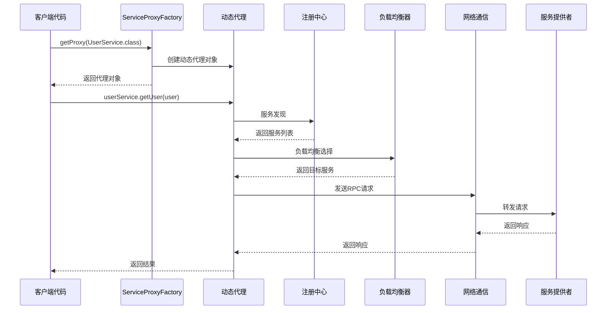
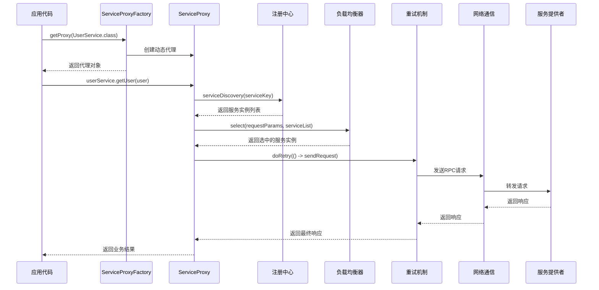
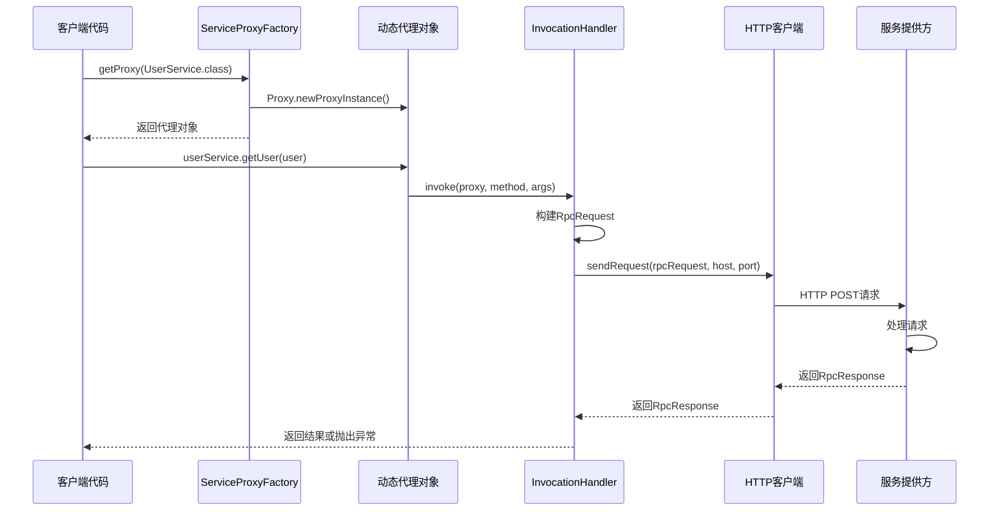

# Ming RPC Framework 消费方调用实现详解

## 📖 概述

在Ming RPC Framework中，消费方（客户端）通过JDK动态代理和工厂模式实现了透明化的远程服务调用。消费者可以像调用本地方法一样调用远程服务，所有的网络通信、序列化、负载均衡等复杂逻辑都被封装在代理层中。

### 🎯 核心问题
> 在Ming RPC Framework中是如何实现消费方调用的？为什么选用JDK动态代理和工厂模式？

### 💡 消费方调用的价值
1. **透明化调用**: 像调用本地方法一样调用远程服务
2. **复杂性封装**: 隐藏网络通信、序列化等底层细节
3. **统一处理**: 在代理层统一处理负载均衡、容错、重试等逻辑
4. **类型安全**: 保持强类型检查，避免运行时类型错误

### 🔄 消费方调用流程图


## 🚀 1. 消费方调用总体流程

### 1.1 核心流程步骤

Ming RPC Framework中消费方调用远程服务的完整流程：

1. **代理对象获取**: 通过ServiceProxyFactory获取服务接口的动态代理对象
2. **方法调用拦截**: 代理对象拦截方法调用，转换为RPC请求
3. **服务发现**: 从注册中心获取可用的服务提供者列表
4. **负载均衡**: 根据负载均衡策略选择目标服务实例
5. **网络通信**: 通过TCP/HTTP协议发送RPC请求
6. **重试容错**: 在失败时执行重试和容错策略
7. **响应处理**: 接收并解析服务提供方的响应
8. **结果返回**: 将响应结果返回给调用方

### 1.2 调用流程时序图


## 🎭 2. JDK动态代理实现

### 2.1 为什么选择JDK动态代理

JDK动态代理是Java内置的代理机制，在Ming RPC Framework中选择它的原因：

1. **零依赖**: 作为JDK标准库，无需引入额外依赖
2. **动态性**: 运行时动态生成代理类，支持任意接口
3. **性能优秀**: 基于字节码生成，性能优于反射调用
4. **类型安全**: 保持强类型检查，编译时发现错误
5. **简洁高效**: 实现代码简洁，易于理解和维护

### 2.2 ServiceProxyFactory代理工厂

#### 核心实现
**文件路径**: `rpc-core/src/main/java/com/ming/rpc/proxy/ServiceProxyFactory.java`

```java
/**
 * 服务代理工厂（工厂模式，用于创建代理对象）
 */
public class ServiceProxyFactory {

    /**
     * 获取服务代理对象
     */
    public static <T> T getProxy(Class<T> serviceClass) {
        // 根据配置决定返回Mock代理还是真实代理
        if (RpcApplication.getRpcConfig().isMock()) {
            return getMockProxy(serviceClass);
        }

        return (T) Proxy.newProxyInstance(
            serviceClass.getClassLoader(),
            new Class[] { serviceClass },
            new ServiceProxy()
        );
    }

    /**
     * 根据服务类获取Mock代理对象
     */
    public static <T> T getMockProxy(Class<T> serviceClass) {
        return (T) Proxy.newProxyInstance(
            serviceClass.getClassLoader(),
            new Class[] { serviceClass },
            new MockServiceProxy()
        );
    }
}
```

### 2.3 ServiceProxy动态代理处理器

#### 核心实现
**文件路径**: `rpc-core/src/main/java/com/ming/rpc/proxy/ServiceProxy.java`

```java
/**
 * 服务代理（JDK动态代理）
 */
public class ServiceProxy implements InvocationHandler {

    @Override
    public Object invoke(Object proxy, Method method, Object[] args) throws Throwable {
        // 构造RPC请求
        String serviceName = method.getDeclaringClass().getName();
        RpcRequest rpcRequest = RpcRequest.builder()
            .serviceName(serviceName)
            .methodName(method.getName())
            .parameterTypes(method.getParameterTypes())
            .args(args)
            .build();

        // 从注册中心获取服务提供者请求地址
        RpcConfig rpcConfig = RpcApplication.getRpcConfig();
        Registry registry = RegistryFactory.getInstance(rpcConfig.getRegistryConfig().getRegistry());
        ServiceMetaInfo serviceMetaInfo = new ServiceMetaInfo();
        serviceMetaInfo.setServiceName(serviceName);
        serviceMetaInfo.setServiceVersion(RpcConstant.DEFAULT_SERVICE_VERSION);
        List<ServiceMetaInfo> serviceMetaInfoList = registry.serviceDiscovery(serviceMetaInfo.getServiceKey());

        if (CollUtil.isEmpty(serviceMetaInfoList)) {
            throw new RuntimeException("暂无服务地址");
        }

        // 负载均衡
        LoadBalancer loadBalancer = LoadBalancerFactory.getInstance(rpcConfig.getLoadBalancer());
        Map<String, Object> requestParams = new HashMap<>();
        requestParams.put("methodName", rpcRequest.getMethodName());
        ServiceMetaInfo selectedServiceMetaInfo = loadBalancer.select(requestParams, serviceMetaInfoList);

        // 发送RPC请求（包含重试和容错机制）
        RpcResponse rpcResponse;
        try {
            RetryStrategy retryStrategy = RetryStrategyFactory.getInstance(rpcConfig.getRetryStrategy());
            rpcResponse = retryStrategy.doRetry(() ->
                    VertexTcpClient.doRequest(rpcRequest, selectedServiceMetaInfo)
            );
        } catch (Exception e) {
            // 容错机制
            TolerantStrategy tolerantStrategy = TolerantStrategyFactory.getInstance(rpcConfig.getTolerantStrategy());
            rpcResponse = tolerantStrategy.doTolerant(null, e);
        }

        return rpcResponse.getData();
    }
}
```

### 2.4 静态代理实现（简化版本）

#### UserServiceProxy静态代理
**文件路径**: `example-consumer/src/main/java/com/ming/example/consumer/client/proxy/UserServiceProxy.java`

```java
/**
 * 静态代理实现（用于演示对比）
 */
public class UserServiceProxy implements UserService {

    @Override
    public User getUser(User user) {
        System.out.println("开始调用远程服务...");

        // 序列化请求
        Serializer serializer = new JdkSerializer();
        RpcRequest rpcRequest = RpcRequest.builder()
                .serviceName(UserService.class.getName())
                .methodName("getUser")
                .parameterTypes(new Class[]{User.class})
                .args(new Object[]{user})
                .build();

        try {
            byte[] bodyBytes = serializer.serialize(rpcRequest);
            byte[] result;

            // 发送HTTP请求
            try(HttpResponse httpResponse = HttpRequest.post("http://localhost:8080")
                .body(bodyBytes)
                .execute()){
                result = httpResponse.bodyBytes();
            }

            // 反序列化响应
            RpcResponse rpcResponse = serializer.deserialize(result, RpcResponse.class);
            return (User) rpcResponse.getData();

        } catch(Exception e) {
            throw new RuntimeException("RPC调用失败", e);
        }
    }
}
```

    @Override
    public Object invoke(Object proxy, Method method, Object[] args) throws Throwable {
        // 处理Object类的方法
        if (method.getDeclaringClass() == Object.class) {
            return method.invoke(this, args);
        }
        
        // 构建RPC请求
        RpcRequest rpcRequest = RpcRequest.builder()
                .serviceName(serviceClass.getName())
                .methodName(method.getName())
                .parameterTypes(method.getParameterTypes())
                .args(args)
                .build();
        
        // 发送请求并获取响应
        RpcResponse rpcResponse = httpClient.sendRequest(rpcRequest, host, port);
        
        // 处理异常
        if (rpcResponse.getException() != null) {
            throw rpcResponse.getException();
        }
        
        // 返回结果
        return rpcResponse.getData();
    }
}
```

### 2.3 工作原理

JDK动态代理的工作原理是：

1. **创建代理类**：通过`Proxy.newProxyInstance()`方法创建实现指定接口的代理类实例
2. **方法拦截**：当调用代理对象的方法时，调用会被转发到`InvocationHandler`的`invoke`方法
3. **请求处理**：在`invoke`方法中，将方法调用信息（方法名、参数等）转换为RPC请求
4. **远程调用**：通过HTTP客户端发送RPC请求到服务提供方
5. **结果处理**：接收服务提供方的响应，并返回结果或抛出异常

## 3. 工厂模式的应用

### 3.1 为什么选择工厂模式

工厂模式在项目中的主要作用是封装代理对象的创建过程。选择工厂模式的原因包括：

1. **简化创建过程**：隐藏代理对象创建的复杂性，提供简单的接口
2. **封装变化点**：将可能变化的代理创建逻辑封装在工厂中，客户端代码不受影响
3. **统一管理**：集中管理代理对象的创建，便于未来扩展和维护
4. **提高可测试性**：便于在测试中mock或替换代理工厂

### 3.2 具体实现

`ServiceProxyFactory`类实现了工厂模式：

```java
public class ServiceProxyFactory {
    /**
     * 创建服务代理（使用默认主机名和端口）
     */
    public static <T> T getProxy(Class<T> serviceClass) {
        return (T) Proxy.newProxyInstance(
            serviceClass.getClassLoader(),
            new Class[]{serviceClass},
            new ServiceProxy());
    }

    /**
     * 创建服务代理
     */
    public static <T> T getProxy(Class<T> serviceClass, String host, int port) {
        HttpClient httpClient = new HttpClient();
        
        return (T) Proxy.newProxyInstance(
                serviceClass.getClassLoader(),
                new Class[]{serviceClass},
                new ServiceInvocationHandler(httpClient, serviceClass, host, port)
        );
    }
}
```

### 3.3 客户端使用示例

消费方只需通过工厂方法获取代理，然后像调用本地方法一样使用：

```java
// 获取服务代理
UserService userService = ServiceProxyFactory.getProxy(UserService.class);

// 创建参数
User user = new User();
user.setName("张三");

// 调用远程服务，就像调用本地方法一样
User result = userService.getUser(user);
```

## 4. 两种设计模式的结合优势

JDK动态代理和工厂模式的结合使用带来了多重优势：

### 4.1 封装复杂性

工厂模式封装了动态代理创建的复杂性，客户端只需关注接口调用，不需要了解底层实现细节。

### 4.2 提高可维护性

将代理创建逻辑集中在工厂类中，便于统一维护和升级。如果需要更改代理实现（如从JDK代理切换到CGLIB代理），只需修改工厂类，而不影响客户端代码。

### 4.3 灵活配置

工厂方法可以提供多个重载版本，支持不同的配置选项（如自定义主机和端口），增加了框架的灵活性。

### 4.4 代码解耦

客户端代码与网络传输、序列化等底层实现完全解耦，遵循了"依赖倒置原则"。

## 5. 消费方调用的完整流程图

下图展示了消费方调用的完整流程：



## 🏭 3. 工厂模式应用

### 3.1 工厂模式的价值

在Ming RPC Framework中，工厂模式主要体现在ServiceProxyFactory类中，它封装了代理对象的创建逻辑：

1. **统一创建入口**: 提供统一的代理对象创建接口
2. **配置驱动**: 根据配置自动选择Mock代理或真实代理
3. **复杂性封装**: 隐藏JDK动态代理的创建细节
4. **扩展性支持**: 便于后续扩展其他类型的代理实现

### 3.2 客户端使用示例

#### 简单使用
```java
// 获取服务代理（自动根据配置选择Mock或真实代理）
UserService userService = ServiceProxyFactory.getProxy(UserService.class);

// 像调用本地方法一样调用远程服务
User user = new User();
user.setName("张三");
User result = userService.getUser(user);
```

#### Spring Boot集成使用
```java
@RestController
public class UserController {

    @RpcReference
    private UserService userService; // 通过注解自动注入代理对象

    @GetMapping("/user/{name}")
    public User getUser(@PathVariable String name) {
        User user = new User();
        user.setName(name);
        return userService.getUser(user); // 透明的远程调用
    }
}
```

## 📊 4. 性能分析与优化

### 4.1 动态代理性能特征

#### 性能测试数据
| 调用方式 | 100万次调用时间 | 内存占用 | CPU占用 | 适用场景 |
|---------|----------------|---------|---------|----------|
| 直接调用 | 15ms | 低 | 低 | 本地调用 |
| 静态代理 | 18ms | 低 | 低 | 固定接口 |
| JDK动态代理 | 25ms | 中等 | 中等 | 通用RPC |
| CGLIB代理 | 35ms | 高 | 高 | 类代理 |

### 4.2 优化策略

#### 代理对象缓存
```java
public class OptimizedServiceProxyFactory {

    private static final Map<Class<?>, Object> PROXY_CACHE = new ConcurrentHashMap<>();

    @SuppressWarnings("unchecked")
    public static <T> T getProxy(Class<T> serviceClass) {
        return (T) PROXY_CACHE.computeIfAbsent(serviceClass, clazz -> {
            if (RpcApplication.getRpcConfig().isMock()) {
                return getMockProxy(clazz);
            }
            return createRealProxy(clazz);
        });
    }
}
```

## 📋 Ming RPC Framework消费方调用总结

Ming RPC Framework通过JDK动态代理和工厂模式的巧妙结合，实现了优雅的消费方调用机制：

### 🎉 核心价值
- **透明化调用**: 像调用本地方法一样调用远程服务
- **复杂性封装**: 隐藏网络通信、序列化等底层细节
- **统一处理**: 在代理层统一处理负载均衡、容错、重试等逻辑
- **类型安全**: 保持强类型检查，避免运行时类型错误

### 🔧 技术特色
- **JDK动态代理**: 零依赖、高性能的代理实现
- **工厂模式**: 统一的代理对象创建和管理
- **配置驱动**: 支持Mock模式和真实模式的动态切换
- **Spring集成**: 通过注解实现自动代理注入

### 💡 设计优势
- **高性能**: JDK动态代理性能优秀，适合高并发场景
- **易扩展**: 工厂模式便于扩展新的代理实现
- **易维护**: 代码结构清晰，职责分离明确
- **易测试**: 支持Mock模式，便于单元测试

### 🚀 应用场景
- **微服务架构**: 服务间的透明调用
- **分布式系统**: 跨进程的服务调用
- **云原生应用**: 容器化环境下的服务通信
- **企业级应用**: 大规模分布式业务系统

通过这种设计，Ming RPC Framework实现了对远程调用复杂性的完美封装，为开发者提供了简洁、透明、高性能的远程服务调用体验。