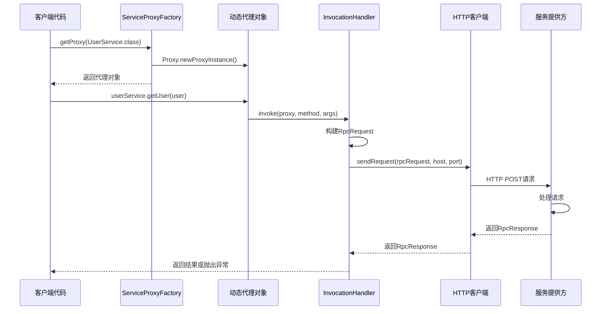

# 消费方调用的实现原理

## 面试题目

你在项目中是如何实现消费方调用的？为什么选用 JDK 动态代理和工厂模式？

## 引言

在RPC框架中，消费方（客户端）需要能够像调用本地方法一样调用远程服务，这种透明化的远程调用体验是RPC框架的核心价值之一。本文将详细解析learn-RPC项目中消费方调用的实现原理，以及JDK动态代理和工厂模式在其中的应用。

## 1. 消费方调用的总体流程

在learn-RPC框架中，消费方调用远程服务的总体流程如下：

1. 获取服务接口的代理对象
2. 调用代理对象的方法
3. 代理对象将方法调用转换为RPC请求
4. 通过网络发送RPC请求到服务提供方
5. 接收并解析服务提供方的响应
6. 返回响应结果

整个过程对调用方透明，使其感觉就像调用本地方法一样简单。

## 2. JDK动态代理的应用

### 2.1 为什么选择JDK动态代理

JDK动态代理是Java内置的代理机制，无需引入额外依赖，具有以下优势：

1. **标准API**：作为JDK的标准库一部分，稳定可靠
2. **动态性**：可以在运行时动态生成代理类，无需预先编写代理类代码
3. **通用性**：可以为任何接口生成代理
4. **简洁**：实现代码简洁，易于理解和维护

### 2.2 具体实现

在learn-RPC项目中，JDK动态代理的具体实现位于`ServiceProxyFactory`类和`ServiceInvocationHandler`类：

```java
public static <T> T getProxy(Class<T> serviceClass, String host, int port) {
    // 创建HTTP客户端
    HttpClient httpClient = new HttpClient();
    
    // 创建动态代理
    return (T) Proxy.newProxyInstance(
            serviceClass.getClassLoader(),
            new Class[]{serviceClass},
            new ServiceInvocationHandler(httpClient, serviceClass, host, port)
    );
}
```

`ServiceInvocationHandler`实现了`InvocationHandler`接口，拦截方法调用：

```java
private static class ServiceInvocationHandler implements InvocationHandler {
    private final HttpClient httpClient;
    private final Class<?> serviceClass;
    private final String host;
    private final int port;

    // 构造函数...

    @Override
    public Object invoke(Object proxy, Method method, Object[] args) throws Throwable {
        // 处理Object类的方法
        if (method.getDeclaringClass() == Object.class) {
            return method.invoke(this, args);
        }
        
        // 构建RPC请求
        RpcRequest rpcRequest = RpcRequest.builder()
                .serviceName(serviceClass.getName())
                .methodName(method.getName())
                .parameterTypes(method.getParameterTypes())
                .args(args)
                .build();
        
        // 发送请求并获取响应
        RpcResponse rpcResponse = httpClient.sendRequest(rpcRequest, host, port);
        
        // 处理异常
        if (rpcResponse.getException() != null) {
            throw rpcResponse.getException();
        }
        
        // 返回结果
        return rpcResponse.getData();
    }
}
```

### 2.3 工作原理

JDK动态代理的工作原理是：

1. **创建代理类**：通过`Proxy.newProxyInstance()`方法创建实现指定接口的代理类实例
2. **方法拦截**：当调用代理对象的方法时，调用会被转发到`InvocationHandler`的`invoke`方法
3. **请求处理**：在`invoke`方法中，将方法调用信息（方法名、参数等）转换为RPC请求
4. **远程调用**：通过HTTP客户端发送RPC请求到服务提供方
5. **结果处理**：接收服务提供方的响应，并返回结果或抛出异常

## 3. 工厂模式的应用

### 3.1 为什么选择工厂模式

工厂模式在项目中的主要作用是封装代理对象的创建过程。选择工厂模式的原因包括：

1. **简化创建过程**：隐藏代理对象创建的复杂性，提供简单的接口
2. **封装变化点**：将可能变化的代理创建逻辑封装在工厂中，客户端代码不受影响
3. **统一管理**：集中管理代理对象的创建，便于未来扩展和维护
4. **提高可测试性**：便于在测试中mock或替换代理工厂

### 3.2 具体实现

`ServiceProxyFactory`类实现了工厂模式：

```java
public class ServiceProxyFactory {
    /**
     * 创建服务代理（使用默认主机名和端口）
     */
    public static <T> T getProxy(Class<T> serviceClass) {
        return (T) Proxy.newProxyInstance(
            serviceClass.getClassLoader(),
            new Class[]{serviceClass},
            new ServiceProxy());
    }

    /**
     * 创建服务代理
     */
    public static <T> T getProxy(Class<T> serviceClass, String host, int port) {
        HttpClient httpClient = new HttpClient();
        
        return (T) Proxy.newProxyInstance(
                serviceClass.getClassLoader(),
                new Class[]{serviceClass},
                new ServiceInvocationHandler(httpClient, serviceClass, host, port)
        );
    }
}
```

### 3.3 客户端使用示例

消费方只需通过工厂方法获取代理，然后像调用本地方法一样使用：

```java
// 获取服务代理
UserService userService = ServiceProxyFactory.getProxy(UserService.class);

// 创建参数
User user = new User();
user.setName("张三");

// 调用远程服务，就像调用本地方法一样
User result = userService.getUser(user);
```

## 4. 两种设计模式的结合优势

JDK动态代理和工厂模式的结合使用带来了多重优势：

### 4.1 封装复杂性

工厂模式封装了动态代理创建的复杂性，客户端只需关注接口调用，不需要了解底层实现细节。

### 4.2 提高可维护性

将代理创建逻辑集中在工厂类中，便于统一维护和升级。如果需要更改代理实现（如从JDK代理切换到CGLIB代理），只需修改工厂类，而不影响客户端代码。

### 4.3 灵活配置

工厂方法可以提供多个重载版本，支持不同的配置选项（如自定义主机和端口），增加了框架的灵活性。

### 4.4 代码解耦

客户端代码与网络传输、序列化等底层实现完全解耦，遵循了"依赖倒置原则"。

## 5. 消费方调用的完整流程图

下图展示了消费方调用的完整流程：



## 总结

learn-RPC项目中消费方调用的实现通过JDK动态代理和工厂模式的巧妙结合，实现了远程调用的透明化。JDK动态代理负责拦截方法调用并转换为RPC请求，工厂模式则封装了代理对象的创建细节，提供了简单易用的接口。这种设计不仅简化了客户端代码，还提高了框架的灵活性和可维护性。

通过这两种设计模式的结合，我们实现了RPC框架的一个核心目标：让远程服务调用就像本地方法调用一样简单。这种对复杂性的良好封装，是优秀框架设计的典范。 