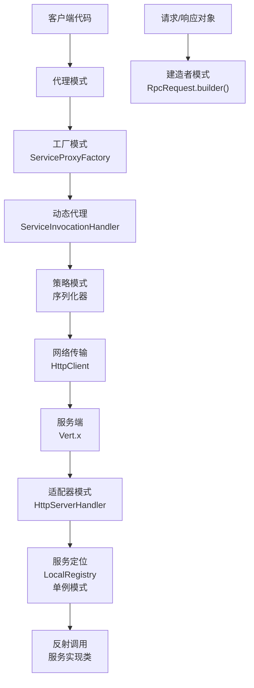

# 设计模式在learn-RPC项目中的应用

## 面试题目

你在项目中使用了哪些设计模式？举例说明你是如何应用的。

## 引言

设计模式是软件开发中经过验证的、用于解决特定问题的最佳实践。在learn-RPC项目中，我们应用了多种设计模式来提高代码的可维护性、可扩展性和灵活性。本文将详细解析项目中使用的主要设计模式及其具体应用场景。

## 1. 代理模式（Proxy Pattern）

### 1.1 定义与作用

代理模式为其他对象提供一种代理以控制对这个对象的访问。在RPC框架中，代理模式是实现远程调用透明化的核心。

### 1.2 项目中的应用

在learn-RPC项目中，代理模式主要应用于客户端调用远程服务时：

#### 静态代理实现

项目中的`UserServiceProxy`类是静态代理的实现示例：

```java
public class UserServiceProxy implements UserService {
    public User getUser(User user) {
        // 序列化请求
        Serializer Serializer = new JdkSerializer();
        RpcRequest rpcRequest = RpcRequest.builder()
                .serviceName(UserService.class.getName())
                .methodName("getUser")
                .parameterTypes(new Class[]{User.class})
                .args(new Object[]{user})
                .build();
        
        // 发送HTTP请求
        // ...处理网络通信逻辑...
        
        // 反序列化响应
        RpcResponse rpcResponse = Serializer.deserialize(result, RpcResponse.class);
        return (User) rpcResponse.getData();
    }
}
```

#### 动态代理实现

更灵活的是项目中使用的JDK动态代理机制，通过`ServiceProxyFactory`创建代理对象：

```java
public static <T> T getProxy(Class<T> serviceClass, String host, int port) {
    HttpClient httpClient = new HttpClient();
    
    return (T) Proxy.newProxyInstance(
            serviceClass.getClassLoader(),
            new Class[]{serviceClass},
            new ServiceInvocationHandler(httpClient, serviceClass, host, port)
    );
}
```

`ServiceInvocationHandler`实现了`InvocationHandler`接口，拦截方法调用：

```java
@Override
public Object invoke(Object proxy, Method method, Object[] args) throws Throwable {
    // 处理Object类的方法
    if (method.getDeclaringClass() == Object.class) {
        return method.invoke(this, args);
    }
    
    // 构建RPC请求
    RpcRequest rpcRequest = RpcRequest.builder()
            .serviceName(serviceClass.getName())
            .methodName(method.getName())
            .parameterTypes(method.getParameterTypes())
            .args(args)
            .build();
    
    // 发送请求并获取响应
    RpcResponse rpcResponse = httpClient.sendRequest(rpcRequest, host, port);
    
    // 返回结果
    return rpcResponse.getData();
}
```

### 1.3 优势

- **透明性**：客户端代码无需关注远程调用的复杂性，可以像调用本地方法一样调用远程服务
- **解耦**：将网络传输、序列化等逻辑与业务代码分离
- **集中控制**：可以在代理中统一处理请求日志、性能监控、超时重试等横切关注点

## 2. 工厂模式（Factory Pattern）

### 2.1 定义与作用

工厂模式提供了一种创建对象的最佳方式，在不暴露创建逻辑的情况下通过使用一个共同的接口来指向新创建的对象。

### 2.2 项目中的应用

项目中的`ServiceProxyFactory`类是工厂模式的典型实现：

```java
public class ServiceProxyFactory {
    public static <T> T getProxy(Class<T> serviceClass) {
        return (T) Proxy.newProxyInstance(
            serviceClass.getClassLoader(),
            new Class[]{serviceClass},
            new ServiceProxy());
    }
    
    public static <T> T getProxy(Class<T> serviceClass, String host, int port) {
        HttpClient httpClient = new HttpClient();
        
        return (T) Proxy.newProxyInstance(
                serviceClass.getClassLoader(),
                new Class[]{serviceClass},
                new ServiceInvocationHandler(httpClient, serviceClass, host, port)
        );
    }
}
```

通过这个工厂，我们可以轻松获取任何服务接口的代理实现：

```java
UserService userService = ServiceProxyFactory.getProxy(UserService.class);
```

### 2.3 优势

- **封装**：隐藏了代理对象的创建细节
- **复用**：提供了创建代理对象的公共接口，避免代码重复
- **可扩展**：可以轻松扩展以支持不同的代理实现和配置

## 3. 单例模式（Singleton Pattern）

### 3.1 定义与作用

单例模式确保一个类只有一个实例，并提供一个全局访问点。

### 3.2 项目中的应用

`LocalRegistry`是项目中单例模式的典型应用：

```java
public class LocalRegistry {
    private static final Map<String,Class<?>> map = new ConcurrentHashMap<>();

    public static void register(String serviceName,Class<?> implClass){
        map.put(serviceName,implClass);
    }
    
    public static Class<?> get(String serviceName){
        return map.get(serviceName);
    }

    public static void remove(String serviceName){
        map.remove(serviceName);
    }
}
```

通过使用静态方法和静态字段，`LocalRegistry`确保了全局只有一个注册中心实例，维护着服务名称到实现类的映射关系。

### 3.3 优势

- **全局访问点**：任何代码都可以通过静态方法访问注册中心
- **资源共享**：所有代码共享同一份服务注册信息
- **线程安全**：使用`ConcurrentHashMap`确保多线程环境下的线程安全

## 4. 建造者模式（Builder Pattern）

### 4.1 定义与作用

建造者模式使用多个简单对象一步步构建一个复杂对象，将一个复杂对象的构建与其表示分离。

### 4.2 项目中的应用

项目中的`RpcRequest`和`RpcResponse`类通过Lombok的`@Builder`注解实现了建造者模式：

```java
@Data
@Builder
@AllArgsConstructor
@NoArgsConstructor
public class RpcRequest implements Serializable {
    private String serviceName;
    private String methodName;
    private Object[] args;
    private Class<?>[] parameterTypes;
}
```

使用建造者模式创建请求对象：

```java
RpcRequest rpcRequest = RpcRequest.builder()
        .serviceName(serviceClass.getName())
        .methodName(method.getName())
        .parameterTypes(method.getParameterTypes())
        .args(args)
        .build();
```

### 4.3 优势

- **可读性**：通过链式调用可以清晰地看到对象的构建过程
- **灵活性**：只需设置必要的属性，其他属性可以保持默认值
- **不可变性**：构建完成后返回不可变对象，提高线程安全性

## 5. 策略模式（Strategy Pattern）

### 5.1 定义与作用

策略模式定义了一系列算法，并将每个算法封装起来，使它们可以相互替换，且算法的变化不会影响使用算法的客户。

### 5.2 项目中的应用

`Serializer`接口及其实现类`JdkSerializer`体现了策略模式：

```java
public interface Serializer {
    <T> byte[] serialize(T obj) throws Exception;
    <T> T deserialize(byte[] bytes, Class<T> clazz) throws Exception;
}

public class JdkSerializer implements Serializer {
    @Override
    public <T> byte[] serialize(T obj) throws Exception {
        ByteArrayOutputStream byteArrayOutputStream = new ByteArrayOutputStream();
        ObjectOutputStream objectOutputStream = new ObjectOutputStream(byteArrayOutputStream);
        objectOutputStream.writeObject(obj);
        return byteArrayOutputStream.toByteArray();
    }

    @Override
    public <T> T deserialize(byte[] bytes, Class<T> clazz) throws Exception {
        ByteArrayInputStream byteArrayInputStream = new ByteArrayInputStream(bytes);
        ObjectInputStream objectInputStream = new ObjectInputStream(byteArrayInputStream);
        return (T) objectInputStream.readObject();
    }
}
```

这种设计允许在不修改使用序列化器的代码的情况下，切换不同的序列化策略（如JDK序列化、JSON序列化、Protobuf等）。

### 5.3 优势

- **算法封装**：每种序列化策略都被封装在独立的类中
- **可替换性**：可以在运行时切换不同的序列化策略
- **开闭原则**：添加新的序列化策略不需要修改现有代码

## 6. 适配器模式（Adapter Pattern）

### 6.1 定义与作用

适配器模式将一个类的接口转换成客户期望的另一个接口，使原本不兼容的接口可以一起工作。

### 6.2 项目中的应用

`HttpServerHandler`类实现了Vert.x的`Handler<HttpServerRequest>`接口，将HTTP请求处理逻辑适配到RPC处理流程：

```java
public class HttpServerHandler implements Handler<HttpServerRequest> {
    @Override
    public void handle(HttpServerRequest request) {
        request.bodyHandler(body -> {
            // 反序列化请求
            RpcRequest rpcRequest = serializer.deserialize(body.getBytes(), RpcRequest.class);
            
            // 处理RPC调用
            // ...
            
            // 序列化响应
            byte[] bytes = serializer.serialize(rpcResponse);
            response.end(Buffer.buffer(bytes));
        });
    }
}
```

### 6.3 优势

- **兼容性**：使不兼容的接口可以一起工作
- **复用**：允许复用现有功能而不修改源码
- **分离关注点**：将适配逻辑与业务逻辑分离

## 总结

在learn-RPC项目中，我们应用了多种设计模式来解决不同的设计问题：

1. **代理模式**：通过动态代理实现远程调用的透明化
2. **工厂模式**：简化代理对象的创建过程
3. **单例模式**：确保全局唯一的注册中心实例
4. **建造者模式**：简化复杂对象的构建过程
5. **策略模式**：支持可替换的序列化策略
6. **适配器模式**：将HTTP请求处理适配到RPC处理流程

这些设计模式的应用使得项目代码结构清晰、易于维护和扩展，同时提高了代码的复用性和可测试性。通过学习这些设计模式及其在实际项目中的应用，我们可以更好地理解软件设计的艺术和原则。

