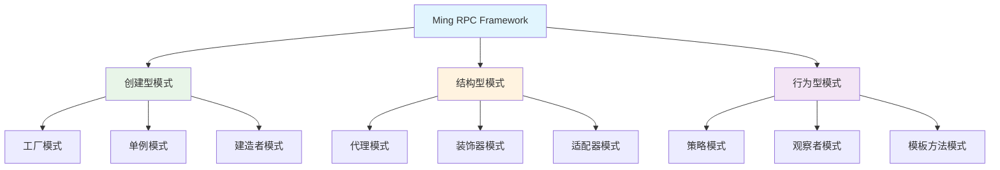
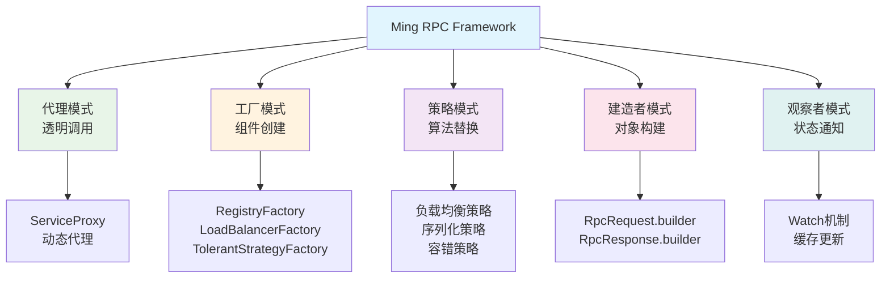

# Ming RPC Framework 设计模式应用详解

## 📖 概述

设计模式是软件开发中经过验证的、用于解决特定问题的最佳实践。Ming RPC Framework巧妙地运用了多种设计模式，构建了一个高度可扩展、可维护的分布式RPC框架。

### 🎯 核心问题
> 在Ming RPC Framework中使用了哪些设计模式？举例说明是如何应用的。

### 💡 设计模式的价值
1. **可扩展性**: 通过工厂模式和SPI机制实现组件的动态扩展
2. **可维护性**: 通过代理模式和装饰器模式实现关注点分离
3. **灵活性**: 通过策略模式支持多种算法的动态切换
4. **解耦性**: 通过观察者模式实现组件间的松耦合

### 🏗️ 设计模式架构图


## 🎭 1. 代理模式（Proxy Pattern）

### 1.1 模式定义与价值

代理模式为其他对象提供一种代理以控制对这个对象的访问。在Ming RPC Framework中，代理模式是实现远程调用透明化的核心，让客户端像调用本地方法一样调用远程服务。

### 1.2 静态代理实现

#### UserServiceProxy静态代理
**文件路径**: `example-consumer/src/main/java/com/ming/example/consumer/client/proxy/UserServiceProxy.java`

```java
/**
 * 静态代理实现
 */
public class UserServiceProxy implements UserService {

    @Override
    public User getUser(User user) {
        System.out.println("开始调用远程服务...");

        // 1. 序列化请求
        Serializer serializer = new JdkSerializer();
        RpcRequest rpcRequest = RpcRequest.builder()
                .serviceName(UserService.class.getName())
                .methodName("getUser")
                .parameterTypes(new Class[]{User.class})
                .args(new Object[]{user})
                .build();

        try {
            System.out.println("正在序列化请求...");
            byte[] bodyBytes = serializer.serialize(rpcRequest);
            byte[] result;

            // 2. 发送HTTP请求
            try(HttpResponse httpResponse = HttpRequest.post("http://localhost:8080")
                .body(bodyBytes)
                .execute()){
                System.out.println("请求已发送，正在获取响应...");
                result = httpResponse.bodyBytes();
            }

            // 3. 反序列化响应
            RpcResponse rpcResponse = serializer.deserialize(result, RpcResponse.class);
            return (User) rpcResponse.getData();

        } catch(Exception e) {
            System.err.println("RPC调用失败: " + e.getMessage());
            throw new RuntimeException(e);
        }
    }
}
```

### 1.3 动态代理实现

#### ServiceProxyFactory代理工厂
**文件路径**: `rpc-core/src/main/java/com/ming/rpc/proxy/ServiceProxyFactory.java`

```java
/**
 * 服务代理工厂（工厂模式，用于创建代理对象）
 */
public class ServiceProxyFactory {

    /**
     * 获取服务代理对象
     */
    public static <T> T getProxy(Class<T> serviceClass) {
        // 根据配置决定返回Mock代理还是真实代理
        if (RpcApplication.getRpcConfig().isMock()) {
            return getMockProxy(serviceClass);
        }

        return (T) Proxy.newProxyInstance(
            serviceClass.getClassLoader(),
            new Class[] { serviceClass },
            new ServiceProxy()
        );
    }

    /**
     * 根据服务类获取Mock代理对象
     */
    public static <T> T getMockProxy(Class<T> serviceClass) {
        return (T) Proxy.newProxyInstance(
            serviceClass.getClassLoader(),
            new Class[] { serviceClass },
            new MockServiceProxy()
        );
    }
}
```

#### ServiceProxy动态代理处理器
**文件路径**: `rpc-core/src/main/java/com/ming/rpc/proxy/ServiceProxy.java`

```java
/**
 * 服务代理（JDK动态代理）
 */
public class ServiceProxy implements InvocationHandler {

    @Override
    public Object invoke(Object proxy, Method method, Object[] args) throws Throwable {
        // 构造RPC请求
        String serviceName = method.getDeclaringClass().getName();
        RpcRequest rpcRequest = RpcRequest.builder()
            .serviceName(serviceName)
            .methodName(method.getName())
            .parameterTypes(method.getParameterTypes())
            .args(args)
            .build();

        // 服务发现
        RpcConfig rpcConfig = RpcApplication.getRpcConfig();
        Registry registry = RegistryFactory.getInstance(rpcConfig.getRegistryConfig().getRegistry());
        ServiceMetaInfo serviceMetaInfo = new ServiceMetaInfo();
        serviceMetaInfo.setServiceName(serviceName);
        serviceMetaInfo.setServiceVersion(RpcConstant.DEFAULT_SERVICE_VERSION);
        List<ServiceMetaInfo> serviceMetaInfoList = registry.serviceDiscovery(serviceMetaInfo.getServiceKey());

        if (CollUtil.isEmpty(serviceMetaInfoList)) {
            throw new RuntimeException("暂无服务地址");
        }

        // 负载均衡
        LoadBalancer loadBalancer = LoadBalancerFactory.getInstance(rpcConfig.getLoadBalancer());
        Map<String, Object> requestParams = new HashMap<>();
        requestParams.put("methodName", rpcRequest.getMethodName());
        ServiceMetaInfo selectedServiceMetaInfo = loadBalancer.select(requestParams, serviceMetaInfoList);

        // 发送RPC请求（包含重试和容错机制）
        RpcResponse rpcResponse;
        try {
            RetryStrategy retryStrategy = RetryStrategyFactory.getInstance(rpcConfig.getRetryStrategy());
            rpcResponse = retryStrategy.doRetry(() ->
                    VertexTcpClient.doRequest(rpcRequest, selectedServiceMetaInfo)
            );
        } catch (Exception e) {
            // 容错机制
            TolerantStrategy tolerantStrategy = TolerantStrategyFactory.getInstance(rpcConfig.getTolerantStrategy());
            rpcResponse = tolerantStrategy.doTolerant(null, e);
        }

        return rpcResponse.getData();
    }
}
```

```java
public static <T> T getProxy(Class<T> serviceClass, String host, int port) {
    HttpClient httpClient = new HttpClient();
    
    return (T) Proxy.newProxyInstance(
            serviceClass.getClassLoader(),
            new Class[]{serviceClass},
            new ServiceInvocationHandler(httpClient, serviceClass, host, port)
    );
}
```

`ServiceInvocationHandler`实现了`InvocationHandler`接口，拦截方法调用：

```java
@Override
public Object invoke(Object proxy, Method method, Object[] args) throws Throwable {
    // 处理Object类的方法
    if (method.getDeclaringClass() == Object.class) {
        return method.invoke(this, args);
    }
    
    // 构建RPC请求
    RpcRequest rpcRequest = RpcRequest.builder()
            .serviceName(serviceClass.getName())
            .methodName(method.getName())
            .parameterTypes(method.getParameterTypes())
            .args(args)
            .build();
    
    // 发送请求并获取响应
    RpcResponse rpcResponse = httpClient.sendRequest(rpcRequest, host, port);
    
    // 返回结果
    return rpcResponse.getData();
}
```

### 1.3 优势

- **透明性**：客户端代码无需关注远程调用的复杂性，可以像调用本地方法一样调用远程服务
- **解耦**：将网络传输、序列化等逻辑与业务代码分离
- **集中控制**：可以在代理中统一处理请求日志、性能监控、超时重试等横切关注点

## 🏭 2. 工厂模式（Factory Pattern）

### 2.1 模式定义与价值

工厂模式提供了一种创建对象的最佳方式，封装了对象的创建逻辑，使客户端无需关心具体的创建细节。在Ming RPC Framework中，工厂模式广泛应用于各种组件的创建和管理。

### 2.2 注册中心工厂

#### RegistryFactory - 注册中心工厂
**文件路径**: `rpc-core/src/main/java/com/ming/rpc/registry/RegistryFactory.java`

```java
/**
 * 注册中心工厂（用于获取注册中心对象）
 */
public class RegistryFactory {

    /**
     * SPI 动态加载
     */
    static {
        SpiLoader.load(Registry.class);
    }

    /**
     * 默认注册中心
     */
    private static final Registry DEFAULT_REGISTRY = new EtcdRegistry();

    /**
     * 获取注册中心实例
     * @param key 注册中心类型
     * @return 注册中心实例
     */
    public static Registry getInstance(String key) {
        return SpiLoader.getInstance(Registry.class, key);
    }
}
```

### 2.3 负载均衡器工厂

#### LoadBalancerFactory - 负载均衡器工厂
**文件路径**: `rpc-core/src/main/java/com/ming/rpc/loadbalancer/LoadBalancerFactory.java`

```java
/**
 * 负载均衡器工厂（工厂模式，用于获取负载均衡器对象）
 */
public class LoadBalancerFactory {

    static {
        SpiLoader.load(LoadBalancer.class);
    }

    /**
     * 默认负载均衡器
     */
    private static final LoadBalancer DEFAULT_LOAD_BALANCER = new RoundRobinLoadBalancer();

    /**
     * 获取实例
     * @param key 负载均衡器类型
     * @return 负载均衡器
     */
    public static LoadBalancer getInstance(String key) {
        return SpiLoader.getInstance(LoadBalancer.class, key);
    }
}
```

### 2.4 容错策略工厂

#### TolerantStrategyFactory - 容错策略工厂
**文件路径**: `rpc-core/src/main/java/com/ming/rpc/fault/tolerant/TolerantStrategyFactory.java`

```java
/**
 * 容错策略工厂（工厂模式，用于获取容错策略对象）
 */
public class TolerantStrategyFactory {

    static {
        SpiLoader.load(TolerantStrategy.class);
    }

    /**
     * 默认容错策略
     */
    private static final TolerantStrategy DEFAULT_TOLERANT_STRATEGY = new FailFastTolerantStrategy();

    /**
     * 获取实例
     * @param key 键
     * @return 实例
     */
    public static TolerantStrategy getInstance(String key) {
        TolerantStrategy tolerantStrategy = SpiLoader.getInstance(TolerantStrategy.class, key);
        return tolerantStrategy == null ? DEFAULT_TOLERANT_STRATEGY : tolerantStrategy;
    }
}
```

### 2.5 工厂模式优势

- **统一创建**: 提供统一的对象创建接口
- **配置驱动**: 支持通过配置动态选择实现
- **默认实现**: 提供合理的默认实现，简化使用
- **SPI集成**: 与SPI机制结合，支持动态扩展
- **单例管理**: 通过SpiLoader实现实例的单例管理

## 3. 单例模式（Singleton Pattern）

### 3.1 定义与作用

单例模式确保一个类只有一个实例，并提供一个全局访问点。

### 3.2 项目中的应用

`LocalRegistry`是项目中单例模式的典型应用：

```java
public class LocalRegistry {
    private static final Map<String,Class<?>> map = new ConcurrentHashMap<>();

    public static void register(String serviceName,Class<?> implClass){
        map.put(serviceName,implClass);
    }
    
    public static Class<?> get(String serviceName){
        return map.get(serviceName);
    }

    public static void remove(String serviceName){
        map.remove(serviceName);
    }
}
```

通过使用静态方法和静态字段，`LocalRegistry`确保了全局只有一个注册中心实例，维护着服务名称到实现类的映射关系。

### 3.3 优势

- **全局访问点**：任何代码都可以通过静态方法访问注册中心
- **资源共享**：所有代码共享同一份服务注册信息
- **线程安全**：使用`ConcurrentHashMap`确保多线程环境下的线程安全

## 4. 建造者模式（Builder Pattern）

### 4.1 定义与作用

建造者模式使用多个简单对象一步步构建一个复杂对象，将一个复杂对象的构建与其表示分离。

### 4.2 项目中的应用

项目中的`RpcRequest`和`RpcResponse`类通过Lombok的`@Builder`注解实现了建造者模式：

```java
@Data
@Builder
@AllArgsConstructor
@NoArgsConstructor
public class RpcRequest implements Serializable {
    private String serviceName;
    private String methodName;
    private Object[] args;
    private Class<?>[] parameterTypes;
}
```

使用建造者模式创建请求对象：

```java
RpcRequest rpcRequest = RpcRequest.builder()
        .serviceName(serviceClass.getName())
        .methodName(method.getName())
        .parameterTypes(method.getParameterTypes())
        .args(args)
        .build();
```

### 4.3 优势

- **可读性**：通过链式调用可以清晰地看到对象的构建过程
- **灵活性**：只需设置必要的属性，其他属性可以保持默认值
- **不可变性**：构建完成后返回不可变对象，提高线程安全性

## 5. 策略模式（Strategy Pattern）

### 5.1 定义与作用

策略模式定义了一系列算法，并将每个算法封装起来，使它们可以相互替换，且算法的变化不会影响使用算法的客户。

### 5.2 项目中的应用

`Serializer`接口及其实现类`JdkSerializer`体现了策略模式：

```java
public interface Serializer {
    <T> byte[] serialize(T obj) throws Exception;
    <T> T deserialize(byte[] bytes, Class<T> clazz) throws Exception;
}

public class JdkSerializer implements Serializer {
    @Override
    public <T> byte[] serialize(T obj) throws Exception {
        ByteArrayOutputStream byteArrayOutputStream = new ByteArrayOutputStream();
        ObjectOutputStream objectOutputStream = new ObjectOutputStream(byteArrayOutputStream);
        objectOutputStream.writeObject(obj);
        return byteArrayOutputStream.toByteArray();
    }

    @Override
    public <T> T deserialize(byte[] bytes, Class<T> clazz) throws Exception {
        ByteArrayInputStream byteArrayInputStream = new ByteArrayInputStream(bytes);
        ObjectInputStream objectInputStream = new ObjectInputStream(byteArrayInputStream);
        return (T) objectInputStream.readObject();
    }
}
```

这种设计允许在不修改使用序列化器的代码的情况下，切换不同的序列化策略（如JDK序列化、JSON序列化、Protobuf等）。

### 5.3 优势

- **算法封装**：每种序列化策略都被封装在独立的类中
- **可替换性**：可以在运行时切换不同的序列化策略
- **开闭原则**：添加新的序列化策略不需要修改现有代码

## 6. 适配器模式（Adapter Pattern）

### 6.1 定义与作用

适配器模式将一个类的接口转换成客户期望的另一个接口，使原本不兼容的接口可以一起工作。

### 6.2 项目中的应用

`HttpServerHandler`类实现了Vert.x的`Handler<HttpServerRequest>`接口，将HTTP请求处理逻辑适配到RPC处理流程：

```java
public class HttpServerHandler implements Handler<HttpServerRequest> {
    @Override
    public void handle(HttpServerRequest request) {
        request.bodyHandler(body -> {
            // 反序列化请求
            RpcRequest rpcRequest = serializer.deserialize(body.getBytes(), RpcRequest.class);
            
            // 处理RPC调用
            // ...
            
            // 序列化响应
            byte[] bytes = serializer.serialize(rpcResponse);
            response.end(Buffer.buffer(bytes));
        });
    }
}
```

### 6.3 优势

- **兼容性**：使不兼容的接口可以一起工作
- **复用**：允许复用现有功能而不修改源码
- **分离关注点**：将适配逻辑与业务逻辑分离

## 总结

在learn-RPC项目中，我们应用了多种设计模式来解决不同的设计问题：

1. **代理模式**：通过动态代理实现远程调用的透明化
2. **工厂模式**：简化代理对象的创建过程
3. **单例模式**：确保全局唯一的注册中心实例
4. **建造者模式**：简化复杂对象的构建过程
5. **策略模式**：支持可替换的序列化策略
6. **适配器模式**：将HTTP请求处理适配到RPC处理流程

这些设计模式的应用使得项目代码结构清晰、易于维护和扩展，同时提高了代码的复用性和可测试性。通过学习这些设计模式及其在实际项目中的应用，我们可以更好地理解软件设计的艺术和原则。

## 🎯 3. 策略模式（Strategy Pattern）

### 3.1 模式定义与价值

策略模式定义了一系列算法，把它们一个个封装起来，并且使它们可相互替换。在Ming RPC Framework中，策略模式广泛应用于各种可替换的算法实现。

### 3.2 负载均衡策略

#### LoadBalancer接口定义
```java
public interface LoadBalancer {
    /**
     * 选择服务调用
     * @param requestParams 请求参数
     * @param serviceMetaInfoList 可用服务列表
     * @return 选中的服务
     */
    ServiceMetaInfo select(Map<String, Object> requestParams, List<ServiceMetaInfo> serviceMetaInfoList);
}
```

#### 具体策略实现
```java
// 轮询策略
public class RoundRobinLoadBalancer implements LoadBalancer {
    private final AtomicInteger currentIndex = new AtomicInteger(0);

    @Override
    public ServiceMetaInfo select(Map<String, Object> requestParams, List<ServiceMetaInfo> serviceMetaInfoList) {
        int index = currentIndex.getAndIncrement() % serviceMetaInfoList.size();
        return serviceMetaInfoList.get(index);
    }
}

// 一致性Hash策略
public class ConsistentHashLoadBalancer implements LoadBalancer {
    private final TreeMap<Integer, ServiceMetaInfo> virtualNodes = new TreeMap<>();

    @Override
    public ServiceMetaInfo select(Map<String, Object> requestParams, List<ServiceMetaInfo> serviceMetaInfoList) {
        // 一致性Hash算法实现
        int hash = getHash(requestParams);
        Map.Entry<Integer, ServiceMetaInfo> entry = virtualNodes.ceilingEntry(hash);
        return entry != null ? entry.getValue() : virtualNodes.firstEntry().getValue();
    }
}
```

### 3.3 序列化策略

#### Serializer接口定义
```java
public interface Serializer {
    <T> byte[] serialize(T obj) throws IOException;
    <T> T deserialize(byte[] bytes, Class<T> clazz) throws IOException;
}
```

#### 具体策略实现
```java
// JDK序列化策略
public class JdkSerializer implements Serializer {
    @Override
    public <T> byte[] serialize(T obj) throws IOException {
        ByteArrayOutputStream outputStream = new ByteArrayOutputStream();
        ObjectOutputStream objectOutputStream = new ObjectOutputStream(outputStream);
        objectOutputStream.writeObject(obj);
        return outputStream.toByteArray();
    }
}

// JSON序列化策略
public class JsonSerializer implements Serializer {
    private static final ObjectMapper OBJECT_MAPPER = new ObjectMapper();

    @Override
    public <T> byte[] serialize(T obj) throws IOException {
        return OBJECT_MAPPER.writeValueAsBytes(obj);
    }
}
```

### 3.4 容错策略

#### TolerantStrategy接口定义
```java
public interface TolerantStrategy {
    /**
     * 容错处理
     * @param context 上下文
     * @param e 异常
     * @return RPC响应
     */
    RpcResponse doTolerant(Map<String, Object> context, Exception e);
}
```

#### 具体策略实现
```java
// 快速失败策略
public class FailFastTolerantStrategy implements TolerantStrategy {
    @Override
    public RpcResponse doTolerant(Map<String, Object> context, Exception e) {
        throw new RuntimeException("服务报错", e);
    }
}

// 故障转移策略
public class FailOverTolerantStrategy implements TolerantStrategy {
    @Override
    public RpcResponse doTolerant(Map<String, Object> context, Exception e) {
        // 获取其他可用服务节点，重新调用
        List<ServiceMetaInfo> serviceList = (List<ServiceMetaInfo>) context.get("serviceNodeList");
        ServiceMetaInfo failedNode = (ServiceMetaInfo) context.get("selectedNode");

        // 移除失败节点，选择其他节点重试
        serviceList.remove(failedNode);
        if (!serviceList.isEmpty()) {
            ServiceMetaInfo retryNode = serviceList.get(0);
            return doRetryCall(context, retryNode);
        }

        throw new RuntimeException("所有服务节点都不可用", e);
    }
}
```

## 🏗️ 4. 建造者模式（Builder Pattern）

### 4.1 模式定义与价值

建造者模式使用多个简单的对象一步一步构建成一个复杂的对象，提供了一种创建对象的最佳方式。

### 4.2 RpcRequest建造者

#### RpcRequest建造者实现
```java
@Data
@Builder
@AllArgsConstructor
@NoArgsConstructor
public class RpcRequest implements Serializable {
    private String serviceName;
    private String methodName;
    private Class<?>[] parameterTypes;
    private Object[] args;

    // 使用建造者模式创建请求对象
    public static RpcRequestBuilder builder() {
        return new RpcRequestBuilder();
    }
}
```

#### 使用示例
```java
// 使用建造者模式构建RPC请求
RpcRequest rpcRequest = RpcRequest.builder()
    .serviceName(UserService.class.getName())
    .methodName("getUser")
    .parameterTypes(new Class[]{User.class})
    .args(new Object[]{user})
    .build();
```

## 🔍 5. 观察者模式（Observer Pattern）

### 5.1 模式定义与价值

观察者模式定义对象间的一种一对多的依赖关系，当一个对象的状态发生改变时，所有依赖于它的对象都得到通知并被自动更新。

### 5.2 服务注册中心Watch机制

#### Etcd Watch实现
```java
@Override
public void watch(String serviceNodeKey) {
    Watch watchClient = client.getWatchClient();
    boolean newWatch = watchingKeySet.add(serviceNodeKey);
    if(newWatch){
        // 建立观察者关系
        watchClient.watch(ByteSequence.from(serviceNodeKey, StandardCharsets.UTF_8), response -> {
            for(WatchEvent event : response.getEvents()){
                switch(event.getEventType()){
                    case DELETE:
                        // 服务下线，通知缓存清理
                        registryServiceMultiCache.clearCache(serviceNodeKey);
                        log.info("服务下线，清理缓存: {}", serviceNodeKey);
                        break;
                    case PUT:
                        log.debug("服务更新事件: {}", serviceNodeKey);
                        break;
                    default:
                        break;
                }
            }
        });
    }
}
```

## 📋 设计模式总结

Ming RPC Framework通过巧妙运用多种设计模式，构建了一个高度可扩展、可维护的分布式RPC框架：

### 🎉 核心价值
- **代理模式**: 实现远程调用透明化，屏蔽网络通信复杂性
- **工厂模式**: 统一组件创建，支持配置驱动和动态扩展
- **策略模式**: 算法可替换，支持多种负载均衡、序列化、容错策略
- **建造者模式**: 简化复杂对象构建，提供链式调用体验
- **观察者模式**: 实现服务状态变化的实时通知

### 🔧 技术特色
- **SPI集成**: 工厂模式与SPI机制结合，实现真正的插件化
- **配置驱动**: 通过配置文件动态选择不同的策略实现
- **默认实现**: 每种策略都提供合理的默认实现
- **链式调用**: 建造者模式提供优雅的API设计

### 💡 设计原则体现
- **开闭原则**: 对扩展开放，对修改关闭
- **单一职责**: 每个类只负责一个功能
- **依赖倒置**: 依赖抽象而不是具体实现
- **里氏替换**: 子类可以替换父类使用



通过这些设计模式的应用，Ming RPC Framework不仅实现了功能的完整性，更重要的是保证了代码的可维护性、可扩展性和可测试性，为构建企业级分布式系统提供了坚实的基础。