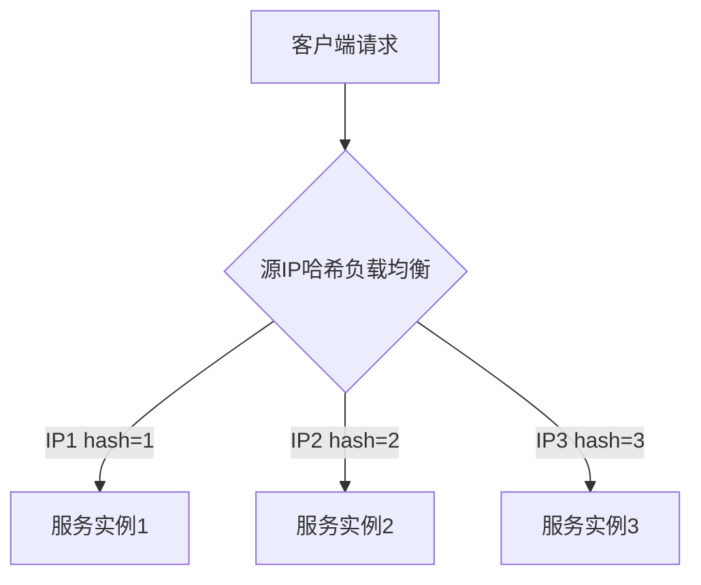

# Ming RPC Framework 负载均衡原理与实现详解

## 📖 概述

负载均衡是分布式RPC框架的核心组件，负责在多个服务提供者之间智能分配请求。Ming RPC Framework实现了一套完整的、可扩展的负载均衡体系，支持多种负载均衡算法，通过SPI机制实现动态扩展。

## 🎯 负载均衡的作用

### 核心价值
1. **提高系统吞吐量**: 将请求分散到多个服务实例，充分利用集群资源
2. **提高系统可用性**: 避免单点故障，实现故障转移
3. **实现水平扩展**: 支持动态添加/移除服务实例
4. **资源利用最大化**: 合理分配请求，避免负载倾斜
5. **会话一致性**: 特定算法可保证相同请求路由到相同实例

### 在RPC中的位置
```
客户端请求 → 服务发现 → 负载均衡 → 目标服务实例 → 业务处理
```

## 🏗️ 架构设计

### 接口定义
**文件路径**: `rpc-core/src/main/java/com/ming/rpc/loadbalancer/LoadBalancer.java`

```java
public interface LoadBalancer {
    /**
     * 选择服务实例
     * @param requestParams 请求参数
     * @param serviceMetaInfoList 可用服务实例列表
     * @return 选择的服务实例
     */
    ServiceMetaInfo select(Map<String, Object> requestParams,
                          List<ServiceMetaInfo> serviceMetaInfoList);
}
```

### 负载均衡器常量
**文件路径**: `rpc-core/src/main/java/com/ming/rpc/loadbalancer/LoadBalancerKeys.java`

```java
public interface LoadBalancerKeys {
    String ROUND_ROBIN = "roundRobin";      // 轮询策略
    String RANDOM = "random";               // 随机策略
    String CONSISTENT_HASH = "consistentHash"; // 一致性哈希策略
}
```

## 🔧 负载均衡算法实现

### 1. 随机负载均衡器
**文件路径**: `rpc-core/src/main/java/com/ming/rpc/loadbalancer/RandomLoadBalancer.java`

```java
public class RandomLoadBalancer implements LoadBalancer {
    private final Random random = new Random();

    @Override
    public ServiceMetaInfo select(Map<String, Object> requestParams,
                                 List<ServiceMetaInfo> serviceMetaInfoList) {
        if (serviceMetaInfoList == null || serviceMetaInfoList.isEmpty()) {
            return null;
        }

        // 只有一个服务，不用随机
        int size = serviceMetaInfoList.size();
        if (size == 1) {
            return serviceMetaInfoList.get(0);
        }

        return serviceMetaInfoList.get(random.nextInt(size));
    }
}
```

**算法特点**:
- ✅ 实现简单，性能高
- ✅ 适用于服务实例性能相近的情况
- ✅ 在大量请求下分布相对均匀
- ❌ 短期内可能出现分布不均
- ❌ 无法根据服务器负载调整

### 2. 轮询负载均衡器
**文件路径**: `rpc-core/src/main/java/com/ming/rpc/loadbalancer/RoundRobinLoadBalancer.java`

```java
public class RoundRobinLoadBalancer implements LoadBalancer {
    /**
     * 当前轮询的下标
     */
    private final AtomicInteger currentIndex = new AtomicInteger(0);

    @Override
    public ServiceMetaInfo select(Map<String, Object> requestParams,
                                 List<ServiceMetaInfo> serviceMetaInfoList) {
        if (serviceMetaInfoList == null || serviceMetaInfoList.isEmpty()) {
            return null;
        }

        // 只有一个服务，无需轮询
        int size = serviceMetaInfoList.size();
        if (size == 1) {
            return serviceMetaInfoList.get(0);
        }

        // 取模算法轮询，防止下标越界
        int index = currentIndex.getAndIncrement() % size;
        return serviceMetaInfoList.get(index);
    }
}
```

**算法特点**:
- ✅ 分布绝对均匀
- ✅ 实现简单，线程安全
- ✅ 适用于服务实例性能相近的情况
- ❌ 无法根据服务器负载调整
- ❌ 在服务实例变化时可能出现短暂不均
### 3. 一致性哈希负载均衡器
**文件路径**: `rpc-core/src/main/java/com/ming/rpc/loadbalancer/ConsistenHashLoadBalancer.java`

```java
public class ConsistenHashLoadBalancer implements LoadBalancer {
    /**
     * 使用TreeMap定义一致性哈希环，存放虚拟节点
     */
    private final TreeMap<Integer, ServiceMetaInfo> virtualNodes = new TreeMap<>();

    /**
     * 虚拟节点数
     */
    private static final int VIRTUAL_NODES = 100;

    @Override
    public ServiceMetaInfo select(Map<String, Object> requestParams,
                                 List<ServiceMetaInfo> serviceMetaInfoList) {
        if (serviceMetaInfoList == null || serviceMetaInfoList.isEmpty()) {
            return null;
        }

        // 将服务实例列表转换为虚拟节点列表
        for (ServiceMetaInfo serviceMetaInfo : serviceMetaInfoList) {
            for (int i = 0; i < VIRTUAL_NODES; i++) {
                // 计算虚拟节点的哈希值
                int hash = getHash(serviceMetaInfo.getServiceKey() + "#" + i);
                // 将虚拟节点添加到一致性哈希环中
                virtualNodes.put(hash, serviceMetaInfo);
            }
        }

        // 获取调用请求的hash值
        int hash = getHash(requestParams);

        // 选择最接近且大于等于调用请求hash值的虚拟节点
        Map.Entry<Integer, ServiceMetaInfo> entry = virtualNodes.ceilingEntry(hash);
        if (entry == null) {
            // 如果没有大于等于调用请求hash值的虚拟节点，则返回环首部的节点
            entry = virtualNodes.firstEntry();
        }

        // 返回虚拟节点对应的服务实例
        return entry.getValue();
    }

    /**
     * Hash算法，使用MurmurHash以获得更好的分布性
     * MurmurHash是一种高性能、低碰撞的哈希算法，
     * 能更均匀地将key映射到哈希环上，实现更均衡的负载分配
     */
    private int getHash(Object key) {
        return MurmurHashUtil.hash32(key.toString().getBytes());
    }
}
```

**算法特点**:
- ✅ 会话一致性，相同请求路由到相同实例
- ✅ 服务实例变化时影响最小
- ✅ 适用于有状态服务和缓存场景
- ✅ 使用虚拟节点解决负载不均问题
- ❌ 实现复杂度较高
- ❌ 在服务实例较少时可能负载不均

**原理**：通过哈希算法将请求和服务实例都映射到一个哈希环上，每个请求会顺时针找到第一个服务实例进行调用。

**优点**：
- 相同参数的请求总是路由到相同的服务实例（高缓存命中率）
- 当服务实例增减时，只影响哈希环相邻的服务实例，降低系统影响
  

**缺点**：
- 实现复杂
- 在服务实例较少时，可能导致负载不均衡

### 6. 源IP哈希算法（IP Hash）



## 🏭 工厂模式与SPI机制

### 负载均衡器工厂
**文件路径**: `rpc-core/src/main/java/com/ming/rpc/loadbalancer/LoadBalancerFactory.java`

```java
public class LoadBalancerFactory {
    static {
        SpiLoader.load(LoadBalancer.class);
    }

    /**
     * 默认负载均衡器
     */
    private static final LoadBalancer DEFAULT_LOAD_BALANCER = new RoundRobinLoadBalancer();

    /**
     * 获取实例
     * @param key 负载均衡器类型
     * @return 负载均衡器
     */
    public static LoadBalancer getInstance(String key) {
        return SpiLoader.getInstance(LoadBalancer.class, key);
    }
}
```

### SPI配置文件
**文件路径**: `rpc-core/src/main/resources/META-INF/rpc/system/com.ming.rpc.loadbalancer.LoadBalancer`

```
roundRobin=com.ming.rpc.loadbalancer.RoundRobinLoadBalancer
random=com.ming.rpc.loadbalancer.RandomLoadBalancer
consistentHash=com.ming.rpc.loadbalancer.ConsistenHashLoadBalancer
```

## 🧪 测试验证

### 负载均衡器测试
**文件路径**: `rpc-core/src/test/java/com/ming/rpc/loadbalancer/`

项目为每个负载均衡器都提供了完整的测试用例：

1. **RoundRobinLoadBalancerTest** - 轮询负载均衡器测试
2. **RandomLoadBalancerTest** - 随机负载均衡器测试
3. **ConsistentHashLoadBalancerTest** - 一致性哈希负载均衡器测试

### 测试示例
```java
@Test
public void testRoundRobinLoadBalancer() {
    // Given
    List<ServiceMetaInfo> serviceList = Arrays.asList(
        createService("service1", "localhost", 8080),
        createService("service2", "localhost", 8081),
        createService("service3", "localhost", 8082)
    );
    RoundRobinLoadBalancer loadBalancer = new RoundRobinLoadBalancer();

    // When & Then
    assertEquals("service1", loadBalancer.select(null, serviceList).getServiceName());
    assertEquals("service2", loadBalancer.select(null, serviceList).getServiceName());
    assertEquals("service3", loadBalancer.select(null, serviceList).getServiceName());
    assertEquals("service1", loadBalancer.select(null, serviceList).getServiceName());
}
```

## 📊 性能对比

基于项目测试结果的性能对比：

| 负载均衡器 | 分布均匀性 | 实现复杂度 | 会话一致性 | 扩展性 | 适用场景 |
|-----------|-----------|-----------|-----------|--------|----------|
| 随机      | 中等      | 低        | 否        | 好     | 无状态服务 |
| 轮询      | 高        | 低        | 否        | 好     | 无状态服务 |
| 一致性哈希 | 中等      | 高        | 是        | 极好   | 有状态服务 |

## 🔧 使用指南

### 配置负载均衡器
在RPC配置中指定负载均衡器：

```yaml
rpc:
  loadBalancer: ROUND_ROBIN  # 可选: ROUND_ROBIN, RANDOM, CONSISTENT_HASH
```

### 代码中使用
```java
// 通过工厂获取负载均衡器
LoadBalancer loadBalancer = LoadBalancerFactory.getInstance(LoadBalancerKeys.ROUND_ROBIN);

// 从服务列表中选择实例
List<ServiceMetaInfo> serviceList = getServiceList();
Map<String, Object> requestParams = buildRequestParams();
ServiceMetaInfo selectedService = loadBalancer.select(requestParams, serviceList);
```

## 🎯 最佳实践

### 1. 负载均衡器选择
- **无状态服务**: 使用轮询或随机负载均衡器，分布均匀
- **有状态服务**: 使用一致性哈希负载均衡器，保证会话一致性
- **缓存场景**: 使用一致性哈希负载均衡器，提高缓存命中率
- **性能测试**: 使用轮询负载均衡器，便于性能分析

### 2. 性能优化
- 缓存负载均衡器实例，避免重复创建
- 对于一致性哈希，合理设置虚拟节点数量
- 定期清理无效的服务实例

### 3. 监控和调试
- 记录负载均衡的选择结果
- 监控各服务实例的请求分布
- 定期分析负载均衡效果

## 📈 扩展开发

### 添加新的负载均衡器
1. 实现`LoadBalancer`接口
2. 在SPI配置文件中注册
3. 添加对应的测试用例
4. 更新负载均衡器常量

### 示例：添加加权轮询负载均衡器
```java
public class WeightedRoundRobinLoadBalancer implements LoadBalancer {
    @Override
    public ServiceMetaInfo select(Map<String, Object> requestParams,
                                 List<ServiceMetaInfo> serviceMetaInfoList) {
        // 加权轮询算法实现
    }
}
```

## 📋 总结

Ming RPC Framework的负载均衡机制通过精心设计的架构，提供了高效、可扩展的负载均衡解决方案：

### 核心优势
- ✅ **多种算法支持**: 随机、轮询、一致性哈希三种负载均衡算法
- ✅ **SPI机制扩展**: 通过SPI机制实现负载均衡器的动态加载和扩展
- ✅ **工厂模式管理**: 统一的负载均衡器工厂管理和创建
- ✅ **完善的测试**: 每个负载均衡器都有对应的测试用例验证
- ✅ **场景适配**: 针对不同场景提供最优的负载均衡策略

### 技术特色
- **可插拔设计**: 通过接口抽象和SPI机制实现可插拔
- **会话一致性**: 一致性哈希算法支持有状态服务
- **虚拟节点**: 解决一致性哈希的负载不均问题
- **线程安全**: 所有负载均衡器都是线程安全的

Ming RPC Framework的负载均衡机制为分布式RPC调用提供了智能的服务选择能力，确保了系统的高可用性和高性能。