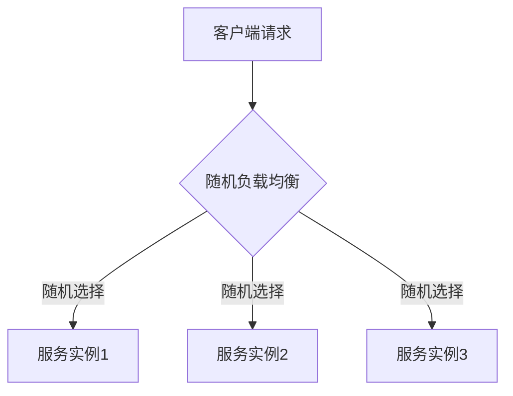
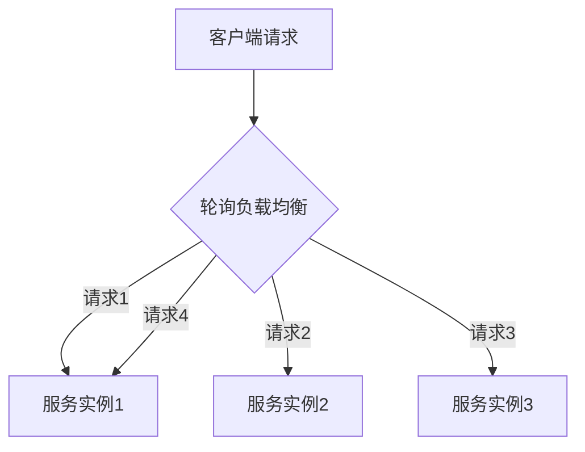
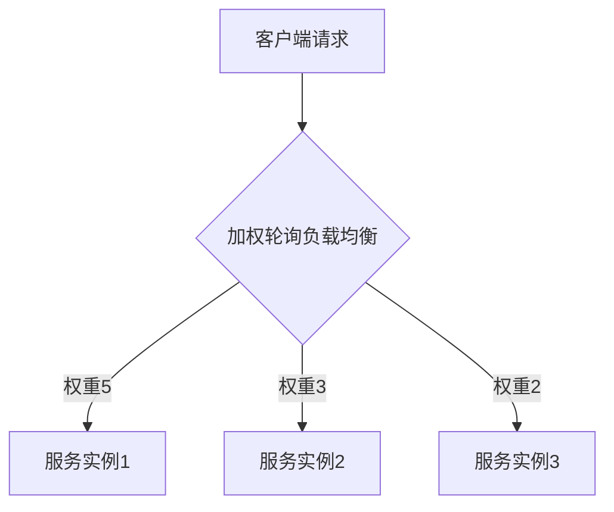
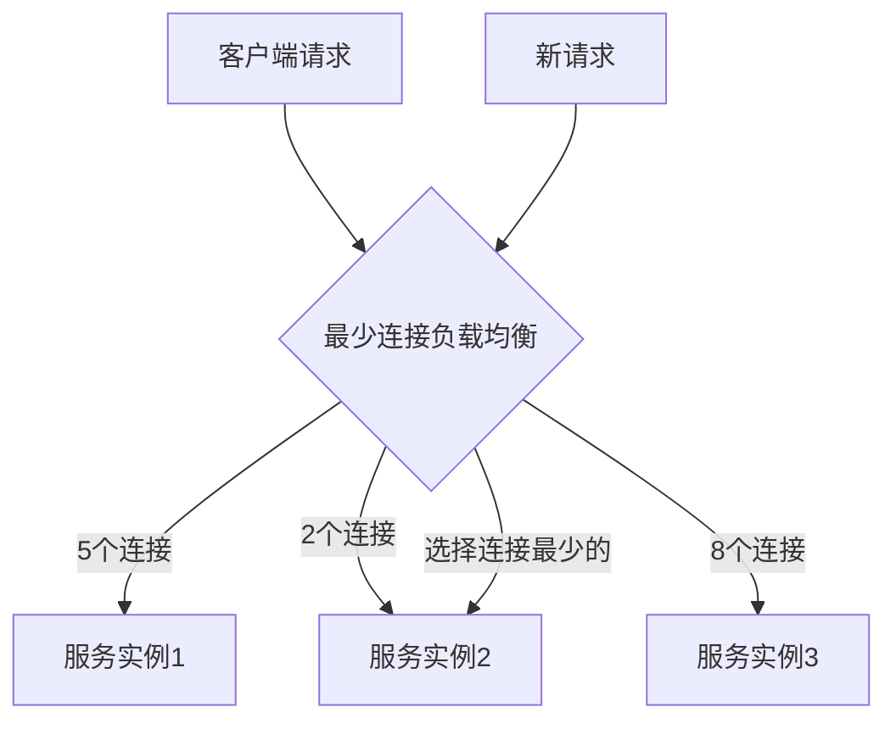
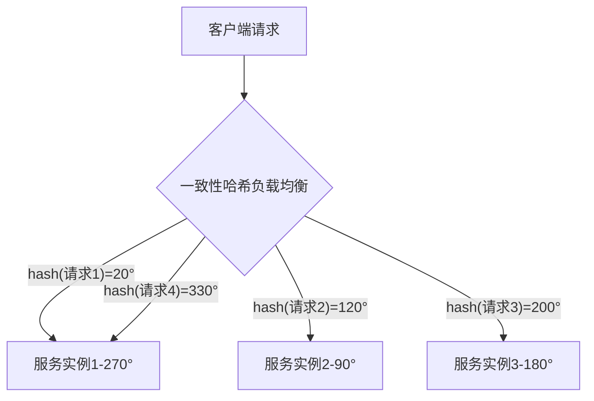
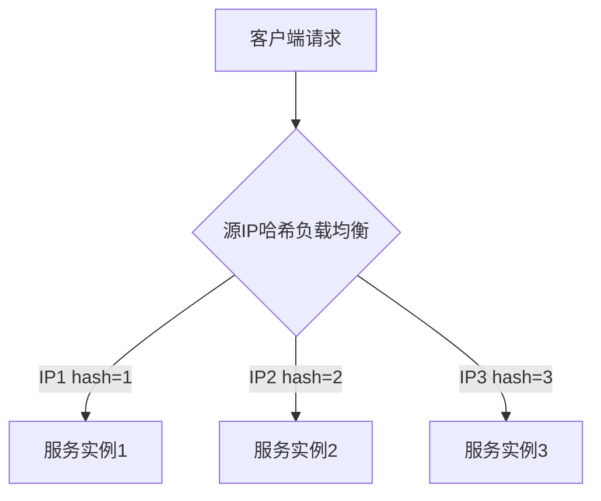

# 负载均衡原理与实现

## 为什么要使用负载均衡？

在分布式系统和微服务架构中，负载均衡是一个核心组件，它通过合理分配客户端请求到多个服务实例，实现了系统的高可用性、高扩展性和高性能。使用负载均衡的主要原因有：

1. **提高系统吞吐量**：通过将请求分散到多个服务实例，系统可以处理更多的并发请求
2. **提高系统可用性**：当某个服务实例故障时，负载均衡器可以将请求转发到其他健康的实例，避免单点故障
3. **实现水平扩展**：随着系统负载增加，只需添加更多服务实例并加入到负载均衡池中即可，无需修改客户端代码
4. **资源利用最大化**：合理分配请求，避免某些实例过载而其他实例空闲
5. **实现动态服务发现**：结合服务注册中心，可以动态感知服务实例的上下线

## 常见的负载均衡算法

### 1. 随机算法（Random）



**原理**：从可用的服务实例中随机选择一个进行调用。

**优点**：
- 实现简单
- 适用于服务实例性能相近的情况
  

**缺点**：
- 无法根据服务器负载情况进行调整
- 可能导致请求分配不均

### 2. 轮询算法（Round Robin）



**原理**：按顺序将请求分配给每个服务实例，形成一个循环。

**优点**：
- 实现简单
- 请求分配均匀
  

**缺点**：
- 不考虑服务实例的实际负载和性能差异

### 3. 加权轮询算法（Weighted Round Robin）



**原理**：根据服务实例的权重分配请求，权重越高的实例被分配的请求越多。

**优点**：
- 可以根据服务实例的性能和负载能力分配请求
- 适用于性能不均的服务集群
  

**缺点**：
- 需要手动设置和调整权重

### 4. 最少连接算法（Least Connection）



**原理**：将新请求分配给当前连接数最少的服务实例。

**优点**：
- 动态考虑服务实例的负载情况
- 适用于请求处理时间差异较大的情况
  

**缺点**：
- 需要维护各实例的连接状态
- 实现复杂度较高

### 5. 一致性哈希算法（Consistent Hash）



**原理**：通过哈希算法将请求和服务实例都映射到一个哈希环上，每个请求会顺时针找到第一个服务实例进行调用。

**优点**：
- 相同参数的请求总是路由到相同的服务实例（高缓存命中率）
- 当服务实例增减时，只影响哈希环相邻的服务实例，降低系统影响
  

**缺点**：
- 实现复杂
- 在服务实例较少时，可能导致负载不均衡

### 6. 源IP哈希算法（IP Hash）



**原理**：根据请求的源IP地址计算哈希值，将请求分配到固定的服务实例。

**优点**：
- 来自同一IP的请求总是被分配到同一服务实例（会话一致性）
  

**缺点**：
- 负载可能不均衡，取决于客户端IP的分布

## 项目中的负载均衡器设计

在当前的learn-RPC项目中，根据代码结构和注释，负载均衡器模块位于`com.ming.rpc.client.loadbalance`包中，计划支持随机、轮询和一致性哈希等策略。该模块将负责在客户端从多个服务提供者中选择一个进行调用。

负载均衡器的实现思路：

1. 定义负载均衡器接口：
```java
public interface LoadBalancer {
    /**
     * 从可用的服务实例中选择一个
     * @param serviceInstances 可用的服务实例列表
     * @param rpcRequest RPC请求
     * @return 选中的服务实例
     */
    ServiceInstance select(List<ServiceInstance> serviceInstances, RpcRequest rpcRequest);
}
```

2. 实现不同的负载均衡策略：
   - RandomLoadBalancer：随机选择策略
   - RoundRobinLoadBalancer：轮询选择策略
   - ConsistentHashLoadBalancer：一致性哈希选择策略

3. 在服务代理工厂中使用负载均衡器：
```java
// 获取服务实例列表（从注册中心或本地缓存）
List<ServiceInstance> instances = serviceDiscovery.getInstances(serviceClass.getName());

// 使用负载均衡器选择一个服务实例
ServiceInstance instance = loadBalancer.select(instances, rpcRequest);

// 发送请求到选中的服务实例
RpcResponse rpcResponse = httpClient.sendRequest(rpcRequest, instance.getHost(), instance.getPort());
```

通过这种设计，负载均衡器可以灵活地切换不同的策略，适应不同的业务场景需求。 