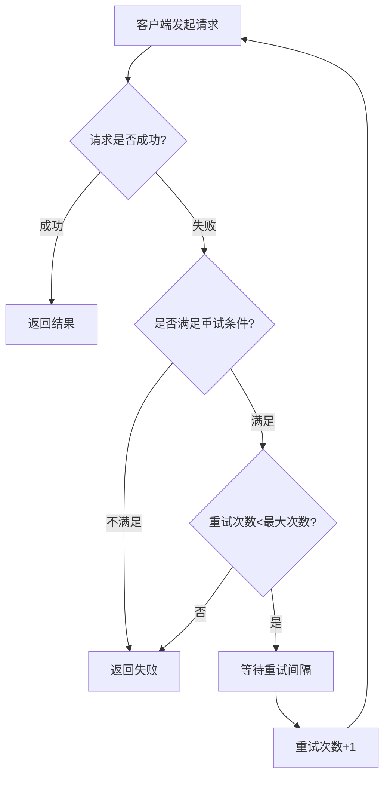
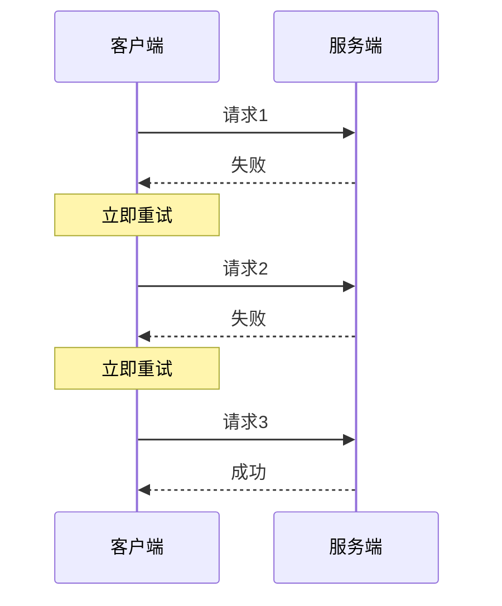
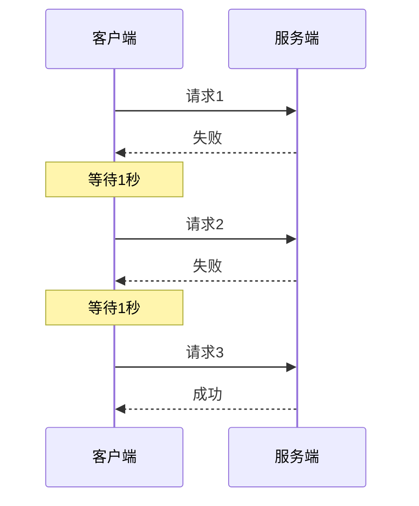
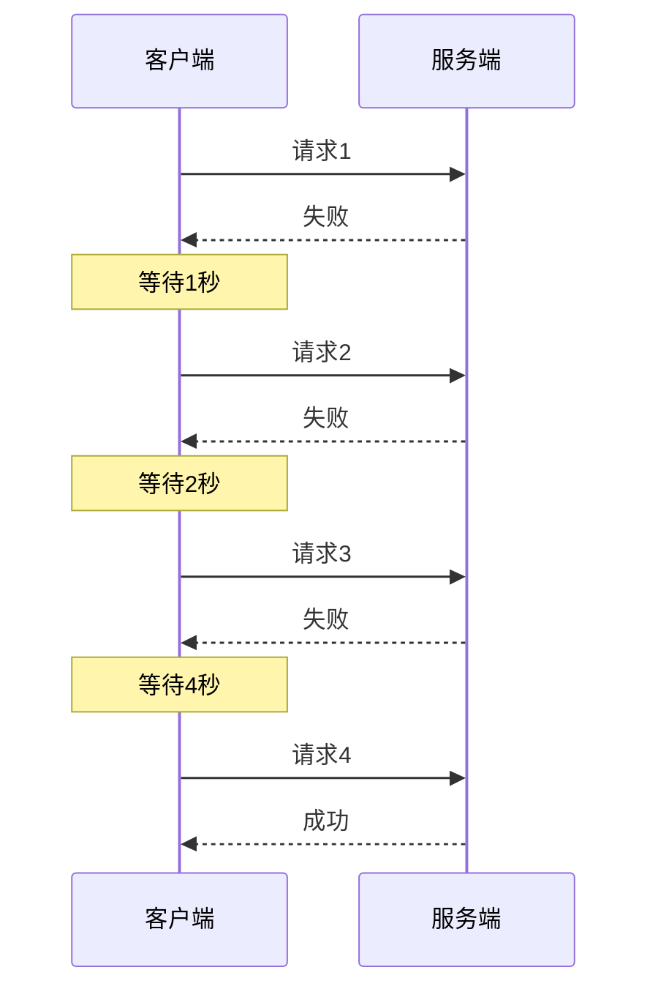
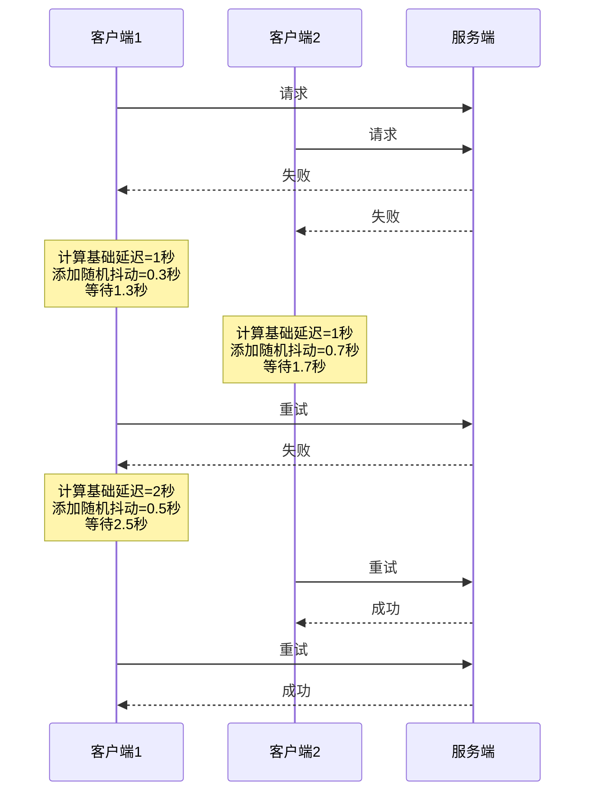
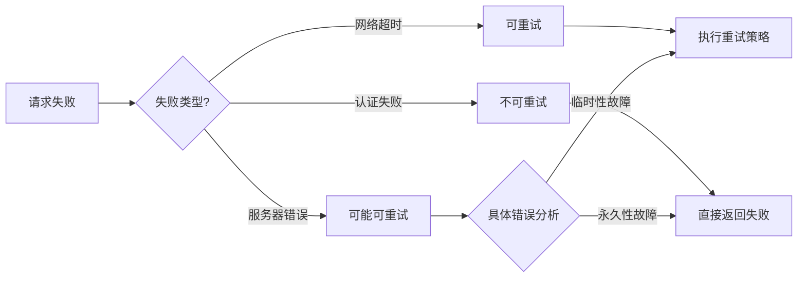
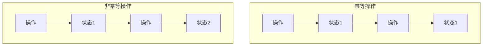
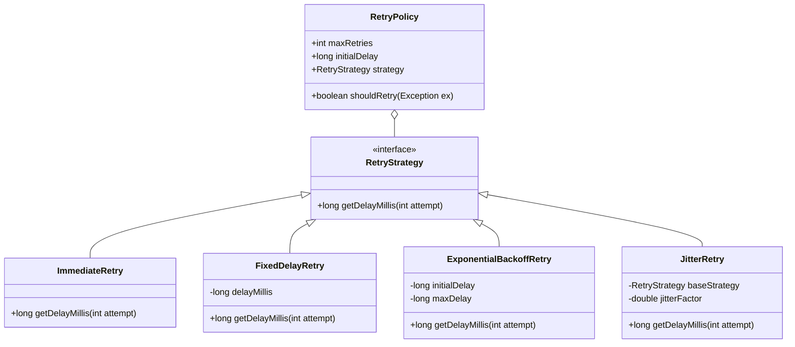

# 重试机制原理与实现

## 为什么要使用重试机制？

在分布式系统和微服务架构中，服务间的通信是通过网络进行的，而网络环境天然就是不可靠的。使用重试机制的主要原因有：

1. **应对网络抖动**：网络可能会出现短暂的不可用或延迟增高，这些都是临时性故障，通过重试可以克服这类问题
2. **处理服务临时过载**：服务器可能因为突发流量导致短暂的响应超时，重试可以将请求分散到不同时间点
3. **提高系统可用性**：对于重要的业务操作，通过合理的重试可以提高操作的最终成功率
4. **应对分布式系统的部分失败**：在分布式系统中，部分失败是常态而非异常，重试是处理部分失败的重要手段
5. **降低开发复杂度**：通过框架提供的自动重试机制，开发者不需要手动编写重试逻辑

## 重试机制工作原理



重试机制的基本工作流程：

1. 客户端发起请求
2. 检查请求是否成功
3. 如果成功，返回结果
4. 如果失败，判断是否满足重试条件
5. 如果满足重试条件且未超过最大重试次数，等待一段时间后重试
6. 如果不满足重试条件或已达最大重试次数，返回失败

## 常见的重试策略

### 1. 立即重试（Immediate Retry）



**特点**：
- 失败后立即进行下一次尝试
- 适用于对延迟敏感的场景
- 实现简单

**缺点**：
- 如果服务器过载是导致失败的原因，立即重试可能会加剧问题
- 可能导致"惊群效应"，多个客户端同时重试

### 2. 固定间隔重试（Fixed Delay）



**特点**：
- 每次重试之间等待固定的时间间隔
- 给服务器留出恢复的时间
- 配置简单

**缺点**：
- 在服务负载高峰期，固定间隔可能不够灵活
- 多个客户端可能在同一时间进行重试

### 3. 指数退避重试（Exponential Backoff）



**特点**：
- 重试等待时间呈指数增长（如1s, 2s, 4s, 8s...）
- 随着失败次数增加，给服务更多恢复时间
- 适用于服务可能需要较长恢复时间的场景

**缺点**：
- 等待时间可能变得很长
- 仍然存在所有客户端同时重试的风险

### 4. 带抖动的指数退避（Exponential Backoff with Jitter）



**特点**：
- 在指数退避的基础上增加随机因素
- 避免多个客户端同时重试导致的"惊群效应"
- 更均匀地分散重试请求

**优势**：
- 更好的系统稳定性
- 更高的请求成功率
- 避免同步效应

## 重试条件与异常分类

并非所有失败都适合重试，通常只有临时性故障才适合重试。异常可以分为三类：

1. **必定会成功的重试（Retryable）**：
   - 网络抖动
   - 连接超时
   - 服务暂时不可用（HTTP 503）
   - 资源冲突（HTTP 409）

2. **可能成功的重试（Maybe Retryable）**：
   - 读超时
   - 部分服务器错误（HTTP 500）
   - 请求超时

3. **不应重试（Non-Retryable）**：
   - 认证失败（HTTP 401/403）
   - 资源不存在（HTTP 404）
   - 参数错误（HTTP 400）
   - 业务逻辑错误



## 幂等性与重试

幂等性是指多次执行相同的操作，产生的影响与一次执行的影响相同。在实现重试机制时，必须考虑操作的幂等性：



- **幂等操作**可以安全地重试，例如：
  - 查询操作（GET）
  - 有唯一标识的更新操作
  - 基于条件的更新操作

- **非幂等操作**重试时需要注意，例如：
  - 资金转账
  - 计数器递增
  - 无条件的数据插入

**实现幂等性的常见方式**：
1. 使用唯一标识（如操作ID）
2. 实现基于条件的更新
3. 使用分布式锁
4. 维护操作状态表

## 在RPC框架中实现重试机制

### 架构设计



### 代码实现示例

#### 1. 重试策略接口

```java
/**
 * 重试策略接口
 */
public interface RetryStrategy {
    /**
     * 计算重试等待时间
     * @param attempt 当前是第几次重试（从1开始）
     * @return 需要等待的毫秒数
     */
    long getDelayMillis(int attempt);
}
```

#### 2. 不同重试策略实现

```java
/**
 * 立即重试策略
 */
public class ImmediateRetry implements RetryStrategy {
    @Override
    public long getDelayMillis(int attempt) {
        return 0; // 立即重试，不等待
    }
}

/**
 * 固定间隔重试策略
 */
public class FixedDelayRetry implements RetryStrategy {
    private final long delayMillis;
    
    public FixedDelayRetry(long delayMillis) {
        this.delayMillis = delayMillis;
    }
    
    @Override
    public long getDelayMillis(int attempt) {
        return delayMillis;
    }
}

/**
 * 指数退避重试策略
 */
public class ExponentialBackoffRetry implements RetryStrategy {
    private final long initialDelayMillis;
    private final long maxDelayMillis;
    
    public ExponentialBackoffRetry(long initialDelayMillis, long maxDelayMillis) {
        this.initialDelayMillis = initialDelayMillis;
        this.maxDelayMillis = maxDelayMillis;
    }
    
    @Override
    public long getDelayMillis(int attempt) {
        // 计算指数退避时间
        long delay = initialDelayMillis * (long)Math.pow(2, attempt - 1);
        // 确保不超过最大延迟时间
        return Math.min(delay, maxDelayMillis);
    }
}

/**
 * 带抖动的重试策略（装饰器模式）
 */
public class JitterRetry implements RetryStrategy {
    private final RetryStrategy baseStrategy;
    private final double jitterFactor;
    private final Random random = new Random();
    
    public JitterRetry(RetryStrategy baseStrategy, double jitterFactor) {
        this.baseStrategy = baseStrategy;
        this.jitterFactor = jitterFactor;
    }
    
    @Override
    public long getDelayMillis(int attempt) {
        long baseDelay = baseStrategy.getDelayMillis(attempt);
        // 计算抖动范围
        long jitterRange = (long)(baseDelay * jitterFactor);
        // 添加随机抖动
        return baseDelay + (jitterRange > 0 ? random.nextLong() % jitterRange : 0);
    }
}
```

#### 3. 重试策略配置

```java
/**
 * 重试策略配置
 */
public class RetryPolicy {
    private final int maxRetries;
    private final RetryStrategy retryStrategy;
    private final Set<Class<? extends Exception>> retryableExceptions;
    
    public RetryPolicy(int maxRetries, RetryStrategy retryStrategy) {
        this(maxRetries, retryStrategy, new HashSet<>());
    }
    
    public RetryPolicy(int maxRetries, RetryStrategy retryStrategy, 
                      Set<Class<? extends Exception>> retryableExceptions) {
        this.maxRetries = maxRetries;
        this.retryStrategy = retryStrategy;
        this.retryableExceptions = retryableExceptions;
        
        // 添加默认的可重试异常
        if (retryableExceptions.isEmpty()) {
            retryableExceptions.add(IOException.class);
            retryableExceptions.add(TimeoutException.class);
            retryableExceptions.add(ConnectException.class);
        }
    }
    
    public boolean shouldRetry(Exception e) {
        // 检查异常是否是可重试的类型
        for (Class<? extends Exception> exceptionClass : retryableExceptions) {
            if (exceptionClass.isInstance(e)) {
                return true;
            }
        }
        return false;
    }
    
    public int getMaxRetries() {
        return maxRetries;
    }
    
    public long getDelayMillis(int attempt) {
        return retryStrategy.getDelayMillis(attempt);
    }
}
```

#### 4. HttpClient中集成重试机制

```java
/**
 * 带重试功能的HTTP客户端
 */
public class RetryableHttpClient {
    private final WebClient webClient;
    private final Serializer serializer;
    private final RetryPolicy retryPolicy;
    
    /**
     * 构造带重试功能的HTTP客户端
     */
    public RetryableHttpClient(RetryPolicy retryPolicy) {
        // 创建Vertx实例
        Vertx vertx = Vertx.vertx();
        
        // 配置WebClient选项
        WebClientOptions options = new WebClientOptions();
        options.setKeepAlive(true);
        options.setConnectTimeout(5000); // 连接超时时间
        
        // 创建WebClient
        this.webClient = WebClient.create(vertx, options);
        
        // 设置序列化器
        this.serializer = new JdkSerializer();
        
        // 设置重试策略
        this.retryPolicy = retryPolicy;
    }
    
    /**
     * 发送带重试功能的HTTP请求
     */
    public RpcResponse sendRequest(RpcRequest rpcRequest, String host, int port) {
        int attempts = 0;
        Exception lastException = null;
        
        while (attempts <= retryPolicy.getMaxRetries()) {
            try {
                if (attempts > 0) {
                    System.out.println("Retry attempt " + attempts + " for request to " 
                                      + host + ":" + port);
                    // 等待重试间隔
                    Thread.sleep(retryPolicy.getDelayMillis(attempts));
                }
                
                // 发送请求
                RpcResponse response = doSendRequest(rpcRequest, host, port);
                
                // 检查响应是否包含异常
                if (response.getException() != null) {
                    if (retryPolicy.shouldRetry(response.getException())) {
                        // 可重试异常，继续循环
                        lastException = response.getException();
                    } else {
                        // 不可重试异常，直接返回
                        return response;
                    }
                } else {
                    // 成功响应
                    return response;
                }
            } catch (Exception e) {
                lastException = e;
                if (!retryPolicy.shouldRetry(e)) {
                    // 不可重试异常，直接创建错误响应并返回
                    RpcResponse errorResponse = new RpcResponse();
                    errorResponse.setException(e);
                    errorResponse.setMessage("客户端请求异常: " + e.getMessage());
                    return errorResponse;
                }
                // 可重试异常，继续循环
            }
            
            attempts++;
        }
        
        // 所有重试都失败
        RpcResponse errorResponse = new RpcResponse();
        errorResponse.setException(lastException);
        errorResponse.setMessage("请求失败，重试" + retryPolicy.getMaxRetries() + "次后仍未成功");
        return errorResponse;
    }
    
    /**
     * 实际发送HTTP请求
     */
    private RpcResponse doSendRequest(RpcRequest rpcRequest, String host, int port) throws Exception {
        CompletableFuture<RpcResponse> responseFuture = new CompletableFuture<>();
        
        // 序列化请求
        byte[] requestBytes = serializer.serialize(rpcRequest);
        
        // 发送POST请求
        webClient.request(HttpMethod.POST, port, host, "/")
                .sendBuffer(Buffer.buffer(requestBytes), ar -> {
                    if (ar.succeeded()) {
                        try {
                            // 获取响应内容
                            Buffer responseBuffer = ar.result().body();
                            // 反序列化响应
                            RpcResponse rpcResponse = serializer.deserialize(
                                    responseBuffer.getBytes(), 
                                    RpcResponse.class
                            );
                            // 完成Future
                            responseFuture.complete(rpcResponse);
                        } catch (Exception e) {
                            // 处理异常
                            responseFuture.completeExceptionally(e);
                        }
                    } else {
                        // 处理请求失败
                        responseFuture.completeExceptionally(ar.cause());
                    }
                });
        
        // 等待响应
        return responseFuture.get(10, TimeUnit.SECONDS);
    }
}
```

#### 5. 通过配置或注解使用重试机制

```java
/**
 * 重试注解
 */
@Retention(RetentionPolicy.RUNTIME)
@Target({ElementType.METHOD, ElementType.TYPE})
public @interface Retryable {
    /**
     * 最大重试次数
     */
    int maxRetries() default 3;
    
    /**
     * 初始延迟毫秒数
     */
    long initialDelay() default 1000;
    
    /**
     * 重试策略类型
     */
    RetryStrategyType strategy() default RetryStrategyType.EXPONENTIAL_BACKOFF;
    
    /**
     * 可重试的异常类
     */
    Class<? extends Exception>[] retryFor() default {IOException.class, TimeoutException.class};
    
    /**
     * 不可重试的异常类
     */
    Class<? extends Exception>[] noRetryFor() default {};
    
    /**
     * 策略类型枚举
     */
    enum RetryStrategyType {
        IMMEDIATE,
        FIXED_DELAY,
        EXPONENTIAL_BACKOFF,
        EXPONENTIAL_BACKOFF_WITH_JITTER
    }
}
```

## 项目中的重试机制实现

在当前的learn-RPC项目中，目前的HttpClient实现仅设置了连接超时，但没有实现重试机制：

```java
public HttpClient() {
    // 创建Vertx实例
    Vertx vertx = Vertx.vertx();
    
    // 配置WebClient选项
    WebClientOptions options = new WebClientOptions();
    options.setKeepAlive(true);
    options.setConnectTimeout(5000); // 连接超时时间
    
    // 创建WebClient
    this.webClient = WebClient.create(vertx, options);
    
    // 设置序列化器
    this.serializer = new JdkSerializer();
}
```

为了增强框架的可靠性，可以考虑以下优化：

1. 引入RetryPolicy和RetryStrategy的抽象设计
2. 默认配置指数退避加抖动的重试策略
3. 提供注解支持，允许开发者为不同服务自定义重试策略
4. 优化日志和监控，便于排查重试相关问题

## 重试机制最佳实践

1. **设置合理的最大重试次数**：通常3-5次足够处理大多数临时性故障

2. **使用递增的重试间隔**：避免在服务不可用时立即发起大量重试请求

3. **添加随机抖动**：防止多个客户端同时重试导致的"惊群效应"

4. **区分异常类型**：针对不同类型的异常采用不同的重试策略

5. **设置总超时时间**：重试策略应有一个总体超时限制，避免无限等待

6. **考虑操作的幂等性**：确保重试不会导致数据不一致

7. **添加日志和监控**：记录重试次数和原因，方便问题排查

8. **结合熔断机制**：当服务持续失败时，暂停重试，避免无效请求

## 总结

重试机制是RPC框架中提高系统可靠性的重要手段，通过合理的重试策略可以有效应对网络抖动和服务临时不可用等问题。在实现重试机制时，需要考虑重试策略、异常分类、幂等性等多个方面，以确保系统既能提高成功率，又不会因重试而引入新的问题。 