```mermaid
flowchart TD
    A[RPC调用] --> B[执行一次]
    B --> C{调用是否成功?}
    C -->|成功| D[返回结果]
    C -->|失败| E[直接抛出异常]
```

```mermaid
flowchart TD
    A[RPC调用] --> B[执行调用]
    B --> C{调用是否成功?}
    C -->|成功| D[返回结果]
    C -->|失败| E{是否达到最大重试次数?}
    E -->|是| F[抛出异常]
    E -->|否| G[等待3秒]
    G --> B
```

# Ming RPC Framework 重试机制原理与实现详解

## 📖 概述

重试机制是Ming RPC Framework中处理临时性故障的核心组件。通过智能的重试策略和灵活的配置机制，框架能够有效应对网络抖动、服务暂时不可用等问题，显著提高系统的可靠性和用户体验。

### 🎯 重试机制的价值

1. **提高可靠性**: 自动处理临时性故障，减少因偶发错误导致的业务失败
2. **改善用户体验**: 减少用户感知到的错误，提高请求成功率
3. **增强容错能力**: 与容错策略配合，提供多层次的故障处理
4. **降低运维成本**: 自动处理临时性故障，减少人工干预

## 🔄 为什么要使用重试机制？

在分布式系统和微服务架构中，服务间的通信是通过网络进行的，而网络环境天然就是不可靠的。使用重试机制的主要原因有：

1. **应对网络抖动**：网络可能会出现短暂的不可用或延迟增高，这些都是临时性故障，通过重试可以克服这类问题
2. **处理服务临时过载**：服务器可能因为突发流量导致短暂的响应超时，重试可以将请求分散到不同时间点
3. **提高系统可用性**：对于重要的业务操作，通过合理的重试可以提高操作的最终成功率
4. **应对分布式系统的部分失败**：在分布式系统中，部分失败是常态而非异常，重试是处理部分失败的重要手段
5. **降低开发复杂度**：通过框架提供的自动重试机制，开发者不需要手动编写重试逻辑

## 重试机制工作原理

```mermaid
flowchart TD
    A[客户端发起请求] --> B{请求是否成功?}
    B -->|成功| C[返回结果]
    B -->|失败| D{是否满足重试条件?}
    D -->|不满足| E[返回失败]
    D -->|满足| F{重试次数<最大次数?}
    F -->|是| G[等待重试间隔]
    G --> H[重试次数+1]
    H --> A
    F -->|否| E
```



重试机制的基本工作流程：

1. 客户端发起请求
2. 检查请求是否成功
3. 如果成功，返回结果
4. 如果失败，判断是否满足重试条件
5. 如果满足重试条件且未超过最大重试次数，等待一段时间后重试
6. 如果不满足重试条件或已达最大重试次数，返回失败

## 常见的重试策略

### 1. 立即重试（Immediate Retry）

```mermaid
sequenceDiagram
    participant Client as 客户端
    participant Server as 服务端
    
    Client->>Server: 请求1
    Server-->>Client: 失败
    Note over Client: 立即重试
    Client->>Server: 请求2
    Server-->>Client: 失败
    Note over Client: 立即重试
    Client->>Server: 请求3
    Server-->>Client: 成功
```



**特点**：
- 失败后立即进行下一次尝试
- 适用于对延迟敏感的场景
- 实现简单

**缺点**：
- 如果服务器过载是导致失败的原因，立即重试可能会加剧问题
- 可能导致"惊群效应"，多个客户端同时重试

### 2. 固定间隔重试（Fixed Delay）

```mermaid
sequenceDiagram
    participant Client as 客户端
    participant Server as 服务端
    
    Client->>Server: 请求1
    Server-->>Client: 失败
    Note over Client: 等待1秒
    Client->>Server: 请求2
    Server-->>Client: 失败
    Note over Client: 等待1秒
    Client->>Server: 请求3
    Server-->>Client: 成功
```



**特点**：
- 每次重试之间等待固定的时间间隔
- 给服务器留出恢复的时间
- 配置简单

**缺点**：
- 在服务负载高峰期，固定间隔可能不够灵活
- 多个客户端可能在同一时间进行重试

### 3. 指数退避重试（Exponential Backoff）

```mermaid
sequenceDiagram
    participant Client as 客户端
    participant Server as 服务端
    
    Client->>Server: 请求1
    Server-->>Client: 失败
    Note over Client: 等待1秒
    Client->>Server: 请求2
    Server-->>Client: 失败
    Note over Client: 等待2秒
    Client->>Server: 请求3
    Server-->>Client: 失败
    Note over Client: 等待4秒
    Client->>Server: 请求4
    Server-->>Client: 成功
```



**特点**：
- 重试等待时间呈指数增长（如1s, 2s, 4s, 8s...）
- 随着失败次数增加，给服务更多恢复时间
- 适用于服务可能需要较长恢复时间的场景

**缺点**：
- 等待时间可能变得很长
- 仍然存在所有客户端同时重试的风险

### 4. 带抖动的指数退避（Exponential Backoff with Jitter）

```mermaid
sequenceDiagram
    participant Client1 as 客户端1
    participant Client2 as 客户端2
    participant Server as 服务端
    
    Client1->>Server: 请求
    Client2->>Server: 请求
    Server-->>Client1: 失败
    Server-->>Client2: 失败
    
    Note over Client1: 计算基础延迟=1秒<br>添加随机抖动=0.3秒<br>等待1.3秒
    Note over Client2: 计算基础延迟=1秒<br>添加随机抖动=0.7秒<br>等待1.7秒
    
    Client1->>Server: 重试
    Server-->>Client1: 失败
    
    Note over Client1: 计算基础延迟=2秒<br>添加随机抖动=0.5秒<br>等待2.5秒
    
    Client2->>Server: 重试
    Server-->>Client2: 成功
    
    Client1->>Server: 重试
    Server-->>Client1: 成功
```



**特点**：
- 在指数退避的基础上增加随机因素
- 避免多个客户端同时重试导致的"惊群效应"
- 更均匀地分散重试请求

**优势**：
- 更好的系统稳定性
- 更高的请求成功率
- 避免同步效应

## 重试条件与异常分类

并非所有失败都适合重试，通常只有临时性故障才适合重试。异常可以分为三类：

1. **必定会成功的重试（Retryable）**：
   - 网络抖动
   - 连接超时
   - 服务暂时不可用（HTTP 503）
   - 资源冲突（HTTP 409）

2. **可能成功的重试（Maybe Retryable）**：
   - 读超时
   - 部分服务器错误（HTTP 500）
   - 请求超时

3. **不应重试（Non-Retryable）**：
   - 认证失败（HTTP 401/403）
   - 资源不存在（HTTP 404）
   - 参数错误（HTTP 400）
   - 业务逻辑错误

```mermaid
flowchart LR
    A[请求失败] --> B{失败类型?}
    B -->|网络超时| C[可重试]
    B -->|认证失败| D[不可重试]
    B -->|服务器错误| E[可能可重试]
    
    C --> F[执行重试策略]
    D --> G[直接返回失败]
    E --> H{具体错误分析}
    H -->|临时性故障| F
    H -->|永久性故障| G
```



## 幂等性与重试

幂等性是指多次执行相同的操作，产生的影响与一次执行的影响相同。在实现重试机制时，必须考虑操作的幂等性：

```mermaid
flowchart TD
    subgraph "幂等操作"
        A1[操作] --> B1[状态1]
        B1 --> C1[操作]
        C1 --> D1[状态1]
    end
    
    subgraph "非幂等操作"
        A2[操作] --> B2[状态1]
        B2 --> C2[操作]
        C2 --> D2[状态2]
    end
```



- **幂等操作**可以安全地重试，例如：
  - 查询操作（GET）
  - 有唯一标识的更新操作
  - 基于条件的更新操作

- **非幂等操作**重试时需要注意，例如：
  - 资金转账
  - 计数器递增
  - 无条件的数据插入

**实现幂等性的常见方式**：
1. 使用唯一标识（如操作ID）
2. 实现基于条件的更新
3. 使用分布式锁
4. 维护操作状态表

## 🔧 Ming RPC Framework重试策略实现

### 核心接口设计
**文件路径**: `rpc-core/src/main/java/com/ming/rpc/fault/retry/RetryStrategy.java`

```java
public interface RetryStrategy {
    /**
     * 重试
     * @param callable 可调用对象
     * @return 返回结果
     * @throws Exception 异常
     */
    RpcResponse doRetry(Callable<RpcResponse> callable) throws Exception;
}
```

### 1. 不重试策略 (No Retry)
**文件路径**: `rpc-core/src/main/java/com/ming/rpc/fault/retry/NoRetryStrategy.java`

```java
public class NoRetryStrategy implements RetryStrategy {
    @Override
    public RpcResponse doRetry(Callable<RpcResponse> callable) throws Exception {
        return callable.call();
    }
}
```

**工作原理**:


**特点**:
- ✅ 性能最高，无额外开销
- ✅ 适用于对实时性要求极高的场景
- ✅ 实现简单，无复杂逻辑
- ❌ 无法处理临时性故障
- ❌ 系统可靠性较低

**适用场景**: 实时交易系统、对延迟敏感的服务

### 2. 固定间隔重试策略 (Fixed Interval)
**文件路径**: `rpc-core/src/main/java/com/ming/rpc/fault/retry/FixedIntervalRetryStrategy.java`

```java
public class FixedIntervalRetryStrategy implements RetryStrategy {
    @Override
    public RpcResponse doRetry(Callable<RpcResponse> callable) throws ExecutionException, RetryException {
        Retryer<RpcResponse> retryer = RetryerBuilder.<RpcResponse>newBuilder()
            .retryIfExceptionOfType(Exception.class)
            .withWaitStrategy(WaitStrategies.fixedWait(3L, TimeUnit.SECONDS))
            .withStopStrategy(StopStrategies.stopAfterAttempt(3))
            .withRetryListener(new RetryListener() {
                @Override
                public <V> void onRetry(Attempt<V> attempt) {
                    if (attempt.hasException()) {
                        System.out.println("重试次数：" + attempt.getAttemptNumber() +
                                         "，异常：" + attempt.getExceptionCause());
                    }
                }
            })
            .build();
        return retryer.call(callable);
    }
}
```

**工作原理**:


**特点**:
- ✅ 实现简单，行为可预测
- ✅ 适用于网络抖动等短暂故障
- ✅ 重试间隔可配置
- ✅ 基于Guava Retrying库，功能强大
- ❌ 可能导致服务器压力集中
- ❌ 不适合长时间故障

**适用场景**: 网络抖动、临时性服务不可用

### 代码实现示例

#### 1. 重试策略接口

```java
/**
 * 重试策略接口
 */
public interface RetryStrategy {
    /**
     * 计算重试等待时间
     * @param attempt 当前是第几次重试（从1开始）
     * @return 需要等待的毫秒数
     */
    long getDelayMillis(int attempt);
}
```

#### 2. 不同重试策略实现

```java
/**
 * 立即重试策略
 */
public class ImmediateRetry implements RetryStrategy {
    @Override
    public long getDelayMillis(int attempt) {
        return 0; // 立即重试，不等待
    }
}

/**
 * 固定间隔重试策略
 */
public class FixedDelayRetry implements RetryStrategy {
    private final long delayMillis;
    
    public FixedDelayRetry(long delayMillis) {
        this.delayMillis = delayMillis;
    }
    
    @Override
    public long getDelayMillis(int attempt) {
        return delayMillis;
    }
}

/**
 * 指数退避重试策略
 */
public class ExponentialBackoffRetry implements RetryStrategy {
    private final long initialDelayMillis;
    private final long maxDelayMillis;
    
    public ExponentialBackoffRetry(long initialDelayMillis, long maxDelayMillis) {
        this.initialDelayMillis = initialDelayMillis;
        this.maxDelayMillis = maxDelayMillis;
    }
    
    @Override
    public long getDelayMillis(int attempt) {
        // 计算指数退避时间
        long delay = initialDelayMillis * (long)Math.pow(2, attempt - 1);
        // 确保不超过最大延迟时间
        return Math.min(delay, maxDelayMillis);
    }
}

/**
 * 带抖动的重试策略（装饰器模式）
 */
public class JitterRetry implements RetryStrategy {
    private final RetryStrategy baseStrategy;
    private final double jitterFactor;
    private final Random random = new Random();
    
    public JitterRetry(RetryStrategy baseStrategy, double jitterFactor) {
        this.baseStrategy = baseStrategy;
        this.jitterFactor = jitterFactor;
    }
    
    @Override
    public long getDelayMillis(int attempt) {
        long baseDelay = baseStrategy.getDelayMillis(attempt);
        // 计算抖动范围
        long jitterRange = (long)(baseDelay * jitterFactor);
        // 添加随机抖动
        return baseDelay + (jitterRange > 0 ? random.nextLong() % jitterRange : 0);
    }
}
```

#### 3. 重试策略配置

```java
/**
 * 重试策略配置
 */
public class RetryPolicy {
    private final int maxRetries;
    private final RetryStrategy retryStrategy;
    private final Set<Class<? extends Exception>> retryableExceptions;
    
    public RetryPolicy(int maxRetries, RetryStrategy retryStrategy) {
        this(maxRetries, retryStrategy, new HashSet<>());
    }
    
    public RetryPolicy(int maxRetries, RetryStrategy retryStrategy, 
                      Set<Class<? extends Exception>> retryableExceptions) {
        this.maxRetries = maxRetries;
        this.retryStrategy = retryStrategy;
        this.retryableExceptions = retryableExceptions;
        
        // 添加默认的可重试异常
        if (retryableExceptions.isEmpty()) {
            retryableExceptions.add(IOException.class);
            retryableExceptions.add(TimeoutException.class);
            retryableExceptions.add(ConnectException.class);
        }
    }
    
    public boolean shouldRetry(Exception e) {
        // 检查异常是否是可重试的类型
        for (Class<? extends Exception> exceptionClass : retryableExceptions) {
            if (exceptionClass.isInstance(e)) {
                return true;
            }
        }
        return false;
    }
    
    public int getMaxRetries() {
        return maxRetries;
    }
    
    public long getDelayMillis(int attempt) {
        return retryStrategy.getDelayMillis(attempt);
    }
}
```

#### 4. HttpClient中集成重试机制

```java
/**
 * 带重试功能的HTTP客户端
 */
public class RetryableHttpClient {
    private final WebClient webClient;
    private final Serializer serializer;
    private final RetryPolicy retryPolicy;
    
    /**
     * 构造带重试功能的HTTP客户端
     */
    public RetryableHttpClient(RetryPolicy retryPolicy) {
        // 创建Vertx实例
        Vertx vertx = Vertx.vertx();
        
        // 配置WebClient选项
        WebClientOptions options = new WebClientOptions();
        options.setKeepAlive(true);
        options.setConnectTimeout(5000); // 连接超时时间
        
        // 创建WebClient
        this.webClient = WebClient.create(vertx, options);
        
        // 设置序列化器
        this.serializer = new JdkSerializer();
        
        // 设置重试策略
        this.retryPolicy = retryPolicy;
    }
    
    /**
     * 发送带重试功能的HTTP请求
     */
    public RpcResponse sendRequest(RpcRequest rpcRequest, String host, int port) {
        int attempts = 0;
        Exception lastException = null;
        
        while (attempts <= retryPolicy.getMaxRetries()) {
            try {
                if (attempts > 0) {
                    System.out.println("Retry attempt " + attempts + " for request to " 
                                      + host + ":" + port);
                    // 等待重试间隔
                    Thread.sleep(retryPolicy.getDelayMillis(attempts));
                }
                
                // 发送请求
                RpcResponse response = doSendRequest(rpcRequest, host, port);
                
                // 检查响应是否包含异常
                if (response.getException() != null) {
                    if (retryPolicy.shouldRetry(response.getException())) {
                        // 可重试异常，继续循环
                        lastException = response.getException();
                    } else {
                        // 不可重试异常，直接返回
                        return response;
                    }
                } else {
                    // 成功响应
                    return response;
                }
            } catch (Exception e) {
                lastException = e;
                if (!retryPolicy.shouldRetry(e)) {
                    // 不可重试异常，直接创建错误响应并返回
                    RpcResponse errorResponse = new RpcResponse();
                    errorResponse.setException(e);
                    errorResponse.setMessage("客户端请求异常: " + e.getMessage());
                    return errorResponse;
                }
                // 可重试异常，继续循环
            }
            
            attempts++;
        }
        
        // 所有重试都失败
        RpcResponse errorResponse = new RpcResponse();
        errorResponse.setException(lastException);
        errorResponse.setMessage("请求失败，重试" + retryPolicy.getMaxRetries() + "次后仍未成功");
        return errorResponse;
    }
    
    /**
     * 实际发送HTTP请求
     */
    private RpcResponse doSendRequest(RpcRequest rpcRequest, String host, int port) throws Exception {
        CompletableFuture<RpcResponse> responseFuture = new CompletableFuture<>();
        
        // 序列化请求
        byte[] requestBytes = serializer.serialize(rpcRequest);
        
        // 发送POST请求
        webClient.request(HttpMethod.POST, port, host, "/")
                .sendBuffer(Buffer.buffer(requestBytes), ar -> {
                    if (ar.succeeded()) {
                        try {
                            // 获取响应内容
                            Buffer responseBuffer = ar.result().body();
                            // 反序列化响应
                            RpcResponse rpcResponse = serializer.deserialize(
                                    responseBuffer.getBytes(), 
                                    RpcResponse.class
                            );
                            // 完成Future
                            responseFuture.complete(rpcResponse);
                        } catch (Exception e) {
                            // 处理异常
                            responseFuture.completeExceptionally(e);
                        }
                    } else {
                        // 处理请求失败
                        responseFuture.completeExceptionally(ar.cause());
                    }
                });
        
        // 等待响应
        return responseFuture.get(10, TimeUnit.SECONDS);
    }
}
```

#### 5. 通过配置或注解使用重试机制

```java
/**
 * 重试注解
 */
@Retention(RetentionPolicy.RUNTIME)
@Target({ElementType.METHOD, ElementType.TYPE})
public @interface Retryable {
    /**
     * 最大重试次数
     */
    int maxRetries() default 3;
    
    /**
     * 初始延迟毫秒数
     */
    long initialDelay() default 1000;
    
    /**
     * 重试策略类型
     */
    RetryStrategyType strategy() default RetryStrategyType.EXPONENTIAL_BACKOFF;
    
    /**
     * 可重试的异常类
     */
    Class<? extends Exception>[] retryFor() default {IOException.class, TimeoutException.class};
    
    /**
     * 不可重试的异常类
     */
    Class<? extends Exception>[] noRetryFor() default {};
    
    /**
     * 策略类型枚举
     */
    enum RetryStrategyType {
        IMMEDIATE,
        FIXED_DELAY,
        EXPONENTIAL_BACKOFF,
        EXPONENTIAL_BACKOFF_WITH_JITTER
    }
}
```

## 项目中的重试机制实现

在当前的learn-RPC项目中，目前的HttpClient实现仅设置了连接超时，但没有实现重试机制：

```java
public HttpClient() {
    // 创建Vertx实例
    Vertx vertx = Vertx.vertx();
    
    // 配置WebClient选项
    WebClientOptions options = new WebClientOptions();
    options.setKeepAlive(true);
    options.setConnectTimeout(5000); // 连接超时时间
    
    // 创建WebClient
    this.webClient = WebClient.create(vertx, options);
    
    // 设置序列化器
    this.serializer = new JdkSerializer();
}
```

为了增强框架的可靠性，可以考虑以下优化：

1. 引入RetryPolicy和RetryStrategy的抽象设计
2. 默认配置指数退避加抖动的重试策略
3. 提供注解支持，允许开发者为不同服务自定义重试策略
4. 优化日志和监控，便于排查重试相关问题

## 重试机制最佳实践

1. **设置合理的最大重试次数**：通常3-5次足够处理大多数临时性故障

2. **使用递增的重试间隔**：避免在服务不可用时立即发起大量重试请求

3. **添加随机抖动**：防止多个客户端同时重试导致的"惊群效应"

4. **区分异常类型**：针对不同类型的异常采用不同的重试策略

5. **设置总超时时间**：重试策略应有一个总体超时限制，避免无限等待

6. **考虑操作的幂等性**：确保重试不会导致数据不一致

7. **添加日志和监控**：记录重试次数和原因，方便问题排查

8. **结合熔断机制**：当服务持续失败时，暂停重试，避免无效请求

## 总结

## 🧪 测试验证

### 重试策略测试
**文件路径**: `rpc-core/src/test/java/com/ming/rpc/fault/retry/RetryStrategyTest.java`

项目为每个重试策略都提供了完整的测试用例：

```java
@Test
@DisplayName("FixedIntervalRetryStrategy: 重试后成功测试")
void testFixedIntervalRetryAndSucceed() throws Exception {
    RetryStrategy retryStrategy = new FixedIntervalRetryStrategy();
    final AtomicInteger callCount = new AtomicInteger(0);
    Callable<RpcResponse> callable = () -> {
        int count = callCount.incrementAndGet();
        if (count < 2) {
            System.out.println("Simulating failure on attempt " + count);
            throw new RuntimeException("transient failure");
        }
        System.out.println("Simulating success on attempt " + count);
        return RpcResponse.builder().message("success").build();
    };

    RpcResponse response = retryStrategy.doRetry(callable);
    assertEquals("success", response.getMessage());
    assertEquals(2, callCount.get());
}

@Test
@DisplayName("RetryStrategyFactory: 工厂加载测试")
void testFactory() {
    RetryStrategy noRetry = RetryStrategyFactory.getInstance(RetryStrategyKeys.NO);
    assertTrue(noRetry instanceof NoRetryStrategy);

    RetryStrategy fixedInterval = RetryStrategyFactory.getInstance(RetryStrategyKeys.FIXED_INTERVAL);
    assertTrue(fixedInterval instanceof FixedIntervalRetryStrategy);
}
```

## 📊 重试策略对比

基于项目实际实现的重试策略对比：

| 策略 | 重试间隔 | 实现复杂度 | 性能开销 | 适用场景 |
|------|---------|-----------|----------|----------|
| 不重试 | - | 极低 | 无 | 实时性要求高 |
| 固定间隔 | 3秒 | 低 | 低 | 网络抖动、临时故障 |

## 🔧 使用指南

### 配置重试策略
在RPC配置中指定重试策略：

```yaml
rpc:
  retryStrategy: fixedInterval  # 可选: no, fixedInterval
```

### 代码中使用
```java
// 通过工厂获取重试策略
RetryStrategy retryStrategy = RetryStrategyFactory.getInstance("fixedInterval");

// 执行重试逻辑
RpcResponse response = retryStrategy.doRetry(() -> {
    return VertexTcpClient.doRequest(rpcRequest, serviceMetaInfo);
});
```

### 自定义重试策略
1. 实现RetryStrategy接口
2. 在SPI配置文件中注册
3. 通过配置使用自定义策略

```java
// 自定义重试策略
public class ExponentialBackoffRetryStrategy implements RetryStrategy {
    @Override
    public RpcResponse doRetry(Callable<RpcResponse> callable) throws Exception {
        // 指数退避重试逻辑
        return callable.call();
    }
}
```

配置文件：`META-INF/rpc/custom/com.ming.rpc.fault.retry.RetryStrategy`
```
exponentialBackoff=com.example.ExponentialBackoffRetryStrategy
```

## 🎯 最佳实践

### 1. 重试策略选择
- **实时交易**: 使用不重试策略，确保响应速度
- **数据查询**: 使用固定间隔重试，处理网络抖动
- **批量处理**: 使用指数退避重试，避免系统过载
- **关键业务**: 结合容错策略，提供多层保障

### 2. 重试参数配置
- **重试次数**: 通常3-5次足够处理大多数临时性故障
- **重试间隔**: 根据业务特点调整，避免过于频繁
- **超时时间**: 设置合理的总超时时间，避免无限等待

### 3. 监控和告警
- 记录重试次数和成功率
- 监控重试失败的原因
- 设置重试阈值告警

### 4. 与容错机制结合
```java
try {
    // 先执行重试策略
    RetryStrategy retryStrategy = RetryStrategyFactory.getInstance(config.getRetryStrategy());
    return retryStrategy.doRetry(() -> doRpcCall(request));
} catch (Exception e) {
    // 重试失败后执行容错策略
    TolerantStrategy tolerantStrategy = TolerantStrategyFactory.getInstance(config.getTolerantStrategy());
    return tolerantStrategy.doTolerant(context, e);
}
```

## 📈 扩展开发

### 添加新的重试策略
1. 实现RetryStrategy接口
2. 添加策略常量
3. 创建SPI配置
4. 实现对应的测试用例

### 示例：添加指数退避重试策略
```java
// 1. 定义指数退避重试策略
public class ExponentialBackoffRetryStrategy implements RetryStrategy {
    @Override
    public RpcResponse doRetry(Callable<RpcResponse> callable) throws Exception {
        Retryer<RpcResponse> retryer = RetryerBuilder.<RpcResponse>newBuilder()
            .retryIfExceptionOfType(Exception.class)
            .withWaitStrategy(WaitStrategies.exponentialWait(1000, 30, TimeUnit.SECONDS))
            .withStopStrategy(StopStrategies.stopAfterAttempt(5))
            .build();
        return retryer.call(callable);
    }
}

// 2. 添加到常量类
public interface RetryStrategyKeys {
    String EXPONENTIAL_BACKOFF = "exponentialBackoff";
}

// 3. SPI配置
exponentialBackoff=com.ming.rpc.fault.retry.ExponentialBackoffRetryStrategy
```

## 📋 总结

Ming RPC Framework的重试机制通过精心设计的架构，提供了可靠的故障处理解决方案：

### 核心优势
- ✅ **多种重试策略**: 不重试、固定间隔重试两种策略
- ✅ **SPI机制扩展**: 通过SPI机制实现重试策略的动态加载和扩展
- ✅ **工厂模式管理**: 统一的重试策略工厂管理和创建
- ✅ **完善的测试**: 每个重试策略都有对应的测试用例验证
- ✅ **与容错集成**: 与容错机制完美结合，提供多层保障

### 技术特色
- **可插拔设计**: 通过接口抽象和SPI机制实现可插拔
- **配置驱动**: 通过配置文件控制使用哪种重试策略
- **基于Guava**: 使用Guava Retrying库，功能强大且稳定
- **智能重试**: 支持异常类型判断和重试监听

### 重试能力
- **不重试**: 适用于对实时性要求极高的场景
- **固定间隔**: 适用于网络抖动等临时性故障
- **可扩展**: 支持自定义重试策略，满足特殊需求

Ming RPC Framework的重试机制为分布式RPC调用提供了强有力的可靠性保障，确保了系统在面对临时性故障时的稳定性和可用性。