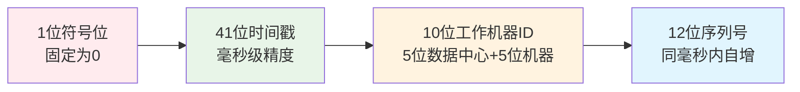

# Ming RPC Framework 雪花算法与分布式ID生成详解

## 📖 概述

雪花算法(Snowflake)是由Twitter开源的分布式ID生成算法，在Ming RPC Framework中用于生成全局唯一的请求ID。通过巧妙地结合时间戳、工作机器ID和序列号，在分布式系统中生成不会重复的ID。

### 🎯 核心问题
> 在分布式RPC系统中，如何生成全局唯一的请求ID来追踪和标识每个RPC调用？

### 💡 分布式ID的价值
1. **请求追踪**: 为每个RPC请求分配唯一ID，便于日志追踪和问题排查
2. **幂等性保证**: 通过请求ID实现接口的幂等性控制
3. **性能监控**: 基于请求ID进行性能统计和分析
4. **分布式事务**: 在分布式事务中作为全局事务ID

### 🏗️ 雪花ID结构设计

#### 64位ID组成


#### 位数分配详解
| 组成部分 | 位数 | 取值范围 | 说明 |
|---------|------|---------|------|
| 符号位 | 1位 | 0 | 固定为0，表示正数 |
| 时间戳 | 41位 | 0 ~ 2^41-1 | 毫秒级时间戳，可使用69年 |
| 数据中心ID | 5位 | 0 ~ 31 | 支持32个数据中心 |
| 机器ID | 5位 | 0 ~ 31 | 每个数据中心支持32台机器 |
| 序列号 | 12位 | 0 ~ 4095 | 同一毫秒内最多4096个序号 |

### 🎉 雪花算法优势

#### 核心优势
- **全局唯一性**: 分布式系统中生成的ID绝对不会重复
- **趋势递增**: ID按时间趋势递增，对数据库索引友好
- **高性能**: 本地生成，无需网络通信，QPS可达百万级
- **信息丰富**: ID中包含时间和机器信息，可以反解析
- **无依赖**: 不依赖数据库或其他中间件

#### 与其他方案对比
| 方案 | 唯一性 | 有序性 | 性能 | 复杂度 | 依赖 |
|------|-------|-------|------|-------|------|
| 雪花算法 | ✅ | ✅ | 极高 | 中等 | 无 |
| UUID | ✅ | ❌ | 高 | 低 | 无 |
| 数据库自增 | ✅ | ✅ | 低 | 低 | 数据库 |
| Redis自增 | ✅ | ✅ | 中等 | 中等 | Redis |

### ⚠️ 雪花算法局限性

#### 主要挑战
- **时钟依赖**: 强依赖系统时钟，时钟回拨可能导致ID重复
- **机器ID管理**: 需要确保不同节点的机器ID唯一
- **位数固定**: 64位长整型，无法动态调整位数分配
- **时间限制**: 41位时间戳只能使用69年

## 🔧 2. Ming RPC Framework中的雪花算法应用

### 2.1 TCP客户端请求ID生成

#### VertexTcpClient中的实际应用
**文件路径**: `rpc-core/src/main/java/com/ming/rpc/server/tcp/VertexTcpClient.java`

```java
public class VertexTcpClient {

    public static RpcResponse doRequest(RpcRequest rpcRequest, ServiceMetaInfo serviceMetaInfo)
            throws InterruptedException, ExecutionException {

        // 发送TCP请求
        Vertx vertx = Vertx.vertx();
        NetClient netClient = vertx.createNetClient();
        CompletableFuture<RpcResponse> responseFuture = new CompletableFuture<>();

        netClient.connect(serviceMetaInfo.getServicePort(), serviceMetaInfo.getServiceHost(), result -> {
            if (result.succeeded()) {
                NetSocket socket = result.result();

                // 构造协议消息
                ProtocolMessage<RpcRequest> protocolMessage = new ProtocolMessage<>();
                ProtocolMessage.Header header = new ProtocolMessage.Header();
                header.setMagic(ProtocolConstant.PROTOCOL_MAGIC);
                header.setVersion(ProtocolConstant.PROTOCOL_VERSION);
                header.setSerializer((byte)ProtocolMessageSerializerEnum
                    .getEnumByValue(RpcApplication.getRpcConfig().getSerializer()).getKey());
                header.setType((byte)ProtocolMessageTypeEnum.REQUEST.getKey());

                // 🎯 生成全局请求ID - 使用雪花算法
                header.setRequestId(IdUtil.getSnowflakeNextId());

                protocolMessage.setHeader(header);
                protocolMessage.setBody(rpcRequest);

                // 编码并发送
                Buffer encodeBuffer = ProtocolMessageEncoder.encode(protocolMessage);
                socket.write(encodeBuffer);

                // 处理响应...
            }
        });

        return responseFuture.get();
    }
}
```

### 2.2 Hutool IdUtil的使用

#### 雪花ID生成方式
```java
// 方式1：直接生成雪花ID（推荐）
long requestId = IdUtil.getSnowflakeNextId();

// 方式2：创建雪花算法实例
Snowflake snowflake = IdUtil.getSnowflake(workerId, datacenterId);
long requestId = snowflake.nextId();

// 方式3：使用默认配置
Snowflake snowflake = IdUtil.getSnowflake();
long requestId = snowflake.nextId();
```

#### 在协议消息中的应用
```java
public class ProtocolMessageBuilder {

    public static ProtocolMessage<RpcRequest> buildRequestMessage(RpcRequest request) {
        ProtocolMessage<RpcRequest> message = new ProtocolMessage<>();

        // 构建消息头
        ProtocolMessage.Header header = new ProtocolMessage.Header();
        header.setMagic(ProtocolConstant.PROTOCOL_MAGIC);
        header.setVersion(ProtocolConstant.PROTOCOL_VERSION);
        header.setType((byte) ProtocolMessageTypeEnum.REQUEST.getKey());

        // 🎯 使用雪花算法生成唯一请求ID
        header.setRequestId(IdUtil.getSnowflakeNextId());

        message.setHeader(header);
        message.setBody(request);

        return message;
    }
}
```

### 2.3 雪花算法核心实现原理

#### Hutool Snowflake类结构
```java
public class Snowflake {
    // 🕐 起始时间戳 (2020-01-01)
    private final long twepoch = 1577808000000L;

    // 📏 位数配置
    private final long workerIdBits = 5L;        // 机器ID位数
    private final long datacenterIdBits = 5L;    // 数据中心ID位数
    private final long sequenceBits = 12L;       // 序列号位数

    // 🔢 最大值计算
    private final long maxWorkerId = ~(-1L << workerIdBits);           // 31
    private final long maxDatacenterId = ~(-1L << datacenterIdBits);   // 31
    private final long sequenceMask = ~(-1L << sequenceBits);          // 4095

    // 🔄 位移配置
    private final long workerIdShift = sequenceBits;                   // 12
    private final long datacenterIdShift = sequenceBits + workerIdBits; // 17
    private final long timestampLeftShift = sequenceBits + workerIdBits + datacenterIdBits; // 22

    // 🏷️ 实例变量
    private final long workerId;      // 工作机器ID (0-31)
    private final long datacenterId;  // 数据中心ID (0-31)
    private long sequence = 0L;       // 毫秒内序列 (0-4095)
    private long lastTimestamp = -1L; // 上次生成ID的时间戳

    // 🔒 线程安全的ID生成
    public synchronized long nextId() {
        long timestamp = timeGen();

        // ⚠️ 时钟回拨检测
        if (timestamp < lastTimestamp) {
            throw new RuntimeException(
                String.format("Clock moved backwards. Refusing to generate id for %d milliseconds",
                lastTimestamp - timestamp));
        }

        // 🔄 同一毫秒内序列号处理
        if (lastTimestamp == timestamp) {
            sequence = (sequence + 1) & sequenceMask;
            if (sequence == 0) {
                // 序列号溢出，等待下一毫秒
                timestamp = tilNextMillis(lastTimestamp);
            }
        } else {
            // 新的毫秒，序列号重置
            sequence = 0L;
        }

        lastTimestamp = timestamp;

        // 🎯 组装64位ID
        return ((timestamp - twepoch) << timestampLeftShift)
            | (datacenterId << datacenterIdShift)
            | (workerId << workerIdShift)
            | sequence;
    }

    // 🕒 等待下一毫秒
    protected long tilNextMillis(long lastTimestamp) {
        long timestamp = timeGen();
        while (timestamp <= lastTimestamp) {
            timestamp = timeGen();
        }
        return timestamp;
    }

    // ⏰ 获取当前时间戳
    protected long timeGen() {
        return System.currentTimeMillis();
    }
}
```

### 2.4 ID解析与信息提取

#### 雪花ID反解析
```java
public class SnowflakeIdParser {

    private static final long TWEPOCH = 1577808000000L;
    private static final long WORKER_ID_BITS = 5L;
    private static final long DATACENTER_ID_BITS = 5L;
    private static final long SEQUENCE_BITS = 12L;

    public static SnowflakeInfo parseId(long snowflakeId) {
        // 提取时间戳
        long timestamp = (snowflakeId >> 22) + TWEPOCH;

        // 提取数据中心ID
        long datacenterId = (snowflakeId >> 17) & ((1L << DATACENTER_ID_BITS) - 1);

        // 提取机器ID
        long workerId = (snowflakeId >> 12) & ((1L << WORKER_ID_BITS) - 1);

        // 提取序列号
        long sequence = snowflakeId & ((1L << SEQUENCE_BITS) - 1);

        return new SnowflakeInfo(timestamp, datacenterId, workerId, sequence);
    }

    public static class SnowflakeInfo {
        private final long timestamp;
        private final long datacenterId;
        private final long workerId;
        private final long sequence;

        // 构造函数和getter方法...

        @Override
        public String toString() {
            return String.format(
                "SnowflakeInfo{timestamp=%s, datacenterId=%d, workerId=%d, sequence=%d}",
                new Date(timestamp), datacenterId, workerId, sequence
            );
        }
    }
}
```

## 3. WorkerId生成策略

在分布式系统中，确保每个节点的workerId唯一是雪花算法正确工作的关键。Hutool和其他实现提供了多种workerId生成策略。

### 3.1 常见的WorkerId生成策略

#### 3.1.1 配置文件指定

最简单的方式是通过配置文件为每个节点指定唯一的workerId：

```java
// 从配置文件读取workerId
long workerId = config.getLong("snowflake.workerId");
long datacenterId = config.getLong("snowflake.datacenterId");
Snowflake snowflake = IdUtil.getSnowflake(workerId, datacenterId);
```

这种方式适用于节点数量较少且相对固定的场景。

#### 3.1.2 基于IP地址生成

使用服务器IP地址的后几位作为workerId：

```java
public class IPWorkerIdStrategy {
    public long getWorkerId() {
        try {
            InetAddress address = InetAddress.getLocalHost();
            byte[] ipAddressBytes = address.getAddress();
            return ((ipAddressBytes[ipAddressBytes.length - 2] & 0B11) << 8) 
                 | (ipAddressBytes[ipAddressBytes.length - 1] & 0xFF);
        } catch (UnknownHostException e) {
            throw new RuntimeException("无法获取本机IP");
        }
    }
}
```

这种方式适用于IP地址相对固定的场景，但在容器化环境中可能不太可靠。

#### 3.1.3 基于MAC地址生成

使用网卡MAC地址生成workerId：

```java
public class MACWorkerIdStrategy {
    public long getWorkerId() {
        try {
            byte[] mac = NetworkInterface.getByInetAddress(InetAddress.getLocalHost())
                .getHardwareAddress();
            return ((mac[4] & 0B11) << 8) | (mac[5] & 0xFF);
        } catch (Exception e) {
            throw new RuntimeException("无法获取MAC地址");
        }
    }
}
```

MAC地址通常比IP地址更稳定，但在虚拟化环境中可能会有重复。

#### 3.1.4 基于分布式协调服务

使用Redis、Zookeeper等分布式协调服务分配和管理workerId：

```java
public class RedisWorkerIdStrategy {
    private JedisPool jedisPool;
    
    public long getWorkerId() {
        try (Jedis jedis = jedisPool.getResource()) {
            // 尝试获取一个可用的workerId
            String key = "snowflake:worker:id";
            for (int i = 0; i < 1024; i++) {
                if (jedis.setnx(key + ":" + i, "1") == 1) {
                    // 设置过期时间，以便节点宕机后自动释放
                    jedis.expire(key + ":" + i, 600);
                    return i;
                }
            }
            throw new RuntimeException("无法获取可用的workerId");
        }
    }
}
```

这种方式最为可靠，适用于大规模分布式系统，但依赖外部服务。

### 3.2 Hutool中的WorkerId生成

Hutool默认不提供自动生成workerId的机制，需要用户自行指定或实现。但可以基于Hutool提供的其他工具类实现workerId生成策略：

```java
public class HutoolWorkerIdStrategy {
    public long getWorkerId() {
        // 使用Hutool的NetUtil获取本机IP
        String ip = NetUtil.getLocalhostStr();
        // 使用Hutool的MurmurHash算法计算哈希值
        int hash = HashUtil.murmur32(ip);
        // 取模得到workerId，确保在0-31范围内
        return hash % 32;
    }
    
    public long getDatacenterId() {
        // 使用Hutool的SystemUtil获取主机名
        String hostname = SystemUtil.getHostInfo().getName();
        // 计算哈希值并取模
        int hash = HashUtil.murmur32(hostname);
        return hash % 32;
    }
}
```

## 4. 时钟回拨问题及解决方案

时钟回拨是雪花算法面临的最大挑战，可能导致生成重复ID。

### 4.1 时钟回拨的原因

- **NTP同步**：服务器通过NTP协议同步时间，可能导致时间回拨
- **系统时钟调整**：手动或自动调整系统时钟
- **虚拟机暂停**：虚拟机暂停后恢复时可能发生时钟回拨
- **闰秒调整**：全球时间调整闰秒时可能影响系统时钟

### 4.2 Hutool中的处理方式

Hutool的雪花算法实现在检测到时钟回拨时会抛出异常：

```java
if (timestamp < lastTimestamp) {
    throw new IllegalStateException(
        String.format("Clock moved backwards. Refusing to generate id for %d milliseconds",
                     lastTimestamp - timestamp));
}
```

### 4.3 常见的解决方案

#### 4.3.1 等待策略

对于短时间的回拨，可以等待时钟追赶上来：

```java
if (timestamp < lastTimestamp) {
    // 如果回拨时间较短，等待时钟追赶
    if (lastTimestamp - timestamp < 5) {
        try {
            Thread.sleep(lastTimestamp - timestamp);
            timestamp = timeGen();
        } catch (InterruptedException e) {
            throw new RuntimeException(e);
        }
    } else {
        throw new IllegalStateException("Clock moved backwards");
    }
}
```

#### 4.3.2 备用位策略

使用序列号的部分位作为备用位，在时钟回拨时使用：

```java
if (timestamp < lastTimestamp) {
    // 使用备用位生成ID
    if (lastTimestamp - timestamp < 50 && backupBits < maxBackupBits) {
        backupBits++;
        sequence = (sequence + 1) & (sequenceMask >> backupBits);
        return ((lastTimestamp - twepoch) << timestampLeftShift) 
            | (datacenterId << datacenterIdShift) 
            | (workerId << workerIdShift) 
            | sequence | (1L << backupBitsPosition);
    } else {
        throw new IllegalStateException("Clock moved backwards");
    }
}
```

#### 4.3.3 切换workerId

在检测到时钟回拨时，切换到另一个workerId继续工作：

```java
if (timestamp < lastTimestamp) {
    // 切换workerId
    workerId = (workerId + 1) % maxWorkerId;
    // 重置序列号和上次时间戳
    sequence = 0L;
    lastTimestamp = timestamp;
    return nextId();
}
```

#### 4.3.4 使用更可靠的时间源

使用更可靠的时间源，如单调时钟：

```java
private long timeGen() {
    // 使用单调时钟而不是系统时钟
    return System.nanoTime() / 1_000_000;
}
```

#### 4.3.5 外部存储最后时间戳

将最后生成ID的时间戳存储在外部系统中，启动时检查：

```java
public class ExternalTimeSnowflake {
    private RedisTemplate redisTemplate;
    
    public void init() {
        // 从Redis获取上次时间戳
        Object lastTime = redisTemplate.opsForValue().get("snowflake:lastTimestamp:" + workerId);
        if (lastTime != null) {
            long storedLastTimestamp = Long.parseLong(lastTime.toString());
            long currentTimestamp = timeGen();
            if (currentTimestamp < storedLastTimestamp) {
                throw new IllegalStateException("Clock moved backwards");
            }
        }
    }
    
    public synchronized long nextId() {
        // 生成ID的逻辑
        // ...
        
        // 更新Redis中的时间戳
        redisTemplate.opsForValue().set("snowflake:lastTimestamp:" + workerId, lastTimestamp);
        
        return id;
    }
}
```

## 5. 美团Leaf和百度UidGenerator

针对雪花算法的局限性，业界提出了多种改进方案，其中最著名的是美团的Leaf和百度的UidGenerator。

### 5.1 美团Leaf

Leaf提供了两种ID生成方式：号段模式和雪花算法模式。

#### 5.1.1 雪花算法模式的改进

Leaf对雪花算法的主要改进在于解决时钟回拨问题：

- 使用ZooKeeper存储服务节点的最后时间戳
- 服务启动时检查当前时间是否小于存储的时间戳
- 对于小范围的时钟回拨，等待时钟追赶上来
- 对于大范围的时钟回拨，拒绝服务并报警

```java
public synchronized Result get() {
    long timestamp = timeGen();
    if (timestamp < lastTimestamp) {
        long offset = lastTimestamp - timestamp;
        if (offset <= maxOffset) {
            try {
                // 等待时钟追赶
                this.wait(offset << 1);
                timestamp = timeGen();
                if (timestamp < lastTimestamp) {
                    return new Result(-1, Status.EXCEPTION);
                }
            } catch (InterruptedException e) {
                return new Result(-2, Status.EXCEPTION);
            }
        } else {
            return new Result(-3, Status.EXCEPTION);
        }
    }
    
    // 其余逻辑与标准雪花算法类似
    // ...
}
```

### 5.2 百度UidGenerator

UidGenerator是百度开源的分布式ID生成器，基于雪花算法的思想，但有一些重要改进。

#### 5.2.1 核心改进

- **RingBuffer缓存**：预生成一批ID并缓存，减少锁竞争
- **更灵活的位分配**：可以自定义各部分的位数
- **WorkerId分配器**：提供多种workerId分配策略，包括数据库分配

```java
public class DefaultUidGenerator implements UidGenerator {
    // 使用RingBuffer预生成ID
    private RingBuffer ringBuffer;
    
    @Override
    public long getUID() {
        // 从RingBuffer中获取预生成的ID
        return ringBuffer.take();
    }
    
    // RingBuffer填充线程
    private void bufferPaddingExecutor() {
        while (running) {
            // 生成一批ID填充RingBuffer
            // ...
        }
    }
}
```

## 6. 面试问题解析

### 6.1 雪花算法的原理是什么？

**答**：雪花算法是一种分布式ID生成算法，由Twitter开源。它生成的ID是一个64位的长整型数字，由以下部分组成：
- 1位符号位，固定为0
- 41位时间戳，精确到毫秒
- 10位工作机器ID，通常分为5位数据中心ID和5位机器ID
- 12位序列号，同一毫秒内的自增序列

雪花算法通过组合这些部分，可以在分布式系统中生成全局唯一的ID，且ID按时间趋势递增，对数据库索引友好。

### 6.2 雪花算法的优缺点有哪些？

**答**：

**优点**：
- 全局唯一性：分布式系统中生成的ID不会重复
- 趋势递增：ID按时间趋势递增，对数据库索引友好
- 高性能：本地生成，不需要网络通信，性能高
- 信息丰富：ID中包含时间和机器信息，可以反解

**缺点**：
- 强依赖系统时钟：如果时钟回拨，可能会生成重复ID
- 机器ID需要手动分配：需要确保不同节点的机器ID唯一
- 位数固定：64位的长整型，无法调整位数分配

### 6.3 如何解决雪花算法的时钟回拨问题？

**答**：解决时钟回拨问题的常见方法有：

1. **等待策略**：对于短时间的回拨，等待时钟追赶上来
2. **备用位策略**：使用序列号的部分位作为备用位，在时钟回拨时使用
3. **切换workerId**：在检测到时钟回拨时，切换到另一个workerId继续工作
4. **使用更可靠的时间源**：如单调时钟，避免时间回拨
5. **外部存储最后时间戳**：将最后生成ID的时间戳存储在外部系统中，启动时检查
6. **使用成熟的解决方案**：如美团的Leaf或百度的UidGenerator，它们都对时钟回拨问题有专门的处理

### 6.4 如何确保分布式系统中不同节点的workerId唯一？

**答**：确保workerId唯一的常见方法有：

1. **配置文件指定**：通过配置文件为每个节点指定唯一的workerId
2. **基于IP地址生成**：使用服务器IP地址的后几位作为workerId
3. **基于MAC地址生成**：使用网卡MAC地址生成workerId
4. **基于分布式协调服务**：使用Redis、Zookeeper等分布式协调服务分配和管理workerId
5. **数据库分配**：使用数据库表记录和分配workerId

其中，基于分布式协调服务的方式最为可靠，适用于大规模分布式系统。

### 6.5 Hutool中的雪花算法是如何实现的？

**答**：Hutool中的雪花算法通过`IdUtil`类提供，核心实现在`Snowflake`类中。主要特点包括：

1. 提供了简单的API：`IdUtil.getSnowflake(workerId, datacenterId)`创建雪花算法对象，`snowflake.nextId()`生成ID
2. 支持自定义起始时间戳：可以设置开始的时间点
3. 时钟回拨处理：检测到时钟回拨时会抛出异常
4. 线程安全：使用synchronized保证并发安全

但Hutool默认不提供自动生成workerId的机制，需要用户自行指定或实现。

### 6.6 雪花算法与UUID相比有什么优势？

**答**：雪花算法相比UUID有以下优势：

1. **有序性**：雪花ID按时间趋势递增，对数据库索引友好，而UUID是无序的
2. **性能更高**：雪花算法生成ID的性能通常比UUID更高
3. **空间效率**：雪花ID是64位长整型，比128位的UUID更节省空间
4. **信息丰富**：雪花ID中包含时间和机器信息，可以反解，而UUID通常不包含有用信息
5. **可读性**：雪花ID是数字，比UUID的16进制字符串更易读

### 6.7 如何处理雪花算法生成ID的溢出问题？

**答**：雪花算法各部分可能的溢出问题及处理方式：

1. **时间戳溢出**：41位时间戳可以使用69年，超过后需要更换算法或调整起始时间
2. **序列号溢出**：同一毫秒内序列号达到最大值(4095)后，会等待下一毫秒再生成ID
3. **workerId溢出**：如果节点数超过1024，可以调整位数分配，减少时间戳或序列号的位数

### 6.8 美团Leaf和百度UidGenerator对雪花算法做了哪些改进？

**答**：

**美团Leaf的改进**：
- 使用ZooKeeper存储服务节点的最后时间戳
- 服务启动时检查当前时间是否小于存储的时间戳
- 对于小范围的时钟回拨，等待时钟追赶上来
- 对于大范围的时钟回拨，拒绝服务并报警
- 提供了号段模式作为备选方案

**百度UidGenerator的改进**：
- 使用RingBuffer预生成一批ID并缓存，减少锁竞争
- 可以自定义各部分的位数，更灵活
- 提供多种workerId分配策略，包括数据库分配
- 更好的并发性能和吞吐量

## 7. 实际案例分析

### 7.1 生产环境中的时钟回拨问题

在一次生产事故中，服务器因NTP同步导致时钟回拨，雪花算法生成了重复的ID(-1)，导致数据插入失败。

**问题分析**：
1. 服务器重启后，时钟与NTP服务器不同步
2. 应用使用当前时间生成了一批ID
3. NTP定时任务执行，时钟被回拨
4. 应用检测到时钟回拨，返回错误值-1
5. 多个请求获得相同的ID -1，导致主键冲突

**解决方案**：
1. 改进雪花算法实现，对时钟回拨有更好的处理
2. 使用更可靠的时间源
3. 优化NTP同步配置，减少大幅度时钟调整
4. 考虑使用美团Leaf或百度UidGenerator等成熟方案

### 7.2 高并发系统中的雪花算法优化

在一个高并发电商系统中，订单ID使用雪花算法生成，但在秒杀场景下出现性能瓶颈。

**问题分析**：
1. 雪花算法使用synchronized保证线程安全，在高并发下成为瓶颈
2. 同一毫秒内序列号达到上限后，需要等待下一毫秒

**优化方案**：
1. 使用百度UidGenerator的RingBuffer机制，预生成ID
2. 增加序列号位数，减少时间戳位数（如果69年太长）
3. 部署多个ID生成服务，分散负载
4. 使用号段模式，批量获取ID

## 🔧 3. WorkerId生成策略

### 3.1 配置文件指定策略

#### 静态配置方式
```yaml
# application.yml
rpc:
  snowflake:
    workerId: 1
    datacenterId: 1
```

```java
@Component
public class SnowflakeConfig {

    @Value("${rpc.snowflake.workerId:0}")
    private long workerId;

    @Value("${rpc.snowflake.datacenterId:0}")
    private long datacenterId;

    @Bean
    public Snowflake snowflake() {
        return IdUtil.getSnowflake(workerId, datacenterId);
    }
}
```

### 3.2 基于IP地址生成策略

#### IP地址哈希算法
```java
public class IpBasedWorkerIdStrategy {

    public static long getWorkerId() {
        try {
            // 获取本机IP地址
            String hostAddress = InetAddress.getLocalHost().getHostAddress();

            // 使用IP地址最后一段作为workerId
            String[] ipParts = hostAddress.split("\\.");
            int lastPart = Integer.parseInt(ipParts[3]);

            // 确保在0-31范围内
            return lastPart % 32;

        } catch (Exception e) {
            // 异常情况下使用随机值
            return new Random().nextInt(32);
        }
    }

    public static long getDatacenterId() {
        try {
            String hostAddress = InetAddress.getLocalHost().getHostAddress();
            String[] ipParts = hostAddress.split("\\.");
            int thirdPart = Integer.parseInt(ipParts[2]);

            return thirdPart % 32;

        } catch (Exception e) {
            return new Random().nextInt(32);
        }
    }
}
```

### 3.3 基于MAC地址生成策略

#### MAC地址哈希算法
```java
public class MacBasedWorkerIdStrategy {

    public static long getWorkerId() {
        try {
            // 获取网络接口
            NetworkInterface network = NetworkInterface.getByInetAddress(
                InetAddress.getLocalHost());

            if (network != null) {
                byte[] mac = network.getHardwareAddress();
                if (mac != null) {
                    // 使用MAC地址后两位计算workerId
                    int workerId = ((mac[4] & 0xFF) << 8) | (mac[5] & 0xFF);
                    return workerId % 32;
                }
            }

        } catch (Exception e) {
            // 异常处理
        }

        return new Random().nextInt(32);
    }
}
```

### 3.4 基于注册中心分配策略

#### Etcd分布式锁分配
```java
@Component
public class EtcdWorkerIdStrategy {

    private final EtcdClient etcdClient;
    private final String WORKER_ID_PREFIX = "/rpc/snowflake/worker/";

    public long allocateWorkerId() {
        for (int workerId = 0; workerId < 32; workerId++) {
            String key = WORKER_ID_PREFIX + workerId;

            try {
                // 尝试获取分布式锁
                Lease leaseClient = etcdClient.getLeaseClient();
                long leaseId = leaseClient.grant(300).get().getID(); // 5分钟租约

                PutOption putOption = PutOption.builder()
                    .withLeaseId(leaseId)
                    .withPrevKV()
                    .build();

                PutResponse putResponse = etcdClient.getKVClient()
                    .put(ByteSequence.from(key, StandardCharsets.UTF_8),
                         ByteSequence.from(getInstanceInfo(), StandardCharsets.UTF_8),
                         putOption)
                    .get();

                if (putResponse.getPrevKv() == null) {
                    // 成功获取workerId
                    startHeartbeat(key, leaseId);
                    return workerId;
                }

            } catch (Exception e) {
                log.warn("Failed to allocate workerId: {}", workerId, e);
            }
        }

        throw new RuntimeException("No available workerId");
    }

    private void startHeartbeat(String key, long leaseId) {
        // 启动心跳续约
        ScheduledExecutorService executor = Executors.newSingleThreadScheduledExecutor();
        executor.scheduleAtFixedRate(() -> {
            try {
                etcdClient.getLeaseClient().keepAliveOnce(leaseId);
            } catch (Exception e) {
                log.error("Heartbeat failed for key: {}", key, e);
            }
        }, 60, 60, TimeUnit.SECONDS);
    }

    private String getInstanceInfo() {
        return String.format("{\"host\":\"%s\",\"pid\":%d,\"timestamp\":%d}",
            getLocalHost(), getCurrentPid(), System.currentTimeMillis());
    }
}
```

## ⚠️ 4. 时钟回拨问题处理

### 4.1 等待策略

#### 短时间回拨等待
```java
public class WaitingSnowflake extends Snowflake {

    private static final long MAX_BACKWARD_MS = 5L; // 最大等待5毫秒

    @Override
    public synchronized long nextId() {
        long timestamp = timeGen();

        if (timestamp < lastTimestamp) {
            long offset = lastTimestamp - timestamp;

            if (offset <= MAX_BACKWARD_MS) {
                // 短时间回拨，等待时钟追赶
                try {
                    Thread.sleep(offset << 1);
                    timestamp = timeGen();
                    if (timestamp < lastTimestamp) {
                        throw new RuntimeException("Clock moved backwards");
                    }
                } catch (InterruptedException e) {
                    Thread.currentThread().interrupt();
                    throw new RuntimeException("Interrupted while waiting for clock", e);
                }
            } else {
                throw new RuntimeException(
                    String.format("Clock moved backwards. Refusing to generate id for %d milliseconds", offset));
            }
        }

        return super.nextId();
    }
}
```

### 4.2 备用位策略

#### 使用备用位处理回拨
```java
public class BackupBitSnowflake {

    private static final long BACKUP_BITS = 2L; // 使用2位作为备用
    private static final long SEQUENCE_BITS = 10L; // 序列号减少到10位
    private static final long SEQUENCE_MASK = ~(-1L << SEQUENCE_BITS);

    private long backupCounter = 0L;

    public synchronized long nextId() {
        long timestamp = timeGen();

        if (timestamp < lastTimestamp) {
            // 时钟回拨，使用备用位
            if (backupCounter < (1L << BACKUP_BITS) - 1) {
                backupCounter++;

                // 使用上次时间戳和备用计数器生成ID
                return ((lastTimestamp - twepoch) << timestampLeftShift)
                    | (datacenterId << datacenterIdShift)
                    | (workerId << workerIdShift)
                    | (backupCounter << SEQUENCE_BITS)
                    | sequence;
            } else {
                throw new RuntimeException("Backup bits exhausted");
            }
        }

        // 正常情况，重置备用计数器
        backupCounter = 0L;

        // 正常生成ID逻辑...
        return generateNormalId(timestamp);
    }
}
```

## 📊 5. 性能测试与优化

### 5.1 性能基准测试

#### 单线程性能测试
```java
@Test
public void testSingleThreadPerformance() {
    Snowflake snowflake = IdUtil.getSnowflake(1, 1);
    int count = 1000000;

    long startTime = System.currentTimeMillis();

    for (int i = 0; i < count; i++) {
        snowflake.nextId();
    }

    long endTime = System.currentTimeMillis();
    long duration = endTime - startTime;

    System.out.printf("生成%d个ID耗时: %dms, QPS: %.2f%n",
        count, duration, count * 1000.0 / duration);
}
```

#### 多线程并发测试
```java
@Test
public void testMultiThreadPerformance() throws InterruptedException {
    Snowflake snowflake = IdUtil.getSnowflake(1, 1);
    int threadCount = 10;
    int countPerThread = 100000;
    CountDownLatch latch = new CountDownLatch(threadCount);
    Set<Long> ids = ConcurrentHashMap.newKeySet();

    long startTime = System.currentTimeMillis();

    for (int i = 0; i < threadCount; i++) {
        new Thread(() -> {
            try {
                for (int j = 0; j < countPerThread; j++) {
                    long id = snowflake.nextId();
                    ids.add(id);
                }
            } finally {
                latch.countDown();
            }
        }).start();
    }

    latch.await();
    long endTime = System.currentTimeMillis();

    System.out.printf("多线程生成%d个ID耗时: %dms, 唯一ID数量: %d%n",
        threadCount * countPerThread, endTime - startTime, ids.size());
}
```

### 5.2 性能优化策略

#### 无锁化实现
```java
public class LockFreeSnowflake {

    private final AtomicLong sequenceAndTimestamp = new AtomicLong(0L);
    private final long workerId;
    private final long datacenterId;

    public long nextId() {
        while (true) {
            long current = sequenceAndTimestamp.get();
            long currentTimestamp = current >>> 12;
            long currentSequence = current & 0xFFF;

            long newTimestamp = timeGen();
            long newSequence;

            if (newTimestamp == currentTimestamp) {
                newSequence = (currentSequence + 1) & 0xFFF;
                if (newSequence == 0) {
                    // 序列号溢出，等待下一毫秒
                    newTimestamp = tilNextMillis(currentTimestamp);
                }
            } else if (newTimestamp > currentTimestamp) {
                newSequence = 0L;
            } else {
                // 时钟回拨
                throw new RuntimeException("Clock moved backwards");
            }

            long newValue = (newTimestamp << 12) | newSequence;

            if (sequenceAndTimestamp.compareAndSet(current, newValue)) {
                return ((newTimestamp - twepoch) << timestampLeftShift)
                    | (datacenterId << datacenterIdShift)
                    | (workerId << workerIdShift)
                    | newSequence;
            }
        }
    }
}
```

## 📋 Ming RPC Framework雪花算法总结

Ming RPC Framework通过Hutool的雪花算法实现了高性能的分布式ID生成：

### 🎉 核心价值
- **请求追踪**: 为每个RPC请求生成唯一ID，便于日志追踪
- **高性能**: 本地生成，QPS可达百万级，无网络依赖
- **全局唯一**: 分布式环境下绝对不重复的ID生成
- **趋势递增**: 对数据库索引友好，提升查询性能

### 🔧 技术特色
- **Hutool集成**: 基于Hutool IdUtil的简洁API
- **协议支持**: 在TCP协议消息中生成请求ID
- **多种策略**: 支持多种WorkerId分配策略
- **时钟回拨处理**: 提供多种时钟回拨解决方案

### 💡 设计优势
- **零依赖**: 不依赖外部系统，本地生成
- **高并发**: 支持高并发场景下的ID生成
- **信息丰富**: ID包含时间和机器信息，可反解析
- **易扩展**: 支持自定义WorkerId分配策略

### 🚀 应用场景
- **RPC请求ID**: 为每个RPC调用生成唯一标识
- **分布式事务**: 作为全局事务ID使用
- **日志追踪**: 实现分布式链路追踪
- **业务主键**: 作为业务表的主键ID

雪花算法是Ming RPC Framework中重要的基础组件，通过Hutool工具库的简洁API，为分布式RPC调用提供了高性能、全局唯一的ID生成能力。在实际应用中，需要根据部署环境选择合适的WorkerId分配策略，并做好时钟回拨的处理，以确保系统的稳定性和可靠性。

选择合适的ID生成方案应考虑系统规模、性能需求、可靠性要求等因素，没有一种方案适合所有场景。在实践中，应根据具体需求选择或组合使用不同的ID生成策略。 